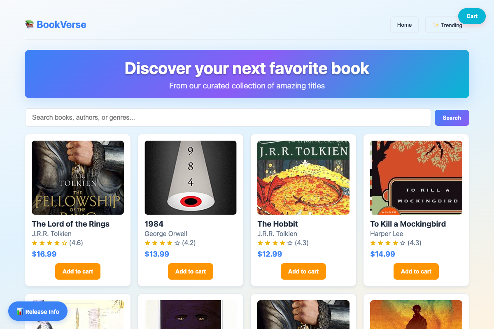

# BookVerse Platform

## Enterprise Microservices Platform with Secure Software Supply Chain Management

*BookVerse web application showcasing the complete microservices platform with product catalog, recommendations, and checkout functionality*

BookVerse is a comprehensive microservices platform that delivers modern software development practices, secure CI/CD pipelines, and enterprise-grade deployment automation. Built with industry-leading technologies, BookVerse provides organizations with a complete reference architecture for scalable, secure, and compliant software delivery.

---

## 🛡️ Enterprise Governance & Policy Framework

BookVerse implements **comprehensive unified policies** that demonstrate enterprise-grade governance, security, and compliance capabilities:

### **🎯 14 Automated Policy Gates**
- **DEV Stage**: Quality gates, security scanning, and traceability requirements
- **QA Stage**: Dynamic security testing and comprehensive API validation  
- **STAGING Stage**: Penetration testing, change management, and infrastructure scanning
- **PROD Release**: Multi-stage completion verification and approval workflows

### **🔒 Security by Design**
- **SLSA Provenance**: Supply chain security with cryptographic verification
- **Multi-Layer Security**: SAST, DAST, penetration testing, and IaC scanning
- **Evidence Collection**: Automated evidence gathering with cryptographic signing
- **Audit Compliance**: Complete audit trails for regulatory and enterprise requirements

### **⚡ Automated Enforcement**
- **CI/CD Integration**: Policies automatically enforced during promotion workflows
- **Real-time Evaluation**: Policy compliance evaluated in real-time during deployments
- **Blocking & Warning Modes**: Configurable enforcement levels for different environments
- **Compliance Reporting**: Comprehensive dashboards and audit reporting

**📋 Learn More**: Explore the complete [Governance Framework](docs/ARCHITECTURE.md#%EF%B8%8F-governance--policy-framework) in our architecture documentation.

---

## 🎯 Where Do You Want to Start?

Choose your path based on your needs:

- **🚀 Quick Start**: Follow the [Getting Started Guide](docs/GETTING_STARTED.md) for rapid deployment
- **🏗️ Deep Dive**: Explore the [Platform Architecture Overview](docs/ARCHITECTURE.md) for detailed system understanding  
- **🎮 Demo**: Run through the [Demo Runbook](docs/DEMO_RUNBOOK.md) for hands-on experience

---

## 🏗️ Platform Architecture

BookVerse consists of seven integrated components that work together to deliver a complete microservices ecosystem, each showcasing different CI/CD patterns and deployment strategies:

### 📦 **Inventory Service**

#### Product catalog and stock management

- Real-time inventory tracking and availability management
- RESTful API for catalog operations and stock queries
- SQLite database with comprehensive book metadata
- Automated stock level monitoring and alerts

**Build Pattern**: Single-container application - demonstrates basic containerized service deployment with minimal complexity

### 🤖 **Recommendations Service**

#### AI-powered personalized recommendations

- Machine learning recommendation engine with configurable algorithms
- Real-time recommendation generation (sub-200ms response times)
- Scalable worker architecture for background processing
- Configurable recommendation models and scoring factors

**Build Pattern**: Multi-container orchestration - showcases complex service deployment with multiple Docker images, worker processes, and supporting artifacts

### 💳 **Checkout Service**

#### Order processing and payment management

- Complete order lifecycle management from cart to fulfillment
- Integrated payment processing with mock and real payment gateways
- Order state tracking and inventory coordination
- Event-driven architecture with order notifications

**Build Pattern**: Service with dependencies - demonstrates deployment coordination with external services and database migrations

### 🌐 **Web Application**

#### Modern responsive frontend

- Single-page application built with vanilla JavaScript
- Responsive design with mobile-first approach
- Real-time integration with all backend services
- Client-side routing and state management

**Build Pattern**: Static asset deployment - showcases frontend build pipelines with asset optimization and CDN distribution

### 🏢 **Platform Service**

#### Integration testing and validation

- Cross-service integration testing as a unified platform
- End-to-end validation of service interactions
- Platform-wide health verification and monitoring
- Component compatibility and version validation

**Build Pattern**: Aggregation service - demonstrates platform-level testing patterns that validate multiple services working together

### 🏗️ **Infrastructure Libraries**

#### Shared libraries and DevOps tooling

- Core business logic shared across services (bookverse-core)
- DevOps automation and deployment scripts (bookverse-devops)
- Common utilities and configuration management
- Evidence collection and compliance frameworks

**Build Pattern**: Multi-artifact library publishing - showcases shared library management with separate core and DevOps build pipelines

### ⎈ **Helm Charts**

#### Kubernetes deployment automation

- Production-ready Helm charts for all services
- Environment-specific configuration management
- GitOps deployment workflows with ArgoCD integration
- Automated scaling and resource management

**Build Pattern**: Infrastructure as Code - demonstrates versioned deployment artifacts and environment promotion strategies

### 🚀 **Demo Orchestration Layer**

#### Platform setup and configuration automation (Demo Infrastructure)

- Automated JFrog Platform provisioning and configuration
- GitHub repository creation and CI/CD setup
- OIDC integration and security configuration
- Environment validation and health checking

**Build Pattern**: Setup automation - showcases demo environment provisioning and platform configuration (not part of the BookVerse application itself)

### Summary

| Component | Purpose | Technology Stack | Deployment | Build Pattern |
|-----------|---------|------------------|------------|---------------|
| **Inventory** | Product catalog & inventory management | Python, FastAPI, SQLite | Container + K8s | Single-container |
| **Recommendations** | AI-powered recommendation engine | Python, scikit-learn, FastAPI | Container + K8s | Multi-container |
| **Checkout** | Order processing & payments | Python, FastAPI, PostgreSQL | Container + K8s | Service dependencies |
| **Web App** | Frontend user interface | Vanilla JS, Vite, HTML5 | Static + CDN | Static assets |
| **Platform** | Integration testing & validation | Python, FastAPI | Container + K8s | Aggregation service |
| **Infrastructure** | Shared libraries & DevOps tooling | Python, Shell | Multi-artifact | Library publishing |
| **Helm Charts** | K8s deployment automation | Helm 3, YAML | GitOps | Infrastructure as Code |
| **Demo Orchestration** | Platform setup automation | Python, Shell, GitHub Actions | Automation | Setup automation |

---

## 🎯 Use Cases

### 🏢 **Enterprise Development Teams**

- Reference architecture for microservices transformation
- Secure CI/CD pipeline implementation
- Container orchestration and deployment automation
- DevSecOps practices and compliance automation

### 🔧 **DevOps Engineers**

- Complete GitOps workflow implementation
- Multi-environment deployment strategies
- Infrastructure as Code patterns
- Monitoring and observability setup

### 🔐 **Security Teams**

- Software supply chain security implementation
- Zero-trust CI/CD pipeline design
- Vulnerability management workflows
- Compliance and audit trail automation

### 🏗️ **Platform Engineers**

- Microservices architecture patterns
- Service mesh and API gateway configuration
- Cross-service communication strategies
- Platform engineering best practices

---

## 📚 Documentation

### 🚀 **Platform Setup & Architecture**

- [📖 **Getting Started**](docs/GETTING_STARTED.md) - Complete setup and deployment instructions
- [🏗️ **Platform Architecture Overview**](docs/ARCHITECTURE.md) - System design and component relationships
- [🎮 **Demo Runbook**](docs/DEMO_RUNBOOK.md) - Step-by-step demo execution guide
- [⚙️ **Repository Architecture**](docs/REPO_ARCHITECTURE.md) - Code organization and structure

### ⚙️ **Operations & Integration**

- [🔄 **CI/CD Deployment**](docs/CICD_DEPLOYMENT_GUIDE.md) - Pipeline configuration and automation
- [🔐 **OIDC Authentication**](docs/OIDC_AUTHENTICATION.md) - Zero-trust authentication setup
- [🏗️ **Setup Automation**](docs/SETUP_AUTOMATION.md) - Platform provisioning and configuration
- [📈 **Evidence Collection**](docs/EVIDENCE_COLLECTION.md) - Compliance and audit trail automation
- [🚀 **GitOps Deployment**](docs/GITOPS_DEPLOYMENT.md) - Continuous deployment workflows
- [🔗 **JFrog Integration**](docs/JFROG_INTEGRATION.md) - Artifact management and security

### 🔧 **Advanced Topics**

- [🔄 **Promotion Workflows**](docs/PROMOTION_WORKFLOWS.md) - Multi-stage deployment strategies
- [🔑 **Evidence Key Deployment**](docs/EVIDENCE_KEY_DEPLOYMENT.md) - Cryptographic key management
- [🔧 **JFrog Platform Switch**](docs/SWITCH_JFROG_PLATFORM.md) - Platform migration procedures

---

## 🌟 Platform Highlights

- **Zero-Trust Security**: OIDC authentication, cryptographic evidence, SBOM generation, and vulnerability scanning
- **Advanced CI/CD**: Multi-stage promotion, intelligent filtering, and comprehensive audit trails  
- **Cloud-Native**: Container-first deployment with Kubernetes and GitOps integration
- **Enterprise Ready**: Scalable architecture with monitoring, automated testing, and multi-environment support

---

## 🚀 Ready to Get Started?

BookVerse provides everything you need to implement enterprise-grade microservices with secure, automated software delivery.

**Choose your next step:**
- **New to BookVerse?** Start with the [Getting Started Guide](docs/GETTING_STARTED.md)
- **Want to understand the architecture?** Read the [Platform Architecture Overview](docs/ARCHITECTURE.md)
- **Ready to run a demo?** Follow the [Demo Runbook](docs/DEMO_RUNBOOK.md)

For additional support and documentation, explore the comprehensive guides above or visit the individual service repositories.

---

> **Note**: Individual service documentation is available in each service repository:
> - [Inventory Service](https://github.com/yonatanp-jfrog/bookverse-inventory)
> - [Recommendations Service](https://github.com/yonatanp-jfrog/bookverse-recommendations)  
> - [Checkout Service](https://github.com/yonatanp-jfrog/bookverse-checkout)
> - [Platform Service](https://github.com/yonatanp-jfrog/bookverse-platform)
> - [Web Application](https://github.com/yonatanp-jfrog/bookverse-web)
> - [Helm Charts](https://github.com/yonatanp-jfrog/bookverse-helm)
> - [Infrastructure Libraries](https://github.com/yonatanp-jfrog/bookverse-infra)
