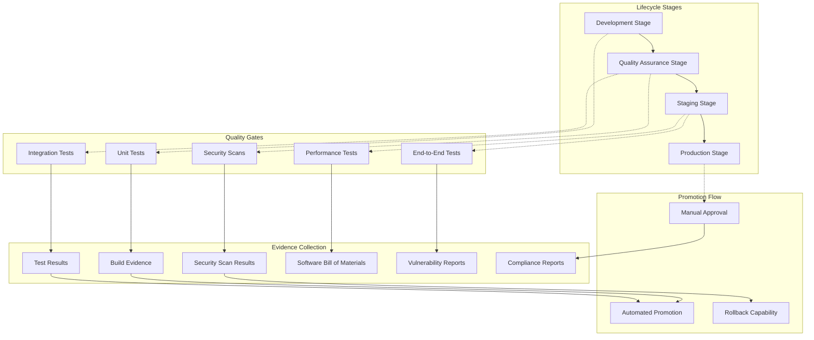

# BookVerse Platform - AppTrust Lifecycle Guide

**Application Lifecycle Management, Stage Promotion, and Evidence Collection**

This guide provides comprehensive documentation for managing application lifecycles using JFrog AppTrust, covering stage-based promotion workflows, evidence collection, and compliance reporting within the BookVerse platform.

---

## 🔄 Application Lifecycle Overview

The BookVerse platform implements sophisticated application lifecycle management through JFrog AppTrust, enabling secure, auditable, and compliant software delivery from development to production.



### Core Lifecycle Principles

#### **🎯 Stage-Based Progression**
- **Linear Progression**: Applications move through defined stages in sequence
- **Quality Gates**: Each stage has specific quality and security requirements
- **Evidence Collection**: Comprehensive evidence gathering at each transition
- **Compliance Tracking**: Full audit trail for regulatory compliance

#### **🔒 Security-First Approach**
- **Zero-Trust**: Every promotion requires validation and evidence
- **Cryptographic Signing**: All artifacts and evidence are cryptographically signed
- **Vulnerability Management**: Continuous security assessment and remediation
- **Policy Enforcement**: Automated policy compliance checking

#### **📊 Data-Driven Decisions**
- **Quality Metrics**: Objective quality measurements drive promotion decisions
- **Performance Baselines**: Performance requirements validated at each stage
- **Risk Assessment**: Automated risk assessment based on evidence
- **Traceability**: Complete traceability from source to deployment

---

## 🏗️ Stage Configuration

### Development Stage Configuration

The Development stage serves as the entry point for new code and features, with minimal barriers to enable rapid iteration.

#### **Development Stage Setup**
```bash
#!/bin/bash
# Comprehensive Development stage configuration

configure_development_stage() {
    local project_key=$1
    
    echo "🔧 Configuring Development stage for ${project_key}"
    
    local dev_config
    dev_config=$(jq -n \
        --arg projectKey "${project_key}" \
        --arg stageName "DEV" \
        '{
            "project_key": $projectKey,
            "stage_name": $stageName,
            "description": "Development stage for active development and feature testing",
            "stage_type": "development",
            "entry_criteria": {
                "source_requirements": {
                    "valid_git_commit": true,
                    "branch_protection": false,
                    "code_review_required": false
                },
                "build_requirements": {
                    "successful_build": true,
                    "unit_tests_passed": true,
                    "code_coverage_minimum": 60
                },
                "security_requirements": {
                    "dependency_scan": "warn",
                    "secret_detection": "warn",
                    "license_compliance": "warn"
                }
            },
            "promotion_criteria": {
                "auto_promotion": {
                    "enabled": true,
                    "conditions": [
                        "build_success",
                        "unit_tests_pass",
                        "basic_security_scan"
                    ]
                },
                "manual_approval": false,
                "evidence_required": false
            },
            "repositories": [
                "'${project_key}'-inventory-internal-docker-dev-local",
                "'${project_key}'-recommendations-internal-docker-dev-local",
                "'${project_key}'-checkout-internal-docker-dev-local",
                "'${project_key}'-platform-public-docker-dev-local",
                "'${project_key}'-web-internal-generic-nonprod-local",
                "'${project_key}'-helm-internal-helm-nonprod-local"
            ],
            "environment_configuration": {
                "variables": {
                    "LOG_LEVEL": "DEBUG",
                    "AUTH_ENABLED": "false",
                    "CACHE_TTL": "60",
                    "DATABASE_POOL_SIZE": "5",
                    "RATE_LIMIT_ENABLED": "false"
                },
                "resources": {
                    "cpu_limit": "500m",
                    "memory_limit": "1Gi",
                    "replica_count": 1
                }
            },
            "policies": {
                "retention_policy": {
                    "max_artifacts": 50,
                    "max_age_days": 30,
                    "cleanup_strategy": "fifo"
                },
                "security_policy": {
                    "vulnerability_scan": "warn",
                    "license_compliance": "warn",
                    "policy_violations": "warn",
                    "block_high_severity": false
                },
                "notification_policy": {
                    "promotion_success": ["development-team"],
                    "promotion_failure": ["development-team"],
                    "security_alerts": ["security-team"]
                }
            }
        }')
    
    # Apply configuration
    create_lifecycle_stage "${project_key}" "DEV" "${dev_config}"
    
    echo "✅ Development stage configured"
}
```

### Quality Assurance Stage Configuration

The QA stage introduces comprehensive testing and initial security validation.

#### **QA Stage Setup**
```bash
#!/bin/bash
# Quality Assurance stage with comprehensive testing requirements

configure_qa_stage() {
    local project_key=$1
    
    echo "🧪 Configuring QA stage for ${project_key}"
    
    local qa_config
    qa_config=$(jq -n \
        --arg projectKey "${project_key}" \
        --arg stageName "QA" \
        '{
            "project_key": $projectKey,
            "stage_name": $stageName,
            "description": "Quality Assurance stage with comprehensive testing and security validation",
            "stage_type": "testing",
            "entry_criteria": {
                "source_requirements": {
                    "from_stage": "DEV",
                    "promotion_evidence": true,
                    "git_tag_required": false
                },
                "build_requirements": {
                    "successful_build": true,
                    "unit_tests_passed": true,
                    "code_coverage_minimum": 80,
                    "static_analysis_passed": true
                },
                "security_requirements": {
                    "dependency_scan": "required",
                    "sast_scan": "required",
                    "secret_detection": "required",
                    "license_compliance": "required",
                    "container_scan": "required"
                }
            },
            "testing_requirements": {
                "integration_tests": {
                    "required": true,
                    "minimum_coverage": 70,
                    "test_environments": ["api", "database", "external_services"]
                },
                "performance_tests": {
                    "required": false,
                    "load_testing": "basic",
                    "response_time_threshold": "500ms"
                },
                "security_tests": {
                    "dast_scan": "required",
                    "penetration_testing": "basic",
                    "vulnerability_assessment": "required"
                }
            },
            "promotion_criteria": {
                "auto_promotion": {
                    "enabled": true,
                    "conditions": [
                        "all_tests_pass",
                        "security_scans_pass",
                        "performance_baseline_met",
                        "quality_gates_satisfied"
                    ]
                },
                "manual_approval": false,
                "evidence_required": true,
                "quality_gates": [
                    {
                        "name": "test_coverage",
                        "threshold": 80,
                        "metric": "line_coverage"
                    },
                    {
                        "name": "security_score",
                        "threshold": 85,
                        "metric": "composite_security_score"
                    },
                    {
                        "name": "performance_score",
                        "threshold": 90,
                        "metric": "performance_index"
                    }
                ]
            },
            "repositories": [
                "'${project_key}'-inventory-internal-docker-qa-local",
                "'${project_key}'-recommendations-internal-docker-qa-local",
                "'${project_key}'-checkout-internal-docker-qa-local",
                "'${project_key}'-platform-public-docker-qa-local"
            ],
            "environment_configuration": {
                "variables": {
                    "LOG_LEVEL": "INFO",
                    "AUTH_ENABLED": "true",
                    "CACHE_TTL": "300",
                    "DATABASE_POOL_SIZE": "10",
                    "RATE_LIMIT_ENABLED": "true",
                    "MONITORING_ENABLED": "true"
                },
                "resources": {
                    "cpu_limit": "1",
                    "memory_limit": "2Gi",
                    "replica_count": 2
                }
            }
        }')
    
    create_lifecycle_stage "${project_key}" "QA" "${qa_config}"
    
    echo "✅ QA stage configured"
}
```

### Production Stage Configuration

The Production stage implements the highest security and approval requirements.

#### **Production Stage Setup**
```bash
#!/bin/bash
# Production stage with maximum security and compliance requirements

configure_production_stage() {
    local project_key=$1
    
    echo "🚀 Configuring Production stage for ${project_key}"
    
    local prod_config
    prod_config=$(jq -n \
        --arg projectKey "${project_key}" \
        --arg stageName "PROD" \
        '{
            "project_key": $projectKey,
            "stage_name": $stageName,
            "description": "Production stage for live deployments with maximum security",
            "stage_type": "production",
            "entry_criteria": {
                "source_requirements": {
                    "from_stage": "STAGING",
                    "promotion_evidence": true,
                    "git_tag_required": true,
                    "signed_commits": true
                },
                "build_requirements": {
                    "successful_build": true,
                    "all_tests_passed": true,
                    "code_coverage_minimum": 90,
                    "static_analysis_passed": true,
                    "build_reproducible": true
                },
                "security_requirements": {
                    "all_scans_passed": true,
                    "vulnerability_threshold": "low",
                    "license_compliance": "required",
                    "supply_chain_verified": true,
                    "cryptographic_signing": "required"
                }
            },
            "compliance_requirements": {
                "sbom_generation": {
                    "required": true,
                    "formats": ["spdx", "cyclonedx"],
                    "include_dependencies": true,
                    "include_vulnerabilities": true
                },
                "evidence_collection": {
                    "comprehensive": true,
                    "retention_years": 7,
                    "cryptographic_integrity": true
                },
                "audit_requirements": {
                    "change_approval": true,
                    "approval_workflow": "multi_stage",
                    "approvers": ["platform-team", "security-team", "compliance-team"]
                }
            },
            "promotion_criteria": {
                "auto_promotion": {
                    "enabled": false
                },
                "manual_approval": {
                    "required": true,
                    "minimum_approvers": 2,
                    "approval_roles": ["platform-admin", "security-admin"],
                    "approval_window": 24
                },
                "evidence_required": true,
                "change_freeze_windows": [
                    {
                        "start": "2024-12-20T00:00:00Z",
                        "end": "2024-01-05T23:59:59Z",
                        "description": "Holiday freeze"
                    }
                ]
            },
            "repositories": [
                "'${project_key}'-inventory-internal-docker-prod-local",
                "'${project_key}'-recommendations-internal-docker-prod-local",
                "'${project_key}'-checkout-internal-docker-prod-local",
                "'${project_key}'-platform-public-docker-prod-local"
            ],
            "environment_configuration": {
                "variables": {
                    "LOG_LEVEL": "WARN",
                    "AUTH_ENABLED": "true",
                    "CACHE_TTL": "3600",
                    "DATABASE_POOL_SIZE": "20",
                    "RATE_LIMIT_ENABLED": "true",
                    "MONITORING_ENABLED": "true",
                    "ALERTING_ENABLED": "true",
                    "BACKUP_ENABLED": "true"
                },
                "resources": {
                    "cpu_limit": "4",
                    "memory_limit": "8Gi",
                    "replica_count": 5
                }
            },
            "policies": {
                "retention_policy": {
                    "max_artifacts": 200,
                    "max_age_days": 2555,  # 7 years
                    "cleanup_strategy": "manual_approval"
                },
                "security_policy": {
                    "vulnerability_scan": "block",
                    "license_compliance": "block",
                    "policy_violations": "block",
                    "mandatory_signing": true,
                    "continuous_monitoring": true
                }
            }
        }')
    
    create_lifecycle_stage "${project_key}" "PROD" "${prod_config}"
    
    echo "✅ Production stage configured"
}

create_lifecycle_stage() {
    local project_key=$1
    local stage_name=$2
    local stage_config=$3
    
    echo "🏗️ Creating lifecycle stage: ${stage_name}"
    
    # Create stage configuration
    local response_code
    response_code=$(curl -s -w "%{http_code}" \
        -X PUT \
        -H "Authorization: Bearer ${JFROG_ADMIN_TOKEN}" \
        -H "Content-Type: application/json" \
        -d "${stage_config}" \
        "${JFROG_URL}/lifecycle/api/v2/projects/${project_key}/stages/${stage_name}" \
        -o "/tmp/stage_${stage_name}_response.json")
    
    case "${response_code}" in
        200|201)
            echo "  ✅ Stage ${stage_name} created successfully"
            configure_stage_policies "${project_key}" "${stage_name}"
            ;;
        400)
            echo "  ⚠️ Stage ${stage_name} configuration error"
            cat "/tmp/stage_${stage_name}_response.json"
            ;;
        409)
            echo "  ℹ️ Stage ${stage_name} already exists, updating..."
            update_lifecycle_stage "${project_key}" "${stage_name}" "${stage_config}"
            ;;
        *)
            echo "  ❌ Failed to create stage ${stage_name}"
            echo "  Response code: ${response_code}"
            cat "/tmp/stage_${stage_name}_response.json"
            return 1
            ;;
    esac
}
```

---

## 🚀 Promotion Workflows

### Automated Promotion Logic

The BookVerse platform implements sophisticated promotion logic that balances automation with security and quality requirements.

#### **Promotion Decision Engine**
```bash
#!/bin/bash
# Intelligent promotion decision engine with comprehensive validation

execute_promotion_workflow() {
    local project_key=$1
    local service_name=$2
    local version=$3
    local source_stage=$4
    local target_stage=$5
    
    echo "🚀 Executing promotion: ${service_name} v${version} from ${source_stage} to ${target_stage}"
    
    # Validate promotion eligibility
    if ! validate_promotion_eligibility "${project_key}" "${service_name}" "${version}" "${source_stage}" "${target_stage}"; then
        echo "❌ Promotion validation failed"
        return 1
    fi
    
    # Collect required evidence
    if ! collect_promotion_evidence "${project_key}" "${service_name}" "${version}" "${source_stage}" "${target_stage}"; then
        echo "❌ Evidence collection failed"
        return 1
    fi
    
    # Execute quality gates
    if ! execute_quality_gates "${project_key}" "${service_name}" "${version}" "${target_stage}"; then
        echo "❌ Quality gates failed"
        return 1
    fi
    
    # Handle approval workflow
    if requires_manual_approval "${target_stage}"; then
        if ! request_manual_approval "${project_key}" "${service_name}" "${version}" "${source_stage}" "${target_stage}"; then
            echo "❌ Manual approval failed"
            return 1
        fi
    fi
    
    # Execute promotion
    if promote_artifacts "${project_key}" "${service_name}" "${version}" "${source_stage}" "${target_stage}"; then
        echo "✅ Promotion completed successfully"
        post_promotion_actions "${project_key}" "${service_name}" "${version}" "${target_stage}"
    else
        echo "❌ Promotion execution failed"
        handle_promotion_failure "${project_key}" "${service_name}" "${version}" "${source_stage}" "${target_stage}"
        return 1
    fi
}

validate_promotion_eligibility() {
    local project_key=$1
    local service_name=$2
    local version=$3
    local source_stage=$4
    local target_stage=$5
    
    echo "  🔍 Validating promotion eligibility"
    
    # Check if artifact exists in source stage
    local artifact_exists
    artifact_exists=$(jf rt curl -X GET \
        "/api/build/${service_name}/${version}" | \
        jq -r '.buildInfo.statuses[] | select(.stageName == "'${source_stage}'") | .stageName')
    
    if [[ "${artifact_exists}" != "${source_stage}" ]]; then
        echo "    ❌ Artifact not found in source stage: ${source_stage}"
        return 1
    fi
    
    # Check promotion path validity
    local valid_promotions
    valid_promotions=$(get_valid_promotion_paths "${target_stage}")
    
    if [[ ! "${valid_promotions}" =~ ${source_stage} ]]; then
        echo "    ❌ Invalid promotion path: ${source_stage} → ${target_stage}"
        return 1
    fi
    
    # Check for change freeze windows
    if is_change_freeze_active "${target_stage}"; then
        echo "    ❌ Change freeze is active for ${target_stage}"
        return 1
    fi
    
    echo "    ✅ Promotion eligibility validated"
    return 0
}

collect_promotion_evidence() {
    local project_key=$1
    local service_name=$2
    local version=$3
    local source_stage=$4
    local target_stage=$5
    
    echo "  📋 Collecting promotion evidence"
    
    # Build comprehensive evidence package
    local evidence_package
    evidence_package=$(jq -n \
        --arg projectKey "${project_key}" \
        --arg serviceName "${service_name}" \
        --arg version "${version}" \
        --arg sourceStage "${source_stage}" \
        --arg targetStage "${target_stage}" \
        --arg timestamp "$(date -u +%Y-%m-%dT%H:%M:%SZ)" \
        --arg promotionId "$(uuidgen)" \
        '{
            "promotion_id": $promotionId,
            "project_key": $projectKey,
            "service_name": $serviceName,
            "version": $version,
            "source_stage": $sourceStage,
            "target_stage": $targetStage,
            "timestamp": $timestamp,
            "evidence_types": {
                "build_evidence": {},
                "test_evidence": {},
                "security_evidence": {},
                "quality_evidence": {},
                "compliance_evidence": {}
            }
        }')
    
    # Collect build evidence
    collect_build_evidence "${service_name}" "${version}" evidence_package
    
    # Collect test evidence
    collect_test_evidence "${service_name}" "${version}" evidence_package
    
    # Collect security evidence
    collect_security_evidence "${service_name}" "${version}" evidence_package
    
    # Store evidence package
    store_evidence_package "${project_key}" "${service_name}" "${version}" "${evidence_package}"
    
    echo "    ✅ Evidence collection completed"
    return 0
}

execute_quality_gates() {
    local project_key=$1
    local service_name=$2
    local version=$3
    local target_stage=$4
    
    echo "  🎯 Executing quality gates for ${target_stage}"
    
    # Get stage-specific quality gates
    local quality_gates
    quality_gates=$(get_stage_quality_gates "${project_key}" "${target_stage}")
    
    local all_gates_passed=true
    
    # Execute each quality gate
    while IFS= read -r gate; do
        local gate_name
        local gate_threshold
        local gate_metric
        
        gate_name=$(echo "${gate}" | jq -r '.name')
        gate_threshold=$(echo "${gate}" | jq -r '.threshold')
        gate_metric=$(echo "${gate}" | jq -r '.metric')
        
        echo "    🔍 Evaluating quality gate: ${gate_name}"
        
        local gate_result
        gate_result=$(evaluate_quality_gate "${service_name}" "${version}" "${gate_metric}" "${gate_threshold}")
        
        if [[ "${gate_result}" == "passed" ]]; then
            echo "      ✅ Quality gate ${gate_name} passed"
        else
            echo "      ❌ Quality gate ${gate_name} failed"
            all_gates_passed=false
        fi
    done <<< "$(echo "${quality_gates}" | jq -c '.[]')"
    
    if [[ "${all_gates_passed}" == "true" ]]; then
        echo "    ✅ All quality gates passed"
        return 0
    else
        echo "    ❌ Quality gate validation failed"
        return 1
    fi
}

promote_artifacts() {
    local project_key=$1
    local service_name=$2
    local version=$3
    local source_stage=$4
    local target_stage=$5
    
    echo "  📦 Promoting artifacts from ${source_stage} to ${target_stage}"
    
    # Execute JFrog CLI promotion
    local promotion_result
    promotion_result=$(jf rt build-promote \
        "${service_name}" \
        "${version}" \
        "${target_stage}" \
        --status="Promoted to ${target_stage}" \
        --comment="Automated promotion from ${source_stage} to ${target_stage}" \
        --copy=true \
        --dependencies=true \
        --props="promoted.from=${source_stage};promoted.to=${target_stage};promoted.at=$(date -u +%Y-%m-%dT%H:%M:%SZ);promoted.by=automated-system" \
        2>&1)
    
    if [[ $? -eq 0 ]]; then
        echo "    ✅ Artifacts promoted successfully"
        
        # Update promotion tracking
        update_promotion_tracking "${project_key}" "${service_name}" "${version}" "${source_stage}" "${target_stage}" "success"
        
        return 0
    else
        echo "    ❌ Artifact promotion failed"
        echo "    Error: ${promotion_result}"
        
        # Update promotion tracking
        update_promotion_tracking "${project_key}" "${service_name}" "${version}" "${source_stage}" "${target_stage}" "failed"
        
        return 1
    fi
}
```

### Manual Approval Workflows

#### **Multi-Stage Approval Process**
```bash
#!/bin/bash
# Comprehensive manual approval workflow with role-based approvals

request_manual_approval() {
    local project_key=$1
    local service_name=$2
    local version=$3
    local source_stage=$4
    local target_stage=$5
    
    echo "  👥 Requesting manual approval for ${target_stage} promotion"
    
    # Create approval request
    local approval_request
    approval_request=$(jq -n \
        --arg projectKey "${project_key}" \
        --arg serviceName "${service_name}" \
        --arg version "${version}" \
        --arg sourceStage "${source_stage}" \
        --arg targetStage "${target_stage}" \
        --arg requestId "$(uuidgen)" \
        --arg timestamp "$(date -u +%Y-%m-%dT%H:%M:%SZ)" \
        '{
            "approval_request_id": $requestId,
            "project_key": $projectKey,
            "service_name": $serviceName,
            "version": $version,
            "source_stage": $sourceStage,
            "target_stage": $targetStage,
            "requested_at": $timestamp,
            "requested_by": "automated-system",
            "approval_requirements": {
                "minimum_approvers": (if $targetStage == "PROD" then 2 else 1 end),
                "required_roles": (if $targetStage == "PROD" then ["platform-admin", "security-admin"] else ["platform-team"] end),
                "approval_window_hours": (if $targetStage == "PROD" then 24 else 8 end)
            },
            "evidence_summary": {
                "quality_gates_passed": true,
                "security_scans_passed": true,
                "test_coverage": "90%",
                "vulnerability_count": 0
            },
            "status": "pending",
            "approvals": [],
            "rejection_reason": null
        }')
    
    # Submit approval request
    local approval_id
    approval_id=$(submit_approval_request "${approval_request}")
    
    if [[ -n "${approval_id}" ]]; then
        echo "    📋 Approval request submitted: ${approval_id}"
        
        # Send notifications
        send_approval_notifications "${approval_request}"
        
        # Wait for approval (in production, this would be handled asynchronously)
        wait_for_approval "${approval_id}" "${target_stage}"
        
        return $?
    else
        echo "    ❌ Failed to submit approval request"
        return 1
    fi
}

wait_for_approval() {
    local approval_id=$1
    local target_stage=$2
    
    echo "    ⏳ Waiting for approval: ${approval_id}"
    
    local timeout_hours
    if [[ "${target_stage}" == "PROD" ]]; then
        timeout_hours=24
    else
        timeout_hours=8
    fi
    
    local timeout_seconds=$((timeout_hours * 3600))
    local check_interval=300  # 5 minutes
    local elapsed=0
    
    while [[ ${elapsed} -lt ${timeout_seconds} ]]; do
        local approval_status
        approval_status=$(check_approval_status "${approval_id}")
        
        case "${approval_status}" in
            "approved")
                echo "    ✅ Approval granted"
                return 0
                ;;
            "rejected")
                echo "    ❌ Approval rejected"
                return 1
                ;;
            "pending")
                echo "    ⏳ Still waiting for approval (${elapsed}/${timeout_seconds} seconds)"
                sleep ${check_interval}
                elapsed=$((elapsed + check_interval))
                ;;
            *)
                echo "    ❓ Unknown approval status: ${approval_status}"
                sleep ${check_interval}
                elapsed=$((elapsed + check_interval))
                ;;
        esac
    done
    
    echo "    ⏰ Approval timeout exceeded"
    return 1
}

send_approval_notifications() {
    local approval_request=$1
    
    local service_name
    local version
    local target_stage
    local approval_id
    
    service_name=$(echo "${approval_request}" | jq -r '.service_name')
    version=$(echo "${approval_request}" | jq -r '.version')
    target_stage=$(echo "${approval_request}" | jq -r '.target_stage')
    approval_id=$(echo "${approval_request}" | jq -r '.approval_request_id')
    
    echo "    📧 Sending approval notifications"
    
    # Email notification
    local email_subject="Approval Required: ${service_name} v${version} → ${target_stage}"
    local email_body="
Promotion approval is required for:

Service: ${service_name}
Version: ${version}
Target Stage: ${target_stage}
Approval ID: ${approval_id}

Please review and approve/reject this promotion request.

Approval Dashboard: ${APPROVAL_DASHBOARD_URL}/approvals/${approval_id}
"
    
    # Send to approval teams
    send_email_notification "${email_subject}" "${email_body}" "platform-team@company.com"
    
    if [[ "${target_stage}" == "PROD" ]]; then
        send_email_notification "${email_subject}" "${email_body}" "security-team@company.com"
        send_email_notification "${email_subject}" "${email_body}" "compliance-team@company.com"
    fi
    
    # Slack notification
    local slack_message="{
        \"text\": \"Promotion Approval Required\",
        \"attachments\": [{
            \"color\": \"warning\",
            \"fields\": [
                {\"title\": \"Service\", \"value\": \"${service_name}\", \"short\": true},
                {\"title\": \"Version\", \"value\": \"${version}\", \"short\": true},
                {\"title\": \"Target Stage\", \"value\": \"${target_stage}\", \"short\": true},
                {\"title\": \"Approval ID\", \"value\": \"${approval_id}\", \"short\": true}
            ],
            \"actions\": [{
                \"type\": \"button\",
                \"text\": \"Review Approval\",
                \"url\": \"${APPROVAL_DASHBOARD_URL}/approvals/${approval_id}\"
            }]
        }]
    }"
    
    send_slack_notification "${slack_message}" "${APPROVAL_SLACK_CHANNEL}"
    
    echo "    ✅ Notifications sent"
}
```

---

## 📋 Evidence Collection

### Comprehensive Evidence Framework

The BookVerse platform implements comprehensive evidence collection to ensure full traceability and compliance throughout the application lifecycle.

#### **Evidence Collection Engine**
```bash
#!/bin/bash
# Advanced evidence collection with cryptographic integrity

collect_comprehensive_evidence() {
    local project_key=$1
    local service_name=$2
    local version=$3
    local stage=$4
    local event_type=$5
    
    echo "📋 Collecting comprehensive evidence for ${service_name} v${version}"
    
    local evidence_id
    evidence_id="evidence-$(uuidgen)"
    
    local evidence_package
    evidence_package=$(jq -n \
        --arg evidenceId "${evidence_id}" \
        --arg projectKey "${project_key}" \
        --arg serviceName "${service_name}" \
        --arg version "${version}" \
        --arg stage "${stage}" \
        --arg eventType "${event_type}" \
        --arg timestamp "$(date -u +%Y-%m-%dT%H:%M:%SZ)" \
        --arg collector "automated-system" \
        '{
            "evidence_id": $evidenceId,
            "project_key": $projectKey,
            "service_name": $serviceName,
            "version": $version,
            "stage": $stage,
            "event_type": $eventType,
            "collected_at": $timestamp,
            "collected_by": $collector,
            "evidence_version": "1.0",
            "integrity": {
                "hash_algorithm": "SHA-256",
                "signature_algorithm": "RS256",
                "signed_by": "'${project_key}'-evidence-key"
            },
            "evidence_data": {}
        }')
    
    # Collect different types of evidence based on event type
    case "${event_type}" in
        "build")
            collect_build_evidence_data "${service_name}" "${version}" evidence_package
            ;;
        "test")
            collect_test_evidence_data "${service_name}" "${version}" evidence_package
            ;;
        "security_scan")
            collect_security_evidence_data "${service_name}" "${version}" evidence_package
            ;;
        "promotion")
            collect_promotion_evidence_data "${service_name}" "${version}" "${stage}" evidence_package
            ;;
        "deployment")
            collect_deployment_evidence_data "${service_name}" "${version}" "${stage}" evidence_package
            ;;
        *)
            echo "    ❓ Unknown evidence type: ${event_type}"
            return 1
            ;;
    esac
    
    # Sign evidence package
    sign_evidence_package "${evidence_id}" "${evidence_package}"
    
    # Store evidence
    store_evidence_package "${project_key}" "${evidence_id}" "${evidence_package}"
    
    echo "    ✅ Evidence collection completed: ${evidence_id}"
    return 0
}

collect_build_evidence_data() {
    local service_name=$1
    local version=$2
    local evidence_package_var=$3
    
    echo "    🔨 Collecting build evidence"
    
    # Get build information
    local build_info
    build_info=$(jf rt curl -X GET "/api/build/${service_name}/${version}")
    
    # Extract relevant build data
    local build_evidence
    build_evidence=$(echo "${build_info}" | jq '{
        "build_number": .buildInfo.number,
        "build_name": .buildInfo.name,
        "started": .buildInfo.started,
        "duration": .buildInfo.durationMillis,
        "principal": .buildInfo.principal,
        "build_agent": .buildInfo.buildAgent,
        "vcs_info": {
            "vcs_type": .buildInfo.vcs[0].vcs,
            "url": .buildInfo.vcs[0].url,
            "revision": .buildInfo.vcs[0].revision,
            "branch": .buildInfo.vcs[0].branch
        },
        "modules": [
            .buildInfo.modules[] | {
                "id": .id,
                "artifacts": [.artifacts[] | {
                    "name": .name,
                    "path": .path,
                    "sha1": .sha1,
                    "sha256": .sha256,
                    "md5": .md5,
                    "size": .size
                }],
                "dependencies": [.dependencies[]? | {
                    "id": .id,
                    "sha1": .sha1,
                    "sha256": .sha256,
                    "scopes": .scopes
                }]
            }
        ],
        "properties": .buildInfo.properties,
        "environment": .buildInfo.env
    }')
    
    # Update evidence package
    evidence_package=$(echo "${!evidence_package_var}" | jq --argjson buildEvidence "${build_evidence}" '
        .evidence_data.build_evidence = $buildEvidence
    ')
    
    # Update the variable (note: this is a simplified approach)
    eval "${evidence_package_var}='${evidence_package}'"
}

collect_security_evidence_data() {
    local service_name=$1
    local version=$2
    local evidence_package_var=$3
    
    echo "    🔒 Collecting security evidence"
    
    # Get security scan results
    local xray_scan_results
    xray_scan_results=$(jf rt curl -X GET "/api/v1/scan/builds/${service_name}/${version}")
    
    # Process security evidence
    local security_evidence
    security_evidence=$(echo "${xray_scan_results}" | jq '{
        "scan_date": .scan_date,
        "scan_id": .scan_id,
        "vulnerabilities": [
            .vulnerabilities[]? | {
                "cve": .cve,
                "type": .type,
                "severity": .severity,
                "summary": .summary,
                "cvss_v2": .cvss_v2,
                "cvss_v3": .cvss_v3,
                "components": .components
            }
        ],
        "licenses": [
            .licenses[]? | {
                "name": .name,
                "full_name": .full_name,
                "more_info_url": .more_info_url,
                "components": .components
            }
        ],
        "security_violations": [
            .violations[]? | {
                "type": .type,
                "severity": .severity,
                "message": .message,
                "components": .components
            }
        ],
        "summary": {
            "total_vulnerabilities": (.vulnerabilities | length),
            "critical_count": ([.vulnerabilities[]? | select(.severity == "Critical")] | length),
            "high_count": ([.vulnerabilities[]? | select(.severity == "High")] | length),
            "medium_count": ([.vulnerabilities[]? | select(.severity == "Medium")] | length),
            "low_count": ([.vulnerabilities[]? | select(.severity == "Low")] | length),
            "license_violations": ([.violations[]? | select(.type == "license")] | length),
            "security_violations": ([.violations[]? | select(.type == "security")] | length)
        }
    }')
    
    # Update evidence package
    evidence_package=$(echo "${!evidence_package_var}" | jq --argjson securityEvidence "${security_evidence}" '
        .evidence_data.security_evidence = $securityEvidence
    ')
    
    eval "${evidence_package_var}='${evidence_package}'"
}

sign_evidence_package() {
    local evidence_id=$1
    local evidence_package=$2
    
    echo "    🔐 Signing evidence package"
    
    # Calculate hash of evidence data
    local evidence_hash
    evidence_hash=$(echo "${evidence_package}" | jq -c '.evidence_data' | sha256sum | cut -d' ' -f1)
    
    # Create signature payload
    local signature_payload
    signature_payload=$(jq -n \
        --arg evidenceId "${evidence_id}" \
        --arg evidenceHash "${evidence_hash}" \
        --arg timestamp "$(date -u +%Y-%m-%dT%H:%M:%SZ)" \
        '{
            "evidence_id": $evidenceId,
            "evidence_hash": $evidenceHash,
            "signed_at": $timestamp,
            "signer": "automated-evidence-system"
        }')
    
    # Sign with AppTrust (simplified approach)
    local signature
    signature=$(echo "${signature_payload}" | jf at evidence create \
        --predicate-type "https://bookverse.com/evidence/v1" \
        --subjects "${evidence_id}" \
        --project "${PROJECT_KEY}" \
        --output-format json)
    
    # Update evidence package with signature
    evidence_package=$(echo "${evidence_package}" | jq --argjson signature "${signature}" '
        .integrity.signature = $signature |
        .integrity.evidence_hash = "'${evidence_hash}'"
    ')
    
    echo "    ✅ Evidence package signed"
}

store_evidence_package() {
    local project_key=$1
    local evidence_id=$2
    local evidence_package=$3
    
    echo "    💾 Storing evidence package"
    
    # Store in JFrog Artifactory
    local evidence_file="/tmp/${evidence_id}.json"
    echo "${evidence_package}" > "${evidence_file}"
    
    # Upload to evidence repository
    jf rt upload "${evidence_file}" \
        "${project_key}-evidence-generic-local/evidence/$(date +%Y/%m/%d)/" \
        --build-name="evidence-collection" \
        --build-number="${evidence_id}" \
        --props="evidence.id=${evidence_id};evidence.type=lifecycle;evidence.project=${project_key}"
    
    # Store in AppTrust evidence store
    jf at evidence store \
        --evidence-file "${evidence_file}" \
        --project "${project_key}" \
        --evidence-id "${evidence_id}"
    
    # Clean up temporary file
    rm -f "${evidence_file}"
    
    echo "    ✅ Evidence package stored"
}
```

---

## 🔗 Related Documentation

- **[JFrog Integration Guide](JFROG_INTEGRATION.md)**: Platform configuration and repository setup
- **[Promotion Workflows Guide](PROMOTION_WORKFLOWS.md)**: Detailed promotion logic and procedures
- **[Evidence Collection Guide](EVIDENCE_COLLECTION.md)**: Comprehensive evidence collection and compliance
- **[SBOM Generation Guide](SBOM_GENERATION.md)**: Software Bill of Materials creation and management
- **[Setup Automation Guide](SETUP_AUTOMATION.md)**: Automated platform provisioning and configuration

---

**Authors**: BookVerse Platform Team  
**Version**: 1.0.0  
**Last Updated**: 2024-01-01
