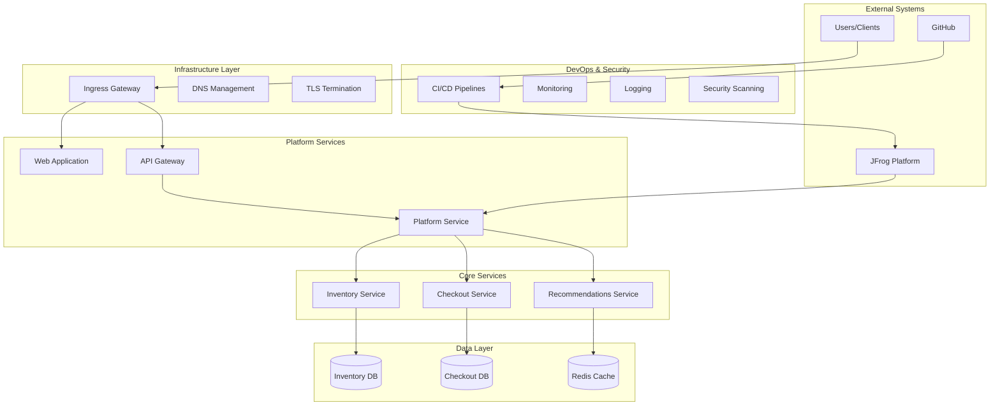
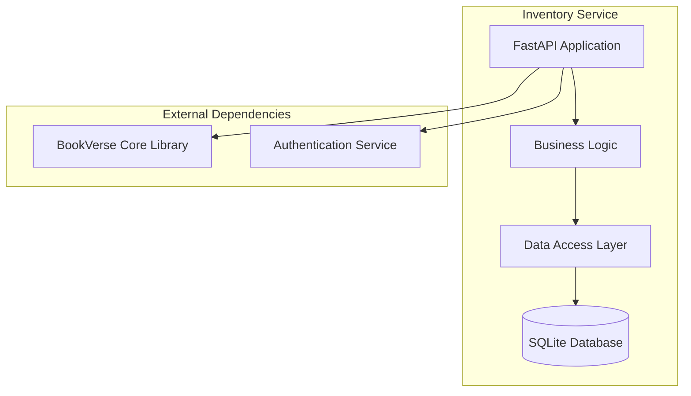
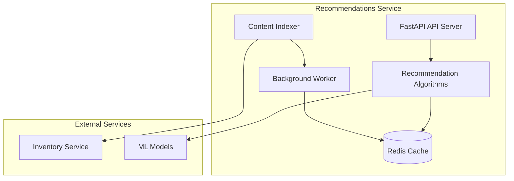
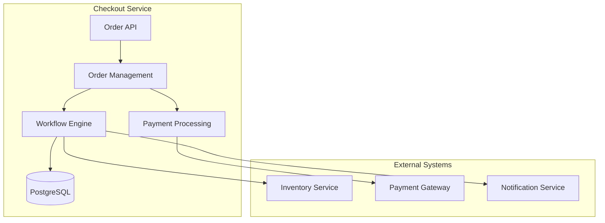
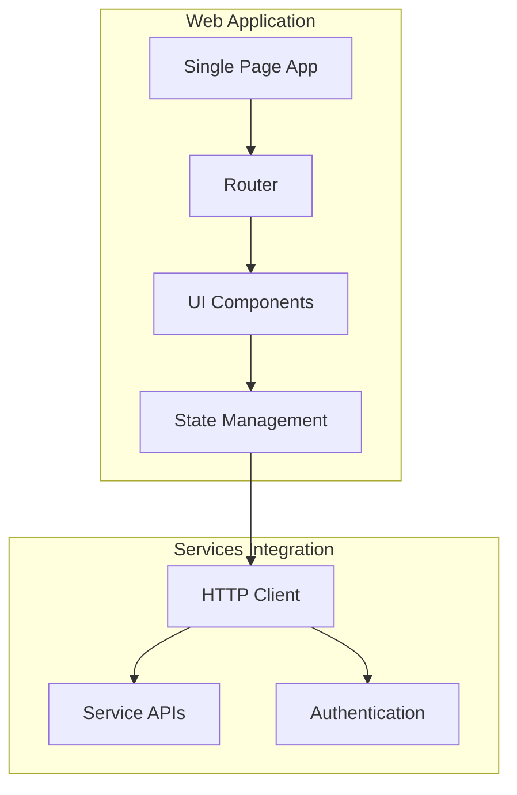
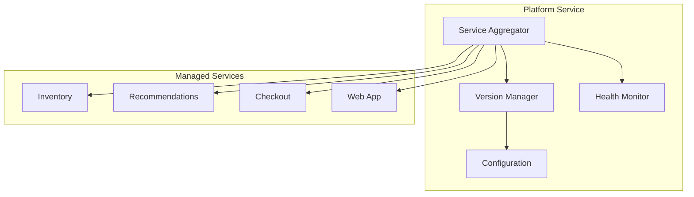
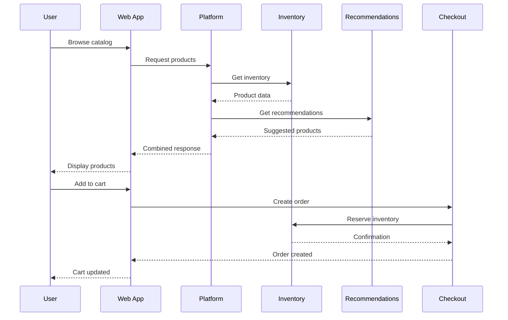
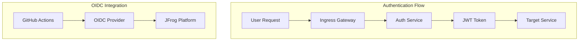
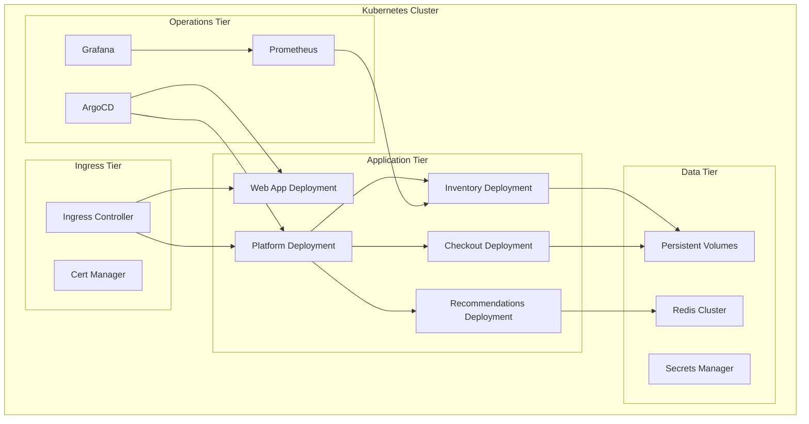
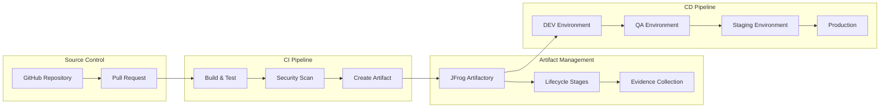

# BookVerse Platform - Architecture Guide

## Comprehensive system architecture and design documentation

This document provides a detailed technical overview of BookVerse's architecture,
design decisions, and implementation patterns for architects, developers, and
operations teams.

---

## 🏗️ System Architecture Overview

BookVerse implements a cloud-native microservices architecture with secure CI/CD
pipelines and enterprise-grade deployment automation.

---

## 🎯 Architectural Principles

### 🔄 **Microservices Design**
- **Service Independence**: Each service owns its data and business logic
- **API-First**: All communication through well-defined REST APIs
- **Database per Service**: Dedicated data stores for service autonomy
- **Failure Isolation**: Circuit breakers and graceful degradation

### 🔐 **Security by Design**
- **Zero-Trust Authentication**: OIDC-based identity verification
- **Secure Communication**: TLS encryption for all service communication
- **Least Privilege**: Minimal permissions and role-based access control
- **Evidence-Based Compliance**: Cryptographic audit trails

### ☁️ **Cloud-Native Patterns**
- **Container-First**: All services containerized with Docker
- **Orchestration Ready**: Kubernetes-native deployment patterns
- **Configuration Management**: External configuration with environment variables
- **Observability**: Comprehensive monitoring, logging, and tracing

### 🚀 **DevOps Excellence**
- **Infrastructure as Code**: All infrastructure defined declaratively
- **GitOps Workflows**: Git-driven deployment and configuration management
- **Automated Testing**: Comprehensive test automation at all levels
- **Continuous Security**: Security scanning integrated into CI/CD

---

## 🏢 Service Architecture

### 📦 **Inventory Service**

**Key Components:**
- **FastAPI Application**: High-performance async API framework
- **SQLAlchemy ORM**: Database abstraction and query optimization
- **Pydantic Models**: Request/response validation and serialization
- **BookVerse Core**: Shared authentication and utility functions

**Responsibilities:**
- Product catalog management and search
- Real-time inventory tracking and availability
- Stock level monitoring and alerting
- Product metadata and image management

### 🤖 **Recommendations Service**

**Key Components:**
- **Dual Architecture**: Separate API server and worker processes
- **ML Pipeline**: Configurable recommendation algorithms
- **Content Indexer**: Real-time inventory data synchronization
- **Caching Layer**: Redis for high-performance recommendations

**Responsibilities:**
- Real-time personalized recommendations (sub-200ms)
- Content-based and collaborative filtering
- A/B testing for recommendation algorithms
- Performance analytics and optimization

### 💳 **Checkout Service**

**Key Components:**
- **Order Lifecycle Management**: Complete order state tracking
- **Payment Integration**: Multiple payment gateway support
- **Workflow Engine**: Event-driven order processing
- **Transaction Management**: ACID compliance for order integrity

**Responsibilities:**
- Shopping cart and checkout flow management
- Payment processing and transaction handling
- Order fulfillment and tracking
- Inventory reservation and coordination

### 🌐 **Web Application**

**Key Components:**
- **Vanilla JavaScript**: Lightweight, modern JavaScript implementation
- **Client-Side Routing**: Single-page application navigation
- **Responsive Design**: Mobile-first responsive UI
- **Service Integration**: Direct API consumption with error handling

**Responsibilities:**
- User interface and experience
- Client-side state management
- API integration and error handling
- Authentication and session management

### 🏢 **Platform Service**

**Key Components:**
- **Service Orchestration**: Coordinated deployment and management
- **Version Management**: Cross-service version compatibility
- **Health Monitoring**: Centralized service health checking
- **Configuration Management**: Environment-specific configuration

**Responsibilities:**
- Cross-service coordination and communication
- Platform-wide configuration management
- Service discovery and health monitoring
- Release orchestration and rollback capabilities

---

## 🗄️ Data Architecture

### 📊 **Data Store Strategy**

| Service | Database | Purpose | Justification |
|---------|----------|---------|---------------|
| **Inventory** | SQLite | Product catalog & stock | Lightweight, embedded, ACID |
| **Checkout** | PostgreSQL | Orders & transactions | ACID, complex queries, JSON |
| **Recommendations** | Redis | Cache & session data | High-performance caching, TTL |
| **Platform** | Config files | Service settings | Git-versioned, env-specific |

### 🔄 **Data Flow Patterns**

### 💾 **Data Consistency**

- **Eventual Consistency**: Non-critical data (recommendations, analytics)
- **Strong Consistency**: Critical data (orders, payments, inventory)
- **Optimistic Locking**: Conflict resolution for concurrent updates
- **Event Sourcing**: Audit trails for compliance and debugging

---

## 🔐 Security Architecture

### 🔑 **Authentication & Authorization**

**Security Layers:**
- **OIDC Authentication**: OpenID Connect for zero-trust CI/CD
- **JWT Tokens**: Stateless authentication with configurable expiration
- **Role-Based Access**: Granular permissions per service and environment
- **API Gateway**: Centralized authentication and rate limiting

### 🛡️ **Security Controls**

| Control | Implementation | Purpose |
|---------|----------------|---------|
| **Network Security** | TLS 1.3, Private networks | Encrypted communication |
| **Access Control** | RBAC, Least privilege | Limited service access |
| **Secrets Management** | External secrets, Rotation | Secure credentials |
| **Vulnerability Scanning** | Automated scanning, SBOM | Supply chain security |
| **Evidence Collection** | Cryptographic signing | Compliance and audit |

---

## 🚀 Deployment Architecture

### ☸️ **Kubernetes Deployment**

### 🔄 **CI/CD Architecture**

**Deployment Stages:**
1. **DEV**: Continuous deployment for development testing
2. **QA**: Automated testing and quality assurance
3. **STAGING**: Production-like environment for final validation
4. **PROD**: Production deployment with zero-downtime strategies

---

## 📊 Technology Stack

### 🔧 **Core Technologies**

| Layer | Technology | Version | Purpose |
|-------|------------|---------|---------|
| **Backend** | Python | 3.11+ | Service implementation |
| **Web Framework** | FastAPI | 0.104+ | High-performance APIs |
| **Frontend** | Vanilla JavaScript | ES2022 | Lightweight client |
| **Containerization** | Docker | 20.10+ | Application packaging |
| **Orchestration** | Kubernetes | 1.25+ | Container orchestration |
| **CI/CD** | GitHub Actions | Latest | Automation pipelines |
| **Artifact Management** | JFrog Artifactory | 7.x | Artifact storage |
| **Security** | JFrog AppTrust | Latest | Software supply chain |

### 📚 **Supporting Libraries**

| Component | Library | Purpose |
|-----------|---------|---------|
| **API Framework** | FastAPI + Uvicorn | Async web services |
| **Database ORM** | SQLAlchemy | Database abstraction |
| **Validation** | Pydantic | Data validation and serialization |
| **HTTP Client** | httpx | Async HTTP client |
| **Caching** | Redis | High-performance caching |
| **Testing** | pytest + coverage | Test automation |
| **Monitoring** | Prometheus + Grafana | Observability stack |
| **GitOps** | ArgoCD | Deployment automation |

---

## 🔍 Design Decisions

### 🎯 **Architectural Choices**

#### **Microservices vs Monolith**
- **Decision**: Microservices architecture
- **Rationale**: Independent scaling, technology diversity, team autonomy
- **Trade-offs**: Increased complexity for distributed tracing and testing

#### **Database Strategy**
- **Decision**: Database-per-service pattern
- **Rationale**: Service independence, technology optimization, scaling flexibility
- **Trade-offs**: Eventual consistency challenges, cross-service queries

#### **API Design**
- **Decision**: REST APIs with OpenAPI specifications
- **Rationale**: Industry standard, tooling ecosystem, documentation automation
- **Trade-offs**: Potential over-fetching compared to GraphQL

#### **Frontend Architecture**
- **Decision**: Vanilla JavaScript SPA
- **Rationale**: Minimal dependencies, fast loading, educational clarity
- **Trade-offs**: More manual state management compared to frameworks

### 🔐 **Security Decisions**

#### **Authentication Strategy**
- **Decision**: OIDC-based zero-trust authentication
- **Rationale**: Eliminates stored credentials, industry standard, auditability
- **Trade-offs**: Initial setup complexity, dependency on external providers

#### **Secret Management**
- **Decision**: External secret management with rotation
- **Rationale**: Security best practices, compliance requirements, operational safety
- **Trade-offs**: Additional infrastructure complexity

### 🚀 **Operational Decisions**

#### **Deployment Strategy**
- **Decision**: GitOps with ArgoCD
- **Rationale**: Declarative deployments, audit trails, rollback capabilities
- **Trade-offs**: Learning curve for traditional deployment teams

#### **Monitoring Approach**
- **Decision**: Prometheus + Grafana observability stack
- **Rationale**: Cloud-native standard, extensive ecosystem, cost-effective
- **Trade-offs**: Initial configuration complexity

---

## 📈 Scalability & Performance

### 🔄 **Scaling Strategies**

| Component | Scaling Pattern | Trigger | Target Metrics |
|-----------|-----------------|---------|----------------|
| **Web Application** | Horizontal | CPU > 70% | Response time < 100ms |
| **Inventory Service** | Horizontal | Memory > 80% | Throughput > 1000 RPS |
| **Recommendations** | Horizontal | Queue depth > 100 | Response time < 200ms |
| **Checkout Service** | Vertical then Horizontal | CPU > 60% | Success > 99.9% |
| **Database** | Vertical | Connection pool > 80% | Query time < 50ms |

### ⚡ **Performance Optimizations**

- **Caching Strategy**: Multi-level caching with Redis and application-level caches
- **Database Optimization**: Indexing strategies and query optimization
- **API Optimization**: Response compression and pagination
- **CDN Integration**: Static asset delivery optimization
- **Connection Pooling**: Efficient database connection management

---

## 🔮 Future Architecture Considerations

### 🛣️ **Roadmap Items**

1. **Service Mesh Integration**: Istio for advanced traffic management
2. **Event-Driven Architecture**: Kafka for asynchronous communication
3. **Multi-Region Deployment**: Geographic distribution for global scale
4. **AI/ML Platform**: Dedicated infrastructure for machine learning workloads
5. **Advanced Monitoring**: Distributed tracing with Jaeger or Zipkin

### 📊 **Metrics & Monitoring**

- **SLA Targets**: 99.9% uptime, < 200ms response times
- **Performance Metrics**: Throughput, latency, error rates
- **Business Metrics**: Conversion rates, user engagement, revenue impact
- **Security Metrics**: Vulnerability counts, compliance scores, audit results

---

## 📞 Architecture Support

### 🤝 **Getting Help**
- **📖 [Troubleshooting Guide](TROUBLESHOOTING.md)** - Architecture-specific issues
- **⚡ [Performance Guide](PERFORMANCE.md)** - Optimization strategies
- **🔐 [Security Guide](operations/SECURITY.md)** - Security configuration
- **💬 [Architecture Discussions](../../discussions)** - Community support

### 🏗️ **Architecture Reviews**
- **Design Reviews**: For significant architectural changes
- **Performance Reviews**: For scaling and optimization decisions
- **Security Reviews**: For security-critical modifications
- **Compliance Reviews**: For regulatory and audit requirements

---

*This architecture documentation is maintained alongside the codebase. For questions or suggestions, please [open a discussion](../../discussions) or [create an issue](../../issues).*
