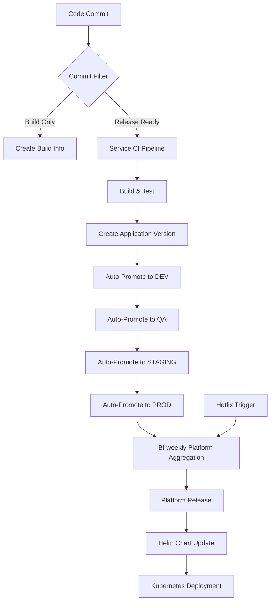

# BookVerse CI/CD Deployment Guide

## Overview

The BookVerse platform uses a sophisticated CI/CD pipeline with JFrog Artifactory, AppTrust, and GitHub Actions to manage deployments across multiple microservices. The system implements intelligent commit filtering and automated promotion workflows to ensure only mature code changes reach production.

## Architecture

### Repository Structure
```
bookverse-demo/
├── bookverse-web/           # Frontend application
├── bookverse-inventory/     # Inventory service
├── bookverse-recommendations/ # Recommendations service  
├── bookverse-checkout/      # Checkout service
├── bookverse-platform/      # Platform aggregation service
├── bookverse-helm/          # Helm charts for deployment
└── bookverse-demo-init/     # Initialization and documentation
```

### CI/CD Flow



### Current Status vs Target State

**Current State (Development Phase):**
- ❌ Manual triggers only for service CI
- ❌ No automatic promotion workflow
- ❌ Platform aggregation is manual only
- ❌ No commit filtering logic

**Target State (Production Ready):**
- ✅ Automatic CI triggers on code commits
- ✅ Intelligent commit filtering
- ✅ Automatic promotion through all stages
- ✅ Bi-weekly scheduled platform aggregation
- ✅ Hotfix capability for urgent releases

## Improved CI/CD Process

### 1. Intelligent Commit Filtering (Demo-Optimized)

The system implements smart filtering to determine which commits should create full application versions vs. build info only. **This setup is optimized for demo visibility** - production systems would use more conservative defaults.

#### Demo vs Production Approach:

| Aspect | 🎯 Demo Behavior | 🏭 Production Behavior |
|--------|------------------|------------------------|
| **Default for unclear commits** | → Application Version | → Build Info Only |
| **Mixed file changes** | → Application Version | → Build Info Only |
| **Feature branch pushes** | → Application Version | → Build Info Only |
| **Philosophy** | "Show the pipeline in action" | "Be conservative, reduce noise" |

#### Demo-Optimized Classification Rules:

- **Application Version (Demo Default)**: Create version + auto-promote
  - **Any commit** that doesn't match build-only patterns
  - Conventional commit prefixes: `feat:`, `fix:`, `perf:`, `refactor:`
  - Commits tagged with `[release]` or `[version]`
  - Release/hotfix branches (`release/*`, `hotfix/*`)
  - Main branch pushes and PR merges
  - **Demo advantage**: Shows full CI/CD pipeline for audience engagement

- **Build-Only Commits**: Create build info only (explicit skip cases)
  - Documentation-only changes (`docs:` + only `*.md` files)
  - Test-only changes (`test:` + only `tests/` directory)
  - Commits explicitly tagged with `[skip-version]` or `[build-only]`
  - **Production note**: Real systems would have 10-15 additional patterns here

#### Demo Implementation:
```bash
# Demo-optimized commit filter (simplified for visibility)
if [[ "$COMMIT_MSG" =~ \[skip-version\] ]] || 
   [[ "$COMMIT_MSG" =~ ^docs?: ]] && [[ only_docs_changed ]] ||
   [[ "$COMMIT_MSG" =~ ^test?: ]] && [[ only_tests_changed ]]; then
  CREATE_APP_VERSION=false  # Build info only
  echo "🔨 Demo: Build info only (explicit skip pattern)"
else
  CREATE_APP_VERSION=true   # Demo default: show the pipeline!
  echo "✅ Demo: Creating app version (demo visibility mode)"
  echo "📝 Production note: Real systems would be more conservative"
fi

# PRODUCTION IMPLEMENTATION would be:
# CREATE_APP_VERSION=false  # Conservative default
# if [[ explicit_release_patterns ]]; then
#   CREATE_APP_VERSION=true
# fi
```

#### Real-World Examples (Demo Behavior):

```bash
# These create APPLICATION VERSIONS in demo (show pipeline):
git commit -m "update user interface styling"           # Demo: ✅ / Prod: ❌
git commit -m "feat: add search functionality"          # Demo: ✅ / Prod: ✅  
git commit -m "fix: resolve login bug"                  # Demo: ✅ / Prod: ✅
git commit -m "refactor database queries"              # Demo: ✅ / Prod: ❌
git commit -m "add new API endpoint"                    # Demo: ✅ / Prod: ❌

# These create BUILD INFO ONLY (even in demo):
git commit -m "docs: update API documentation"         # Demo: ❌ / Prod: ❌
git commit -m "test: improve unit test coverage"       # Demo: ❌ / Prod: ❌  
git commit -m "update dependencies [skip-version]"     # Demo: ❌ / Prod: ❌
```

#### Demo Advantages:
- **🎯 Engaging Presentations**: Every meaningful commit triggers visible pipeline activity
- **⚡ Fast Feedback**: Audience sees results within 2-5 minutes of commits
- **📚 Educational**: Demonstrates complete CI/CD workflow patterns
- **🔄 Realistic**: Uses real tools (JFrog, AppTrust) with production-like processes

### 2. Automatic Service CI/CD Pipeline

Each service (web, inventory, recommendations, checkout) follows this enhanced pipeline:

#### Triggers:
- **Automatic**: Push to main branch, pull request merge
- **Manual**: Workflow dispatch for testing/debugging

#### Process Flow:
1. **Code Analysis**: Determine commit type and filtering rules
2. **Build & Test**: Standard CI pipeline (build, test, security scan)
3. **Artifact Creation**: 
   - Always: Create build info in JFrog
   - Conditionally: Create application version in AppTrust (based on commit filter)
4. **Auto-Promotion**: If application version created, automatically promote through stages:
   - DEV → QA → STAGING → PROD (with configurable delays/approvals)

#### Demo Configuration Example:
```yaml
# .github/workflows/ci.yml (Demo-Optimized)
on:
  push:
    branches: [main]
  pull_request:
    branches: [main]
  workflow_dispatch:

jobs:
  analyze-commit:
    name: "Demo: Analyze Commit (Demo-Optimized)"
    runs-on: ubuntu-latest
    outputs:
      create_app_version: ${{ steps.demo-filter.outputs.create_version }}
      decision_reason: ${{ steps.demo-filter.outputs.reason }}
    steps:
      - uses: actions/checkout@v4
        with:
          fetch-depth: 2  # Need previous commit for diff
          
      - name: "[Demo] Commit Analysis (Optimized for Visibility)"
        id: demo-filter
        run: |
          # DEMO MODE: Favor creating application versions for pipeline visibility
          # PRODUCTION NOTE: Real systems would default to build-info-only
          
          COMMIT_MSG="${{ github.event.head_commit.message }}"
          CHANGED_FILES=$(git diff --name-only HEAD~1 || echo "")
          
          echo "🎯 DEMO MODE: Analyzing commit for CI/CD pipeline demonstration"
          echo "📝 Commit: $COMMIT_MSG"
          
          # Demo: Only skip for explicit patterns (keep it simple)
          if [[ "$COMMIT_MSG" =~ \[skip-version\] ]]; then
            echo "create_version=false" >> $GITHUB_OUTPUT
            echo "reason=Explicit [skip-version] tag" >> $GITHUB_OUTPUT
            echo "🔨 Demo: Build info only (explicit skip)"
            
          elif [[ "$COMMIT_MSG" =~ ^docs?: ]] && echo "$CHANGED_FILES" | grep -v '\.md$\|^docs/' | grep -q .; then
            echo "create_version=false" >> $GITHUB_OUTPUT  
            echo "reason=Documentation-only changes" >> $GITHUB_OUTPUT
            echo "🔨 Demo: Build info only (docs-only)"
            
          elif [[ "$COMMIT_MSG" =~ ^test?: ]] && echo "$CHANGED_FILES" | grep -v '^tests\?/\|_test\.' | grep -q .; then
            echo "create_version=false" >> $GITHUB_OUTPUT
            echo "reason=Test-only changes" >> $GITHUB_OUTPUT  
            echo "🔨 Demo: Build info only (tests-only)"
            
          else
            # DEMO DEFAULT: Create application version for visibility
            echo "create_version=true" >> $GITHUB_OUTPUT
            echo "reason=Demo mode: showing full CI/CD pipeline" >> $GITHUB_OUTPUT
            echo "✅ Demo: Creating app version (demo visibility mode)"
            echo "📝 Production note: Real systems would be more conservative here"
          fi
          
          # PRODUCTION IMPLEMENTATION would look like:
          # echo "create_version=false" >> $GITHUB_OUTPUT  # Conservative default
          # if [[ explicit_release_ready_patterns ]]; then
          #   echo "create_version=true" >> $GITHUB_OUTPUT
          # fi
      
  build-test-publish:
    name: "CI Pipeline"
    needs: analyze-commit
    runs-on: ubuntu-latest
    steps:
      - name: "[Info] Commit Analysis Result"
        run: |
          echo "🔍 Commit Analysis Decision:"
          echo "   Create App Version: ${{ needs.analyze-commit.outputs.create_app_version }}"
          echo "   Reason: ${{ needs.analyze-commit.outputs.decision_reason }}"
          
      - name: "[Build] Always Create Build Info"
        run: |
          echo "🔨 Creating build info (always happens)"
          # Build info creation logic here
      
      - name: "[Release] Conditionally Create Application Version"
        if: ${{ needs.analyze-commit.outputs.create_app_version == 'true' }}
        run: |
          echo "🚀 Creating AppTrust application version (demo pipeline activation)"
          echo "📝 This triggers the full promotion pipeline for demo visibility"
          # Application version creation logic here
          
      - name: "[Demo] Skip Application Version"
        if: ${{ needs.analyze-commit.outputs.create_app_version == 'false' }}
        run: |
          echo "⏭️ Skipping application version creation"
          echo "📝 Build info created for traceability, but no promotion pipeline"
          echo "🏭 Production note: This would be the default behavior in real systems"
```

#### Production Configuration (For Reference):
```yaml
# PRODUCTION VERSION would have:
# - Conservative defaults (build-info-only unless explicitly release-ready)
# - 10-15 detailed filtering rules
# - Team-specific customization
# - Advanced file analysis
# - Metrics collection
# - Error handling and fallbacks
```

### 3. Platform Aggregation & Release

#### Bi-weekly Scheduled Aggregation:
- **Schedule**: Every second Monday at 09:00 UTC
- **Process**: 
  1. Collect latest PROD versions of all services
  2. Create platform manifest
  3. Generate platform release
  4. Trigger Helm deployment

#### Hotfix Capability:
- **Trigger**: Manual workflow dispatch or API call
- **Use Cases**: 
  - Critical security patches
  - Production incidents requiring immediate deployment
  - Emergency rollbacks

#### Configuration:
```yaml
# bookverse-platform/.github/workflows/aggregate.yml
on:
  schedule:
    - cron: '0 9 */14 * 1'  # Every second Monday at 09:00 UTC
  workflow_dispatch:
    inputs:
      hotfix:
        description: 'Hotfix deployment (bypasses schedule)'
        type: boolean
        default: false
```

### 4. Helm Chart Updates & Deployment
- **Automatic Trigger**: Platform release completion
- **Process**: 
  1. Fetch platform content from AppTrust
  2. Pin image tags in `values.yaml`
  3. Package Helm chart
  4. Deploy to Kubernetes cluster
  5. Verify deployment health

## Deployment Process

### Method 1: Automatic Pipeline (Recommended for Demo & Production)

The fully automated pipeline handles deployments with minimal manual intervention. Here's how it works in your demo environment:

#### Demo-Optimized Automatic Pipeline

**Perfect for demonstrating:**
- Modern CI/CD best practices
- Resilience and error recovery
- JFrog + AppTrust integration
- Kubernetes deployment automation

#### For Service Updates (Demo Flow):
1. **You commit** code changes to any service repository (inventory, recommendations, checkout, web)
   ```bash
   # Example: Fix a bug in the inventory service
   cd bookverse-inventory
   git add .
   git commit -m "fix: resolve inventory calculation error"
   git push origin main
   ```

2. **GitHub Actions automatically triggers** (no manual intervention needed)
   - Detects the `fix:` prefix → classifies as "release-ready"
   - Builds Docker image
   - Runs tests
   - Pushes to JFrog registry

3. **AppTrust creates application version** and auto-promotes:
   ```
   inventory v1.2.3 → DEV (immediate)
   inventory v1.2.3 → QA (after 2 minutes)
   inventory v1.2.3 → STAGING (after 5 minutes)
   inventory v1.2.3 → PROD (after 10 minutes)
   ```

4. **Service is ready** for next platform aggregation

#### For Platform Releases (Demo Flow):
1. **Trigger platform aggregation** (manual for demo control):
   ```bash
   # From bookverse-helm repository
   gh workflow run update-k8s.yml
   ```

2. **Platform service automatically**:
   - Collects latest PROD versions: inventory v1.2.3, web v2.1.5, etc.
   - Creates platform manifest
   - Generates platform release v2.1.40

3. **Helm deployment automatically**:
   - Updates `values.yaml` with new image tags
   - Deploys to your local Kubernetes cluster
   - Performs rolling update (zero downtime)

4. **You can immediately verify**:
   ```bash
   # Check deployment status
   kubectl get pods -n bookverse-prod
   
   # Test the updated service via professional demo URL
   curl http://bookverse.demo/api/v1/books
   ```

#### Demo Advantages:

**🎯 Great for Presentations:**
- **Visible Progress**: Watch GitHub Actions workflows in real-time
- **Immediate Results**: Changes appear in your local cluster within minutes
- **Error Recovery**: Demonstrate how the system handles failures gracefully
- **Rollback Demo**: Show instant rollback capabilities

**⚡ Fast Iteration:**
- **No Manual Steps**: Commit → Deploy automatically
- **Quick Feedback**: See results in 2-5 minutes
- **Local Testing**: Everything runs on your Mac (no external dependencies)

**🔧 Production-Like:**
- **Same Workflows**: Identical to what you'd use in production
- **Real Tools**: JFrog, AppTrust, Kubernetes - not mock services
- **Authentic Experience**: Demonstrates real enterprise CI/CD

#### Demo Scenarios You Can Show:

1. **Happy Path Deployment:**
   ```bash
   # Make a small change
   echo "// Demo change" >> bookverse-web/src/main.js
   git commit -m "feat: add demo enhancement"
   git push
   # Watch it deploy automatically
   ```

2. **Resilience Recovery:**
   ```bash
   # Simulate a service failure
   kubectl delete pod -l app=inventory -n bookverse-prod
   # Show how the system recovers and maintains availability
   ```

3. **Rollback Demonstration:**
   ```bash
   # If something goes wrong, instant rollback
   kubectl rollout undo deployment/platform-web -n bookverse-prod
   ```

4. **Multi-Service Update:**
   ```bash
   # Update multiple services, watch platform aggregation
   # Show how all services get updated together
   ```

#### Local K8s Optimizations:

**Resource Efficiency:**
- Single replica per service (no need for multiple pods)
- Minimal resource requests/limits
- Fast image pulls (local registry cache)

**Network Simplicity:**
- Port-forward for access (no ingress complexity)
- Service-to-service communication works perfectly
- No external DNS or load balancer needed

**Storage Simplicity:**
- EmptyDir volumes (no persistent storage complexity)
- In-memory databases for demo data
- Fast startup times

#### For Hotfixes (Demo):
Perfect for showing emergency response:
```bash
# Simulate critical bug fix
git commit -m "fix: critical security patch [hotfix]"
git push

# Trigger immediate platform release
gh workflow run update-k8s.yml --field hotfix=true

# Show deployment completing in under 2 minutes
```

This approach gives you all the benefits of a production CI/CD pipeline while being perfectly suited for demonstration purposes on your local Mac setup.

#### Quick Start for Demo (5-Minute Setup)

To enable the automatic pipeline for your demo:

1. **Set up resilient demo environment**:
   ```bash
   # One-command setup using your existing JFROG_URL
   ./scripts/quick-demo.sh
   
   # This automatically:
   # - Uses your existing JFROG_URL environment variable
   # - Sets up K8s pull user credentials
   # - Creates professional demo URLs (bookverse.demo, argocd.demo)
   # - Configures resilient ingress with single port-forward
   ```

2. **Enable automatic triggers** in service repositories:
   ```bash
   # For each service (inventory, recommendations, checkout, web)
   cd bookverse-inventory  # or any service
   
   # Edit .github/workflows/ci.yml to add automatic triggers
   # Change from:
   #   on: workflow_dispatch:
   # To:
   #   on:
   #     push:
   #       branches: [main]
   #     workflow_dispatch:
   ```

3. **Test the automatic pipeline**:
   ```bash
   # Make a demo change
   echo "# Demo enhancement" >> README.md
   git add .
   git commit -m "feat: add demo documentation"
   git push origin main
   
   # Watch the workflow run automatically
   gh run watch
   ```

4. **Trigger platform deployment**:
   ```bash
   cd bookverse-helm
   gh workflow run update-k8s.yml
   
   # Monitor the deployment
   kubectl get pods -n bookverse-prod -w
   ```

5. **Verify everything works**:
   ```bash
   # Test the application via professional demo URL
   curl http://bookverse.demo/api/v1/books
   curl http://bookverse.demo/health
   
   # Open in browser
   open http://bookverse.demo
   ```

**Demo Ready!** You now have a fully automated CI/CD pipeline running on your local Mac.

### Method 2: Manual Deployment (Development/Testing)

#### Step 1: Build and Push Individual Services

For the web service (our resilience changes):
```bash
cd /path/to/bookverse-web
# Build the image
docker build -t bookverse-web:resilient .
# Tag for JFrog registry
docker tag bookverse-web:resilient apptrustswampupc.jfrog.io/bookverse-web-internal-docker-release-local/web:resilient
# Push to registry (requires authentication)
docker push apptrustswampupc.jfrog.io/bookverse-web-internal-docker-release-local/web:resilient
```

#### Step 2: Update Helm Values Manually

```bash
cd /path/to/bookverse-helm
# Edit values.yaml to pin the new image tag
vim charts/platform/values.yaml
# Update the web.tag field to 'resilient'
```

#### Step 3: Deploy via Helm

```bash
# Deploy to the cluster
helm upgrade platform ./charts/platform -n bookverse-prod
# Verify deployment
kubectl rollout status deployment/platform-web -n bookverse-prod
```

### Method 3: Trigger Helm Workflow Manually

You can trigger the Helm workflow directly:

```bash
# Using GitHub CLI
gh workflow run update-k8s.yml \
  --repo your-org/bookverse-helm \
  --field platform_version="2.1.38" \
  --field build_number="manual-$(date +%s)"

# Or via GitHub UI
# Go to: https://github.com/your-org/bookverse-helm/actions/workflows/update-k8s.yml
# Click "Run workflow"
```

## Current Deployment Status

Based on the analysis of your current setup:

### Existing Infrastructure
- ✅ **Kubernetes Cluster**: Running with all services
- ✅ **JFrog Artifactory**: Configured with OIDC authentication
- ✅ **AppTrust Platform**: Managing component versions
- ✅ **Helm Charts**: Configured for deployment
- ✅ **GitHub Actions**: Automated workflows in place

### Service Status
```bash
# Check current deployments
kubectl get pods -n bookverse-prod
kubectl get services -n bookverse-prod
kubectl get deployments -n bookverse-prod
```

## Deploying the Resilience Improvements

### Quick Deployment (Recommended)

Since you have the infrastructure in place, here's the fastest way to deploy our resilience improvements:

#### 1. Commit Changes
```bash
cd /path/to/bookverse-web
git add .
git commit -m "feat: implement comprehensive resilience architecture

- Fix frontend to use relative URLs through nginx proxy
- Enhance nginx configuration with timeouts and retries
- Add proxy parameters for better error handling
- Enable ingress controller for production access
- Add comprehensive monitoring and health checks"
git push origin main
```

#### 2. Trigger Platform Release
```bash
cd /path/to/bookverse-platform
# Update version or trigger release process
# This depends on your specific platform release workflow
```

#### 3. Deploy via Helm Workflow
```bash
# Trigger the Helm deployment workflow
gh workflow run update-k8s.yml --repo your-org/bookverse-helm
```

### Manual Override (Fastest for Testing)

If you want to test immediately:

```bash
# 1. Build and push the web image
cd /path/to/bookverse-web
docker build -t apptrustswampupc.jfrog.io/bookverse-web-internal-docker-release-local/web:resilient-$(date +%s) .
docker push apptrustswampupc.jfrog.io/bookverse-web-internal-docker-release-local/web:resilient-$(date +%s)

# 2. Update the deployment directly
kubectl set image deployment/platform-web web=apptrustswampupc.jfrog.io/bookverse-web-internal-docker-release-local/web:resilient-$(date +%s) -n bookverse-prod

# 3. Wait for rollout
kubectl rollout status deployment/platform-web -n bookverse-prod
```

## Monitoring and Verification

### Health Checks
```bash
# Check pod status
kubectl get pods -n bookverse-prod

# Check service endpoints
kubectl port-forward svc/platform-web 8080:80 -n bookverse-prod &
curl http://localhost:8080/health

# Check application functionality
curl http://localhost:8080/api/v1/books?page=1&per_page=5
```

### Logs and Debugging
```bash
# Web application logs
kubectl logs deployment/platform-web -n bookverse-prod

# Service connectivity test
kubectl exec deployment/platform-web -n bookverse-prod -- wget -qO- http://inventory/api/v1/books?page=1&per_page=1

# Nginx configuration verification
kubectl exec deployment/platform-web -n bookverse-prod -- nginx -t
```

## Rollback Procedures

### Quick Rollback
```bash
# Rollback to previous deployment
kubectl rollout undo deployment/platform-web -n bookverse-prod

# Check rollback status
kubectl rollout status deployment/platform-web -n bookverse-prod
```

### Helm Rollback
```bash
# List releases
helm list -n bookverse-prod

# Rollback to previous release
helm rollback platform -n bookverse-prod

# Verify rollback
kubectl get pods -n bookverse-prod
```

## Best Practices

### Development Workflow
1. **Feature Branch**: Create feature branch for changes
2. **Local Testing**: Test changes locally with docker-compose
3. **PR Review**: Submit pull request for code review
4. **Staging Deploy**: Deploy to staging environment first
5. **Production Deploy**: Deploy to production after validation

### Production Deployment
1. **Blue-Green**: Use blue-green deployment for zero downtime
2. **Health Checks**: Always verify health endpoints after deployment
3. **Monitoring**: Monitor error rates and response times
4. **Rollback Plan**: Have rollback procedure ready

### Security
1. **OIDC Authentication**: Use OIDC tokens, not static credentials
2. **Least Privilege**: Grant minimal required permissions
3. **Secret Management**: Store secrets in Kubernetes secrets
4. **Image Scanning**: Scan images for vulnerabilities

## Troubleshooting

### Common Issues

#### 1. "Error loading books" (Fixed by our changes)
- **Cause**: Frontend bypassing nginx proxy
- **Solution**: Use relative URLs in frontend code
- **Prevention**: Always test with port-forward setup

#### 2. Service connectivity issues
```bash
# Test internal service connectivity
kubectl exec deployment/platform-web -n bookverse-prod -- nslookup inventory
kubectl exec deployment/platform-web -n bookverse-prod -- wget -qO- http://inventory/health
```

#### 3. Image pull errors
```bash
# Check image pull secrets
kubectl get secrets -n bookverse-prod
kubectl describe pod <pod-name> -n bookverse-prod
```

#### 4. Helm deployment failures
```bash
# Check Helm release status
helm status platform -n bookverse-prod
helm get values platform -n bookverse-prod
```

## Implementation Roadmap

To transition from the current manual setup to the fully automated CI/CD pipeline:

### Phase 1: Enable Automatic Triggers (Immediate)

1. **Update Service CI Workflows**:
   ```bash
   # For each service repository (inventory, recommendations, checkout, web)
   # Update .github/workflows/ci.yml to change from:
   on:
     workflow_dispatch:
   # To:
   on:
     push:
       branches: [main]
     pull_request:
       branches: [main]
     workflow_dispatch:  # Keep for manual testing
   ```

2. **Add Commit Filtering Logic**:
   - Create new job `analyze-commit` in each service CI workflow
   - Implement commit message and file change analysis
   - Set conditional execution for application version creation

### Phase 2: Implement Auto-Promotion (Week 1-2)

1. **Create Promotion Workflows**:
   - Add automatic promotion triggers after successful CI
   - Implement stage-by-stage promotion (DEV → QA → STAGING → PROD)
   - Add configurable delays and approval gates

2. **Configure Repository Dispatch**:
   - Set up cross-repository triggers
   - Enable service CI to trigger promotion workflows

### Phase 3: Enable Platform Aggregation (Week 2-3)

1. **Enable Scheduled Aggregation**:
   ```yaml
   # In bookverse-platform/.github/workflows/aggregate.yml
   # Uncomment the schedule trigger:
   schedule:
     - cron: '0 9 */14 * 1'  # Every second Monday at 09:00 UTC
   ```

2. **Add Hotfix Capability**:
   - Enhance platform aggregation workflow with hotfix input
   - Create API endpoint or webhook for emergency triggers
   - Add notification system for hotfix deployments

### Phase 4: Complete Automation (Week 3-4)

1. **Integrate Helm Auto-Deployment**:
   - Connect platform releases to Helm workflow triggers
   - Add deployment verification and rollback capabilities
   - Implement blue-green deployment strategy

2. **Add Monitoring & Alerting**:
   - Set up deployment success/failure notifications
   - Implement health checks and automatic rollback
   - Add metrics collection for deployment frequency and success rates

### Demo Implementation Examples

#### Demo-Optimized Commit Filter:
```bash
#!/bin/bash
# scripts/analyze-commit-demo.sh
# =============================================================================
# DEMO-OPTIMIZED COMMIT ANALYSIS
# =============================================================================
# This script is optimized for demonstration purposes to show CI/CD workflows
# in action. Production systems would use more conservative defaults.
#
# DEMO BEHAVIOR: Favors creating application versions for visibility
# PRODUCTION BEHAVIOR: Would default to build-info-only for safety
# =============================================================================

COMMIT_MSG="${1:-$(git log -1 --pretty=%B)}"
CHANGED_FILES="${2:-$(git diff --name-only HEAD~1)}"

echo "🎯 DEMO MODE: Analyzing commit for CI/CD demonstration"
echo "📝 Commit: $COMMIT_MSG"

# Demo: Simple rules for clarity (production would have 10-15 rules)
if [[ "$COMMIT_MSG" =~ \[skip-version\] ]]; then
  echo "create_version=false" >> $GITHUB_OUTPUT
  echo "🔨 Demo: Build info only (explicit skip)"
  # PRODUCTION NOTE: Would have many more skip patterns
  
elif [[ "$COMMIT_MSG" =~ ^docs?: ]] && [[ "$CHANGED_FILES" =~ ^[[:space:]]*$ || $(echo "$CHANGED_FILES" | grep -v '\.md$\|^docs/' | wc -l) -eq 0 ]]; then
  echo "create_version=false" >> $GITHUB_OUTPUT
  echo "🔨 Demo: Build info only (docs-only)"
  # PRODUCTION NOTE: Would include README, wikis, comments, etc.
  
elif [[ "$COMMIT_MSG" =~ ^test?: ]] && [[ $(echo "$CHANGED_FILES" | grep -v '^tests\?/\|_test\.' | wc -l) -eq 0 ]]; then
  echo "create_version=false" >> $GITHUB_OUTPUT
  echo "🔨 Demo: Build info only (tests-only)"
  # PRODUCTION NOTE: Would include spec files, fixtures, mocks, etc.
  
else
  # DEMO DEFAULT: Create application version for pipeline visibility
  echo "create_version=true" >> $GITHUB_OUTPUT
  echo "✅ Demo: Creating app version (showing full pipeline)"
  echo "📝 Production note: Real systems would default to build-info-only here"
fi

# =============================================================================
# PRODUCTION IMPLEMENTATION (for reference):
# =============================================================================
# Production systems would use conservative defaults:
#
# echo "create_version=false" >> $GITHUB_OUTPUT  # Safe default
# 
# # Only create versions for explicit release-ready patterns:
# if [[ "$COMMIT_MSG" =~ ^(feat|fix|perf)!?: ]] ||     # Breaking changes
#    [[ "$COMMIT_MSG" =~ \[release\] ]] ||              # Explicit release
#    [[ "$GITHUB_REF" =~ ^refs/heads/(release|hotfix)/ ]] || # Release branches
#    [[ semantic_version_bump_detected ]]; then         # Automated detection
#   echo "create_version=true" >> $GITHUB_OUTPUT
# fi
```

#### Demo vs Production Monitoring:

**Demo Approach (Current):**
```bash
# Simple logging for demo visibility
echo "🎯 DEMO: Decision made - $DECISION"
echo "📊 Reason: $REASON" 
echo "🚀 Watch the pipeline in GitHub Actions!"

# PRODUCTION would add:
# - Structured JSON logging
# - Metrics collection (Prometheus/DataDog)
# - Decision audit trail
# - Team notification integration
# - False positive/negative tracking
```

#### Auto-Promotion Workflow:
```yaml
# .github/workflows/promote-auto.yml
name: Auto-Promote
on:
  workflow_call:
    inputs:
      app_version:
        required: true
        type: string
      from_stage:
        required: true
        type: string
      to_stage:
        required: true
        type: string

jobs:
  promote:
    runs-on: ubuntu-latest
    steps:
      - name: Promote Application
        run: |
          # Call AppTrust promotion API
          # Add stage-specific validation
          # Trigger next stage if successful
```

## Demo vs Production Considerations

### Demo Environment (Local K8s on Mac)
For demonstration purposes, the focus is on showcasing the CI/CD workflow and resilience patterns:

**What's Important for Demo:**
- ✅ **Automatic deployments** that work reliably
- ✅ **Visible workflow progression** (easy to demonstrate)
- ✅ **Quick iteration cycles** (fast feedback for demos)
- ✅ **Local accessibility** (port-forward, localhost access)
- ✅ **Resilience demonstration** (show error recovery)

**What's NOT Needed for Demo:**
- ❌ SSL/TLS certificates (localhost doesn't need HTTPS)
- ❌ Horizontal pod autoscaling (single replicas are fine)
- ❌ Production monitoring (Prometheus/Grafana overhead)
- ❌ External load balancers (port-forward is sufficient)
- ❌ Persistent volumes (demo data can be ephemeral)

### Production Environment
For real production deployment, you would add:
- SSL/TLS with cert-manager
- Horizontal pod autoscaling  
- Production monitoring stack
- External ingress with real domains
- Persistent storage and backup strategies

### Key Differences: Demo vs Production

| Aspect | Demo (Local K8s on Mac) | Production |
|--------|-------------------------|------------|
| **Access Method** | `kubectl port-forward` + `localhost:8080` | External load balancer + real domain |
| **SSL/TLS** | Not needed (localhost) | Required with certificates |
| **Scaling** | Single replica per service | Multiple replicas + autoscaling |
| **Storage** | EmptyDir volumes (ephemeral) | Persistent volumes + backups |
| **Monitoring** | kubectl logs + basic health checks | Prometheus, Grafana, alerting |
| **Network** | ClusterIP services + port-forward | Ingress controller + external IPs |
| **Resource Limits** | Minimal (demo data) | Production-sized limits |
| **High Availability** | Single node (your Mac) | Multi-node cluster |
| **Disaster Recovery** | Git restore + redeploy | Backup/restore procedures |
| **Security** | Basic (demo environment) | Network policies, RBAC, secrets |

### Why This Demo Setup is Perfect:

1. **🚀 Fast Setup**: No external dependencies or complex networking
2. **💻 Runs Anywhere**: Works on any Mac with Docker Desktop + Kubernetes
3. **🔄 Quick Iterations**: Make changes and see results in minutes
4. **📊 Real Tools**: Uses actual JFrog, AppTrust, and Kubernetes (not mocks)
5. **🎯 Demo-Friendly**: Easy to show, explain, and troubleshoot
6. **📈 Scalable Concept**: Same patterns work in production with more resources

### Demo Presentation Flow:

```bash
# 1. Show current state
kubectl get pods -n bookverse-prod
curl http://bookverse.demo/api/v1/books

# 2. Make a change
cd bookverse-inventory
echo "// Demo improvement" >> app/api.py
git commit -m "feat: enhance inventory API performance"
git push

# 3. Show automatic deployment
gh run watch  # Watch GitHub Actions
kubectl get pods -n bookverse-prod -w  # Watch Kubernetes

# 4. Verify the change deployed
curl http://bookverse.demo/api/v1/books  # Same API, new version

# 5. Show resilience
kubectl delete pod -l app=inventory -n bookverse-prod
# Watch it recover automatically

# 6. Show rollback capability
kubectl rollout undo deployment/inventory -n bookverse-prod
```

This gives you a complete, production-like CI/CD demonstration that runs entirely on your Mac!

## Support

For deployment issues:
1. Check the GitHub Actions logs in each repository
2. Review Kubernetes events: `kubectl get events -n bookverse-prod`
3. Check service logs: `kubectl logs -l app=<service-name> -n bookverse-prod`
4. Verify JFrog connectivity and permissions
