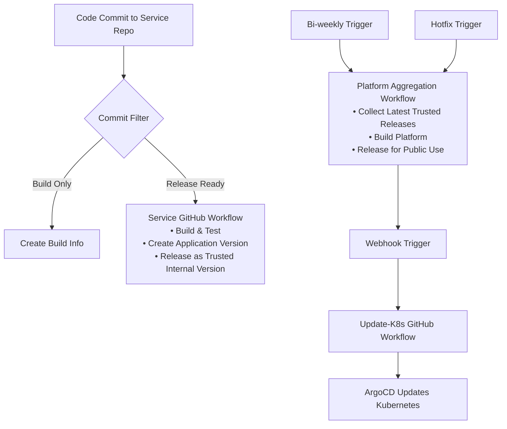

# BookVerse CI/CD Deployment Guide

## Overview

The BookVerse platform uses a sophisticated CI/CD pipeline with JFrog Artifactory, AppTrust, and GitHub Actions to manage deployments across multiple microservices. The system implements intelligent commit filtering and automated promotion workflows to ensure only mature code changes reach production.

## Architecture

### Repository Structure
```
bookverse-demo/
├── bookverse-web/           # Frontend application
├── bookverse-inventory/     # Inventory service
├── bookverse-recommendations/ # Recommendations service  
├── bookverse-checkout/      # Checkout service
├── bookverse-platform/      # Platform aggregation service
├── bookverse-helm/          # Helm charts for deployment
└── bookverse-demo-init/     # Initialization and documentation
```

## CI/CD Flow Overview

The BookVerse platform uses a multi-stage CI/CD process with service-level and platform-level workflows:

**Service Level**: Code Commit → GitHub Workflow → Build/Promote/Release → Trusted Release for Internal Use

**Platform Level**: Bi-weekly Trigger → Aggregate Services → Promote/Release for Public Use → Webhook → K8s Update

### The Actual Process

#### Service Deployment (Individual Services)
1. **Developer commits code** to a service repository (inventory, recommendations, checkout, web)

2. **GitHub workflow triggers automatically** and executes:
   - Build the service
   - Promote through environments
   - Release the application version as a **trusted release for internal use**

#### Platform Aggregation (Bi-weekly)
3. **Bi-weekly GitHub workflow triggers** and executes:
   - Aggregate the latest trusted releases for all internal services
   - Promote the aggregated platform
   - Release for **public use**

#### Kubernetes Deployment
4. **Webhook triggers** the update-k8s workflow in GitHub Actions

5. **ArgoCD updates** the Kubernetes cluster automatically

### Key Characteristics
- **Service Independence**: Each service deploys independently to trusted internal releases
- **Platform Coordination**: Bi-weekly aggregation coordinates all services for public release
- **GitOps Integration**: ArgoCD handles the final Kubernetes deployment
- **Webhook-Driven**: Platform releases automatically trigger infrastructure updates

### CI/CD Flow



### Current Status vs Target State

**Current State (Production Ready):**
- ✅ Automatic CI triggers on code commits
- ✅ Intelligent commit filtering
- ✅ Automatic service releases to trusted internal versions
- ✅ Bi-weekly scheduled platform aggregation
- ✅ Hotfix capability for urgent releases

**Implementation Status:**
- ✅ **Service CI Pipelines**: Fully automated with intelligent commit filtering
- ✅ **Service Release Workflows**: Trusted internal releases for platform aggregation
- ✅ **Platform Aggregation**: Bi-weekly scheduled releases with hotfix capability
- ✅ **Helm Deployment**: Automated Kubernetes deployment through GitOps
- ✅ **Monitoring & Rollback**: Health checks and rollback procedures in place

## Improved CI/CD Process

### 1. Intelligent Commit Filtering

The BookVerse platform automatically analyzes every code commit to determine whether it should trigger a full deployment pipeline or just create build information for tracking purposes.

#### How It Works

When you push code to any BookVerse service repository, the system examines:
1. **Commit Message**: The text description of your changes
2. **Changed Files**: Which specific files were modified
3. **Branch Context**: Which branch the commit was made to

Based on this analysis, the system makes one of two decisions:

#### Decision 1: Create Application Version (Full Pipeline)
**What Happens**: Triggers the complete CI/CD pipeline including build, test, and release as a trusted version for internal use.

**When This Happens**:
- **Feature Commits**: Messages starting with `feat:`, `fix:`, `perf:`, `refactor:`
- **Release Commits**: Messages containing `[release]` or `[version]` tags
- **Main Branch Activity**: Direct pushes to main branch or pull request merges
- **Release Branches**: Commits to `release/*` or `hotfix/*` branches

**Why**: These commits represent meaningful changes that should be deployed and tested through the full pipeline to ensure they reach production safely.

#### Decision 2: Build Info Only (No Deployment)
**What Happens**: Creates a build record for traceability but does NOT trigger deployment pipeline. The code is built and tested, but no new application version is created.

**When This Happens**:
- **Documentation Changes**: Only markdown files or documentation updated
- **Test-Only Changes**: Only test files were modified
- **Explicit Skip**: Developer explicitly requests no deployment

**Why**: These commits don't change the application functionality, so there's no need to create a new version or deploy through environments.

#### Real Examples

| Commit | Decision | Reason |
|--------|----------|---------|
| `feat: add user profile page` | ✅ **Application Version** | New feature - needs full testing |
| `fix: resolve login timeout issue` | ✅ **Application Version** | Bug fix - needs deployment |
| `docs: update installation guide` | ❌ **Build Info Only** | Documentation only - no code changes |
| `test: add integration tests for API` | ❌ **Build Info Only** | Test improvements - no app changes |
| `refactor: optimize database queries` | ✅ **Application Version** | Performance improvement - needs testing |
| `update README [skip-version]` | ❌ **Build Info Only** | Explicitly requested skip |

#### Why This Matters

**For Developers**:
- **Faster Feedback**: Only meaningful changes trigger full pipeline
- **Reduced Noise**: Documentation updates don't create unnecessary releases
- **Flexibility**: Can override decisions when needed with commit tags

**For Operations**:
- **Resource Efficiency**: Avoid unnecessary builds and deployments
- **Clear Audit Trail**: Every commit tracked, but only releases create versions
- **Production Safety**: Only tested, meaningful changes reach production

**For Compliance**:
- **Complete Traceability**: Every commit recorded in build info
- **Version Control**: Clear separation between builds and releases
- **Evidence Collection**: Full audit trail for regulatory requirements

### 2. Service CI/CD Pipeline

Each service (web, inventory, recommendations, checkout) follows this workflow:

#### Triggers:
- **Automatic**: Push to main branch, pull request merge
- **Manual**: Workflow dispatch for testing/debugging

#### Process Flow:
1. **Code Analysis**: Determine commit type and filtering rules
2. **Build & Test**: Standard CI pipeline (build, test, security scan)
3. **Artifact Creation**: 
   - Always: Create build info in JFrog
   - Conditionally: Create application version in AppTrust (based on commit filter)
4. **Release**: If application version created, release as **trusted version for internal use**

#### Key Points:
- **No Environment Promotion**: Services don't promote through DEV/QA/STAGING environments
- **Internal Trusted Releases**: Each service creates trusted releases ready for platform aggregation
- **Independent Deployment**: Services deploy independently without waiting for platform releases

### 3. Platform Aggregation & Release

#### Bi-weekly Scheduled Aggregation:
- **Schedule**: Every second Monday at 09:00 UTC
- **Process**: 
  1. Collect latest trusted releases of all internal services
  2. Build and test the aggregated platform
  3. Create platform manifest
  4. Release for **public use**
  5. Trigger webhook to initiate Kubernetes deployment

#### Webhook-Driven Deployment:
- **Trigger**: Platform release completion automatically sends webhook
- **Target**: update-k8s workflow in GitHub Actions
- **Process**: 
  1. Webhook triggers update-k8s GitHub workflow
  2. Workflow updates Helm charts with new platform versions
  3. ArgoCD detects changes and updates Kubernetes cluster
  4. Rolling deployment with zero downtime

#### Hotfix Capability:
- **Trigger**: Manual workflow dispatch or API call
- **Use Cases**: 
  - Critical security patches
  - Production incidents requiring immediate deployment
  - Emergency rollbacks
- **Process**: Same as bi-weekly aggregation but triggered on-demand


## Rollback Procedures

The BookVerse platform includes a user-triggered rollback workflow that handles deployment rollbacks safely and efficiently.

### User-Triggered Rollback Workflow

**Trigger**: Use the dedicated rollback workflow when you need to revert to a previous version.

**How to Execute**:
```bash
# Trigger the rollback workflow
gh workflow run rollback.yml --repo your-org/bookverse-helm \
  --field service="platform" \
  --field target_version="previous"

# Or rollback to a specific version
gh workflow run rollback.yml --repo your-org/bookverse-helm \
  --field service="inventory" \
  --field target_version="v1.2.3"
```


**What the Workflow Does**:
1. **Validates** the target version exists and is deployable
2. **Updates** Helm values to the specified version
3. **Deploys** the rollback through the normal deployment pipeline
4. **Verifies** the rollback was successful
5. **Notifies** the team of rollback completion

### Benefits of Workflow-Based Rollback
- **Safe**: Uses the same tested deployment pipeline
- **Traceable**: Creates full audit trail of the rollback
- **Verified**: Includes health checks and validation
- **Consistent**: Same process whether rolling forward or backward

### Emergency Rollback
For critical situations, the rollback workflow can be triggered immediately and will bypass normal approval gates while maintaining full traceability.