# BookVerse Platform - Evidence Collection Guide

**Cryptographic signing, compliance reporting, and audit trails for enterprise-grade software supply chain security**

The BookVerse Platform implements comprehensive evidence collection with cryptographic signing, tamper-evident audit trails, and automated compliance reporting to ensure software supply chain integrity and meet enterprise security and regulatory requirements.

---

## 📋 Table of Contents

- [Evidence Collection Architecture](#-evidence-collection-architecture)
- [Cryptographic Signing Framework](#-cryptographic-signing-framework)
- [Evidence Types and Collection](#-evidence-types-and-collection)
- [Compliance Reporting](#-compliance-reporting)
- [Audit Trail Management](#-audit-trail-management)
- [Evidence Storage and Integrity](#-evidence-storage-and-integrity)
- [Verification and Validation](#-verification-and-validation)
- [Integration with External Systems](#-integration-with-external-systems)
- [Monitoring and Alerting](#-monitoring-and-alerting)
- [Troubleshooting Guide](#-troubleshooting-guide)

---

## 🏗️ Evidence Collection Architecture

### Evidence Collection Pipeline

The BookVerse Platform implements a comprehensive evidence collection pipeline with cryptographic integrity:

```mermaid
graph TB
    SOURCE[📝 Evidence Sources<br/>Build Process<br/>Test Results<br/>Security Scans<br/>Deployment Events] --> COLLECTOR[🔍 Evidence Collector<br/>Automated Collection<br/>Metadata Enrichment<br/>Timestamp Validation]
    
    COLLECTOR --> SIGNER[🔐 Cryptographic Signer<br/>Digital Signatures<br/>Hash Generation<br/>Certificate Management]
    
    SIGNER --> VALIDATOR[✅ Evidence Validator<br/>Signature Verification<br/>Integrity Checking<br/>Policy Compliance]
    
    VALIDATOR --> STORAGE[🗄️ Evidence Storage<br/>Tamper-Evident Storage<br/>Redundant Copies<br/>Retention Policies]
    
    STORAGE --> AGGREGATOR[📊 Evidence Aggregator<br/>Report Generation<br/>Compliance Mapping<br/>Audit Preparation]
    
    AGGREGATOR --> REPORTER[📋 Compliance Reporter<br/>Regulatory Reports<br/>Audit Trails<br/>Executive Dashboards]
    
    KEYS[🔑 Key Management<br/>Certificate Authority<br/>Key Rotation<br/>HSM Integration] --> SIGNER
    
    POLICIES[📜 Evidence Policies<br/>Collection Rules<br/>Retention Policies<br/>Compliance Requirements] --> COLLECTOR
    
    MONITOR[📊 Evidence Monitor<br/>Integrity Monitoring<br/>Collection Health<br/>Anomaly Detection] --> STORAGE
```



### Evidence Collection Points

| Collection Point | Evidence Type | Frequency | Retention Period | Compliance Mapping |
|------------------|---------------|-----------|------------------|-------------------|
| **Source Code Commit** | Code changes, author, timestamp | Per commit | 7 years | SOX, GDPR |
| **Build Process** | Build logs, artifacts, dependencies | Per build | 3 years | NIST, ISO 27001 |
| **Security Scans** | Vulnerability reports, SBOM | Per scan | 5 years | NIST, PCI-DSS |
| **Test Execution** | Test results, coverage reports | Per test run | 2 years | ISO 27001 |
| **Deployment Events** | Deployment logs, configurations | Per deployment | 7 years | SOX, GDPR |
| **Access Events** | Authentication, authorization | Real-time | 7 years | SOX, GDPR, PCI-DSS |

### Evidence Metadata Schema

```json
{
  "evidence_metadata": {
    "evidence_id": "uuid",
    "evidence_type": "string",
    "evidence_version": "1.0",
    "collection_timestamp": "ISO8601",
    "source_system": "string",
    "collector_version": "string",
    
    "cryptographic_metadata": {
      "signature_algorithm": "ECDSA-SHA256",
      "certificate_fingerprint": "string",
      "hash_algorithm": "SHA256",
      "content_hash": "string",
      "signature": "string",
      "certificate_chain": ["string"]
    },
    
    "compliance_metadata": {
      "regulatory_frameworks": ["SOX", "GDPR", "PCI-DSS"],
      "classification_level": "confidential",
      "retention_period": "7y",
      "geographic_restrictions": ["EU", "US"],
      "access_controls": ["read", "audit"]
    },
    
    "business_context": {
      "application": "bookverse-inventory",
      "environment": "production",
      "release_version": "1.2.3",
      "responsible_team": "platform-team",
      "business_impact": "high"
    }
  }
}
```

---

## 🔐 Cryptographic Signing Framework

### Certificate Authority Setup

```bash
#!/usr/bin/env bash
# BookVerse Certificate Authority Setup

set -euo pipefail

SCRIPT_DIR="$(cd "$(dirname "${BASH_SOURCE[0]}")" && pwd)"
CA_DIR="${SCRIPT_DIR}/ca"
CERTS_DIR="${CA_DIR}/certs"
PRIVATE_DIR="${CA_DIR}/private"

setup_certificate_authority() {
    echo "🔐 Setting up BookVerse Certificate Authority..."
    
    # Create directory structure
    mkdir -p "$CA_DIR"/{certs,private,newcerts,crl}
    touch "$CA_DIR/index.txt"
    echo "1000" > "$CA_DIR/serial"
    echo "1000" > "$CA_DIR/crlnumber"
    
    # Set proper permissions
    chmod 700 "$PRIVATE_DIR"
    
    # Create CA configuration
    cat > "$CA_DIR/openssl.cnf" << 'EOF'
[ ca ]
default_ca = CA_default

[ CA_default ]
dir               = ./ca
certs             = $dir/certs
crl_dir           = $dir/crl
new_certs_dir     = $dir/newcerts
database          = $dir/index.txt
serial            = $dir/serial
RANDFILE          = $dir/private/.rand

private_key       = $dir/private/ca.key.pem
certificate       = $dir/certs/ca.cert.pem
crlnumber         = $dir/crlnumber
crl               = $dir/crl/ca.crl.pem
crl_extensions    = crl_ext
default_crl_days  = 30
default_md        = sha256
name_opt          = ca_default
cert_opt          = ca_default
default_days      = 365
preserve          = no
policy            = policy_strict

[ policy_strict ]
countryName             = match
stateOrProvinceName     = match
organizationName        = match
organizationalUnitName  = optional
commonName              = supplied
emailAddress            = optional

[ req ]
default_bits        = 4096
distinguished_name  = req_distinguished_name
string_mask         = utf8only
default_md          = sha256
x509_extensions     = v3_ca

[ req_distinguished_name ]
countryName                     = Country Name (2 letter code)
stateOrProvinceName             = State or Province Name
localityName                    = Locality Name
0.organizationName              = Organization Name
organizationalUnitName          = Organizational Unit Name
commonName                      = Common Name
emailAddress                    = Email Address

[ v3_ca ]
subjectKeyIdentifier = hash
authorityKeyIdentifier = keyid:always,issuer
basicConstraints = critical, CA:true
keyUsage = critical, digitalSignature, cRLSign, keyCertSign

[ v3_intermediate_ca ]
subjectKeyIdentifier = hash
authorityKeyIdentifier = keyid:always,issuer
basicConstraints = critical, CA:true, pathlen:0
keyUsage = critical, digitalSignature, cRLSign, keyCertSign

[ evidence_signing ]
basicConstraints = CA:FALSE
nsCertType = client, email
nsComment = "BookVerse Evidence Signing Certificate"
subjectKeyIdentifier = hash
authorityKeyIdentifier = keyid,issuer
keyUsage = critical, nonRepudiation, digitalSignature, keyEncipherment
extendedKeyUsage = codeSigning, emailProtection
EOF
    
    # Generate CA private key
    echo "🔑 Generating CA private key..."
    openssl genrsa -aes256 -out "$PRIVATE_DIR/ca.key.pem" 4096
    chmod 400 "$PRIVATE_DIR/ca.key.pem"
    
    # Generate CA certificate
    echo "📜 Generating CA certificate..."
    openssl req -config "$CA_DIR/openssl.cnf" \
        -key "$PRIVATE_DIR/ca.key.pem" \
        -new -x509 -days 7300 -sha256 -extensions v3_ca \
        -out "$CERTS_DIR/ca.cert.pem" \
        -subj "/C=US/ST=California/O=BookVerse/OU=Platform Security/CN=BookVerse Root CA"
    
    chmod 444 "$CERTS_DIR/ca.cert.pem"
    
    echo "✅ Certificate Authority setup completed"
}

create_evidence_signing_certificate() {
    local cert_name="$1"
    local subject="$2"
    
    echo "📋 Creating evidence signing certificate: $cert_name"
    
    # Generate private key
    openssl genrsa -out "$PRIVATE_DIR/${cert_name}.key.pem" 2048
    chmod 400 "$PRIVATE_DIR/${cert_name}.key.pem"
    
    # Generate certificate signing request
    openssl req -config "$CA_DIR/openssl.cnf" \
        -key "$PRIVATE_DIR/${cert_name}.key.pem" \
        -new -sha256 -out "$CA_DIR/${cert_name}.csr.pem" \
        -subj "$subject"
    
    # Sign the certificate
    openssl ca -config "$CA_DIR/openssl.cnf" \
        -extensions evidence_signing -days 375 -notext -md sha256 \
        -in "$CA_DIR/${cert_name}.csr.pem" \
        -out "$CERTS_DIR/${cert_name}.cert.pem" \
        -batch
    
    chmod 444 "$CERTS_DIR/${cert_name}.cert.pem"
    
    # Clean up CSR
    rm "$CA_DIR/${cert_name}.csr.pem"
    
    echo "✅ Evidence signing certificate created: $cert_name"
}

setup_evidence_signing_certificates() {
    echo "📋 Creating evidence signing certificates..."
    
    # CI/CD Evidence Signing
    create_evidence_signing_certificate "cicd-evidence" \
        "/C=US/ST=California/O=BookVerse/OU=CI-CD/CN=BookVerse CI/CD Evidence Signing"
    
    # Build Evidence Signing
    create_evidence_signing_certificate "build-evidence" \
        "/C=US/ST=California/O=BookVerse/OU=Build/CN=BookVerse Build Evidence Signing"
    
    # Deployment Evidence Signing
    create_evidence_signing_certificate "deployment-evidence" \
        "/C=US/ST=California/O=BookVerse/OU=Deployment/CN=BookVerse Deployment Evidence Signing"
    
    # Security Evidence Signing
    create_evidence_signing_certificate "security-evidence" \
        "/C=US/ST=California/O=BookVerse/OU=Security/CN=BookVerse Security Evidence Signing"
    
    echo "✅ All evidence signing certificates created"
}

verify_certificate_chain() {
    echo "🔍 Verifying certificate chain..."
    
    for cert in "$CERTS_DIR"/*.cert.pem; do
        cert_name=$(basename "$cert" .cert.pem)
        
        if [[ "$cert_name" != "ca" ]]; then
            echo "Verifying $cert_name..."
            openssl verify -CAfile "$CERTS_DIR/ca.cert.pem" "$cert"
        fi
    done
    
    echo "✅ Certificate chain verification completed"
}

main() {
    cd "$SCRIPT_DIR"
    
    setup_certificate_authority
    setup_evidence_signing_certificates
    verify_certificate_chain
    
    echo "🎉 BookVerse Certificate Authority setup completed successfully!"
    echo "📁 CA files location: $CA_DIR"
    echo "🔐 Root CA certificate: $CERTS_DIR/ca.cert.pem"
}

main "$@"
```

### Evidence Signing Implementation

```python
#!/usr/bin/env python3
"""
BookVerse Evidence Signing Framework

Implements cryptographic signing of evidence with comprehensive
validation, certificate management, and compliance reporting.
"""

import json
import hashlib
import base64
import datetime
from typing import Dict, List, Optional, Any
from pathlib import Path
from cryptography import x509
from cryptography.hazmat.primitives import hashes, serialization
from cryptography.hazmat.primitives.asymmetric import padding, rsa
from cryptography.exceptions import InvalidSignature
import logging

logger = logging.getLogger(__name__)

class EvidenceSigner:
    """
    Comprehensive evidence signing implementation for BookVerse Platform.
    
    Provides cryptographic signing, verification, and certificate management
    with enterprise-grade security and compliance capabilities.
    """
    
    def __init__(self, config: Dict):
        self.config = config
        self.ca_cert_path = config.get('ca_cert_path')
        self.signing_cert_path = config.get('signing_cert_path')
        self.signing_key_path = config.get('signing_key_path')
        self.signature_algorithm = config.get('signature_algorithm', 'ECDSA-SHA256')
        
        # Load certificates and keys
        self.ca_cert = self._load_certificate(self.ca_cert_path)
        self.signing_cert = self._load_certificate(self.signing_cert_path)
        self.signing_key = self._load_private_key(self.signing_key_path)
        
    async def sign_evidence(self, evidence: Dict) -> Dict:
        """
        Sign evidence with cryptographic signature and metadata.
        
        Creates tamper-evident evidence with digital signature,
        certificate chain, and comprehensive metadata for compliance.
        """
        
        signing_context = {
            'evidence_id': evidence.get('evidence_id', str(uuid4())),
            'signing_timestamp': datetime.datetime.utcnow(),
            'signer_identity': self._get_signer_identity(),
            'signature_algorithm': self.signature_algorithm
        }
        
        try:
            # Phase 1: Canonicalize evidence content
            canonical_content = self._canonicalize_evidence(evidence)
            
            # Phase 2: Generate content hash
            content_hash = self._generate_content_hash(canonical_content)
            signing_context['content_hash'] = content_hash
            
            # Phase 3: Create signing payload
            signing_payload = {
                'evidence_id': signing_context['evidence_id'],
                'content_hash': content_hash,
                'signing_timestamp': signing_context['signing_timestamp'].isoformat(),
                'signer_identity': signing_context['signer_identity'],
                'signature_algorithm': self.signature_algorithm
            }
            
            # Phase 4: Generate signature
            signature = await self._generate_signature(signing_payload)
            signing_context['signature'] = signature
            
            # Phase 5: Create certificate chain
            certificate_chain = self._build_certificate_chain()
            
            # Phase 6: Create signed evidence
            signed_evidence = {
                'evidence': evidence,
                'signature_metadata': {
                    'evidence_id': signing_context['evidence_id'],
                    'content_hash': content_hash,
                    'signature': signature,
                    'signature_algorithm': self.signature_algorithm,
                    'signing_timestamp': signing_context['signing_timestamp'].isoformat(),
                    'signer_identity': signing_context['signer_identity'],
                    'certificate_chain': certificate_chain,
                    'signature_format': 'PKCS#7'
                },
                'verification_metadata': {
                    'verification_instructions': self._generate_verification_instructions(),
                    'ca_certificate_fingerprint': self._get_certificate_fingerprint(self.ca_cert),
                    'signing_certificate_fingerprint': self._get_certificate_fingerprint(self.signing_cert),
                    'signature_validation_endpoint': self.config.get('validation_endpoint')
                }
            }
            
            # Phase 7: Validate signed evidence
            validation_result = await self.verify_evidence(signed_evidence)
            if not validation_result.valid:
                raise EvidenceSigningError(
                    f"Signed evidence validation failed: {validation_result.error}"
                )
            
            # Phase 8: Log signing event
            await self._log_signing_event(signing_context, success=True)
            
            return signed_evidence
            
        except Exception as error:
            signing_context['error'] = str(error)
            await self._log_signing_event(signing_context, success=False, error=error)
            
            raise EvidenceSigningError(f"Evidence signing failed: {error}") from error
    
    async def verify_evidence(self, signed_evidence: Dict) -> 'EvidenceVerificationResult':
        """
        Verify signed evidence with comprehensive validation.
        
        Validates signature, certificate chain, timestamps, and
        evidence integrity with detailed verification reporting.
        """
        
        verification_context = {
            'verification_id': str(uuid4()),
            'verification_timestamp': datetime.datetime.utcnow(),
            'evidence_id': signed_evidence.get('signature_metadata', {}).get('evidence_id')
        }
        
        try:
            # Phase 1: Extract components
            evidence = signed_evidence.get('evidence')
            signature_metadata = signed_evidence.get('signature_metadata', {})
            
            if not evidence or not signature_metadata:
                return EvidenceVerificationResult(
                    valid=False,
                    error="Missing evidence or signature metadata",
                    verification_context=verification_context
                )
            
            # Phase 2: Verify certificate chain
            certificate_chain_result = await self._verify_certificate_chain(
                signature_metadata.get('certificate_chain', [])
            )
            
            if not certificate_chain_result.valid:
                return EvidenceVerificationResult(
                    valid=False,
                    error=f"Certificate chain validation failed: {certificate_chain_result.error}",
                    verification_context=verification_context
                )
            
            # Phase 3: Verify content hash
            canonical_content = self._canonicalize_evidence(evidence)
            calculated_hash = self._generate_content_hash(canonical_content)
            stored_hash = signature_metadata.get('content_hash')
            
            if calculated_hash != stored_hash:
                return EvidenceVerificationResult(
                    valid=False,
                    error="Content hash mismatch - evidence may have been tampered with",
                    verification_context=verification_context
                )
            
            # Phase 4: Verify signature
            signature_result = await self._verify_signature(
                signature_metadata,
                evidence
            )
            
            if not signature_result.valid:
                return EvidenceVerificationResult(
                    valid=False,
                    error=f"Signature validation failed: {signature_result.error}",
                    verification_context=verification_context
                )
            
            # Phase 5: Verify timestamps
            timestamp_result = await self._verify_timestamps(signature_metadata)
            if not timestamp_result.valid:
                return EvidenceVerificationResult(
                    valid=False,
                    error=f"Timestamp validation failed: {timestamp_result.error}",
                    verification_context=verification_context
                )
            
            # Phase 6: Log verification event
            await self._log_verification_event(verification_context, success=True)
            
            return EvidenceVerificationResult(
                valid=True,
                verification_context=verification_context,
                certificate_chain_result=certificate_chain_result,
                signature_result=signature_result,
                timestamp_result=timestamp_result
            )
            
        except Exception as error:
            verification_context['error'] = str(error)
            await self._log_verification_event(verification_context, success=False, error=error)
            
            return EvidenceVerificationResult(
                valid=False,
                error=f"Verification process failed: {error}",
                verification_context=verification_context
            )
    
    def _canonicalize_evidence(self, evidence: Dict) -> str:
        """Create canonical representation of evidence for signing."""
        
        # Sort keys recursively for consistent representation
        def sort_dict(obj):
            if isinstance(obj, dict):
                return {k: sort_dict(v) for k, v in sorted(obj.items())}
            elif isinstance(obj, list):
                return [sort_dict(item) for item in obj]
            else:
                return obj
        
        sorted_evidence = sort_dict(evidence)
        return json.dumps(sorted_evidence, separators=(',', ':'), ensure_ascii=True)
    
    def _generate_content_hash(self, content: str) -> str:
        """Generate SHA-256 hash of content."""
        
        content_bytes = content.encode('utf-8')
        hash_object = hashlib.sha256(content_bytes)
        return hash_object.hexdigest()
    
    async def _generate_signature(self, signing_payload: Dict) -> str:
        """Generate cryptographic signature of signing payload."""
        
        # Create canonical representation of signing payload
        canonical_payload = json.dumps(signing_payload, separators=(',', ':'), sort_keys=True)
        payload_bytes = canonical_payload.encode('utf-8')
        
        # Generate signature
        signature = self.signing_key.sign(
            payload_bytes,
            padding.PSS(
                mgf=padding.MGF1(hashes.SHA256()),
                salt_length=padding.PSS.MAX_LENGTH
            ),
            hashes.SHA256()
        )
        
        # Encode as base64
        return base64.b64encode(signature).decode('ascii')
    
    def _build_certificate_chain(self) -> List[str]:
        """Build certificate chain for signature verification."""
        
        certificate_chain = []
        
        # Add signing certificate
        signing_cert_pem = self.signing_cert.public_bytes(serialization.Encoding.PEM)
        certificate_chain.append(signing_cert_pem.decode('ascii'))
        
        # Add CA certificate
        ca_cert_pem = self.ca_cert.public_bytes(serialization.Encoding.PEM)
        certificate_chain.append(ca_cert_pem.decode('ascii'))
        
        return certificate_chain
    
    def _get_certificate_fingerprint(self, certificate: x509.Certificate) -> str:
        """Get SHA-256 fingerprint of certificate."""
        
        cert_bytes = certificate.public_bytes(serialization.Encoding.DER)
        fingerprint = hashlib.sha256(cert_bytes).hexdigest()
        return fingerprint
    
    def _get_signer_identity(self) -> Dict:
        """Extract signer identity from signing certificate."""
        
        subject = self.signing_cert.subject
        
        return {
            'common_name': self._get_name_attribute(subject, x509.NameOID.COMMON_NAME),
            'organization': self._get_name_attribute(subject, x509.NameOID.ORGANIZATION_NAME),
            'organizational_unit': self._get_name_attribute(subject, x509.NameOID.ORGANIZATIONAL_UNIT_NAME),
            'country': self._get_name_attribute(subject, x509.NameOID.COUNTRY_NAME),
            'certificate_fingerprint': self._get_certificate_fingerprint(self.signing_cert),
            'certificate_serial_number': str(self.signing_cert.serial_number)
        }
    
    def _get_name_attribute(self, name: x509.Name, oid: x509.ObjectIdentifier) -> Optional[str]:
        """Extract name attribute from certificate subject."""
        
        try:
            return name.get_attributes_for_oid(oid)[0].value
        except (IndexError, AttributeError):
            return None
    
    def _load_certificate(self, cert_path: str) -> x509.Certificate:
        """Load X.509 certificate from file."""
        
        try:
            with open(cert_path, 'rb') as f:
                cert_data = f.read()
            
            return x509.load_pem_x509_certificate(cert_data)
        except Exception as error:
            raise EvidenceSigningError(f"Failed to load certificate {cert_path}: {error}")
    
    def _load_private_key(self, key_path: str) -> rsa.RSAPrivateKey:
        """Load RSA private key from file."""
        
        try:
            with open(key_path, 'rb') as f:
                key_data = f.read()
            
            # Try to load key (may require password)
            password = self.config.get('key_password')
            if password:
                password = password.encode('utf-8')
            
            return serialization.load_pem_private_key(key_data, password=password)
        except Exception as error:
            raise EvidenceSigningError(f"Failed to load private key {key_path}: {error}")

class EvidenceSigningError(Exception):
    """Exception raised for evidence signing failures."""
    pass

class EvidenceVerificationResult:
    """Result of evidence verification."""
    
    def __init__(self, valid: bool, error: str = None, verification_context: Dict = None, **kwargs):
        self.valid = valid
        self.error = error
        self.verification_context = verification_context or {}
        
        # Additional verification results
        for key, value in kwargs.items():
            setattr(self, key, value)
```

---

## 📊 Evidence Types and Collection

### Build Evidence Collection

```python
class BuildEvidenceCollector:
    """
    Build evidence collection for BookVerse Platform.
    
    Collects comprehensive build evidence including source code,
    dependencies, build environment, and artifact metadata.
    """
    
    def __init__(self, config: Dict):
        self.config = config
        self.evidence_signer = EvidenceSigner(config['signing'])
        
    async def collect_build_evidence(self, build_context: Dict) -> Dict:
        """
        Collect comprehensive build evidence.
        
        Gathers all relevant build information, dependencies,
        environment details, and creates signed evidence record.
        """
        
        collection_context = {
            'collection_id': str(uuid4()),
            'collection_timestamp': datetime.datetime.utcnow(),
            'build_id': build_context.get('build_id'),
            'repository': build_context.get('repository'),
            'commit_sha': build_context.get('commit_sha')
        }
        
        try:
            # Phase 1: Source code evidence
            source_evidence = await self._collect_source_evidence(build_context)
            
            # Phase 2: Dependency evidence
            dependency_evidence = await self._collect_dependency_evidence(build_context)
            
            # Phase 3: Build environment evidence
            environment_evidence = await self._collect_environment_evidence(build_context)
            
            # Phase 4: Build process evidence
            process_evidence = await self._collect_process_evidence(build_context)
            
            # Phase 5: Artifact evidence
            artifact_evidence = await self._collect_artifact_evidence(build_context)
            
            # Phase 6: Create comprehensive build evidence
            build_evidence = {
                'evidence_type': 'build_evidence',
                'evidence_version': '1.0',
                'collection_metadata': {
                    'collection_id': collection_context['collection_id'],
                    'collection_timestamp': collection_context['collection_timestamp'].isoformat(),
                    'collector_version': self.config.get('collector_version', '1.0.0'),
                    'collection_environment': self.config.get('environment', 'unknown')
                },
                'build_context': build_context,
                'source_evidence': source_evidence,
                'dependency_evidence': dependency_evidence,
                'environment_evidence': environment_evidence,
                'process_evidence': process_evidence,
                'artifact_evidence': artifact_evidence,
                'compliance_metadata': {
                    'regulatory_frameworks': ['SOX', 'NIST-SSDF', 'ISO-27001'],
                    'evidence_classification': 'confidential',
                    'retention_period': '7y',
                    'access_controls': ['build-team', 'audit-team', 'compliance-team']
                }
            }
            
            # Phase 7: Sign the evidence
            signed_evidence = await self.evidence_signer.sign_evidence(build_evidence)
            
            # Phase 8: Store evidence
            await self._store_evidence(signed_evidence, collection_context)
            
            # Phase 9: Log collection event
            await self._log_collection_event(collection_context, success=True)
            
            return signed_evidence
            
        except Exception as error:
            collection_context['error'] = str(error)
            await self._log_collection_event(collection_context, success=False, error=error)
            
            raise EvidenceCollectionError(f"Build evidence collection failed: {error}") from error
    
    async def _collect_source_evidence(self, build_context: Dict) -> Dict:
        """Collect source code evidence."""
        
        return {
            'repository_url': build_context.get('repository_url'),
            'commit_sha': build_context.get('commit_sha'),
            'commit_timestamp': build_context.get('commit_timestamp'),
            'commit_author': build_context.get('commit_author'),
            'commit_message': build_context.get('commit_message'),
            'branch': build_context.get('branch'),
            'tags': build_context.get('tags', []),
            'source_tree_hash': await self._calculate_source_tree_hash(build_context),
            'modified_files': build_context.get('modified_files', []),
            'file_checksums': await self._generate_file_checksums(build_context)
        }
    
    async def _collect_dependency_evidence(self, build_context: Dict) -> Dict:
        """Collect dependency evidence."""
        
        dependencies = {}
        
        # Python dependencies
        if build_context.get('python_requirements'):
            dependencies['python'] = await self._collect_python_dependencies(build_context)
        
        # Node.js dependencies
        if build_context.get('package_json'):
            dependencies['nodejs'] = await self._collect_nodejs_dependencies(build_context)
        
        # System dependencies
        dependencies['system'] = await self._collect_system_dependencies(build_context)
        
        return {
            'dependency_managers': list(dependencies.keys()),
            'dependencies': dependencies,
            'dependency_lock_files': await self._collect_lock_files(build_context),
            'vulnerability_scan_results': await self._collect_vulnerability_scans(build_context)
        }
    
    async def _collect_environment_evidence(self, build_context: Dict) -> Dict:
        """Collect build environment evidence."""
        
        return {
            'build_system': {
                'platform': build_context.get('platform', 'linux'),
                'architecture': build_context.get('architecture', 'x86_64'),
                'os_version': build_context.get('os_version'),
                'kernel_version': build_context.get('kernel_version')
            },
            'build_tools': {
                'python_version': build_context.get('python_version'),
                'node_version': build_context.get('node_version'),
                'docker_version': build_context.get('docker_version'),
                'git_version': build_context.get('git_version')
            },
            'environment_variables': await self._collect_environment_variables(build_context),
            'build_runner': {
                'runner_type': build_context.get('runner_type', 'github-actions'),
                'runner_version': build_context.get('runner_version'),
                'runner_image': build_context.get('runner_image')
            }
        }
    
    async def _collect_process_evidence(self, build_context: Dict) -> Dict:
        """Collect build process evidence."""
        
        return {
            'build_commands': build_context.get('build_commands', []),
            'build_logs': await self._collect_build_logs(build_context),
            'test_results': await self._collect_test_results(build_context),
            'static_analysis': await self._collect_static_analysis(build_context),
            'security_scans': await self._collect_security_scans(build_context),
            'performance_metrics': {
                'build_duration': build_context.get('build_duration'),
                'cpu_usage': build_context.get('cpu_usage'),
                'memory_usage': build_context.get('memory_usage'),
                'disk_usage': build_context.get('disk_usage')
            }
        }
    
    async def _collect_artifact_evidence(self, build_context: Dict) -> Dict:
        """Collect build artifact evidence."""
        
        artifacts = []
        
        for artifact in build_context.get('artifacts', []):
            artifact_evidence = {
                'artifact_name': artifact.get('name'),
                'artifact_type': artifact.get('type'),
                'artifact_path': artifact.get('path'),
                'artifact_size': artifact.get('size'),
                'artifact_hash': await self._calculate_artifact_hash(artifact),
                'creation_timestamp': artifact.get('creation_timestamp'),
                'artifact_metadata': artifact.get('metadata', {})
            }
            artifacts.append(artifact_evidence)
        
        return {
            'total_artifacts': len(artifacts),
            'artifacts': artifacts,
            'artifact_repository': build_context.get('artifact_repository'),
            'upload_timestamp': build_context.get('upload_timestamp')
        }

class EvidenceCollectionError(Exception):
    """Exception raised for evidence collection failures."""
    pass
```

### Security Evidence Collection

```python
class SecurityEvidenceCollector:
    """
    Security evidence collection for BookVerse Platform.
    
    Collects security scan results, vulnerability assessments,
    and compliance validation evidence.
    """
    
    def __init__(self, config: Dict):
        self.config = config
        self.evidence_signer = EvidenceSigner(config['signing'])
        
    async def collect_security_evidence(self, security_context: Dict) -> Dict:
        """
        Collect comprehensive security evidence.
        
        Gathers security scan results, vulnerability assessments,
        compliance validations, and creates signed evidence record.
        """
        
        collection_context = {
            'collection_id': str(uuid4()),
            'collection_timestamp': datetime.datetime.utcnow(),
            'scan_id': security_context.get('scan_id'),
            'target_artifact': security_context.get('target_artifact'),
            'scan_type': security_context.get('scan_type')
        }
        
        try:
            # Phase 1: Vulnerability scan evidence
            vulnerability_evidence = await self._collect_vulnerability_evidence(security_context)
            
            # Phase 2: Static analysis evidence
            static_analysis_evidence = await self._collect_static_analysis_evidence(security_context)
            
            # Phase 3: Dynamic analysis evidence  
            dynamic_analysis_evidence = await self._collect_dynamic_analysis_evidence(security_context)
            
            # Phase 4: Compliance evidence
            compliance_evidence = await self._collect_compliance_evidence(security_context)
            
            # Phase 5: Container security evidence
            container_evidence = await self._collect_container_evidence(security_context)
            
            # Phase 6: Create comprehensive security evidence
            security_evidence = {
                'evidence_type': 'security_evidence',
                'evidence_version': '1.0',
                'collection_metadata': {
                    'collection_id': collection_context['collection_id'],
                    'collection_timestamp': collection_context['collection_timestamp'].isoformat(),
                    'collector_version': self.config.get('collector_version', '1.0.0'),
                    'scan_tools': self._get_scan_tools()
                },
                'security_context': security_context,
                'vulnerability_evidence': vulnerability_evidence,
                'static_analysis_evidence': static_analysis_evidence,
                'dynamic_analysis_evidence': dynamic_analysis_evidence,
                'compliance_evidence': compliance_evidence,
                'container_evidence': container_evidence,
                'risk_assessment': await self._calculate_risk_assessment(
                    vulnerability_evidence,
                    static_analysis_evidence,
                    compliance_evidence
                ),
                'compliance_metadata': {
                    'regulatory_frameworks': ['NIST-SSDF', 'OWASP', 'PCI-DSS', 'SOC2'],
                    'security_standards': ['ISO-27001', 'NIST-CSF'],
                    'evidence_classification': 'restricted',
                    'retention_period': '5y',
                    'access_controls': ['security-team', 'audit-team', 'compliance-team']
                }
            }
            
            # Phase 7: Sign the evidence
            signed_evidence = await self.evidence_signer.sign_evidence(security_evidence)
            
            # Phase 8: Store evidence
            await self._store_evidence(signed_evidence, collection_context)
            
            # Phase 9: Generate security alerts if needed
            await self._process_security_alerts(security_evidence)
            
            # Phase 10: Log collection event
            await self._log_collection_event(collection_context, success=True)
            
            return signed_evidence
            
        except Exception as error:
            collection_context['error'] = str(error)
            await self._log_collection_event(collection_context, success=False, error=error)
            
            raise EvidenceCollectionError(f"Security evidence collection failed: {error}") from error
    
    async def _collect_vulnerability_evidence(self, security_context: Dict) -> Dict:
        """Collect vulnerability scan evidence."""
        
        vulnerability_scans = []
        
        # SAST (Static Application Security Testing)
        if security_context.get('sast_results'):
            sast_evidence = {
                'scan_type': 'SAST',
                'tool_name': security_context.get('sast_tool', 'unknown'),
                'tool_version': security_context.get('sast_tool_version'),
                'scan_timestamp': security_context.get('sast_timestamp'),
                'scan_duration': security_context.get('sast_duration'),
                'vulnerabilities': security_context['sast_results'].get('vulnerabilities', []),
                'total_issues': security_context['sast_results'].get('total_issues', 0),
                'severity_breakdown': security_context['sast_results'].get('severity_breakdown', {}),
                'scan_coverage': security_context['sast_results'].get('coverage', {}),
                'false_positive_rate': security_context['sast_results'].get('false_positive_rate')
            }
            vulnerability_scans.append(sast_evidence)
        
        # DAST (Dynamic Application Security Testing)
        if security_context.get('dast_results'):
            dast_evidence = {
                'scan_type': 'DAST',
                'tool_name': security_context.get('dast_tool', 'unknown'),
                'tool_version': security_context.get('dast_tool_version'),
                'scan_timestamp': security_context.get('dast_timestamp'),
                'scan_duration': security_context.get('dast_duration'),
                'target_urls': security_context['dast_results'].get('target_urls', []),
                'vulnerabilities': security_context['dast_results'].get('vulnerabilities', []),
                'total_issues': security_context['dast_results'].get('total_issues', 0),
                'severity_breakdown': security_context['dast_results'].get('severity_breakdown', {}),
                'authentication_tested': security_context['dast_results'].get('auth_tested', False)
            }
            vulnerability_scans.append(dast_evidence)
        
        # SCA (Software Composition Analysis)
        if security_context.get('sca_results'):
            sca_evidence = {
                'scan_type': 'SCA',
                'tool_name': security_context.get('sca_tool', 'unknown'),
                'tool_version': security_context.get('sca_tool_version'),
                'scan_timestamp': security_context.get('sca_timestamp'),
                'dependencies_scanned': security_context['sca_results'].get('dependencies_scanned', 0),
                'vulnerabilities': security_context['sca_results'].get('vulnerabilities', []),
                'total_issues': security_context['sca_results'].get('total_issues', 0),
                'severity_breakdown': security_context['sca_results'].get('severity_breakdown', {}),
                'license_issues': security_context['sca_results'].get('license_issues', []),
                'outdated_dependencies': security_context['sca_results'].get('outdated_dependencies', [])
            }
            vulnerability_scans.append(sca_evidence)
        
        return {
            'scan_summary': {
                'total_scans': len(vulnerability_scans),
                'scan_types': [scan['scan_type'] for scan in vulnerability_scans],
                'total_vulnerabilities': sum(scan.get('total_issues', 0) for scan in vulnerability_scans),
                'highest_severity': self._determine_highest_severity(vulnerability_scans),
                'scan_completion_status': 'complete' if vulnerability_scans else 'incomplete'
            },
            'scans': vulnerability_scans,
            'remediation_recommendations': await self._generate_remediation_recommendations(vulnerability_scans)
        }
    
    async def _calculate_risk_assessment(self, vuln_evidence: Dict, static_evidence: Dict, compliance_evidence: Dict) -> Dict:
        """Calculate overall risk assessment."""
        
        # Risk scoring algorithm
        risk_factors = {
            'vulnerability_risk': self._calculate_vulnerability_risk(vuln_evidence),
            'code_quality_risk': self._calculate_code_quality_risk(static_evidence),
            'compliance_risk': self._calculate_compliance_risk(compliance_evidence)
        }
        
        # Weighted risk calculation
        weights = {'vulnerability_risk': 0.5, 'code_quality_risk': 0.3, 'compliance_risk': 0.2}
        
        overall_risk_score = sum(
            risk_factors[factor] * weights[factor] 
            for factor in risk_factors
        )
        
        # Determine risk level
        if overall_risk_score >= 8.0:
            risk_level = 'CRITICAL'
        elif overall_risk_score >= 6.0:
            risk_level = 'HIGH'
        elif overall_risk_score >= 4.0:
            risk_level = 'MEDIUM'
        elif overall_risk_score >= 2.0:
            risk_level = 'LOW'
        else:
            risk_level = 'MINIMAL'
        
        return {
            'overall_risk_score': round(overall_risk_score, 2),
            'risk_level': risk_level,
            'risk_factors': risk_factors,
            'risk_calculation_method': 'weighted_average',
            'risk_assessment_timestamp': datetime.datetime.utcnow().isoformat(),
            'recommendations': self._generate_risk_recommendations(risk_level, risk_factors)
        }
```

---

## 📋 Compliance Reporting

### Regulatory Compliance Framework

```python
class ComplianceReporter:
    """
    Compliance reporting framework for BookVerse Platform.
    
    Generates comprehensive compliance reports for various regulatory
    frameworks including SOX, GDPR, PCI-DSS, and industry standards.
    """
    
    def __init__(self, config: Dict):
        self.config = config
        self.evidence_store = EvidenceStore(config['storage'])
        self.regulatory_frameworks = {
            'SOX': SOXComplianceHandler(),
            'GDPR': GDPRComplianceHandler(),
            'PCI-DSS': PCIDSSComplianceHandler(),
            'NIST-SSDF': NISTSSDFComplianceHandler(),
            'ISO-27001': ISO27001ComplianceHandler()
        }
        
    async def generate_compliance_report(self, framework: str, period_start: datetime, period_end: datetime) -> Dict:
        """
        Generate comprehensive compliance report for specified framework.
        
        Creates detailed compliance report with evidence mapping,
        gap analysis, and remediation recommendations.
        """
        
        report_context = {
            'report_id': str(uuid4()),
            'framework': framework,
            'period_start': period_start,
            'period_end': period_end,
            'generation_timestamp': datetime.datetime.utcnow(),
            'report_version': '1.0'
        }
        
        try:
            # Phase 1: Validate framework
            if framework not in self.regulatory_frameworks:
                raise ComplianceReportingError(f"Unsupported framework: {framework}")
            
            compliance_handler = self.regulatory_frameworks[framework]
            
            # Phase 2: Collect relevant evidence
            evidence_collection = await self._collect_framework_evidence(
                framework,
                period_start,
                period_end
            )
            
            # Phase 3: Map evidence to requirements
            evidence_mapping = await compliance_handler.map_evidence_to_requirements(
                evidence_collection
            )
            
            # Phase 4: Assess compliance status
            compliance_assessment = await compliance_handler.assess_compliance(
                evidence_mapping
            )
            
            # Phase 5: Identify gaps and risks
            gap_analysis = await compliance_handler.analyze_gaps(
                compliance_assessment
            )
            
            # Phase 6: Generate remediation plan
            remediation_plan = await compliance_handler.generate_remediation_plan(
                gap_analysis
            )
            
            # Phase 7: Create comprehensive report
            compliance_report = {
                'report_metadata': report_context,
                'executive_summary': {
                    'framework': framework,
                    'assessment_period': {
                        'start': period_start.isoformat(),
                        'end': period_end.isoformat(),
                        'duration_days': (period_end - period_start).days
                    },
                    'overall_compliance_score': compliance_assessment['overall_score'],
                    'compliance_status': compliance_assessment['status'],
                    'total_requirements': compliance_assessment['total_requirements'],
                    'met_requirements': compliance_assessment['met_requirements'],
                    'partially_met_requirements': compliance_assessment['partially_met'],
                    'unmet_requirements': compliance_assessment['unmet_requirements'],
                    'critical_gaps': len(gap_analysis.get('critical_gaps', [])),
                    'high_priority_actions': len(remediation_plan.get('high_priority', []))
                },
                'evidence_summary': {
                    'total_evidence_items': len(evidence_collection),
                    'evidence_types': self._categorize_evidence_types(evidence_collection),
                    'evidence_coverage': evidence_mapping['coverage_percentage'],
                    'evidence_quality_score': evidence_mapping['quality_score']
                },
                'compliance_assessment': compliance_assessment,
                'evidence_mapping': evidence_mapping,
                'gap_analysis': gap_analysis,
                'remediation_plan': remediation_plan,
                'attestations': await self._generate_attestations(
                    framework,
                    compliance_assessment
                ),
                'appendices': {
                    'evidence_inventory': evidence_collection,
                    'regulatory_requirements': compliance_handler.get_requirements(),
                    'assessment_methodology': compliance_handler.get_methodology(),
                    'risk_assessment': await self._assess_compliance_risks(gap_analysis)
                }
            }
            
            # Phase 8: Sign the report
            signed_report = await self._sign_compliance_report(compliance_report)
            
            # Phase 9: Store report
            await self._store_compliance_report(signed_report, report_context)
            
            # Phase 10: Generate notifications
            await self._generate_compliance_notifications(compliance_report)
            
            return signed_report
            
        except Exception as error:
            report_context['error'] = str(error)
            await self._log_report_generation_error(report_context, error)
            
            raise ComplianceReportingError(f"Compliance report generation failed: {error}") from error
    
    async def _collect_framework_evidence(self, framework: str, start_date: datetime, end_date: datetime) -> List[Dict]:
        """Collect evidence relevant to specific compliance framework."""
        
        # Define evidence types required for each framework
        framework_evidence_types = {
            'SOX': [
                'access_control_evidence',
                'change_management_evidence',
                'data_integrity_evidence',
                'audit_trail_evidence',
                'financial_controls_evidence'
            ],
            'GDPR': [
                'data_processing_evidence',
                'consent_management_evidence',
                'data_protection_evidence',
                'breach_notification_evidence',
                'data_retention_evidence'
            ],
            'PCI-DSS': [
                'cardholder_data_evidence',
                'network_security_evidence',
                'access_control_evidence',
                'vulnerability_management_evidence',
                'monitoring_evidence'
            ],
            'NIST-SSDF': [
                'secure_development_evidence',
                'vulnerability_management_evidence',
                'supply_chain_evidence',
                'incident_response_evidence',
                'security_testing_evidence'
            ],
            'ISO-27001': [
                'information_security_evidence',
                'risk_management_evidence',
                'access_control_evidence',
                'incident_management_evidence',
                'business_continuity_evidence'
            ]
        }
        
        required_types = framework_evidence_types.get(framework, [])
        
        # Collect evidence from storage
        collected_evidence = []
        
        for evidence_type in required_types:
            evidence_items = await self.evidence_store.query_evidence(
                evidence_type=evidence_type,
                start_date=start_date,
                end_date=end_date
            )
            collected_evidence.extend(evidence_items)
        
        return collected_evidence

class SOXComplianceHandler:
    """Sarbanes-Oxley compliance handler."""
    
    def __init__(self):
        self.requirements = self._load_sox_requirements()
        
    async def map_evidence_to_requirements(self, evidence: List[Dict]) -> Dict:
        """Map collected evidence to SOX requirements."""
        
        mapping = {}
        coverage_score = 0
        quality_score = 0
        
        for requirement in self.requirements:
            requirement_id = requirement['id']
            mapped_evidence = []
            
            # Find evidence that satisfies this requirement
            for evidence_item in evidence:
                if self._evidence_satisfies_requirement(evidence_item, requirement):
                    mapped_evidence.append(evidence_item)
            
            mapping[requirement_id] = {
                'requirement': requirement,
                'evidence': mapped_evidence,
                'coverage_status': 'covered' if mapped_evidence else 'not_covered',
                'evidence_quality': self._assess_evidence_quality(mapped_evidence)
            }
            
            # Update scores
            if mapped_evidence:
                coverage_score += 1
                quality_score += mapping[requirement_id]['evidence_quality']
        
        return {
            'mapping': mapping,
            'coverage_percentage': (coverage_score / len(self.requirements)) * 100,
            'quality_score': quality_score / len(self.requirements) if self.requirements else 0
        }
    
    async def assess_compliance(self, evidence_mapping: Dict) -> Dict:
        """Assess SOX compliance status."""
        
        total_requirements = len(self.requirements)
        met_requirements = 0
        partially_met = 0
        unmet_requirements = 0
        
        compliance_details = {}
        
        for requirement_id, mapping_data in evidence_mapping['mapping'].items():
            requirement = mapping_data['requirement']
            evidence = mapping_data['evidence']
            quality = mapping_data['evidence_quality']
            
            if evidence and quality >= 0.8:
                status = 'met'
                met_requirements += 1
            elif evidence and quality >= 0.5:
                status = 'partially_met'
                partially_met += 1
            else:
                status = 'not_met'
                unmet_requirements += 1
            
            compliance_details[requirement_id] = {
                'requirement_title': requirement['title'],
                'compliance_status': status,
                'evidence_count': len(evidence),
                'quality_score': quality,
                'last_evidence_date': max(
                    (item.get('collection_timestamp', '') for item in evidence),
                    default=''
                )
            }
        
        # Calculate overall compliance score
        overall_score = (met_requirements + (partially_met * 0.5)) / total_requirements * 100
        
        # Determine compliance status
        if overall_score >= 95:
            compliance_status = 'COMPLIANT'
        elif overall_score >= 80:
            compliance_status = 'SUBSTANTIALLY_COMPLIANT'
        elif overall_score >= 60:
            compliance_status = 'PARTIALLY_COMPLIANT'
        else:
            compliance_status = 'NON_COMPLIANT'
        
        return {
            'overall_score': round(overall_score, 2),
            'status': compliance_status,
            'total_requirements': total_requirements,
            'met_requirements': met_requirements,
            'partially_met': partially_met,
            'unmet_requirements': unmet_requirements,
            'compliance_details': compliance_details,
            'assessment_timestamp': datetime.datetime.utcnow().isoformat()
        }
    
    def _load_sox_requirements(self) -> List[Dict]:
        """Load SOX compliance requirements."""
        
        return [
            {
                'id': 'SOX-302',
                'title': 'Corporate Responsibility for Financial Reports',
                'description': 'CEO and CFO certification of financial reports',
                'control_objectives': [
                    'Accuracy and completeness of financial data',
                    'Effective internal controls',
                    'Disclosure of material changes'
                ],
                'evidence_requirements': [
                    'access_control_evidence',
                    'change_management_evidence',
                    'audit_trail_evidence'
                ]
            },
            {
                'id': 'SOX-404',
                'title': 'Management Assessment of Internal Controls',
                'description': 'Assessment of internal control over financial reporting',
                'control_objectives': [
                    'Internal control effectiveness',
                    'Material weakness identification',
                    'Control testing and validation'
                ],
                'evidence_requirements': [
                    'data_integrity_evidence',
                    'financial_controls_evidence',
                    'audit_trail_evidence'
                ]
            },
            {
                'id': 'SOX-409',
                'title': 'Real Time Issuer Disclosures',
                'description': 'Rapid and current disclosure of material changes',
                'control_objectives': [
                    'Timely disclosure of material information',
                    'Accurate and complete disclosures',
                    'Effective disclosure controls'
                ],
                'evidence_requirements': [
                    'change_management_evidence',
                    'audit_trail_evidence',
                    'access_control_evidence'
                ]
            }
        ]

class ComplianceReportingError(Exception):
    """Exception raised for compliance reporting failures."""
    pass
```

---

## 🗄️ Evidence Storage and Integrity

### Tamper-Evident Storage System

```python
class TamperEvidentStorageSystem:
    """
    Tamper-evident evidence storage for BookVerse Platform.
    
    Implements blockchain-inspired storage with cryptographic integrity,
    redundant storage, and comprehensive audit capabilities.
    """
    
    def __init__(self, config: Dict):
        self.config = config
        self.storage_backends = self._initialize_storage_backends(config)
        self.integrity_monitor = IntegrityMonitor(config['integrity'])
        
    async def store_evidence(self, evidence: Dict, metadata: Dict) -> str:
        """
        Store evidence with tamper-evident guarantees.
        
        Creates multiple redundant copies with cryptographic linking
        and continuous integrity monitoring.
        """
        
        storage_context = {
            'storage_id': str(uuid4()),
            'evidence_id': evidence.get('evidence_id', str(uuid4())),
            'storage_timestamp': datetime.datetime.utcnow(),
            'storage_version': '1.0'
        }
        
        try:
            # Phase 1: Prepare evidence for storage
            prepared_evidence = await self._prepare_evidence_for_storage(evidence, metadata)
            
            # Phase 2: Generate storage block
            storage_block = await self._create_storage_block(prepared_evidence, storage_context)
            
            # Phase 3: Store in multiple backends
            storage_results = await self._store_in_multiple_backends(storage_block)
            
            # Phase 4: Create integrity record
            integrity_record = await self._create_integrity_record(storage_block, storage_results)
            
            # Phase 5: Update storage index
            await self._update_storage_index(storage_block, integrity_record)
            
            # Phase 6: Schedule integrity verification
            await self._schedule_integrity_verification(storage_context['evidence_id'])
            
            return storage_context['evidence_id']
            
        except Exception as error:
            await self._log_storage_error(storage_context, error)
            raise EvidenceStorageError(f"Evidence storage failed: {error}") from error
    
    async def retrieve_evidence(self, evidence_id: str, verify_integrity: bool = True) -> Dict:
        """
        Retrieve evidence with integrity verification.
        
        Fetches evidence from storage, verifies integrity,
        and provides detailed verification results.
        """
        
        retrieval_context = {
            'retrieval_id': str(uuid4()),
            'evidence_id': evidence_id,
            'retrieval_timestamp': datetime.datetime.utcnow(),
            'verify_integrity': verify_integrity
        }
        
        try:
            # Phase 1: Locate evidence in storage index
            storage_metadata = await self._lookup_storage_metadata(evidence_id)
            
            if not storage_metadata:
                raise EvidenceNotFoundError(f"Evidence not found: {evidence_id}")
            
            # Phase 2: Retrieve from primary storage
            primary_evidence = await self._retrieve_from_primary_storage(storage_metadata)
            
            # Phase 3: Verify integrity if requested
            integrity_result = None
            if verify_integrity:
                integrity_result = await self._verify_evidence_integrity(
                    primary_evidence,
                    storage_metadata
                )
                
                if not integrity_result.valid:
                    # Try to recover from backup storage
                    recovery_result = await self._attempt_evidence_recovery(evidence_id)
                    if recovery_result.recovered:
                        primary_evidence = recovery_result.evidence
                        integrity_result = recovery_result.integrity_result
                    else:
                        raise EvidenceIntegrityError(
                            f"Evidence integrity verification failed: {integrity_result.error}"
                        )
            
            # Phase 4: Log retrieval event
            await self._log_retrieval_event(retrieval_context, success=True)
            
            return {
                'evidence': primary_evidence,
                'retrieval_metadata': retrieval_context,
                'storage_metadata': storage_metadata,
                'integrity_result': integrity_result
            }
            
        except Exception as error:
            await self._log_retrieval_event(retrieval_context, success=False, error=error)
            raise EvidenceRetrievalError(f"Evidence retrieval failed: {error}") from error
    
    async def _create_storage_block(self, evidence: Dict, context: Dict) -> Dict:
        """Create tamper-evident storage block."""
        
        # Generate content hash
        evidence_content = json.dumps(evidence, sort_keys=True, separators=(',', ':'))
        content_hash = hashlib.sha256(evidence_content.encode()).hexdigest()
        
        # Get previous block hash for chaining
        previous_block_hash = await self._get_previous_block_hash()
        
        # Create block header
        block_header = {
            'block_id': str(uuid4()),
            'evidence_id': context['evidence_id'],
            'timestamp': context['storage_timestamp'].isoformat(),
            'content_hash': content_hash,
            'previous_block_hash': previous_block_hash,
            'block_version': '1.0'
        }
        
        # Generate block hash
        header_content = json.dumps(block_header, sort_keys=True, separators=(',', ':'))
        block_hash = hashlib.sha256(header_content.encode()).hexdigest()
        block_header['block_hash'] = block_hash
        
        # Create complete storage block
        storage_block = {
            'block_header': block_header,
            'evidence_content': evidence,
            'storage_metadata': {
                'storage_timestamp': context['storage_timestamp'].isoformat(),
                'storage_version': context['storage_version'],
                'compression_algorithm': 'gzip',
                'encryption_algorithm': 'AES-256-GCM'
            }
        }
        
        return storage_block
    
    async def _store_in_multiple_backends(self, storage_block: Dict) -> Dict:
        """Store evidence in multiple backend systems."""
        
        storage_results = {}
        
        for backend_name, backend in self.storage_backends.items():
            try:
                # Encrypt storage block for this backend
                encrypted_block = await backend.encrypt_for_storage(storage_block)
                
                # Store in backend
                backend_result = await backend.store(encrypted_block)
                
                storage_results[backend_name] = {
                    'success': True,
                    'storage_path': backend_result.get('storage_path'),
                    'storage_timestamp': datetime.datetime.utcnow().isoformat(),
                    'storage_size': backend_result.get('size'),
                    'checksum': backend_result.get('checksum')
                }
                
            except Exception as error:
                storage_results[backend_name] = {
                    'success': False,
                    'error': str(error),
                    'retry_scheduled': True
                }
                
                # Schedule retry
                await self._schedule_storage_retry(backend_name, storage_block)
        
        # Ensure minimum number of successful storage operations
        successful_stores = sum(1 for result in storage_results.values() if result['success'])
        minimum_stores = self.config.get('minimum_storage_backends', 2)
        
        if successful_stores < minimum_stores:
            raise EvidenceStorageError(
                f"Insufficient storage backends: {successful_stores}/{minimum_stores}"
            )
        
        return storage_results
    
    async def _verify_evidence_integrity(self, evidence: Dict, storage_metadata: Dict) -> 'IntegrityVerificationResult':
        """Verify evidence integrity using multiple methods."""
        
        verification_methods = []
        
        # Method 1: Content hash verification
        content_hash_result = await self._verify_content_hash(evidence, storage_metadata)
        verification_methods.append(content_hash_result)
        
        # Method 2: Digital signature verification
        signature_result = await self._verify_digital_signature(evidence)
        verification_methods.append(signature_result)
        
        # Method 3: Block chain verification
        blockchain_result = await self._verify_blockchain_integrity(storage_metadata)
        verification_methods.append(blockchain_result)
        
        # Method 4: Cross-backend verification
        cross_backend_result = await self._verify_cross_backend_consistency(evidence)
        verification_methods.append(cross_backend_result)
        
        # Aggregate verification results
        all_passed = all(method.valid for method in verification_methods)
        critical_failures = [method for method in verification_methods 
                           if not method.valid and method.critical]
        
        return IntegrityVerificationResult(
            valid=all_passed and len(critical_failures) == 0,
            verification_methods=verification_methods,
            critical_failures=critical_failures,
            verification_timestamp=datetime.datetime.utcnow(),
            confidence_score=self._calculate_confidence_score(verification_methods)
        )

class EvidenceStorageError(Exception):
    """Exception raised for evidence storage failures."""
    pass

class EvidenceNotFoundError(Exception):
    """Exception raised when evidence cannot be found."""
    pass

class EvidenceIntegrityError(Exception):
    """Exception raised for evidence integrity failures."""
    pass

class EvidenceRetrievalError(Exception):
    """Exception raised for evidence retrieval failures."""
    pass

class IntegrityVerificationResult:
    """Result of evidence integrity verification."""
    
    def __init__(self, valid: bool, verification_methods: List = None, 
                 critical_failures: List = None, verification_timestamp: datetime = None,
                 confidence_score: float = 0.0):
        self.valid = valid
        self.verification_methods = verification_methods or []
        self.critical_failures = critical_failures or []
        self.verification_timestamp = verification_timestamp
        self.confidence_score = confidence_score
```

---

## 🔍 Verification and Validation

### Evidence Verification Dashboard

```yaml
# monitoring/evidence-verification-dashboard.yaml
apiVersion: v1
kind: ConfigMap
metadata:
  name: evidence-verification-dashboard
  namespace: monitoring
  labels:
    grafana_dashboard: "1"
data:
  evidence-verification.json: |
    {
      "dashboard": {
        "id": null,
        "title": "BookVerse Evidence Collection & Verification",
        "tags": ["evidence", "compliance", "security", "bookverse"],
        "timezone": "browser",
        "panels": [
          {
            "id": 1,
            "title": "Evidence Collection Rate",
            "type": "stat",
            "targets": [
              {
                "expr": "rate(evidence_collection_total[1h])",
                "legendFormat": "Evidence/hour"
              }
            ],
            "fieldConfig": {
              "defaults": {
                "color": {
                  "mode": "palette-classic"
                },
                "unit": "short"
              }
            }
          },
          {
            "id": 2,
            "title": "Evidence Types Distribution",
            "type": "piechart",
            "targets": [
              {
                "expr": "sum by (evidence_type) (evidence_collection_total)",
                "legendFormat": "{{ evidence_type }}"
              }
            ]
          },
          {
            "id": 3,
            "title": "Signature Verification Success Rate",
            "type": "stat",
            "targets": [
              {
                "expr": "rate(evidence_signature_verification_total{status=\"success\"}[1h]) / rate(evidence_signature_verification_total[1h]) * 100",
                "legendFormat": "Success Rate %"
              }
            ],
            "fieldConfig": {
              "defaults": {
                "color": {
                  "mode": "thresholds"
                },
                "thresholds": {
                  "steps": [
                    {"color": "red", "value": 0},
                    {"color": "yellow", "value": 95},
                    {"color": "green", "value": 99}
                  ]
                },
                "unit": "percent"
              }
            }
          },
          {
            "id": 4,
            "title": "Evidence Storage Health",
            "type": "graph",
            "targets": [
              {
                "expr": "evidence_storage_backend_health",
                "legendFormat": "{{ backend }}"
              }
            ],
            "yAxes": [
              {
                "label": "Health Score",
                "min": 0,
                "max": 1
              }
            ]
          },
          {
            "id": 5,
            "title": "Compliance Coverage",
            "type": "bargauge",
            "targets": [
              {
                "expr": "compliance_framework_coverage",
                "legendFormat": "{{ framework }}"
              }
            ],
            "fieldConfig": {
              "defaults": {
                "color": {
                  "mode": "thresholds"
                },
                "thresholds": {
                  "steps": [
                    {"color": "red", "value": 0},
                    {"color": "yellow", "value": 80},
                    {"color": "green", "value": 95}
                  ]
                },
                "unit": "percent",
                "min": 0,
                "max": 100
              }
            }
          },
          {
            "id": 6,
            "title": "Recent Evidence Integrity Failures",
            "type": "table",
            "targets": [
              {
                "expr": "evidence_integrity_verification_total{status=\"failed\"}",
                "legendFormat": "{{ evidence_id }} - {{ failure_reason }}"
              }
            ]
          }
        ],
        "time": {
          "from": "now-24h",
          "to": "now"
        },
        "refresh": "30s"
      }
    }
```

### Evidence Audit Trail

```python
class EvidenceAuditTrail:
    """
    Comprehensive audit trail for evidence lifecycle management.
    
    Tracks all evidence operations with tamper-evident logging,
    compliance reporting, and forensic investigation capabilities.
    """
    
    def __init__(self, config: Dict):
        self.config = config
        self.audit_storage = AuditStorage(config['audit_storage'])
        self.event_signer = EvidenceSigner(config['signing'])
        
    async def log_evidence_event(self, event_type: str, event_data: Dict) -> str:
        """
        Log evidence-related event with full audit trail.
        
        Creates tamper-evident audit record with cryptographic signing
        and comprehensive metadata for compliance and investigation.
        """
        
        audit_context = {
            'audit_id': str(uuid4()),
            'event_timestamp': datetime.datetime.utcnow(),
            'event_type': event_type,
            'source_system': event_data.get('source_system', 'unknown'),
            'actor': event_data.get('actor', 'system')
        }
        
        try:
            # Phase 1: Create audit record
            audit_record = {
                'audit_metadata': {
                    'audit_id': audit_context['audit_id'],
                    'event_timestamp': audit_context['event_timestamp'].isoformat(),
                    'event_type': event_type,
                    'audit_version': '1.0',
                    'source_system': audit_context['source_system'],
                    'correlation_id': event_data.get('correlation_id')
                },
                'event_data': event_data,
                'actor_information': {
                    'actor_id': audit_context['actor'],
                    'actor_type': event_data.get('actor_type', 'system'),
                    'source_ip': event_data.get('source_ip'),
                    'user_agent': event_data.get('user_agent'),
                    'session_id': event_data.get('session_id')
                },
                'system_context': {
                    'environment': self.config.get('environment', 'production'),
                    'application_version': self.config.get('application_version'),
                    'hostname': event_data.get('hostname'),
                    'process_id': event_data.get('process_id')
                },
                'compliance_metadata': {
                    'data_classification': 'confidential',
                    'retention_period': '7y',
                    'regulatory_frameworks': ['SOX', 'GDPR', 'PCI-DSS'],
                    'audit_requirements': ['tamper_evident', 'non_repudiation']
                }
            }
            
            # Phase 2: Sign audit record
            signed_audit_record = await self.event_signer.sign_evidence(audit_record)
            
            # Phase 3: Store in audit storage
            storage_result = await self.audit_storage.store_audit_record(
                signed_audit_record,
                audit_context
            )
            
            # Phase 4: Update audit index
            await self._update_audit_index(audit_record, storage_result)
            
            # Phase 5: Generate compliance notifications if needed
            await self._process_compliance_notifications(audit_record)
            
            return audit_context['audit_id']
            
        except Exception as error:
            # Emergency logging - even if audit system fails, we need a record
            await self._emergency_audit_log(audit_context, error)
            
            raise AuditTrailError(f"Audit logging failed: {error}") from error
    
    async def generate_audit_report(self, start_date: datetime, end_date: datetime, 
                                  filters: Dict = None) -> Dict:
        """
        Generate comprehensive audit report for specified period.
        
        Creates detailed audit report with event analysis, compliance
        mapping, and forensic investigation support.
        """
        
        report_context = {
            'report_id': str(uuid4()),
            'generation_timestamp': datetime.datetime.utcnow(),
            'period_start': start_date,
            'period_end': end_date,
            'filters': filters or {}
        }
        
        try:
            # Phase 1: Query audit records
            audit_records = await self.audit_storage.query_audit_records(
                start_date=start_date,
                end_date=end_date,
                filters=filters
            )
            
            # Phase 2: Analyze event patterns
            event_analysis = await self._analyze_event_patterns(audit_records)
            
            # Phase 3: Compliance analysis
            compliance_analysis = await self._analyze_compliance_events(audit_records)
            
            # Phase 4: Security analysis
            security_analysis = await self._analyze_security_events(audit_records)
            
            # Phase 5: Generate forensic timeline
            forensic_timeline = await self._generate_forensic_timeline(audit_records)
            
            # Phase 6: Create comprehensive report
            audit_report = {
                'report_metadata': report_context,
                'executive_summary': {
                    'total_events': len(audit_records),
                    'event_types': event_analysis['event_type_distribution'],
                    'security_incidents': security_analysis['incident_count'],
                    'compliance_violations': compliance_analysis['violation_count'],
                    'anomalous_events': security_analysis['anomaly_count'],
                    'top_actors': event_analysis['top_actors'][:10],
                    'busiest_time_periods': event_analysis['peak_activity_periods']
                },
                'event_analysis': event_analysis,
                'compliance_analysis': compliance_analysis,
                'security_analysis': security_analysis,
                'forensic_timeline': forensic_timeline,
                'data_integrity_verification': await self._verify_audit_integrity(audit_records),
                'recommendations': await self._generate_audit_recommendations(
                    event_analysis,
                    compliance_analysis,
                    security_analysis
                ),
                'appendices': {
                    'audit_methodology': self._get_audit_methodology(),
                    'data_sources': audit_records[:100],  # Sample for reference
                    'verification_results': await self._verify_sample_records(audit_records)
                }
            }
            
            # Phase 7: Sign audit report
            signed_report = await self.event_signer.sign_evidence(audit_report)
            
            # Phase 8: Store report
            await self._store_audit_report(signed_report, report_context)
            
            return signed_report
            
        except Exception as error:
            await self._log_report_generation_error(report_context, error)
            
            raise AuditReportError(f"Audit report generation failed: {error}") from error
    
    async def _analyze_event_patterns(self, audit_records: List[Dict]) -> Dict:
        """Analyze patterns in audit events."""
        
        if not audit_records:
            return {
                'event_type_distribution': {},
                'temporal_patterns': {},
                'top_actors': [],
                'peak_activity_periods': []
            }
        
        # Event type distribution
        event_types = {}
        actors = {}
        hourly_activity = {}
        
        for record in audit_records:
            # Count event types
            event_type = record.get('audit_metadata', {}).get('event_type', 'unknown')
            event_types[event_type] = event_types.get(event_type, 0) + 1
            
            # Count actors
            actor = record.get('actor_information', {}).get('actor_id', 'unknown')
            actors[actor] = actors.get(actor, 0) + 1
            
            # Hourly activity
            timestamp_str = record.get('audit_metadata', {}).get('event_timestamp', '')
            if timestamp_str:
                try:
                    timestamp = datetime.datetime.fromisoformat(timestamp_str.replace('Z', '+00:00'))
                    hour = timestamp.hour
                    hourly_activity[hour] = hourly_activity.get(hour, 0) + 1
                except ValueError:
                    continue
        
        # Find peak activity periods
        peak_hours = sorted(hourly_activity.items(), key=lambda x: x[1], reverse=True)[:5]
        
        return {
            'event_type_distribution': event_types,
            'temporal_patterns': {
                'hourly_distribution': hourly_activity,
                'total_events': len(audit_records),
                'average_events_per_hour': len(audit_records) / 24 if audit_records else 0
            },
            'top_actors': sorted(actors.items(), key=lambda x: x[1], reverse=True),
            'peak_activity_periods': [
                {'hour': hour, 'event_count': count} for hour, count in peak_hours
            ]
        }

class AuditTrailError(Exception):
    """Exception raised for audit trail failures."""
    pass

class AuditReportError(Exception):
    """Exception raised for audit report generation failures."""
    pass
```

---

## 🔧 Troubleshooting Guide

### Common Evidence Collection Issues

#### 1. **Certificate Validation Failures**

**Problem**: Evidence signing fails due to certificate validation errors.

**Diagnosis**:
```bash
# Check certificate validity
openssl x509 -in signing.cert.pem -text -noout

# Verify certificate chain
openssl verify -CAfile ca.cert.pem signing.cert.pem

# Check certificate expiration
openssl x509 -in signing.cert.pem -checkend 86400
```

**Solution**:
```bash
# Renew certificate if expired
./scripts/renew-evidence-certificates.sh

# Update certificate in configuration
kubectl create secret tls evidence-signing-cert \
  --cert=signing.cert.pem \
  --key=signing.key.pem \
  --namespace=bookverse-evidence
```

#### 2. **Evidence Storage Failures**

**Problem**: Evidence cannot be stored due to storage backend issues.

**Diagnosis**:
```bash
# Check storage backend health
kubectl get pods -l app=evidence-storage -n bookverse-evidence

# Check storage capacity
df -h /evidence-storage

# Verify network connectivity
curl -I http://evidence-storage-service:8080/health
```

**Solution**:
```bash
# Scale storage backends
kubectl scale deployment evidence-storage --replicas=3

# Clean up old evidence if storage full
./scripts/cleanup-expired-evidence.sh

# Add additional storage backend
kubectl apply -f evidence-storage-backup.yaml
```

#### 3. **Signature Verification Failures**

**Problem**: Previously signed evidence fails signature verification.

**Diagnosis**:
```bash
# Check JWKS endpoint
curl -s https://evidence.bookverse.com/.well-known/jwks | jq .

# Verify certificate chain
openssl verify -CAfile ca.cert.pem evidence.cert.pem

# Check clock synchronization
timedatectl status
```

**Solution**:
```bash
# Synchronize system time
sudo chrony sources -v

# Update certificate revocation list
./scripts/update-crl.sh

# Verify evidence with specific timestamp
./scripts/verify-evidence.sh --evidence-id=<id> --timestamp=<time>
```

---

## 🎯 Best Practices

### Evidence Collection Best Practices

1. **Comprehensive Collection**: Collect evidence at all critical points in the software lifecycle
2. **Cryptographic Integrity**: Use strong cryptographic signatures for all evidence
3. **Redundant Storage**: Store evidence in multiple, geographically distributed locations
4. **Regular Verification**: Continuously verify evidence integrity
5. **Compliance Mapping**: Map evidence to specific regulatory requirements
6. **Access Controls**: Implement strict access controls for evidence systems
7. **Retention Policies**: Implement appropriate retention and disposal policies
8. **Audit Trails**: Maintain comprehensive audit trails for all evidence operations
9. **Disaster Recovery**: Implement robust backup and recovery procedures
10. **Regular Testing**: Test evidence collection and verification systems regularly

### Security Considerations

- **Key Management**: Use HSMs for critical signing keys
- **Certificate Rotation**: Implement automated certificate rotation
- **Access Logging**: Log all access to evidence systems
- **Encryption**: Encrypt evidence at rest and in transit
- **Network Security**: Use secure networks for evidence transmission

---

## 🚀 Next Steps

With comprehensive evidence collection implemented, you can:

1. **Enhance Automation**: Add more automated evidence collection points
2. **Improve Analytics**: Implement advanced evidence analytics and reporting
3. **Expand Compliance**: Add support for additional regulatory frameworks
4. **Strengthen Security**: Implement additional security controls and monitoring
5. **Optimize Performance**: Optimize evidence collection and storage performance

For additional information, see:
- [SBOM Generation Guide](SBOM_GENERATION.md) - Software Bill of Materials
- [OIDC Authentication Guide](OIDC_AUTHENTICATION.md) - Zero-trust authentication
- [Security & Compliance Guide](../SECURITY_COMPLIANCE.md) - Enterprise security standards

---

*This evidence collection guide provides comprehensive cryptographic evidence management with compliance reporting, audit trails, and enterprise-grade security for software supply chain integrity.*
