# BookVerse Platform - GitOps Deployment Guide

**ArgoCD integration, environment management, and sync policies for continuous deployment automation**

The BookVerse Platform implements comprehensive GitOps deployment patterns using ArgoCD for automated, declarative, and auditable deployment workflows across all environments with sophisticated sync policies, rollback capabilities, and multi-environment management.

---

## 📋 Table of Contents

- [GitOps Architecture Overview](#-gitops-architecture-overview)
- [ArgoCD Integration](#-argocd-integration)
- [Environment Management](#-environment-management)
- [Sync Policies and Strategies](#-sync-policies-and-strategies)
- [Application Configuration](#-application-configuration)
- [Multi-Tenancy and RBAC](#-multi-tenancy-and-rbac)
- [Progressive Delivery](#-progressive-delivery)
- [Monitoring and Observability](#-monitoring-and-observability)
- [Disaster Recovery](#-disaster-recovery)
- [Troubleshooting Guide](#-troubleshooting-guide)

---

## 🏗️ GitOps Architecture Overview

### GitOps Workflow Architecture

The BookVerse Platform follows GitOps principles with ArgoCD as the deployment orchestrator:

```mermaid
graph TB
    DEV[👨‍💻 Developer<br/>Code Changes<br/>Feature Development] --> GIT[📁 Git Repository<br/>Source Code<br/>Helm Charts<br/>Config Changes]
    
    GIT --> CI[🔨 CI Pipeline<br/>Build & Test<br/>Image Creation<br/>Chart Updates]
    
    CI --> REG[📦 Container Registry<br/>Docker Images<br/>Helm Charts<br/>Artifacts]
    
    REG --> GITOPS[📋 GitOps Repository<br/>Environment Configs<br/>Application Manifests<br/>Deployment Specs]
    
    GITOPS --> ARGO[🔄 ArgoCD<br/>Continuous Deployment<br/>Sync Management<br/>Health Monitoring]
    
    ARGO --> ENV1[🔬 DEV Environment<br/>Development Cluster<br/>Feature Testing]
    ARGO --> ENV2[🧪 QA Environment<br/>Integration Testing<br/>Quality Assurance]
    ARGO --> ENV3[🎭 STAGING Environment<br/>Pre-production<br/>User Acceptance]
    ARGO --> ENV4[🚀 PROD Environment<br/>Production Cluster<br/>Live Traffic]
    
    ENV1 --> MON[📊 Monitoring<br/>Prometheus<br/>Grafana<br/>Alerting]
    ENV2 --> MON
    ENV3 --> MON
    ENV4 --> MON
    
    MON --> ARGO
```



### GitOps Principles Implementation

| Principle | BookVerse Implementation |
|-----------|-------------------------|
| **Declarative** | All infrastructure and applications defined in YAML manifests |
| **Versioned** | All configurations stored in Git with full version history |
| **Immutable** | Container images and configurations are immutable artifacts |
| **Pulled** | ArgoCD pulls changes from Git, no external push access to clusters |
| **Auditable** | Complete audit trail through Git history and ArgoCD logs |

### Repository Structure

```
bookverse-gitops/
├── environments/                  # Environment-specific configurations
│   ├── dev/                      # Development environment
│   │   ├── applications/         # Application definitions
│   │   ├── infrastructure/       # Infrastructure components
│   │   └── values/              # Environment-specific values
│   ├── qa/                       # QA environment
│   ├── staging/                  # Staging environment
│   └── prod/                     # Production environment
├── applications/                 # Application templates
│   ├── bookverse-inventory/
│   ├── bookverse-recommendations/
│   ├── bookverse-checkout/
│   ├── bookverse-web/
│   └── bookverse-platform/
├── infrastructure/               # Infrastructure components
│   ├── monitoring/
│   ├── security/
│   └── networking/
├── policies/                     # OPA policies and governance
└── scripts/                     # Automation scripts
```

---

## 🔄 ArgoCD Integration

### ArgoCD Installation and Configuration

```yaml
# argocd/install/argocd-install.yaml
apiVersion: v1
kind: Namespace
metadata:
  name: argocd
  labels:
    name: argocd
    app.kubernetes.io/part-of: bookverse-platform
---
apiVersion: argoproj.io/v1alpha1
kind: Application
metadata:
  name: argocd
  namespace: argocd
  finalizers:
    - resources-finalizer.argocd.argoproj.io
spec:
  project: default
  source:
    repoURL: https://argoproj.github.io/argo-helm
    chart: argo-cd
    targetRevision: 5.46.7
    helm:
      values: |
        global:
          domain: argocd.bookverse.com
        
        configs:
          params:
            server.insecure: false
            server.grpc.web: true
            application.instanceLabelKey: argocd.argoproj.io/instance
          
          cm:
            # OIDC configuration
            oidc.config: |
              name: GitHub
              issuer: https://github.com
              clientId: $oidc.github.clientId
              clientSecret: $oidc.github.clientSecret
              requestedScopes: ["user:email", "read:org"]
              requestedIDTokenClaims: {"groups": {"essential": true}}
            
            # Repository configuration
            repositories: |
              - url: https://github.com/bookverse/helm-charts
                name: bookverse-charts
                type: helm
              - url: https://github.com/bookverse/gitops
                name: bookverse-gitops
                type: git
                
            # Resource exclusions
            resource.exclusions: |
              - apiGroups:
                - tekton.dev
                clusters:
                - '*'
                kinds:
                - TaskRun
                - PipelineRun
        
        server:
          ingress:
            enabled: true
            ingressClassName: traefik
            annotations:
              traefik.ingress.kubernetes.io/router.tls: "true"
              cert-manager.io/cluster-issuer: letsencrypt-prod
            hosts:
              - argocd.bookverse.com
            tls:
              - secretName: argocd-server-tls
                hosts:
                  - argocd.bookverse.com
        
        repoServer:
          env:
            - name: HELM_CACHE_HOME
              value: /tmp/.helmcache
            - name: HELM_CONFIG_HOME
              value: /tmp/.helmconfig
          
          volumes:
            - name: helm-cache
              emptyDir: {}
          
          volumeMounts:
            - name: helm-cache
              mountPath: /tmp/.helmcache
        
        applicationSet:
          enabled: true
  
  destination:
    server: https://kubernetes.default.svc
    namespace: argocd
  
  syncPolicy:
    automated:
      prune: true
      selfHeal: true
    syncOptions:
      - CreateNamespace=true
```

### ArgoCD Project Configuration

```yaml
# argocd/projects/bookverse-platform.yaml
apiVersion: argoproj.io/v1alpha1
kind: AppProject
metadata:
  name: bookverse-platform
  namespace: argocd
  labels:
    project: bookverse
spec:
  description: BookVerse Platform Project for all environments
  
  sourceRepos:
    - https://github.com/bookverse/gitops
    - https://github.com/bookverse/helm-charts
    - https://charts.bitnami.com/bitnami
    - https://prometheus-community.github.io/helm-charts
    - https://grafana.github.io/helm-charts
    - https://kubernetes-sigs.github.io/external-dns
    - https://cert-manager.io/charts
  
  destinations:
    # Allow deployment to all BookVerse namespaces
    - namespace: bookverse-*
      server: https://kubernetes.default.svc
    # Allow deployment to infrastructure namespaces
    - namespace: monitoring
      server: https://kubernetes.default.svc
    - namespace: cert-manager
      server: https://kubernetes.default.svc
    - namespace: traefik
      server: https://kubernetes.default.svc
  
  clusterResourceWhitelist:
    - group: ""
      kind: Namespace
    - group: rbac.authorization.k8s.io
      kind: ClusterRole
    - group: rbac.authorization.k8s.io
      kind: ClusterRoleBinding
    - group: apiextensions.k8s.io
      kind: CustomResourceDefinition
    - group: cert-manager.io
      kind: ClusterIssuer
  
  namespaceResourceWhitelist:
    - group: ""
      kind: "*"
    - group: apps
      kind: "*"
    - group: networking.k8s.io
      kind: "*"
    - group: monitoring.coreos.com
      kind: "*"
    - group: batch
      kind: "*"
    - group: autoscaling
      kind: "*"
    - group: policy
      kind: "*"
  
  roles:
    # Platform Admin Role
    - name: platform-admin
      description: Full access to BookVerse Platform
      policies:
        - p, proj:bookverse-platform:platform-admin, applications, *, bookverse-platform/*, allow
        - p, proj:bookverse-platform:platform-admin, repositories, *, *, allow
        - p, proj:bookverse-platform:platform-admin, clusters, *, *, allow
        - p, proj:bookverse-platform:platform-admin, exec, create, bookverse-platform/*, allow
      groups:
        - bookverse:platform-admins
        - bookverse:sre-team
    
    # Developer Role
    - name: developer
      description: Developer access to applications
      policies:
        - p, proj:bookverse-platform:developer, applications, get, bookverse-platform/*, allow
        - p, proj:bookverse-platform:developer, applications, sync, bookverse-platform/bookverse-dev-*, allow
        - p, proj:bookverse-platform:developer, applications, sync, bookverse-platform/bookverse-qa-*, allow
        - p, proj:bookverse-platform:developer, repositories, get, *, allow
        - p, proj:bookverse-platform:developer, logs, get, bookverse-platform/*, allow
      groups:
        - bookverse:developers
    
    # Operations Role
    - name: operations
      description: Operations team access
      policies:
        - p, proj:bookverse-platform:operations, applications, *, bookverse-platform/*, allow
        - p, proj:bookverse-platform:operations, repositories, *, *, allow
        - p, proj:bookverse-platform:operations, clusters, get, *, allow
        - p, proj:bookverse-platform:operations, exec, create, bookverse-platform/bookverse-staging-*, allow
        - p, proj:bookverse-platform:operations, exec, create, bookverse-platform/bookverse-prod-*, allow
      groups:
        - bookverse:operations-team
        - bookverse:devops-team
  
  # Orphaned Resources Monitoring
  orphanedResources:
    warn: true
  
  # Signature verification (if using signed commits)
  signatureKeys:
    - keyID: ABCDEF1234567890
```

---

## 🌍 Environment Management

### Environment-Specific Application Definitions

```yaml
# environments/dev/applications/bookverse-platform.yaml
apiVersion: argoproj.io/v1alpha1
kind: Application
metadata:
  name: bookverse-dev
  namespace: argocd
  labels:
    environment: dev
    team: bookverse
  annotations:
    argocd.argoproj.io/sync-wave: "1"
  finalizers:
    - resources-finalizer.argocd.argoproj.io
spec:
  project: bookverse-platform
  
  source:
    repoURL: https://github.com/bookverse/helm-charts
    path: charts/bookverse-platform
    targetRevision: main
    helm:
      valueFiles:
        - values.yaml
        - values-dev.yaml
      parameters:
        - name: global.environment
          value: dev
        - name: global.domain
          value: dev.bookverse.local
        - name: global.imageTag
          value: latest
        - name: global.database.type
          value: sqlite
  
  destination:
    server: https://kubernetes.default.svc
    namespace: bookverse-dev
  
  syncPolicy:
    automated:
      prune: true
      selfHeal: true
      allowEmpty: false
    syncOptions:
      - CreateNamespace=true
      - PrunePropagationPolicy=foreground
      - PruneLast=true
      - ApplyOutOfSyncOnly=true
    retry:
      limit: 5
      backoff:
        duration: 5s
        factor: 2
        maxDuration: 3m
  
  revisionHistoryLimit: 10
  
  ignoreDifferences:
    # Ignore replicas changes from HPA
    - group: apps
      kind: Deployment
      jsonPointers:
        - /spec/replicas
    # Ignore managed fields
    - group: "*"
      kind: "*"
      managedFieldsManagers:
        - kubectl
        - kube-controller-manager
```

```yaml
# environments/prod/applications/bookverse-platform.yaml
apiVersion: argoproj.io/v1alpha1
kind: Application
metadata:
  name: bookverse-prod
  namespace: argocd
  labels:
    environment: prod
    team: bookverse
    criticality: high
  annotations:
    argocd.argoproj.io/sync-wave: "1"
    notifications.argoproj.io/subscribe.on-sync-succeeded.slack: production-deployments
    notifications.argoproj.io/subscribe.on-sync-failed.slack: production-alerts
  finalizers:
    - resources-finalizer.argocd.argoproj.io
spec:
  project: bookverse-platform
  
  source:
    repoURL: https://github.com/bookverse/helm-charts
    path: charts/bookverse-platform
    targetRevision: v1.2.3  # Pinned version for production
    helm:
      valueFiles:
        - values.yaml
        - values-prod.yaml
      parameters:
        - name: global.environment
          value: prod
        - name: global.domain
          value: bookverse.com
        - name: global.imageTag
          value: 1.2.3
        - name: global.database.type
          value: postgresql
        - name: global.database.ha
          value: "true"
  
  destination:
    server: https://kubernetes.default.svc
    namespace: bookverse-prod
  
  syncPolicy:
    # Manual sync for production
    automated: null
    syncOptions:
      - CreateNamespace=true
      - PrunePropagationPolicy=foreground
      - PruneLast=true
      - ApplyOutOfSyncOnly=true
    retry:
      limit: 3
      backoff:
        duration: 10s
        factor: 2
        maxDuration: 5m
  
  revisionHistoryLimit: 50  # More history for production
  
  ignoreDifferences:
    - group: apps
      kind: Deployment
      jsonPointers:
        - /spec/replicas
    - group: "*"
      kind: "*"
      managedFieldsManagers:
        - kubectl
        - kube-controller-manager
        - argocd-application-controller
```

### ApplicationSet for Multi-Environment Management

```yaml
# applicationsets/bookverse-platform.yaml
apiVersion: argoproj.io/v1alpha1
kind: ApplicationSet
metadata:
  name: bookverse-platform
  namespace: argocd
  labels:
    app.kubernetes.io/name: bookverse-platform
spec:
  generators:
    # Git generator for environment configurations
    - git:
        repoURL: https://github.com/bookverse/gitops
        revision: main
        directories:
          - path: environments/*
        
  template:
    metadata:
      name: 'bookverse-{{path.basename}}'
      labels:
        environment: '{{path.basename}}'
        managed-by: applicationset
      annotations:
        argocd.argoproj.io/sync-wave: "1"
    spec:
      project: bookverse-platform
      source:
        repoURL: https://github.com/bookverse/helm-charts
        path: charts/bookverse-platform
        targetRevision: '{{path.basename == "prod" && "v1.2.3" || "main"}}'
        helm:
          valueFiles:
            - values.yaml
            - 'values-{{path.basename}}.yaml'
          parameters:
            - name: global.environment
              value: '{{path.basename}}'
      destination:
        server: https://kubernetes.default.svc
        namespace: 'bookverse-{{path.basename}}'
      syncPolicy:
        automated:
          prune: true
          selfHeal: true
        syncOptions:
          - CreateNamespace=true
          - PrunePropagationPolicy=foreground
```

### Environment Promotion Workflow

```bash
#!/usr/bin/env bash
# Environment promotion script

set -euo pipefail

SCRIPT_DIR="$(cd "$(dirname "${BASH_SOURCE[0]}")" && pwd)"
GITOPS_REPO="${SCRIPT_DIR}/../"

promote_environment() {
    local source_env="$1"
    local target_env="$2"
    local image_tag="$3"
    local reason="${4:-Automated promotion}"
    
    echo "🚀 Promoting from $source_env to $target_env..."
    echo "📦 Image tag: $image_tag"
    echo "📝 Reason: $reason"
    
    # Validate environments
    if [[ ! -d "$GITOPS_REPO/environments/$source_env" ]]; then
        echo "❌ Source environment $source_env not found"
        exit 1
    fi
    
    if [[ ! -d "$GITOPS_REPO/environments/$target_env" ]]; then
        echo "❌ Target environment $target_env not found"
        exit 1
    fi
    
    # Create promotion branch
    local branch_name="promote-$source_env-to-$target_env-$(date +%Y%m%d-%H%M%S)"
    
    cd "$GITOPS_REPO"
    git checkout main
    git pull origin main
    git checkout -b "$branch_name"
    
    # Update target environment configuration
    local target_app_file="environments/$target_env/applications/bookverse-platform.yaml"
    
    # Update image tag
    if command -v yq &> /dev/null; then
        yq eval ".spec.source.helm.parameters[] |= select(.name == \"global.imageTag\").value = \"$image_tag\"" -i "$target_app_file"
    else
        # Fallback to sed
        sed -i.bak "s/value: \".*\"/value: \"$image_tag\"/" "$target_app_file"
        rm -f "$target_app_file.bak"
    fi
    
    # Update target revision for production
    if [[ "$target_env" == "prod" ]]; then
        if command -v yq &> /dev/null; then
            yq eval ".spec.source.targetRevision = \"v$image_tag\"" -i "$target_app_file"
        fi
    fi
    
    # Commit changes
    git add "$target_app_file"
    git commit -m "feat: promote $source_env to $target_env

Image tag: $image_tag
Reason: $reason

Environment: $target_env
Source: $source_env
Timestamp: $(date -u +%Y-%m-%dT%H:%M:%SZ)"
    
    # Push and create PR
    git push origin "$branch_name"
    
    # Create pull request (if gh CLI is available)
    if command -v gh &> /dev/null; then
        gh pr create \
            --title "🚀 Promote $source_env → $target_env (v$image_tag)" \
            --body "## Environment Promotion

**Source Environment**: $source_env
**Target Environment**: $target_env
**Image Tag**: $image_tag
**Reason**: $reason

### Changes
- Updated image tag to \`$image_tag\`
- Updated application configuration for $target_env environment

### Validation Checklist
- [ ] Image exists in registry
- [ ] Source environment is stable
- [ ] Target environment is ready for deployment
- [ ] Stakeholders have been notified

/cc @bookverse/platform-team" \
            --label "environment:$target_env" \
            --label "promotion" \
            --assignee "@me"
    fi
    
    echo "✅ Promotion PR created: $branch_name"
    echo "🔗 Manual review and approval required for $target_env deployment"
}

# Main execution
main() {
    local source_env="${1:-}"
    local target_env="${2:-}"
    local image_tag="${3:-}"
    local reason="${4:-Automated promotion}"
    
    if [[ -z "$source_env" || -z "$target_env" || -z "$image_tag" ]]; then
        echo "Usage: $0 <source_env> <target_env> <image_tag> [reason]"
        echo "Example: $0 qa staging 1.2.3 'Critical bug fix'"
        exit 1
    fi
    
    promote_environment "$source_env" "$target_env" "$image_tag" "$reason"
}

main "$@"
```

---

## ⚙️ Sync Policies and Strategies

### Automated Sync Configuration

```yaml
# sync-policies/automated-sync.yaml
apiVersion: v1
kind: ConfigMap
metadata:
  name: argocd-sync-policies
  namespace: argocd
data:
  policy.csv: |
    # Environment-based sync policies
    p, environment:dev, applications, sync, *, allow
    p, environment:qa, applications, sync, *, allow
    p, environment:staging, applications, sync, *, deny
    p, environment:prod, applications, sync, *, deny
    
    # Role-based sync policies
    p, role:platform-admin, applications, sync, *, allow
    p, role:developer, applications, sync, bookverse-dev-*, allow
    p, role:developer, applications, sync, bookverse-qa-*, allow
    p, role:operations, applications, sync, bookverse-staging-*, allow
    p, role:operations, applications, sync, bookverse-prod-*, allow
    
    # Time-based policies (production deployment windows)
    p, time:business-hours, applications, sync, bookverse-prod-*, allow
    p, time:maintenance-window, applications, sync, bookverse-prod-*, allow
```

### Progressive Sync Strategy

```yaml
# Progressive sync for critical applications
apiVersion: argoproj.io/v1alpha1
kind: Application
metadata:
  name: bookverse-prod-progressive
  namespace: argocd
  annotations:
    argocd.argoproj.io/sync-options: SkipDryRunOnMissingResource=true
spec:
  project: bookverse-platform
  source:
    repoURL: https://github.com/bookverse/helm-charts
    path: charts/bookverse-platform
    targetRevision: v1.2.3
    helm:
      valueFiles:
        - values.yaml
        - values-prod.yaml
      parameters:
        - name: progressive.enabled
          value: "true"
        - name: progressive.stages
          value: "5,25,50,100"  # Percentage rollout stages
  
  destination:
    server: https://kubernetes.default.svc
    namespace: bookverse-prod
  
  syncPolicy:
    syncOptions:
      - CreateNamespace=true
      - PrunePropagationPolicy=foreground
      - ApplyOutOfSyncOnly=true
      # Progressive sync annotations
      - "argocd.argoproj.io/sync-wave=1"
    
    # Custom sync hooks for progressive deployment
    hooks:
      - name: pre-sync-validation
        type: PreSync
        manifest: |
          apiVersion: batch/v1
          kind: Job
          metadata:
            name: pre-sync-validation
            annotations:
              argocd.argoproj.io/hook: PreSync
              argocd.argoproj.io/hook-delete-policy: BeforeHookCreation
          spec:
            template:
              spec:
                containers:
                - name: validator
                  image: bookverse/validator:latest
                  command: ["/bin/sh"]
                  args: ["-c", "echo 'Validating deployment prerequisites...' && sleep 5"]
                restartPolicy: Never
      
      - name: post-sync-verification
        type: PostSync
        manifest: |
          apiVersion: batch/v1
          kind: Job
          metadata:
            name: post-sync-verification
            annotations:
              argocd.argoproj.io/hook: PostSync
              argocd.argoproj.io/hook-delete-policy: BeforeHookCreation
          spec:
            template:
              spec:
                containers:
                - name: verifier
                  image: bookverse/verifier:latest
                  command: ["/bin/sh"]
                  args: ["-c", "echo 'Verifying deployment health...' && sleep 10"]
                restartPolicy: Never
```

### Rollback Automation

```yaml
# rollback/automated-rollback.yaml
apiVersion: argoproj.io/v1alpha1
kind: Application
metadata:
  name: bookverse-rollback-automation
  namespace: argocd
  annotations:
    argocd.argoproj.io/sync-options: PruneLast=true
spec:
  project: bookverse-platform
  source:
    repoURL: https://github.com/bookverse/gitops
    path: rollback-automation
    targetRevision: main
  destination:
    server: https://kubernetes.default.svc
    namespace: bookverse-automation
  syncPolicy:
    automated:
      prune: true
      selfHeal: true
---
apiVersion: v1
kind: ConfigMap
metadata:
  name: rollback-config
  namespace: bookverse-automation
data:
  rollback-policy.yaml: |
    triggers:
      - type: health_check_failure
        threshold: 3
        duration: 5m
        action: automatic_rollback
      
      - type: error_rate_spike
        threshold: 5%
        duration: 2m
        action: automatic_rollback
      
      - type: response_time_degradation
        threshold: 2x
        duration: 3m
        action: automatic_rollback
    
    rollback_targets:
      bookverse-prod:
        strategy: immediate
        validation_checks:
          - health_check
          - smoke_test
        notification_channels:
          - slack: "#production-alerts"
          - email: "ops@bookverse.com"
```

---

## 📱 Application Configuration

### Multi-Service Application Template

```yaml
# applications/templates/microservice.yaml
apiVersion: argoproj.io/v1alpha1
kind: Application
metadata:
  name: '{{.service}}-{{.environment}}'
  namespace: argocd
  labels:
    app.kubernetes.io/name: '{{.service}}'
    app.kubernetes.io/instance: '{{.environment}}'
    app.kubernetes.io/part-of: bookverse-platform
    environment: '{{.environment}}'
    service: '{{.service}}'
  annotations:
    argocd.argoproj.io/sync-wave: '{{.syncWave | default "1"}}'
spec:
  project: bookverse-platform
  
  source:
    repoURL: https://github.com/bookverse/helm-charts
    path: 'charts/{{.service}}'
    targetRevision: '{{.chartVersion | default "main"}}'
    helm:
      valueFiles:
        - values.yaml
        - 'values-{{.environment}}.yaml'
      parameters:
        {{- range .parameters}}
        - name: '{{.name}}'
          value: '{{.value}}'
        {{- end}}
  
  destination:
    server: https://kubernetes.default.svc
    namespace: 'bookverse-{{.environment}}'
  
  syncPolicy:
    {{- if eq .environment "prod"}}
    # Manual sync for production
    syncOptions:
      - CreateNamespace=true
      - PrunePropagationPolicy=foreground
      - ApplyOutOfSyncOnly=true
    {{- else}}
    # Automated sync for non-production
    automated:
      prune: true
      selfHeal: true
      allowEmpty: false
    syncOptions:
      - CreateNamespace=true
      - PrunePropagationPolicy=foreground
      - ApplyOutOfSyncOnly=true
    {{- end}}
    
    retry:
      limit: '{{.retryLimit | default "5"}}'
      backoff:
        duration: 5s
        factor: 2
        maxDuration: 3m
  
  # Health checks
  health:
    {{- if .healthChecks}}
    {{- range .healthChecks}}
    - group: '{{.group}}'
      kind: '{{.kind}}'
      check: '{{.check}}'
    {{- end}}
    {{- end}}
  
  revisionHistoryLimit: '{{.historyLimit | default "10"}}'
  
  ignoreDifferences:
    - group: apps
      kind: Deployment
      jsonPointers:
        - /spec/replicas
    - group: "*"
      kind: "*"
      managedFieldsManagers:
        - kubectl
        - kube-controller-manager
```

### Application of Applications Pattern

```yaml
# apps/root-application.yaml
apiVersion: argoproj.io/v1alpha1
kind: Application
metadata:
  name: bookverse-root
  namespace: argocd
  labels:
    app.kubernetes.io/name: bookverse-root
  finalizers:
    - resources-finalizer.argocd.argoproj.io
spec:
  project: bookverse-platform
  
  source:
    repoURL: https://github.com/bookverse/gitops
    path: apps
    targetRevision: main
    directory:
      recurse: true
      jsonnet:
        extVars:
          - name: environment
            value: '{{env "ENVIRONMENT"}}'
          - name: cluster
            value: '{{env "CLUSTER_NAME"}}'
  
  destination:
    server: https://kubernetes.default.svc
    namespace: argocd
  
  syncPolicy:
    automated:
      prune: true
      selfHeal: true
    syncOptions:
      - CreateNamespace=true
```

---

## 🔐 Multi-Tenancy and RBAC

### Team-Based Access Control

```yaml
# rbac/team-access.yaml
apiVersion: v1
kind: ConfigMap
metadata:
  name: argocd-rbac-cm
  namespace: argocd
data:
  policy.default: role:readonly
  policy.csv: |
    # Platform Administrators
    p, role:platform-admin, applications, *, */*, allow
    p, role:platform-admin, clusters, *, *, allow
    p, role:platform-admin, repositories, *, *, allow
    p, role:platform-admin, certificates, *, *, allow
    p, role:platform-admin, projects, *, *, allow
    p, role:platform-admin, accounts, *, *, allow
    p, role:platform-admin, gpgkeys, *, *, allow
    g, bookverse:platform-admins, role:platform-admin
    
    # Service Team Access
    p, role:inventory-team, applications, *, bookverse-*/bookverse-inventory*, allow
    p, role:inventory-team, repositories, get, https://github.com/bookverse/inventory*, allow
    p, role:inventory-team, logs, get, bookverse-*/bookverse-inventory*, allow
    p, role:inventory-team, exec, create, bookverse-dev/bookverse-inventory*, allow
    p, role:inventory-team, exec, create, bookverse-qa/bookverse-inventory*, allow
    g, bookverse:inventory-team, role:inventory-team
    
    p, role:recommendations-team, applications, *, bookverse-*/bookverse-recommendations*, allow
    p, role:recommendations-team, repositories, get, https://github.com/bookverse/recommendations*, allow
    p, role:recommendations-team, logs, get, bookverse-*/bookverse-recommendations*, allow
    p, role:recommendations-team, exec, create, bookverse-dev/bookverse-recommendations*, allow
    p, role:recommendations-team, exec, create, bookverse-qa/bookverse-recommendations*, allow
    g, bookverse:recommendations-team, role:recommendations-team
    
    p, role:checkout-team, applications, *, bookverse-*/bookverse-checkout*, allow
    p, role:checkout-team, repositories, get, https://github.com/bookverse/checkout*, allow
    p, role:checkout-team, logs, get, bookverse-*/bookverse-checkout*, allow
    p, role:checkout-team, exec, create, bookverse-dev/bookverse-checkout*, allow
    p, role:checkout-team, exec, create, bookverse-qa/bookverse-checkout*, allow
    g, bookverse:checkout-team, role:checkout-team
    
    # Environment-based access
    p, role:dev-access, applications, *, bookverse-dev/*, allow
    p, role:dev-access, logs, get, bookverse-dev/*, allow
    p, role:dev-access, exec, create, bookverse-dev/*, allow
    g, bookverse:developers, role:dev-access
    
    p, role:qa-access, applications, get, bookverse-qa/*, allow
    p, role:qa-access, applications, sync, bookverse-qa/*, allow
    p, role:qa-access, logs, get, bookverse-qa/*, allow
    g, bookverse:qa-team, role:qa-access
    
    p, role:staging-access, applications, get, bookverse-staging/*, allow
    p, role:staging-access, applications, sync, bookverse-staging/*, allow
    p, role:staging-access, logs, get, bookverse-staging/*, allow
    p, role:staging-access, exec, create, bookverse-staging/*, allow
    g, bookverse:staging-team, role:staging-access
    
    p, role:prod-readonly, applications, get, bookverse-prod/*, allow
    p, role:prod-readonly, logs, get, bookverse-prod/*, allow
    g, bookverse:developers, role:prod-readonly
    g, bookverse:qa-team, role:prod-readonly
    
    p, role:prod-operator, applications, *, bookverse-prod/*, allow
    p, role:prod-operator, logs, get, bookverse-prod/*, allow
    p, role:prod-operator, exec, create, bookverse-prod/*, allow
    g, bookverse:sre-team, role:prod-operator
    g, bookverse:operations-team, role:prod-operator
    
    # Read-only role for auditors
    p, role:auditor, applications, get, */*, allow
    p, role:auditor, logs, get, */*, allow
    p, role:auditor, repositories, get, *, allow
    g, bookverse:auditors, role:auditor
  
  scopes: '[groups, email]'
```

### Resource Quota Management

```yaml
# resource-quotas/environment-quotas.yaml
apiVersion: v1
kind: ResourceQuota
metadata:
  name: bookverse-dev-quota
  namespace: bookverse-dev
spec:
  hard:
    requests.cpu: "10"
    requests.memory: 20Gi
    limits.cpu: "20"
    limits.memory: 40Gi
    persistentvolumeclaims: "10"
    services: "20"
    secrets: "30"
    configmaps: "30"
    pods: "50"
---
apiVersion: v1
kind: ResourceQuota
metadata:
  name: bookverse-prod-quota
  namespace: bookverse-prod
spec:
  hard:
    requests.cpu: "50"
    requests.memory: 100Gi
    limits.cpu: "100"
    limits.memory: 200Gi
    persistentvolumeclaims: "50"
    services: "100"
    secrets: "100"
    configmaps: "100"
    pods: "200"
---
apiVersion: v1
kind: LimitRange
metadata:
  name: bookverse-prod-limits
  namespace: bookverse-prod
spec:
  limits:
  - default:
      cpu: "2"
      memory: "4Gi"
    defaultRequest:
      cpu: "100m"
      memory: "128Mi"
    type: Container
  - max:
      cpu: "8"
      memory: "16Gi"
    min:
      cpu: "50m"
      memory: "64Mi"
    type: Container
```

---

## 🚀 Progressive Delivery

### Canary Deployment Configuration

```yaml
# progressive-delivery/canary-rollout.yaml
apiVersion: argoproj.io/v1alpha1
kind: Rollout
metadata:
  name: bookverse-inventory-canary
  namespace: bookverse-prod
  labels:
    app.kubernetes.io/name: bookverse-inventory
spec:
  replicas: 10
  strategy:
    canary:
      maxSurge: "25%"
      maxUnavailable: 0
      analysis:
        templates:
        - templateName: success-rate
        startingStep: 2
        args:
        - name: service-name
          value: bookverse-inventory
      steps:
      - setWeight: 5
      - pause: {duration: 10m}
      - setWeight: 10
      - pause: {duration: 10m}
      - analysis:
          templates:
          - templateName: success-rate
          args:
          - name: service-name
            value: bookverse-inventory
      - setWeight: 20
      - pause: {duration: 10m}
      - setWeight: 40
      - pause: {duration: 10m}
      - setWeight: 60
      - pause: {duration: 10m}
      - setWeight: 80
      - pause: {duration: 10m}
      trafficRouting:
        traefik:
          weightedTraefikServiceName: bookverse-inventory-canary
  selector:
    matchLabels:
      app: bookverse-inventory
  template:
    metadata:
      labels:
        app: bookverse-inventory
    spec:
      containers:
      - name: bookverse-inventory
        image: bookverse/inventory:stable
        ports:
        - containerPort: 8000
        resources:
          requests:
            memory: "512Mi"
            cpu: "500m"
          limits:
            memory: "1Gi"
            cpu: "1000m"
---
apiVersion: argoproj.io/v1alpha1
kind: AnalysisTemplate
metadata:
  name: success-rate
  namespace: bookverse-prod
spec:
  args:
  - name: service-name
  metrics:
  - name: success-rate
    interval: 1m
    count: 5
    successCondition: result[0] >= 0.95
    provider:
      prometheus:
        address: http://prometheus.monitoring.svc.cluster.local:9090
        query: |
          sum(rate(http_requests_total{job="{{args.service-name}}",status!~"5.."}[5m])) /
          sum(rate(http_requests_total{job="{{args.service-name}}"}[5m]))
  - name: avg-response-time
    interval: 1m
    count: 5
    successCondition: result[0] <= 0.5
    provider:
      prometheus:
        address: http://prometheus.monitoring.svc.cluster.local:9090
        query: |
          histogram_quantile(0.95,
            sum(rate(http_request_duration_seconds_bucket{job="{{args.service-name}}"}[5m])) by (le)
          )
```

### Blue-Green Deployment

```yaml
# progressive-delivery/blue-green.yaml
apiVersion: argoproj.io/v1alpha1
kind: Rollout
metadata:
  name: bookverse-web-blue-green
  namespace: bookverse-prod
spec:
  replicas: 5
  strategy:
    blueGreen:
      activeService: bookverse-web-active
      previewService: bookverse-web-preview
      autoPromotionEnabled: false
      scaleDownDelaySeconds: 30
      prePromotionAnalysis:
        templates:
        - templateName: success-rate
        args:
        - name: service-name
          value: bookverse-web-preview
      postPromotionAnalysis:
        templates:
        - templateName: success-rate
        args:
        - name: service-name
          value: bookverse-web-active
  selector:
    matchLabels:
      app: bookverse-web
  template:
    metadata:
      labels:
        app: bookverse-web
    spec:
      containers:
      - name: bookverse-web
        image: bookverse/web:stable
        ports:
        - containerPort: 3000
---
apiVersion: v1
kind: Service
metadata:
  name: bookverse-web-active
  namespace: bookverse-prod
spec:
  selector:
    app: bookverse-web
  ports:
  - port: 80
    targetPort: 3000
---
apiVersion: v1
kind: Service
metadata:
  name: bookverse-web-preview
  namespace: bookverse-prod
spec:
  selector:
    app: bookverse-web
  ports:
  - port: 80
    targetPort: 3000
```

---

## 📊 Monitoring and Observability

### ArgoCD Metrics and Monitoring

```yaml
# monitoring/argocd-monitoring.yaml
apiVersion: monitoring.coreos.com/v1
kind: ServiceMonitor
metadata:
  name: argocd-metrics
  namespace: argocd
  labels:
    app.kubernetes.io/component: metrics
    app.kubernetes.io/name: argocd-metrics
    app.kubernetes.io/part-of: argocd
spec:
  selector:
    matchLabels:
      app.kubernetes.io/name: argocd-metrics
  endpoints:
  - port: metrics
    interval: 30s
    path: /metrics
---
apiVersion: monitoring.coreos.com/v1
kind: ServiceMonitor
metadata:
  name: argocd-server-metrics
  namespace: argocd
  labels:
    app.kubernetes.io/component: server
    app.kubernetes.io/name: argocd-server-metrics
    app.kubernetes.io/part-of: argocd
spec:
  selector:
    matchLabels:
      app.kubernetes.io/component: server
  endpoints:
  - port: metrics
    interval: 30s
    path: /metrics
---
apiVersion: monitoring.coreos.com/v1
kind: ServiceMonitor
metadata:
  name: argocd-repo-server-metrics
  namespace: argocd
  labels:
    app.kubernetes.io/component: repo-server
    app.kubernetes.io/name: argocd-repo-server
    app.kubernetes.io/part-of: argocd
spec:
  selector:
    matchLabels:
      app.kubernetes.io/component: repo-server
  endpoints:
  - port: metrics
    interval: 30s
    path: /metrics
```

### Deployment Health Dashboard

```yaml
# monitoring/deployment-dashboard.yaml
apiVersion: v1
kind: ConfigMap
metadata:
  name: argocd-deployment-dashboard
  namespace: monitoring
  labels:
    grafana_dashboard: "1"
data:
  argocd-deployments.json: |
    {
      "dashboard": {
        "id": null,
        "title": "BookVerse GitOps Deployments",
        "tags": ["argocd", "gitops", "bookverse"],
        "timezone": "browser",
        "panels": [
          {
            "id": 1,
            "title": "Application Sync Status",
            "type": "stat",
            "targets": [
              {
                "expr": "argocd_app_info",
                "legendFormat": "{{name}} - {{sync_status}}"
              }
            ],
            "fieldConfig": {
              "defaults": {
                "mappings": [
                  {
                    "options": {
                      "Synced": {
                        "color": "green",
                        "index": 0,
                        "text": "Synced"
                      },
                      "OutOfSync": {
                        "color": "red",
                        "index": 1,
                        "text": "Out of Sync"
                      }
                    },
                    "type": "value"
                  }
                ]
              }
            }
          },
          {
            "id": 2,
            "title": "Application Health",
            "type": "stat",
            "targets": [
              {
                "expr": "argocd_app_health_status",
                "legendFormat": "{{name}} - {{health_status}}"
              }
            ],
            "fieldConfig": {
              "defaults": {
                "mappings": [
                  {
                    "options": {
                      "Healthy": {
                        "color": "green",
                        "index": 0,
                        "text": "Healthy"
                      },
                      "Degraded": {
                        "color": "orange",
                        "index": 1,
                        "text": "Degraded"
                      },
                      "Unknown": {
                        "color": "yellow",
                        "index": 2,
                        "text": "Unknown"
                      }
                    },
                    "type": "value"
                  }
                ]
              }
            }
          },
          {
            "id": 3,
            "title": "Sync Operations",
            "type": "graph",
            "targets": [
              {
                "expr": "rate(argocd_app_sync_total[5m])",
                "legendFormat": "{{name}}"
              }
            ]
          },
          {
            "id": 4,
            "title": "Failed Syncs",
            "type": "table",
            "targets": [
              {
                "expr": "argocd_app_sync_total{phase=\"Failed\"}",
                "legendFormat": "{{name}}"
              }
            ]
          }
        ],
        "time": {
          "from": "now-6h",
          "to": "now"
        },
        "refresh": "1m"
      }
    }
```

---

## 🚨 Disaster Recovery

### Backup and Restore Procedures

```bash
#!/usr/bin/env bash
# ArgoCD backup and restore script

set -euo pipefail

NAMESPACE="argocd"
BACKUP_DIR="/tmp/argocd-backup-$(date +%Y%m%d-%H%M%S)"
S3_BUCKET="${ARGOCD_BACKUP_BUCKET:-bookverse-argocd-backups}"

backup_argocd() {
    echo "🔄 Starting ArgoCD backup..."
    
    mkdir -p "$BACKUP_DIR"
    
    # Backup ArgoCD resources
    echo "📦 Backing up ArgoCD applications..."
    kubectl get applications -n "$NAMESPACE" -o yaml > "$BACKUP_DIR/applications.yaml"
    
    echo "📦 Backing up ArgoCD projects..."
    kubectl get appprojects -n "$NAMESPACE" -o yaml > "$BACKUP_DIR/projects.yaml"
    
    echo "📦 Backing up ArgoCD repositories..."
    kubectl get secrets -n "$NAMESPACE" -l argocd.argoproj.io/secret-type=repository -o yaml > "$BACKUP_DIR/repositories.yaml"
    
    echo "📦 Backing up ArgoCD clusters..."
    kubectl get secrets -n "$NAMESPACE" -l argocd.argoproj.io/secret-type=cluster -o yaml > "$BACKUP_DIR/clusters.yaml"
    
    echo "📦 Backing up ArgoCD configuration..."
    kubectl get configmaps -n "$NAMESPACE" -l app.kubernetes.io/part-of=argocd -o yaml > "$BACKUP_DIR/configmaps.yaml"
    
    echo "📦 Backing up ArgoCD secrets..."
    kubectl get secrets -n "$NAMESPACE" -l app.kubernetes.io/part-of=argocd -o yaml > "$BACKUP_DIR/secrets.yaml"
    
    # Create compressed archive
    tar -czf "${BACKUP_DIR}.tar.gz" -C "$(dirname "$BACKUP_DIR")" "$(basename "$BACKUP_DIR")"
    
    # Upload to S3 if configured
    if command -v aws &> /dev/null && [[ -n "${S3_BUCKET:-}" ]]; then
        echo "☁️ Uploading backup to S3..."
        aws s3 cp "${BACKUP_DIR}.tar.gz" "s3://$S3_BUCKET/argocd/$(basename "$BACKUP_DIR").tar.gz"
    fi
    
    echo "✅ Backup completed: ${BACKUP_DIR}.tar.gz"
}

restore_argocd() {
    local backup_file="$1"
    
    echo "🔄 Starting ArgoCD restore from $backup_file..."
    
    if [[ ! -f "$backup_file" ]]; then
        echo "❌ Backup file not found: $backup_file"
        exit 1
    fi
    
    local restore_dir="/tmp/argocd-restore-$(date +%Y%m%d-%H%M%S)"
    mkdir -p "$restore_dir"
    
    # Extract backup
    tar -xzf "$backup_file" -C "$restore_dir"
    
    # Find the extracted directory
    local extracted_dir
    extracted_dir=$(find "$restore_dir" -type d -name "argocd-backup-*" | head -1)
    
    if [[ -z "$extracted_dir" ]]; then
        echo "❌ Could not find extracted backup directory"
        exit 1
    fi
    
    # Restore ArgoCD resources
    echo "📦 Restoring ArgoCD projects..."
    if [[ -f "$extracted_dir/projects.yaml" ]]; then
        kubectl apply -f "$extracted_dir/projects.yaml"
    fi
    
    echo "📦 Restoring ArgoCD repositories..."
    if [[ -f "$extracted_dir/repositories.yaml" ]]; then
        kubectl apply -f "$extracted_dir/repositories.yaml"
    fi
    
    echo "📦 Restoring ArgoCD clusters..."
    if [[ -f "$extracted_dir/clusters.yaml" ]]; then
        kubectl apply -f "$extracted_dir/clusters.yaml"
    fi
    
    echo "📦 Restoring ArgoCD configuration..."
    if [[ -f "$extracted_dir/configmaps.yaml" ]]; then
        kubectl apply -f "$extracted_dir/configmaps.yaml"
    fi
    
    echo "📦 Restoring ArgoCD applications..."
    if [[ -f "$extracted_dir/applications.yaml" ]]; then
        kubectl apply -f "$extracted_dir/applications.yaml"
    fi
    
    # Clean up
    rm -rf "$restore_dir"
    
    echo "✅ Restore completed successfully"
}

# Health check after restore
verify_restore() {
    echo "🔍 Verifying ArgoCD restore..."
    
    # Wait for ArgoCD server to be ready
    kubectl wait --for=condition=Ready pod -l app.kubernetes.io/component=server -n "$NAMESPACE" --timeout=300s
    
    # Check application sync status
    local apps_count
    apps_count=$(kubectl get applications -n "$NAMESPACE" --no-headers | wc -l)
    echo "📊 Found $apps_count applications"
    
    # Check for any failed applications
    local failed_apps
    failed_apps=$(kubectl get applications -n "$NAMESPACE" -o jsonpath='{.items[?(@.status.health.status=="Degraded")].metadata.name}')
    
    if [[ -n "$failed_apps" ]]; then
        echo "⚠️ Warning: The following applications are in Degraded state:"
        echo "$failed_apps"
    else
        echo "✅ All applications are healthy"
    fi
}

main() {
    local action="${1:-backup}"
    local backup_file="${2:-}"
    
    case "$action" in
        backup)
            backup_argocd
            ;;
        restore)
            if [[ -z "$backup_file" ]]; then
                echo "Usage: $0 restore <backup_file>"
                exit 1
            fi
            restore_argocd "$backup_file"
            verify_restore
            ;;
        verify)
            verify_restore
            ;;
        *)
            echo "Usage: $0 {backup|restore|verify} [backup_file]"
            exit 1
            ;;
    esac
}

main "$@"
```

---

## 🔧 Troubleshooting Guide

### Common GitOps Issues

#### 1. **Application Stuck in Syncing State**

**Problem**: Application shows "Syncing" status indefinitely.

**Diagnosis**:
```bash
# Check application status
kubectl get application <app-name> -n argocd -o yaml

# Check ArgoCD controller logs
kubectl logs -n argocd -l app.kubernetes.io/component=application-controller

# Check sync operation details
argocd app get <app-name> --show-operation
```

**Solution**:
```bash
# Terminate current sync operation
argocd app terminate-op <app-name>

# Force refresh and sync
argocd app get <app-name> --refresh
argocd app sync <app-name> --force
```

#### 2. **Sync Policy Conflicts**

**Problem**: Applications fail to sync due to RBAC or policy restrictions.

**Diagnosis**:
```bash
# Check RBAC configuration
kubectl get configmap argocd-rbac-cm -n argocd -o yaml

# Check user permissions
argocd account get-user-info

# Check application project policies
kubectl get appproject <project-name> -n argocd -o yaml
```

**Solution**:
```yaml
# Update RBAC configuration
apiVersion: v1
kind: ConfigMap
metadata:
  name: argocd-rbac-cm
  namespace: argocd
data:
  policy.csv: |
    p, role:developer, applications, sync, <project>/<app-pattern>, allow
```

#### 3. **Resource Health Check Failures**

**Problem**: Applications show as "Degraded" due to health check failures.

**Diagnosis**:
```bash
# Check resource health status
argocd app get <app-name> --show-managed-resources

# Check specific resource details
kubectl describe <resource-type> <resource-name> -n <namespace>

# Check custom health checks
kubectl get application <app-name> -n argocd -o jsonpath='{.status.resources}'
```

**Solution**:
```yaml
# Add custom health check
apiVersion: argoproj.io/v1alpha1
kind: Application
spec:
  # ... other configuration
  ignoreDifferences:
  - group: apps
    kind: Deployment
    jsonPointers:
    - /spec/replicas
```

#### 4. **Git Repository Access Issues**

**Problem**: ArgoCD cannot access Git repositories.

**Diagnosis**:
```bash
# Check repository configuration
kubectl get secrets -n argocd -l argocd.argoproj.io/secret-type=repository

# Test repository connectivity
argocd repo get <repository-url>

# Check ArgoCD server logs
kubectl logs -n argocd -l app.kubernetes.io/component=server
```

**Solution**:
```bash
# Add repository with credentials
argocd repo add <repository-url> --username <username> --password <token>

# Or using SSH key
argocd repo add <repository-url> --ssh-private-key-path ~/.ssh/id_rsa
```

---

## 🎯 Best Practices

### GitOps Best Practices

1. **Repository Structure**: Organize configurations by environment and application
2. **Declarative Configuration**: Use declarative YAML for all configurations
3. **Immutable Artifacts**: Never modify deployed artifacts directly
4. **Environment Promotion**: Use Git workflows for environment promotion
5. **Security**: Implement RBAC and secret management
6. **Monitoring**: Monitor GitOps operations and application health
7. **Backup**: Regular backup of ArgoCD configuration and data
8. **Testing**: Test configurations in non-production environments
9. **Documentation**: Maintain comprehensive documentation
10. **Automation**: Automate common operations and workflows

### Performance Optimization

- **Resource Requests**: Set appropriate resource requests and limits
- **Parallelization**: Use ApplicationSets for parallel deployments
- **Caching**: Enable repository and Helm chart caching
- **Pruning**: Regular cleanup of unused resources
- **Monitoring**: Monitor ArgoCD performance metrics

---

## 🚀 Next Steps

With comprehensive GitOps deployment implemented, you can:

1. **Implement Advanced Patterns**: Add ApplicationSets and progressive delivery
2. **Enhance Security**: Implement OPA policies and secret management
3. **Improve Monitoring**: Add custom metrics and advanced alerting
4. **Automate Operations**: Implement self-healing and automated remediation
5. **Scale GitOps**: Support multiple clusters and regions

For additional information, see:
- [Helm Charts Guide](../bookverse-helm/docs/HELM_CHARTS.md) - Chart development patterns
- [Promotion Workflows Guide](PROMOTION_WORKFLOWS.md) - Environment promotion strategies
- [Scaling Guide](SCALING_GUIDE.md) - Horizontal and vertical scaling patterns

---

*This GitOps deployment guide provides comprehensive patterns for implementing continuous deployment with ArgoCD, enabling automated, auditable, and reliable deployment workflows across all environments.*
