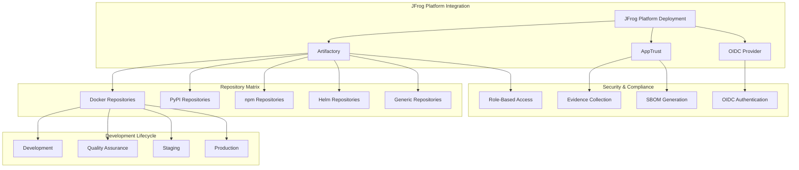

# BookVerse Platform - JFrog Integration Guide

## Platform Configuration, Repository Setup, and OIDC Authentication

This guide provides comprehensive documentation for configuring and managing JFrog
Platform integration within the BookVerse ecosystem, covering repository
architecture, security configuration, and operational best practices.

---

## 🏗️ JFrog Platform Architecture

The BookVerse platform leverages JFrog Platform's comprehensive capabilities to
implement a secure, scalable artifact management and software supply chain
solution.



### Core Platform Components

#### **Artifactory - Universal Repository Manager**
- **Purpose**: Centralized artifact storage and distribution
- **Package Types**: Docker, PyPI, npm, Helm, Generic
- **Features**: Multi-repository architecture, promotion workflows, metadata management
- **Integration**: CI/CD pipelines, development tools, deployment automation

#### **AppTrust - Application Lifecycle Management**
- **Purpose**: Secure application lifecycle management with evidence collection
- **Features**: Stage-based promotion, cryptographic evidence, compliance reporting
- **Security**: SBOM generation, vulnerability scanning, policy enforcement
- **Audit Trail**: Comprehensive tracking from build to deployment

#### **OIDC Provider - Zero-Trust Authentication**
- **Purpose**: Passwordless authentication for CI/CD workflows
- **Integration**: GitHub Actions, external systems, service-to-service
- **Security**: Token-based authentication, claims validation, subject filtering
- **Compliance**: Audit logging, identity mapping, access policies

---

## 📦 Repository Architecture

### Multi-Environment Repository Strategy

The BookVerse platform implements a sophisticated repository architecture that
supports multiple package types, environments, and promotion workflows.

#### **Repository Naming Convention**
```
{project}-{service}-{visibility}-{package_type}-{stage_group}-{repo_type}

Examples:
- bookverse-inventory-internal-docker-nonprod-local
- bookverse-recommendations-internal-pypi-nonprod-local
- bookverse-platform-public-docker-release-local
- bookverse-helm-internal-helm-nonprod-local
```

#### **Environment-Specific Configuration**
```yaml
# Repository configuration matrix
repository_matrix:
  package_types:
    docker:
      environments: [dev, qa, staging, prod]
      features:
        - dockerApiVersion: V2
        - maxUniqueSnapshots: 10
        - dockerTagRetention: 5
        - blockPushingSchema1: true
    
    pypi:
      environments: [dev, qa, staging]  # Single PyPI repo for all non-prod
      features:
        - indexCompressionFormats: [bz2]
        - pypiRegistryUrl: "https://pypi.org"
        - enableTokenAuthentication: true
    
    npm:
      environments: [dev, qa, staging]
      features:
        - npmRegistryUrl: "https://registry.npmjs.org"
        - enableTokenAuthentication: true
    
    helm:
      environments: [dev, qa, staging, prod]
      features:
        - helmChartsBaseUrl: "https://charts.helm.sh"
        - enableTokenAuthentication: true
    
    generic:
      environments: [all]
      features:
        - maxUniqueSnapshots: 20
        - suppressPomConsistencyChecks: false

  services:
    inventory:
      packages: [docker, pypi]
      visibility: internal
    recommendations:
      packages: [docker, generic]
      visibility: internal
    checkout:
      packages: [docker, generic]
      visibility: internal
    platform:
      packages: [docker]
      visibility: public
    web:
      packages: [generic]
      visibility: internal
    helm:
      packages: [helm]
      visibility: internal
    infra:
      packages: [pypi, generic]
      visibility: internal
```

### Repository Creation Process

#### **Automated Repository Provisioning**
```bash
#!/bin/bash
# Comprehensive repository creation with environment-specific configuration

create_repository_matrix() {
    local project_key=$1
    
    echo "🏗️ Creating repository matrix for ${project_key}"
    
    # Repository configuration
    declare -A SERVICES=(
        ["inventory"]="docker pypi"
        ["recommendations"]="docker generic"
        ["checkout"]="docker generic"
        ["platform"]="docker"
        ["web"]="generic"
        ["helm"]="helm"
        ["infra"]="pypi generic"
    )
    
    declare -A VISIBILITY=(
        ["inventory"]="internal"
        ["recommendations"]="internal"
        ["checkout"]="internal"
        ["platform"]="public"
        ["web"]="internal"
        ["helm"]="internal"
        ["infra"]="internal"
    )
    
    # Create repositories for each service
    for service in "${!SERVICES[@]}"; do
        local packages=${SERVICES[$service]}
        local visibility=${VISIBILITY[$service]}
        
        echo "📦 Creating repositories for ${service} (${visibility})"
        
        for package_type in $packages; do
            create_service_repositories "${project_key}" "${service}" \
                "${package_type}" "${visibility}"
        done
    done
    
    echo "✅ Repository matrix creation completed"
}

create_service_repositories() {
    local project_key=$1
    local service=$2
    local package_type=$3
    local visibility=$4
    
    case "${package_type}" in
        "docker")
            create_docker_repositories "${project_key}" "${service}" "${visibility}"
            ;;
        "pypi"|"npm"|"generic")
            create_single_repository "${project_key}" "${service}" \
                "${package_type}" "${visibility}" "nonprod"
            ;;
        "helm")
            create_helm_repositories "${project_key}" "${service}" "${visibility}"
            ;;
        *)
            echo "❌ Unsupported package type: ${package_type}"
            return 1
            ;;
    esac
}

create_docker_repositories() {
    local project_key=$1
    local service=$2
    local visibility=$3
    
    echo "  🐳 Creating Docker repositories for ${service}"
    
    # Create environment-specific Docker repositories
    for environment in dev qa staging prod; do
        local stage_group
        if [[ "${environment}" == "prod" ]]; then
            stage_group="release"
        else
            stage_group="nonprod"
        fi
        
        local repo_key="${project_key}-${service}-${visibility}-docker-${environment}-local"
        
        local repo_config
        repo_config=$(jq -n \
            --arg key "${repo_key}" \
            --arg rclass "local" \
            --arg packageType "docker" \
            --arg description "Docker repository for ${service} service \
                in ${environment} environment" \
            --arg projectKey "${project_key}" \
            --arg environment "${environment^^}" \
            '{
                "key": $key,
                "rclass": $rclass,
                "packageType": $packageType,
                "description": $description,
                "projectKey": $projectKey,
                "environments": [$environment],
                "dockerApiVersion": "V2",
                "maxUniqueSnapshots": 10,
                "handleReleases": true,
                "handleSnapshots": true,
                "suppressPomConsistencyChecks": false,
                "blackedOut": false,
                "downloadRedirect": false,
                "blockPushingSchema1": true,
                "dockerTagRetention": 5,
                "enableTokenAuthentication": true,
                "xrayIndex": true,
                "checksumPolicyType": "client-checksums",
                "archiveBrowsingEnabled": false,
                "calculateYumMetadata": false,
                "enableFileListsIndexing": false,
                "optionalIndexCompressionFormats": [],
                "primaryKeyPairRef": "",
                "secondaryKeyPairRef": "",
                "notes": "Auto-generated repository for BookVerse ${service} service"
            }')
        
        execute_repository_creation "${repo_key}" "${repo_config}"
    done
}

create_single_repository() {
    local project_key=$1
    local service=$2
    local package_type=$3
    local visibility=$4
    local stage_group=$5
    
    echo "  📦 Creating ${package_type} repository for ${service}"
    
    local repo_key="${project_key}-${service}-${visibility}-${package_type}-${stage_group}-local"
    
    local repo_config
    case "${package_type}" in
        "pypi")
            repo_config=$(build_pypi_repository_config "${repo_key}" "${project_key}" "${service}")
            ;;
        "npm")
            repo_config=$(build_npm_repository_config "${repo_key}" "${project_key}" "${service}")
            ;;
        "generic")
            repo_config=$(build_generic_repository_config \
                "${repo_key}" "${project_key}" "${service}")
            ;;
    esac
    
    execute_repository_creation "${repo_key}" "${repo_config}"
}

build_pypi_repository_config() {
    local repo_key=$1
    local project_key=$2
    local service=$3
    
    jq -n \
        --arg key "${repo_key}" \
        --arg rclass "local" \
        --arg packageType "pypi" \
        --arg description "PyPI repository for ${service} Python packages" \
        --arg projectKey "${project_key}" \
        '{
            "key": $key,
            "rclass": $rclass,
            "packageType": $packageType,
            "description": $description,
            "projectKey": $projectKey,
            "environments": ["DEV", "QA", "STAGING"],
            "handleReleases": true,
            "handleSnapshots": true,
            "suppressPomConsistencyChecks": false,
            "blackedOut": false,
            "downloadRedirect": false,
            "pypiRegistryUrl": "https://pypi.org",
            "enableTokenAuthentication": true,
            "indexCompressionFormats": ["bz2"],
            "xrayIndex": true,
            "checksumPolicyType": "client-checksums",
            "archiveBrowsingEnabled": true,
            "notes": "Auto-generated PyPI repository for BookVerse ${service} service"
        }'
}

execute_repository_creation() {
    local repo_key=$1
    local repo_config=$2
    
    echo "    🏗️ Creating repository: ${repo_key}"
    
    local response_code
    response_code=$(curl -s -w "%{http_code}" \
        -X PUT \
        -H "Authorization: Bearer ${JFROG_ADMIN_TOKEN}" \
        -H "Content-Type: application/json" \
        -d "${repo_config}" \
        "${JFROG_URL}/artifactory/api/repositories/${repo_key}" \
        -o "/tmp/repo_${repo_key}_response.json")
    
    case "${response_code}" in
        200|201)
            echo "    ✅ Repository ${repo_key} created successfully"
            configure_repository_policies "${repo_key}"
            ;;
        400)
            if grep -q "already exists" "/tmp/repo_${repo_key}_response.json" 2>/dev/null; then
                echo "    ℹ️ Repository ${repo_key} already exists"
            else
                echo "    ❌ Configuration error for ${repo_key}"
                cat "/tmp/repo_${repo_key}_response.json"
                return 1
            fi
            ;;
        *)
            echo "    ❌ Failed to create repository ${repo_key}"
            echo "    Response code: ${response_code}"
            cat "/tmp/repo_${repo_key}_response.json"
            return 1
            ;;
    esac
}

configure_repository_policies() {
    local repo_key=$1
    
    echo "    🔒 Configuring policies for ${repo_key}"
    
    # Configure retention policy
    local retention_policy
    if [[ "${repo_key}" == *"-prod-"* ]]; then
        retention_policy='{
            "maxCount": 50,
            "maxDays": 365,
            "deleteArtifacts": true
        }'
    else
        retention_policy='{
            "maxCount": 20,
            "maxDays": 90,
            "deleteArtifacts": true
        }'
    fi
    
    curl -s \
        -X PUT \
        -H "Authorization: Bearer ${JFROG_ADMIN_TOKEN}" \
        -H "Content-Type: application/json" \
        -d "${retention_policy}" \
        "${JFROG_URL}/artifactory/api/repositories/${repo_key}/properties/retention"
    
    echo "    ✅ Policies configured for ${repo_key}"
}
```

---

## 🔐 OIDC Authentication Configuration

### Zero-Trust Authentication Setup

The BookVerse platform implements comprehensive OIDC authentication to enable
secure, passwordless CI/CD workflows with JFrog Platform.

#### **OIDC Provider Configuration**
```bash
#!/bin/bash
# Comprehensive OIDC provider setup with claims validation

configure_oidc_provider() {
    local project_key=$1
    local github_org=$2
    
    echo "🔐 Configuring OIDC provider for ${project_key}"
    
    local provider_name="github-actions-${project_key}"
    local issuer_url="https://token.actions.githubusercontent.com"
    local audience="https://github.com/${github_org}"
    
    # Create OIDC provider configuration
    local oidc_config
    oidc_config=$(jq -n \
        --arg name "${provider_name}" \
        --arg description "GitHub Actions OIDC provider for ${project_key} project" \
        --arg issuerUrl "${issuer_url}" \
        --arg audience "${audience}" \
        --argjson enabled true \
        --arg jwksUrl "${issuer_url}/.well-known/jwks" \
        '{
            "name": $name,
            "description": $description,
            "issuer_url": $issuerUrl,
            "provider_type": "generic",
            "audience": $audience,
            "enabled": $enabled,
            "jwks_url": $jwksUrl,
            "auto_redirect": false,
            "allow_user_to_access_profile": true,
            "sync_groups": false,
            "verify_audience": true,
            "verify_issuer": true,
            "client_authentication_method": "none",
            "token_endpoint_auth_method": "none",
            "supported_scopes": ["openid", "repo"],
            "claims_mapping": {
                "username": "actor",
                "email": "actor_id",
                "groups": []
            },
            "user_info_endpoint_method": "header",
            "use_claims_from_id_token": true
        }')
    
    # Create or update OIDC provider
    local response_code
    response_code=$(curl -s -w "%{http_code}" \
        -X POST \
        -H "Authorization: Bearer ${JFROG_ADMIN_TOKEN}" \
        -H "Content-Type: application/json" \
        -d "${oidc_config}" \
        "${JFROG_URL}/access/api/v1/oidc" \
        -o "/tmp/oidc_provider_response.json")
    
    case "${response_code}" in
        201)
            echo "✅ OIDC provider ${provider_name} created successfully"
            ;;
        409)
            echo "⚠️ OIDC provider ${provider_name} already exists, updating..."
            update_oidc_provider "${provider_name}" "${oidc_config}"
            ;;
        *)
            echo "❌ Failed to create OIDC provider"
            echo "Response code: ${response_code}"
            cat "/tmp/oidc_provider_response.json"
            return 1
            ;;
    esac
    
    # Configure identity mappings
    setup_identity_mappings "${project_key}" "${github_org}" "${provider_name}"
    
    echo "✅ OIDC configuration completed"
}

setup_identity_mappings() {
    local project_key=$1
    local github_org=$2
    local provider_name=$3
    
    echo "🔑 Setting up identity mappings"
    
    # Define services that need OIDC access
    local services=("inventory" "recommendations" "checkout" "platform" "web" "helm" "infra")
    
    for service in "${services[@]}"; do
        create_service_identity_mapping "${project_key}" "${github_org}" \
            "${service}" "${provider_name}"
    done
}

create_service_identity_mapping() {
    local project_key=$1
    local github_org=$2
    local service=$3
    local provider_name=$4
    
    echo "  🔐 Creating identity mapping for ${service}"
    
    local mapping_name="${project_key}-${service}-oidc-mapping"
    local repository_pattern="repo:${github_org}/bookverse-${service}:*"
    
    # Create comprehensive identity mapping with specific claims
    local identity_mapping
    identity_mapping=$(jq -n \
        --arg name "${mapping_name}" \
        --arg description "OIDC identity mapping for ${service} service workflows" \
        --arg provider "${provider_name}" \
        --arg priority 100 \
        --arg subjectClaim "${repository_pattern}" \
        --arg issClaim "https://token.actions.githubusercontent.com" \
        --arg audClaim "https://github.com/${github_org}" \
        --arg projectKey "${project_key}" \
        --arg serviceName "${service}" \
        '{
            "name": $name,
            "description": $description,
            "provider_name": $provider,
            "priority": ($priority | tonumber),
            "claims": {
                "sub": $subjectClaim,
                "iss": $issClaim,
                "aud": $audClaim,
                "repository": "'${github_org}'/bookverse-'${service}'",
                "repository_owner": "'${github_org}'",
                "workflow": "CI/CD Pipeline"
            },
            "token_spec": {
                "username": "'${project_key}'-'${service}'-ci",
                "scope": "applied-permissions/groups:'${project_key}'-developers \
                         applied-permissions/groups:readers",
                "project_key": $projectKey,
                "access_token": {
                    "expires_in": 3600,
                    "refreshable": false,
                    "include_reference_token": false,
                    "audience": "'${github_org}'"
                },
                "custom_claims": {
                    "service_name": $serviceName,
                    "project": $projectKey,
                    "environment": "ci"
                }
            }
        }')
    
    # Create identity mapping
    local response_code
    response_code=$(curl -s -w "%{http_code}" \
        -X POST \
        -H "Authorization: Bearer ${JFROG_ADMIN_TOKEN}" \
        -H "Content-Type: application/json" \
        -d "${identity_mapping}" \
        "${JFROG_URL}/access/api/v1/oidc/identity_mappings" \
        -o "/tmp/identity_mapping_${service}_response.json")
    
    case "${response_code}" in
        201)
            echo "    ✅ Identity mapping for ${service} created successfully"
            ;;
        409)
            echo "    ⚠️ Identity mapping for ${service} already exists"
            ;;
        *)
            echo "    ❌ Failed to create identity mapping for ${service}"
            echo "    Response code: ${response_code}"
            cat "/tmp/identity_mapping_${service}_response.json"
            ;;
    esac
}
```

### Claims Validation and Security

#### **Subject Pattern Validation**
```yaml
# OIDC Claims validation patterns
claims_validation:
  subject_patterns:
    repository_specific: "repo:{org}/bookverse-{service}:*"
    branch_specific: "repo:{org}/bookverse-{service}:ref:refs/heads/main"
    tag_specific: "repo:{org}/bookverse-{service}:ref:refs/tags/v*"
    pull_request: "repo:{org}/bookverse-{service}:pull_request"
  
  required_claims:
    - iss: "https://token.actions.githubusercontent.com"
    - aud: "https://github.com/{org}"
    - repository: "{org}/bookverse-{service}"
    - repository_owner: "{org}"
    - workflow: "CI/CD Pipeline"
  
  security_policies:
    token_expiration: 3600  # 1 hour
    refresh_allowed: false
    audience_validation: true
    issuer_validation: true
    claims_validation: strict
```

---

## 🚀 AppTrust Lifecycle Management

### Application Lifecycle Configuration

BookVerse integrates with AppTrust to implement comprehensive application
lifecycle management with evidence collection and compliance reporting.

#### **Lifecycle Stage Configuration**
```bash
#!/bin/bash
# Comprehensive AppTrust lifecycle stage setup

configure_apptrust_lifecycle() {
    local project_key=$1
    
    echo "🔄 Configuring AppTrust lifecycle for ${project_key}"
    
    # Define lifecycle stages
    local stages=("DEV" "QA" "STAGING" "PROD")
    
    for stage in "${stages[@]}"; do
        configure_lifecycle_stage "${project_key}" "${stage}"
    done
    
    # Configure promotion workflows
    configure_promotion_workflows "${project_key}"
    
    # Setup evidence collection
    configure_evidence_collection "${project_key}"
    
    echo "✅ AppTrust lifecycle configuration completed"
}

configure_lifecycle_stage() {
    local project_key=$1
    local stage=$2
    
    echo "📋 Configuring lifecycle stage: ${stage}"
    
    local stage_config
    case "${stage}" in
        "DEV")
            stage_config=$(build_dev_stage_config "${project_key}")
            ;;
        "QA")
            stage_config=$(build_qa_stage_config "${project_key}")
            ;;
        "STAGING")
            stage_config=$(build_staging_stage_config "${project_key}")
            ;;
        "PROD")
            stage_config=$(build_prod_stage_config "${project_key}")
            ;;
    esac
    
    # Create or update stage
    local response_code
    response_code=$(curl -s -w "%{http_code}" \
        -X PUT \
        -H "Authorization: Bearer ${JFROG_ADMIN_TOKEN}" \
        -H "Content-Type: application/json" \
        -d "${stage_config}" \
        "${JFROG_URL}/lifecycle/api/v2/projects/${project_key}/stages/${stage}" \
        -o "/tmp/stage_${stage}_response.json")
    
    if [[ "${response_code}" == "200" ]] || [[ "${response_code}" == "201" ]]; then
        echo "  ✅ Stage ${stage} configured successfully"
    else
        echo "  ❌ Failed to configure stage ${stage}"
        echo "  Response code: ${response_code}"
        cat "/tmp/stage_${stage}_response.json"
    fi
}

build_dev_stage_config() {
    local project_key=$1
    
    jq -n \
        --arg projectKey "${project_key}" \
        --arg stageName "DEV" \
        '{
            "project_key": $projectKey,
            "stage_name": $stageName,
            "description": "Development stage for active development and testing",
            "stage_type": "development",
            "auto_promotion": {
                "enabled": true,
                "criteria": {
                    "build_status": "success",
                    "quality_gates": ["unit_tests", "code_coverage"],
                    "security_scans": ["dependency_check"],
                    "manual_approval": false
                }
            },
            "repositories": [
                "'${project_key}'-inventory-internal-docker-dev-local",
                "'${project_key}'-recommendations-internal-docker-dev-local",
                "'${project_key}'-checkout-internal-docker-dev-local",
                "'${project_key}'-platform-public-docker-dev-local",
                "'${project_key}'-web-internal-generic-nonprod-local"
            ],
            "environment_variables": {
                "LOG_LEVEL": "DEBUG",
                "AUTH_ENABLED": "false",
                "CACHE_TTL": "60"
            },
            "policies": {
                "retention_policy": {
                    "max_artifacts": 50,
                    "max_age_days": 30
                },
                "security_policy": {
                    "vulnerability_scan": "required",
                    "license_compliance": "warn",
                    "policy_violations": "warn"
                }
            }
        }'
}

build_prod_stage_config() {
    local project_key=$1
    
    jq -n \
        --arg projectKey "${project_key}" \
        --arg stageName "PROD" \
        '{
            "project_key": $projectKey,
            "stage_name": $stageName,
            "description": "Production stage for live deployments",
            "stage_type": "production",
            "auto_promotion": {
                "enabled": false,
                "criteria": {
                    "build_status": "success",
                    "quality_gates": [
                        "unit_tests", "integration_tests", 
                        "e2e_tests", "performance_tests"
                    ],
                    "security_scans": ["sast", "dast", "dependency_check", "container_scan"],
                    "manual_approval": true,
                    "approvers": ["platform-team", "security-team"],
                    "evidence_required": true
                }
            },
            "repositories": [
                "'${project_key}'-inventory-internal-docker-prod-local",
                "'${project_key}'-recommendations-internal-docker-prod-local",
                "'${project_key}'-checkout-internal-docker-prod-local",
                "'${project_key}'-platform-public-docker-prod-local"
            ],
            "environment_variables": {
                "LOG_LEVEL": "INFO",
                "AUTH_ENABLED": "true",
                "CACHE_TTL": "3600",
                "MONITORING_ENABLED": "true"
            },
            "policies": {
                "retention_policy": {
                    "max_artifacts": 100,
                    "max_age_days": 365
                },
                "security_policy": {
                    "vulnerability_scan": "required",
                    "license_compliance": "required",
                    "policy_violations": "block",
                    "sbom_required": true,
                    "evidence_required": true
                }
            }
        }'
}

configure_promotion_workflows() {
    local project_key=$1
    
    echo "🔄 Configuring promotion workflows"
    
    # Define promotion paths
    local promotions=(
        "DEV:QA"
        "QA:STAGING" 
        "STAGING:PROD"
    )
    
    for promotion in "${promotions[@]}"; do
        IFS=':' read -r source_stage target_stage <<< "${promotion}"
        configure_promotion_workflow "${project_key}" "${source_stage}" "${target_stage}"
    done
}

configure_promotion_workflow() {
    local project_key=$1
    local source_stage=$2
    local target_stage=$3
    
    echo "  📈 Configuring promotion: ${source_stage} → ${target_stage}"
    
    local workflow_config
    workflow_config=$(jq -n \
        --arg projectKey "${project_key}" \
        --arg sourceStage "${source_stage}" \
        --arg targetStage "${target_stage}" \
        '{
            "project_key": $projectKey,
            "source_stage": $sourceStage,
            "target_stage": $targetStage,
            "promotion_criteria": {
                "quality_gates": (
                    if $targetStage == "PROD" then
                        ["unit_tests", "integration_tests", "security_scans", "performance_tests"]
                    elif $targetStage == "STAGING" then
                        ["unit_tests", "integration_tests", "security_scans"]
                    else
                        ["unit_tests", "security_scans"]
                    end
                ),
                "manual_approval": (
                    if $targetStage == "PROD" then true
                    else false
                    end
                ),
                "evidence_collection": (
                    if $targetStage == "PROD" then true
                    else false
                    end
                )
            },
            "automation": {
                "trigger_type": "webhook",
                "webhook_url": \
                    "https://api.github.com/repos/'${GITHUB_ORG}'/bookverse-platform/dispatches",
                "webhook_secret": "'${WEBHOOK_SECRET}'",
                "retry_policy": {
                    "max_retries": 3,
                    "retry_delay": 300
                }
            }
        }')
    
    # Create promotion workflow
    curl -s \
        -X PUT \
        -H "Authorization: Bearer ${JFROG_ADMIN_TOKEN}" \
        -H "Content-Type: application/json" \
        -d "${workflow_config}" \
        "${JFROG_URL}/lifecycle/api/v2/projects/${project_key}/promotions/\
${source_stage}-${target_stage}"
}
```

### Evidence Collection and SBOM Generation

#### **Comprehensive Evidence Collection**
```bash
#!/bin/bash
# Advanced evidence collection and SBOM generation

configure_evidence_collection() {
    local project_key=$1
    
    echo "📋 Configuring evidence collection for ${project_key}"
    
    # Configure evidence collection policies
    local evidence_config
    evidence_config=$(jq -n \
        --arg projectKey "${project_key}" \
        '{
            "project_key": $projectKey,
            "evidence_collection": {
                "enabled": true,
                "collection_points": [
                    "build_start",
                    "build_complete", 
                    "security_scan",
                    "quality_gate",
                    "promotion",
                    "deployment"
                ],
                "evidence_types": [
                    "build_info",
                    "test_results",
                    "security_scan_results",
                    "sbom",
                    "vulnerability_report",
                    "compliance_report"
                ],
                "retention_policy": {
                    "max_age_days": 2555,  # 7 years for compliance
                    "compression": true,
                    "encryption": true
                }
            },
            "sbom_generation": {
                "enabled": true,
                "formats": ["spdx", "cyclonedx"],
                "include_dependencies": true,
                "include_vulnerabilities": true,
                "auto_generation": {
                    "on_build": true,
                    "on_promotion": true,
                    "on_deployment": true
                }
            },
            "signing": {
                "enabled": true,
                "key_pair": "'${project_key}'-signing-key",
                "algorithm": "RS256",
                "include_certificate_chain": true
            }
        }')
    
    # Apply evidence collection configuration
    curl -s \
        -X PUT \
        -H "Authorization: Bearer ${JFROG_ADMIN_TOKEN}" \
        -H "Content-Type: application/json" \
        -d "${evidence_config}" \
        "${JFROG_URL}/apptrust/api/v1/projects/${project_key}/evidence-collection"
    
    echo "✅ Evidence collection configured"
}

generate_evidence() {
    local project_key=$1
    local service=$2
    local version=$3
    local stage=$4
    
    echo "📝 Generating evidence for ${service} v${version} in ${stage}"
    
    # Create evidence payload
    local evidence_payload
    evidence_payload=$(jq -n \
        --arg projectKey "${project_key}" \
        --arg serviceName "${service}" \
        --arg version "${version}" \
        --arg stage "${stage}" \
        --arg timestamp "$(date -u +%Y-%m-%dT%H:%M:%SZ)" \
        --arg buildNumber "${BUILD_NUMBER:-$(date +%s)}" \
        '{
            "project_key": $projectKey,
            "service_name": $serviceName,
            "version": $version,
            "stage": $stage,
            "timestamp": $timestamp,
            "build_info": {
                "build_number": $buildNumber,
                "vcs_revision": "'${GITHUB_SHA:-unknown}'",
                "vcs_branch": "'${GITHUB_REF_NAME:-main}'",
                "build_url": "'${GITHUB_SERVER_URL}'/'${GITHUB_REPOSITORY}'/actions/runs/'${GITHUB_RUN_ID}'"
            },
            "artifacts": [
                {
                    "name": $serviceName,
                    "version": $version,
                    "type": "docker",
                    "repository": "'${project_key}'-'${serviceName}'-internal-docker-'${stage}'-local",
                    "path": "'${serviceName}':'${version}'"
                }
            ],
            "quality_gates": {
                "unit_tests": "passed",
                "security_scan": "passed",
                "vulnerability_scan": "passed"
            }
        }')
    
    # Submit evidence
    curl -s \
        -X POST \
        -H "Authorization: Bearer ${JFROG_ADMIN_TOKEN}" \
        -H "Content-Type: application/json" \
        -d "${evidence_payload}" \
        "${JFROG_URL}/apptrust/api/v1/evidence" \
        -o "/tmp/evidence_${service}_${version}_response.json"
    
    echo "✅ Evidence generated for ${service} v${version}"
}
```

---

## 🔧 Configuration Management

### Environment-Specific Configurations

#### **Development Environment Setup**
```yaml
# Development environment configuration
development:
  jfrog_platform:
    url: "${JFROG_DEV_URL}"
    project: "bookverse-dev"
    
  repositories:
    docker:
      retention_days: 30
      max_artifacts: 50
      auto_cleanup: true
    
    pypi:
      allow_snapshots: true
      index_compression: ["bz2"]
    
  security:
    vulnerability_scanning: "warn"
    license_compliance: "warn"
    policy_violations: "warn"
    
  automation:
    auto_promotion: true
    evidence_collection: false
    sbom_generation: false
```

#### **Production Environment Setup**
```yaml
# Production environment configuration
production:
  jfrog_platform:
    url: "${JFROG_PROD_URL}"
    project: "bookverse"
    
  repositories:
    docker:
      retention_days: 365
      max_artifacts: 100
      auto_cleanup: false
    
    pypi:
      allow_snapshots: false
      index_compression: ["bz2", "gz"]
    
  security:
    vulnerability_scanning: "block"
    license_compliance: "block"
    policy_violations: "block"
    mandatory_signing: true
    
  automation:
    auto_promotion: false
    evidence_collection: true
    sbom_generation: true
    manual_approval: true
```

### Integration Scripts

#### **CLI Integration Scripts**
```bash
#!/bin/bash
# Comprehensive JFrog CLI integration utilities

# Configure JFrog CLI for BookVerse operations
configure_jfrog_cli() {
    local environment=$1
    local access_token=$2
    
    echo "🔧 Configuring JFrog CLI for ${environment}"
    
    # Add server configuration
    jf c add "bookverse-${environment}" \
        --url "${JFROG_URL}" \
        --access-token "${access_token}" \
        --interactive=false
    
    # Set as active server
    jf c use "bookverse-${environment}"
    
    # Verify configuration
    jf rt ping
    
    echo "✅ JFrog CLI configured for ${environment}"
}

# Upload artifacts with comprehensive metadata
upload_artifact() {
    local artifact_path=$1
    local target_repo=$2
    local service_name=$3
    local version=$4
    
    echo "📤 Uploading ${artifact_path} to ${target_repo}"
    
    # Upload with build info
    jf rt upload "${artifact_path}" "${target_repo}/" \
        --build-name="${service_name}" \
        --build-number="${version}" \
        --module="${service_name}" \
        --spec-vars="service=${service_name};version=${version}" \
        --detailed-summary \
        --include-dirs=false
    
    # Add build environment
    jf rt build-add-git "${service_name}" "${version}"
    jf rt build-collect-env "${service_name}" "${version}"
    
    # Publish build info
    jf rt build-publish "${service_name}" "${version}"
    
    echo "✅ Artifact uploaded successfully"
}

# Promote artifacts between stages
promote_artifact() {
    local service_name=$1
    local version=$2
    local source_stage=$3
    local target_stage=$4
    
    echo "🚀 Promoting ${service_name} v${version}: ${source_stage} → ${target_stage}"
    
    # Promote build
    jf rt build-promote \
        "${service_name}" \
        "${version}" \
        "${target_stage}" \
        --status="Promoted to ${target_stage}" \
        --comment="Automated promotion from ${source_stage}" \
        --copy=true \
        --dependencies=true \
        --props="promoted.from=${source_stage};promoted.to=${target_stage};\
promotion.at=$(date -u +%Y-%m-%dT%H:%M:%SZ)"
    
    echo "✅ Promotion completed successfully"
}

# Generate and upload SBOM
generate_and_upload_sbom() {
    local service_name=$1
    local version=$2
    local format=$3
    
    echo "📋 Generating SBOM for ${service_name} v${version} in ${format} format"
    
    # Generate SBOM
    jf rt build-scan \
        "${service_name}" \
        "${version}" \
        --format="${format}" \
        --output-file="${service_name}-${version}-sbom.${format}"
    
    # Upload SBOM to generic repository
    jf rt upload \
        "${service_name}-${version}-sbom.${format}" \
        "bookverse-sbom-generic-local/sbom/${service_name}/${version}/" \
        --build-name="${service_name}" \
        --build-number="${version}"
    
    echo "✅ SBOM generated and uploaded"
}
```

---

## 🔗 Related Documentation

- **[Setup Automation Guide](SETUP_AUTOMATION.md)**: Automated JFrog Platform provisioning and configuration
- **[OIDC Authentication Guide](OIDC_AUTHENTICATION.md)**: Detailed OIDC setup and troubleshooting
- **[AppTrust Lifecycle Guide](APPTRUST_LIFECYCLE.md)**: Application lifecycle management and promotion workflows
- **[Evidence Collection Guide](EVIDENCE_COLLECTION.md)**: Comprehensive evidence collection and compliance
- **[Orchestration Overview](ORCHESTRATION_OVERVIEW.md)**: Platform orchestration and automation

---


- **[Webhook Configuration Guide](WEBHOOK_CONFIGURATION.md)**: Real-time event automation and CI/CD webhook integration
