# BookVerse Platform - OIDC Authentication Guide

## Zero-trust configuration, token management, and troubleshooting for secure CI/CD and platform access

The BookVerse Platform implements comprehensive OpenID Connect (OIDC) authentication
providing passwordless, zero-trust security for GitHub Actions CI/CD workflows,
JFrog Platform access, and service-to-service communication with automated token
management and secure key rotation.

---

## 📋 Table of Contents

- [OIDC Architecture Overview](#️-oidc-architecture-overview)
- [GitHub Actions OIDC Integration](#-github-actions-oidc-integration)
- [JFrog Platform OIDC Configuration](#-jfrog-platform-oidc-configuration)
- [Token Management and Lifecycle](#-token-management-and-lifecycle)
- [Service-to-Service Authentication](#-service-to-service-authentication)
- [JWKS Key Management](#-jwks-key-management)
- [Zero-Trust Security Implementation](#️-zero-trust-security-implementation)
- [Monitoring and Audit](#-monitoring-and-audit)
- [Troubleshooting Guide](#-troubleshooting-guide)
- [Security Best Practices](#-security-best-practices)

---

## 🏗️ OIDC Architecture Overview

### Zero-Trust Authentication Flow

The BookVerse Platform implements a comprehensive zero-trust authentication architecture:

```mermaid
graph TB
    DEV[👨‍💻 Developer<br/>Pushes Code<br/>Triggers Workflow] --> GH[🔄 GitHub Actions<br/>Workflow Execution<br/>OIDC Token Request]
    
    GH --> IDP[🔐 GitHub OIDC Provider<br/>Token Generation<br/>JWT Signing<br/>Claims Validation]
    
    IDP --> JWT[📋 JWT Token<br/>Repository Claims<br/>Workflow Context<br/>Time-bound Access]
    
    JWT --> JFROG[🏢 JFrog Platform<br/>OIDC Integration<br/>Token Validation<br/>Access Control]
    
    JFROG --> VALIDATE[✅ Token Validation<br/>Signature Verification<br/>Claims Checking<br/>Policy Enforcement]
    
    VALIDATE --> ACCESS[🔓 Platform Access<br/>Artifact Operations<br/>Repository Access<br/>API Permissions]
    
    ACCESS --> AUDIT[📊 Audit Logging<br/>Access Tracking<br/>Security Events<br/>Compliance Records]
    
    JWKS[🔑 JWKS Endpoint<br/>Key Rotation<br/>Signature Validation] --> VALIDATE
    
    POLICIES[📋 Access Policies<br/>Subject Filtering<br/>Repository Restrictions<br/>Time-based Access] --> VALIDATE
```



### OIDC Security Boundaries

| Component | Trust Level | Authentication Method | Token Scope |
|-----------|-------------|----------------------|-------------|
| **GitHub Actions** | Trusted Identity Provider | OIDC JWT with repository claims | Workflow-specific, time-bound |
| **JFrog Platform** | Resource Server | OIDC token validation | Repository and operation specific |
| **BookVerse Services** | Protected Resources | Service account tokens | Service-specific, role-based |
| **Developer Access** | User Authentication | GitHub OAuth + MFA | User-specific, session-based |

### Token Claims Structure

```json
{
  "iss": "https://token.actions.githubusercontent.com",
  "sub": "repo:bookverse/bookverse-inventory:ref:refs/heads/main",
  "aud": "https://bookverse.jfrog.io",
  "exp": 1640995200,
  "iat": 1640991600,
  "nbf": 1640991600,
  "jti": "unique-token-id",
  "actor": "github-username",
  "actor_id": "12345",
  "repository": "bookverse/bookverse-inventory",
  "repository_id": "67890",
  "repository_owner": "bookverse",
  "repository_owner_id": "54321",
  "run_id": "1234567890",
  "run_number": "123",
  "run_attempt": "1",
  "ref": "refs/heads/main",
  "ref_type": "branch",
  "environment": "production",
  "job_workflow_ref": "bookverse/bookverse-inventory/.github/workflows/ci.yml@refs/heads/main",
  "workflow": "CI/CD Pipeline",
  "event_name": "push"
}
```

---

## 🔄 GitHub Actions OIDC Integration

### OIDC Provider Configuration

```yaml
# .github/workflows/oidc-setup.yml
name: 🔐 OIDC Authentication Setup

on:
  workflow_dispatch:
  push:
    branches: [main]

# OIDC permissions for token requests
permissions:
  id-token: write   # Required for OIDC token requests
  contents: read    # Required for repository access

env:
  JFROG_URL: ${{ vars.JFROG_URL }}
  JFROG_OIDC_AUDIENCE: ${{ vars.JFROG_OIDC_AUDIENCE }}

jobs:
  oidc-authentication:
    runs-on: ubuntu-latest
    
    steps:
      # 🔐 Request OIDC token from GitHub
      - name: Configure OIDC Token
        id: oidc-token
        run: |
          # Request OIDC token from GitHub Actions
          OIDC_TOKEN=$(curl -s \
            -H "Authorization: bearer $ACTIONS_ID_TOKEN_REQUEST_TOKEN" \
            -H "Accept: application/json; api-version=2.0" \
            "$ACTIONS_ID_TOKEN_REQUEST_URL&audience=$JFROG_OIDC_AUDIENCE" | \
            jq -r '.value')
          
          if [[ "$OIDC_TOKEN" == "null" || -z "$OIDC_TOKEN" ]]; then
            echo "❌ Failed to obtain OIDC token"
            exit 1
          fi
          
          echo "✅ OIDC token obtained successfully"
          echo "oidc-token=${OIDC_TOKEN}" >> $GITHUB_OUTPUT
          
          # Decode and display token claims (for debugging)
          echo "🔍 Token Claims:"
          echo "$OIDC_TOKEN" | cut -d'.' -f2 | base64 -d 2>/dev/null | jq . || echo "Failed to decode claims"
      
      # 🏢 Exchange OIDC token for JFrog access token
      - name: Exchange for JFrog Access Token
        id: jfrog-token
        run: |
          # Exchange OIDC token for JFrog access token
          JFROG_ACCESS_TOKEN=$(curl -s \
            -X POST \
            -H "Content-Type: application/json" \
            -d "{
              \"grant_type\": \"urn:ietf:params:oauth:grant-type:token-exchange\",
              \"subject_token_type\": \"urn:ietf:params:oauth:token-type:id_token\",
              \"subject_token\": \"${{ steps.oidc-token.outputs.oidc-token }}\",
              \"audience\": \"$JFROG_OIDC_AUDIENCE\"
            }" \
            "$JFROG_URL/access/api/v1/oidc/token" | \
            jq -r '.access_token')
          
          if [[ "$JFROG_ACCESS_TOKEN" == "null" || -z "$JFROG_ACCESS_TOKEN" ]]; then
            echo "❌ Failed to exchange OIDC token for JFrog access token"
            exit 1
          fi
          
          echo "✅ JFrog access token obtained successfully"
          echo "jfrog-token=${JFROG_ACCESS_TOKEN}" >> $GITHUB_OUTPUT
      
      # 🔧 Configure JFrog CLI with OIDC token
      - name: Setup JFrog CLI
        uses: jfrog/setup-jfrog-cli@v3
        env:
          JF_ACCESS_TOKEN: ${{ steps.jfrog-token.outputs.jfrog-token }}
      
      # ✅ Validate OIDC authentication
      - name: Validate OIDC Authentication
        run: |
          # Test JFrog Platform access
          echo "🔍 Testing JFrog Platform access..."
          jf rt ping
          
          # List accessible repositories
          echo "📦 Accessible repositories:"
          jf rt repo-search "bookverse-*"
          
          # Test artifact operations
          echo "🧪 Testing artifact operations..."
          echo "test-file" | jf rt upload - "bookverse-dev/test/oidc-validation.txt"
          
          echo "✅ OIDC authentication validation completed successfully"
```

### Advanced OIDC Workflow Integration

```yaml
# .github/workflows/ci-oidc.yml
name: 🔨 CI with OIDC Authentication

on:
  push:
    branches: [main, develop]
  pull_request:
    branches: [main]

permissions:
  id-token: write
  contents: read
  security-events: write

env:
  JFROG_URL: ${{ vars.JFROG_URL }}
  JFROG_OIDC_AUDIENCE: ${{ vars.JFROG_OIDC_AUDIENCE }}

jobs:
  ci-pipeline:
    runs-on: ubuntu-latest
    
    steps:
      - name: 📥 Checkout code
        uses: actions/checkout@v4
      
      # 🔐 OIDC Authentication with enhanced error handling
      - name: Authenticate with OIDC
        id: oidc-auth
        run: |
          #!/bin/bash
          set -euo pipefail
          
          # Function to get OIDC token with retry logic
          get_oidc_token() {
            local max_retries=3
            local retry=0
            
            while [[ $retry -lt $max_retries ]]; do
              echo "🔄 Attempting to get OIDC token (attempt $((retry + 1))/$max_retries)"
              
              local response
              response=$(curl -s -w "%{http_code}" \
                -H "Authorization: bearer $ACTIONS_ID_TOKEN_REQUEST_TOKEN" \
                -H "Accept: application/json; api-version=2.0" \
                "$ACTIONS_ID_TOKEN_REQUEST_URL&audience=$JFROG_OIDC_AUDIENCE")
              
              local http_code="${response: -3}"
              local body="${response%???}"
              
              if [[ "$http_code" == "200" ]]; then
                local token
                token=$(echo "$body" | jq -r '.value')
                
                if [[ "$token" != "null" && -n "$token" ]]; then
                  echo "$token"
                  return 0
                fi
              fi
              
              echo "⚠️ Failed to get OIDC token (HTTP $http_code), retrying..."
              ((retry++))
              sleep $((retry * 2))
            done
            
            echo "❌ Failed to get OIDC token after $max_retries attempts"
            return 1
          }
          
          # Function to exchange OIDC token for JFrog token
          exchange_for_jfrog_token() {
            local oidc_token="$1"
            local max_retries=3
            local retry=0
            
            while [[ $retry -lt $max_retries ]]; do
              echo "🔄 Attempting to exchange for JFrog token (attempt $((retry + 1))/$max_retries)"
              
              local response
              response=$(curl -s -w "%{http_code}" \
                -X POST \
                -H "Content-Type: application/json" \
                -d "{
                  \"grant_type\": \"urn:ietf:params:oauth:grant-type:token-exchange\",
                  \"subject_token_type\": \"urn:ietf:params:oauth:token-type:id_token\",
                  \"subject_token\": \"$oidc_token\",
                  \"audience\": \"$JFROG_OIDC_AUDIENCE\"
                }" \
                "$JFROG_URL/access/api/v1/oidc/token")
              
              local http_code="${response: -3}"
              local body="${response%???}"
              
              if [[ "$http_code" == "200" ]]; then
                local access_token
                access_token=$(echo "$body" | jq -r '.access_token')
                
                if [[ "$access_token" != "null" && -n "$access_token" ]]; then
                  echo "$access_token"
                  return 0
                fi
              fi
              
              echo "⚠️ Failed to exchange token (HTTP $http_code), retrying..."
              ((retry++))
              sleep $((retry * 2))
            done
            
            echo "❌ Failed to exchange for JFrog token after $max_retries attempts"
            return 1
          }
          
          # Main authentication flow
          echo "🔐 Starting OIDC authentication flow..."
          
          # Get OIDC token
          OIDC_TOKEN=$(get_oidc_token)
          
          # Validate token format
          if ! echo "$OIDC_TOKEN" | grep -q "^[A-Za-z0-9_-]\+\.[A-Za-z0-9_-]\+\.[A-Za-z0-9_-]\+$"; then
            echo "❌ Invalid OIDC token format"
            exit 1
          fi
          
          # Exchange for JFrog token
          JFROG_ACCESS_TOKEN=$(exchange_for_jfrog_token "$OIDC_TOKEN")
          
          # Set outputs
          echo "oidc-token=${OIDC_TOKEN}" >> $GITHUB_OUTPUT
          echo "jfrog-token=${JFROG_ACCESS_TOKEN}" >> $GITHUB_OUTPUT
          
          echo "✅ OIDC authentication completed successfully"
      
      # 🔧 Setup JFrog CLI with enhanced configuration
      - name: Setup JFrog CLI
        uses: jfrog/setup-jfrog-cli@v3
        env:
          JF_ACCESS_TOKEN: ${{ steps.oidc-auth.outputs.jfrog-token }}
        
      # 🏗️ Build and test with authenticated access
      - name: Build and Test
        run: |
          # Configure JFrog CLI server
          jf c add bookverse \
            --url="$JFROG_URL" \
            --access-token="${{ steps.oidc-auth.outputs.jfrog-token }}" \
            --interactive=false
          
          jf c use bookverse
          
          # Validate configuration
          jf rt ping
          
          # Build application
          echo "🏗️ Building application..."
          # Add your build commands here
          
          # Upload artifacts with OIDC authentication
          echo "📦 Uploading artifacts..."
          # Add your artifact upload commands here
```

---

## 🏢 JFrog Platform OIDC Configuration

### OIDC Integration Setup

```bash
#!/usr/bin/env bash
# JFrog Platform OIDC configuration script

set -euo pipefail

SCRIPT_DIR="$(cd "$(dirname "${BASH_SOURCE[0]}")" && pwd)"
JFROG_URL="${JFROG_URL:-https://bookverse.jfrog.io}"
JFROG_ACCESS_TOKEN="${JFROG_ACCESS_TOKEN:-}"

configure_oidc_integration() {
    echo "🔐 Configuring OIDC integration for JFrog Platform..."
    
    # Create OIDC configuration
    local oidc_config='{
        "name": "github-actions-oidc",
        "description": "GitHub Actions OIDC Integration for BookVerse Platform",
        "issuer_url": "https://token.actions.githubusercontent.com",
        "provider_type": "generic",
        "audience": "'$JFROG_URL'",
        "claims": {
            "sub": "repo:bookverse/*:*",
            "aud": "'$JFROG_URL'"
        },
        "settings": {
            "require_signed_tokens": true,
            "verify_audience": true,
            "verify_expiration": true,
            "clock_skew_leeway": 60,
            "allowed_clock_skew": 300
        }
    }'
    
    # Configure OIDC provider
    curl -X POST \
        -H "Authorization: Bearer $JFROG_ACCESS_TOKEN" \
        -H "Content-Type: application/json" \
        -d "$oidc_config" \
        "$JFROG_URL/access/api/v1/oidc/providers"
    
    echo "✅ OIDC provider configured successfully"
}

create_oidc_policies() {
    echo "📋 Creating OIDC access policies..."
    
    # Policy for inventory service
    local inventory_policy='{
        "name": "bookverse-inventory-oidc",
        "description": "OIDC policy for BookVerse Inventory Service",
        "resources": [
            "artifactory:bookverse-inventory-*"
        ],
        "principals": [
            "subject/repo:bookverse/bookverse-inventory:*"
        ],
        "effect": "allow",
        "actions": [
            "read",
            "write",
            "annotate",
            "delete"
        ],
        "conditions": {
            "date_range": {
                "not_before": "2024-01-01T00:00:00Z",
                "not_after": "2025-12-31T23:59:59Z"
            },
            "string_equals": {
                "repository_owner": "bookverse"
            },
            "string_like": {
                "ref": "refs/heads/*"
            }
        }
    }'
    
    # Create access policy
    curl -X POST \
        -H "Authorization: Bearer $JFROG_ACCESS_TOKEN" \
        -H "Content-Type: application/json" \
        -d "$inventory_policy" \
        "$JFROG_URL/access/api/v2/policies"
    
    # Policy for recommendations service
    local recommendations_policy='{
        "name": "bookverse-recommendations-oidc",
        "description": "OIDC policy for BookVerse Recommendations Service",
        "resources": [
            "artifactory:bookverse-recommendations-*"
        ],
        "principals": [
            "subject/repo:bookverse/bookverse-recommendations:*"
        ],
        "effect": "allow",
        "actions": [
            "read",
            "write",
            "annotate",
            "delete"
        ],
        "conditions": {
            "string_equals": {
                "repository_owner": "bookverse"
            }
        }
    }'
    
    curl -X POST \
        -H "Authorization: Bearer $JFROG_ACCESS_TOKEN" \
        -H "Content-Type: application/json" \
        -d "$recommendations_policy" \
        "$JFROG_URL/access/api/v2/policies"
    
    # Policy for checkout service
    local checkout_policy='{
        "name": "bookverse-checkout-oidc",
        "description": "OIDC policy for BookVerse Checkout Service",
        "resources": [
            "artifactory:bookverse-checkout-*"
        ],
        "principals": [
            "subject/repo:bookverse/bookverse-checkout:*"
        ],
        "effect": "allow",
        "actions": [
            "read",
            "write",
            "annotate",
            "delete"
        ],
        "conditions": {
            "string_equals": {
                "repository_owner": "bookverse"
            }
        }
    }'
    
    curl -X POST \
        -H "Authorization: Bearer $JFROG_ACCESS_TOKEN" \
        -H "Content-Type: application/json" \
        -d "$checkout_policy" \
        "$JFROG_URL/access/api/v2/policies"
    
    echo "✅ OIDC access policies created successfully"
}

configure_subject_filters() {
    echo "🔍 Configuring OIDC subject filters..."
    
    # Subject filter configuration
    local subject_filters='{
        "filters": [
            {
                "name": "bookverse-main-branch",
                "description": "Allow access only from main branch",
                "pattern": "repo:bookverse/*:ref:refs/heads/main",
                "priority": 100,
                "enabled": true
            },
            {
                "name": "bookverse-develop-branch",
                "description": "Allow access from develop branch",
                "pattern": "repo:bookverse/*:ref:refs/heads/develop",
                "priority": 90,
                "enabled": true
            },
            {
                "name": "bookverse-feature-branches",
                "description": "Allow access from feature branches",
                "pattern": "repo:bookverse/*:ref:refs/heads/feature/*",
                "priority": 80,
                "enabled": true
            },
            {
                "name": "bookverse-release-branches",
                "description": "Allow access from release branches",
                "pattern": "repo:bookverse/*:ref:refs/heads/release/*",
                "priority": 85,
                "enabled": true
            }
        ]
    }'
    
    curl -X PUT \
        -H "Authorization: Bearer $JFROG_ACCESS_TOKEN" \
        -H "Content-Type: application/json" \
        -d "$subject_filters" \
        "$JFROG_URL/access/api/v1/oidc/providers/github-actions-oidc/subject-filters"
    
    echo "✅ Subject filters configured successfully"
}

validate_oidc_configuration() {
    echo "🔍 Validating OIDC configuration..."
    
    # Get OIDC provider configuration
    local provider_config
    provider_config=$(curl -s \
        -H "Authorization: Bearer $JFROG_ACCESS_TOKEN" \
        "$JFROG_URL/access/api/v1/oidc/providers/github-actions-oidc")
    
    if echo "$provider_config" | jq -e '.name' >/dev/null 2>&1; then
        echo "✅ OIDC provider configuration is valid"
        echo "$provider_config" | jq .
    else
        echo "❌ OIDC provider configuration is invalid"
        return 1
    fi
    
    # Validate JWKS endpoint access
    local jwks_url="https://token.actions.githubusercontent.com/.well-known/jwks"
    if curl -s "$jwks_url" | jq -e '.keys[]' >/dev/null 2>&1; then
        echo "✅ JWKS endpoint is accessible"
    else
        echo "❌ JWKS endpoint is not accessible"
        return 1
    fi
    
    echo "✅ OIDC configuration validation completed successfully"
}

main() {
    if [[ -z "$JFROG_ACCESS_TOKEN" ]]; then
        echo "❌ JFROG_ACCESS_TOKEN environment variable is required"
        exit 1
    fi
    
    configure_oidc_integration
    create_oidc_policies
    configure_subject_filters
    validate_oidc_configuration
    
    echo "🎉 JFrog Platform OIDC configuration completed successfully!"
}

main "$@"
```

### OIDC Token Validation Rules

```json
{
  "oidc_validation_rules": {
    "required_claims": [
      "iss",
      "sub",
      "aud",
      "exp",
      "iat",
      "repository",
      "repository_owner",
      "ref"
    ],
    "issuer_validation": {
      "allowed_issuers": [
        "https://token.actions.githubusercontent.com"
      ],
      "verify_issuer": true
    },
    "audience_validation": {
      "expected_audience": "https://bookverse.jfrog.io",
      "verify_audience": true
    },
    "subject_validation": {
      "patterns": [
        "repo:bookverse/*:ref:refs/heads/main",
        "repo:bookverse/*:ref:refs/heads/develop",
        "repo:bookverse/*:ref:refs/heads/feature/*",
        "repo:bookverse/*:ref:refs/heads/release/*",
        "repo:bookverse/*:ref:refs/tags/*"
      ],
      "deny_patterns": [
        "repo:bookverse/*:ref:refs/heads/experimental/*",
        "repo:bookverse/*:pull/*"
      ]
    },
    "time_validation": {
      "verify_expiration": true,
      "verify_not_before": true,
      "clock_skew_allowance": 300,
      "max_token_age": 3600
    },
    "repository_validation": {
      "allowed_repositories": [
        "bookverse/bookverse-inventory",
        "bookverse/bookverse-recommendations",
        "bookverse/bookverse-checkout",
        "bookverse/bookverse-web",
        "bookverse/bookverse-platform",
        "bookverse/bookverse-helm",
        "bookverse/bookverse-demo-init"
      ],
      "allowed_repository_owners": [
        "bookverse"
      ]
    }
  }
}
```

---

## 🔄 Token Management and Lifecycle

### Token Lifecycle Management

```python
#!/usr/bin/env python3
"""
OIDC Token Lifecycle Management

Handles token validation, refresh, and lifecycle management for the
BookVerse Platform OIDC authentication system.
"""

import jwt
import requests
import time
import json
import logging
from datetime import datetime, timedelta
from typing import Dict, Optional, List
from cryptography.hazmat.primitives import serialization
from cryptography.hazmat.primitives.asymmetric import rsa

logger = logging.getLogger(__name__)

class OIDCTokenManager:
    """
    Comprehensive OIDC token management for BookVerse Platform.
    
    Handles token validation, refresh, and lifecycle management with
    sophisticated security controls and monitoring integration.
    """
    
    def __init__(self, config: Dict):
        self.config = config
        self.jwks_cache = {}
        self.jwks_cache_expiry = {}
        self.token_cache = {}
        
        # Configuration
        self.issuer_url = config.get('issuer_url', 'https://token.actions.githubusercontent.com')
        self.audience = config.get('audience')
        self.clock_skew_leeway = config.get('clock_skew_leeway', 60)
        self.max_token_age = config.get('max_token_age', 3600)
        self.jwks_cache_duration = config.get('jwks_cache_duration', 3600)
        
        # Security settings
        self.allowed_algorithms = ['RS256', 'ES256']
        self.required_claims = ['iss', 'sub', 'aud', 'exp', 'iat', 'repository']
        
    async def validate_token(self, token: str) -> Dict:
        """
        Comprehensive OIDC token validation.
        
        Validates token signature, claims, expiration, and business rules
        with detailed error reporting and security audit logging.
        """
        
        validation_context = {
            'token_received_at': datetime.utcnow(),
            'validation_start': time.time(),
            'token_preview': token[:20] + '...' if len(token) > 20 else token
        }
        
        try:
            # Phase 1: Decode token header without verification
            unverified_header = jwt.get_unverified_header(token)
            validation_context['algorithm'] = unverified_header.get('alg')
            validation_context['key_id'] = unverified_header.get('kid')
            
            # Validate algorithm
            if unverified_header.get('alg') not in self.allowed_algorithms:
                raise TokenValidationError(
                    f"Unsupported algorithm: {unverified_header.get('alg')}"
                )
            
            # Phase 2: Get signing key from JWKS
            signing_key = await self._get_signing_key(
                unverified_header.get('kid'),
                unverified_header.get('alg')
            )
            
            # Phase 3: Verify token signature and decode claims
            try:
                decoded_claims = jwt.decode(
                    token,
                    signing_key,
                    algorithms=self.allowed_algorithms,
                    audience=self.audience,
                    issuer=self.issuer_url,
                    leeway=self.clock_skew_leeway
                )
            except jwt.ExpiredSignatureError:
                raise TokenValidationError("Token has expired")
            except jwt.InvalidAudienceError:
                raise TokenValidationError("Invalid audience")
            except jwt.InvalidIssuerError:
                raise TokenValidationError("Invalid issuer")
            except jwt.InvalidSignatureError:
                raise TokenValidationError("Invalid token signature")
            
            validation_context['claims'] = decoded_claims
            
            # Phase 4: Validate required claims
            missing_claims = []
            for claim in self.required_claims:
                if claim not in decoded_claims:
                    missing_claims.append(claim)
            
            if missing_claims:
                raise TokenValidationError(
                    f"Missing required claims: {', '.join(missing_claims)}"
                )
            
            # Phase 5: Business rule validation
            business_validation = await self._validate_business_rules(decoded_claims)
            if not business_validation.valid:
                raise TokenValidationError(
                    f"Business rule validation failed: {business_validation.reason}"
                )
            
            # Phase 6: Token age validation
            token_age = time.time() - decoded_claims.get('iat', 0)
            if token_age > self.max_token_age:
                raise TokenValidationError(
                    f"Token is too old: {token_age}s > {self.max_token_age}s"
                )
            
            validation_context['validation_duration'] = time.time() - validation_context['validation_start']
            
            # Log successful validation
            await self._log_token_validation(validation_context, success=True)
            
            return TokenValidationResult(
                valid=True,
                claims=decoded_claims,
                validation_context=validation_context,
                permissions=await self._determine_permissions(decoded_claims)
            )
            
        except Exception as error:
            validation_context['error'] = str(error)
            validation_context['validation_duration'] = time.time() - validation_context['validation_start']
            
            # Log failed validation
            await self._log_token_validation(validation_context, success=False, error=error)
            
            raise TokenValidationError(f"Token validation failed: {error}") from error
    
    async def _get_signing_key(self, key_id: str, algorithm: str) -> str:
        """Get and cache JWKS signing key."""
        
        # Check cache first
        cache_key = f"{self.issuer_url}#{key_id}"
        if (cache_key in self.jwks_cache and 
            time.time() < self.jwks_cache_expiry.get(cache_key, 0)):
            return self.jwks_cache[cache_key]
        
        # Fetch JWKS from provider
        jwks_url = f"{self.issuer_url}/.well-known/jwks"
        
        try:
            response = requests.get(jwks_url, timeout=10)
            response.raise_for_status()
            jwks_data = response.json()
        except Exception as error:
            raise TokenValidationError(f"Failed to fetch JWKS: {error}")
        
        # Find matching key
        for key_data in jwks_data.get('keys', []):
            if key_data.get('kid') == key_id and key_data.get('alg') == algorithm:
                # Convert JWK to PEM format
                signing_key = self._jwk_to_pem(key_data)
                
                # Cache the key
                self.jwks_cache[cache_key] = signing_key
                self.jwks_cache_expiry[cache_key] = time.time() + self.jwks_cache_duration
                
                return signing_key
        
        raise TokenValidationError(f"Signing key not found: kid={key_id}, alg={algorithm}")
    
    async def _validate_business_rules(self, claims: Dict) -> 'BusinessValidationResult':
        """Validate business-specific rules for token claims."""
        
        # Repository validation
        repository = claims.get('repository', '')
        repository_owner = claims.get('repository_owner', '')
        
        # Check allowed repositories
        allowed_repos = self.config.get('allowed_repositories', [])
        if allowed_repos and repository not in allowed_repos:
            return BusinessValidationResult(
                valid=False,
                reason=f"Repository not allowed: {repository}"
            )
        
        # Check allowed repository owners
        allowed_owners = self.config.get('allowed_repository_owners', [])
        if allowed_owners and repository_owner not in allowed_owners:
            return BusinessValidationResult(
                valid=False,
                reason=f"Repository owner not allowed: {repository_owner}"
            )
        
        # Branch validation
        ref = claims.get('ref', '')
        allowed_ref_patterns = self.config.get('allowed_ref_patterns', [])
        if allowed_ref_patterns:
            import re
            ref_allowed = any(
                re.match(pattern, ref) for pattern in allowed_ref_patterns
            )
            if not ref_allowed:
                return BusinessValidationResult(
                    valid=False,
                    reason=f"Branch/ref not allowed: {ref}"
                )
        
        # Environment validation
        environment = claims.get('environment')
        if environment:
            allowed_environments = self.config.get('allowed_environments', [])
            if allowed_environments and environment not in allowed_environments:
                return BusinessValidationResult(
                    valid=False,
                    reason=f"Environment not allowed: {environment}"
                )
        
        return BusinessValidationResult(valid=True)
    
    async def _determine_permissions(self, claims: Dict) -> List[str]:
        """Determine permissions based on token claims."""
        
        permissions = []
        repository = claims.get('repository', '')
        ref = claims.get('ref', '')
        environment = claims.get('environment', '')
        
        # Base permissions for all valid tokens
        permissions.append('artifactory:read')
        
        # Write permissions for main branch
        if ref == 'refs/heads/main':
            permissions.extend([
                'artifactory:write',
                'artifactory:annotate',
                'artifactory:promote'
            ])
        
        # Development permissions for feature branches
        if ref.startswith('refs/heads/feature/') or ref.startswith('refs/heads/develop'):
            permissions.extend([
                'artifactory:write',
                'artifactory:annotate'
            ])
        
        # Release permissions for release branches and tags
        if (ref.startswith('refs/heads/release/') or 
            ref.startswith('refs/tags/')):
            permissions.extend([
                'artifactory:write',
                'artifactory:annotate',
                'artifactory:promote',
                'artifactory:release'
            ])
        
        # Environment-specific permissions
        if environment == 'production':
            permissions.append('artifactory:production')
        elif environment == 'staging':
            permissions.append('artifactory:staging')
        
        return list(set(permissions))  # Remove duplicates
    
    async def _log_token_validation(self, context: Dict, success: bool, error: Exception = None):
        """Log token validation events for security audit."""
        
        log_entry = {
            'event_type': 'oidc_token_validation',
            'timestamp': context['token_received_at'].isoformat(),
            'success': success,
            'validation_duration': context.get('validation_duration'),
            'algorithm': context.get('algorithm'),
            'key_id': context.get('key_id'),
            'token_preview': context.get('token_preview')
        }
        
        if success:
            claims = context.get('claims', {})
            log_entry.update({
                'repository': claims.get('repository'),
                'repository_owner': claims.get('repository_owner'),
                'ref': claims.get('ref'),
                'actor': claims.get('actor'),
                'workflow': claims.get('workflow')
            })
        else:
            log_entry['error'] = str(error) if error else 'Unknown error'
        
        # Log to audit system
        logger.info(f"OIDC Token Validation: {json.dumps(log_entry)}")
        
        # Send to monitoring system if configured
        if self.config.get('monitoring_webhook'):
            try:
                requests.post(
                    self.config['monitoring_webhook'],
                    json=log_entry,
                    timeout=5
                )
            except Exception as e:
                logger.warning(f"Failed to send monitoring event: {e}")

class TokenValidationError(Exception):
    """Exception raised for token validation failures."""
    pass

class TokenValidationResult:
    """Result of token validation."""
    
    def __init__(self, valid: bool, claims: Dict = None, validation_context: Dict = None, permissions: List[str] = None):
        self.valid = valid
        self.claims = claims or {}
        self.validation_context = validation_context or {}
        self.permissions = permissions or []

class BusinessValidationResult:
    """Result of business rule validation."""
    
    def __init__(self, valid: bool, reason: str = None):
        self.valid = valid
        self.reason = reason
```

---

## 🔗 Service-to-Service Authentication

### Service Account Token Management

```yaml
# oidc/service-accounts.yaml
apiVersion: v1
kind: ServiceAccount
metadata:
  name: bookverse-inventory-sa
  namespace: bookverse-prod
  annotations:
    oidc.bookverse.com/issuer: "https://bookverse.jfrog.io"
    oidc.bookverse.com/audience: "bookverse-inventory"
    oidc.bookverse.com/subject: "system:serviceaccount:bookverse-prod:bookverse-inventory-sa"
---
apiVersion: v1
kind: Secret
metadata:
  name: bookverse-inventory-oidc-token
  namespace: bookverse-prod
  annotations:
    kubernetes.io/service-account.name: bookverse-inventory-sa
type: kubernetes.io/service-account-token
data:
  # Token data populated by Kubernetes
---
apiVersion: v1
kind: ConfigMap
metadata:
  name: oidc-service-config
  namespace: bookverse-prod
data:
  oidc-config.yaml: |
    services:
      inventory:
        service_account: "bookverse-inventory-sa"
        audience: "bookverse-inventory"
        token_path: "/var/run/secrets/kubernetes.io/serviceaccount/token"
        ca_cert_path: "/var/run/secrets/kubernetes.io/serviceaccount/ca.crt"
        
      recommendations:
        service_account: "bookverse-recommendations-sa"
        audience: "bookverse-recommendations"
        token_path: "/var/run/secrets/kubernetes.io/serviceaccount/token"
        ca_cert_path: "/var/run/secrets/kubernetes.io/serviceaccount/ca.crt"
        
      checkout:
        service_account: "bookverse-checkout-sa"
        audience: "bookverse-checkout"
        token_path: "/var/run/secrets/kubernetes.io/serviceaccount/token"
        ca_cert_path: "/var/run/secrets/kubernetes.io/serviceaccount/ca.crt"
    
    token_settings:
      default_expiration: "1h"
      refresh_threshold: "10m"
      max_retries: 3
      retry_delay: "5s"
```

### Service Authentication Client

```python
class ServiceOIDCClient:
    """
    OIDC client for service-to-service authentication in BookVerse Platform.
    
    Handles service account token management, automatic refresh, and
    secure communication between microservices using OIDC tokens.
    """
    
    def __init__(self, service_name: str, config: Dict):
        self.service_name = service_name
        self.config = config
        self.token_cache = {}
        self.token_refresh_tasks = {}
        
    async def get_service_token(self, target_audience: str) -> str:
        """
        Get or refresh service token for target audience.
        
        Implements token caching, automatic refresh, and secure token
        management for service-to-service communication.
        """
        
        cache_key = f"{self.service_name}:{target_audience}"
        
        # Check if we have a valid cached token
        if self._is_token_valid(cache_key):
            return self.token_cache[cache_key]['token']
        
        # Get new token
        token_data = await self._request_service_token(target_audience)
        
        # Cache token with metadata
        self.token_cache[cache_key] = {
            'token': token_data['access_token'],
            'expires_at': time.time() + token_data.get('expires_in', 3600),
            'refresh_at': time.time() + token_data.get('expires_in', 3600) - 600,  # Refresh 10 min early
            'audience': target_audience
        }
        
        # Schedule token refresh
        self._schedule_token_refresh(cache_key)
        
        return token_data['access_token']
    
    async def _request_service_token(self, audience: str) -> Dict:
        """Request new service token from OIDC provider."""
        
        # Read service account token
        token_path = self.config.get('token_path', '/var/run/secrets/kubernetes.io/serviceaccount/token')
        
        try:
            with open(token_path, 'r') as f:
                service_account_token = f.read().strip()
        except FileNotFoundError:
            raise ServiceAuthenticationError(f"Service account token not found: {token_path}")
        
        # Token exchange request
        token_request = {
            'grant_type': 'urn:ietf:params:oauth:grant-type:token-exchange',
            'subject_token_type': 'urn:ietf:params:oauth:token-type:access_token',
            'subject_token': service_account_token,
            'audience': audience,
            'requested_token_type': 'urn:ietf:params:oauth:token-type:access_token'
        }
        
        # Make token request
        async with aiohttp.ClientSession() as session:
            async with session.post(
                f"{self.config['oidc_endpoint']}/token",
                data=token_request,
                headers={'Content-Type': 'application/x-www-form-urlencoded'},
                timeout=30
            ) as response:
                
                if response.status != 200:
                    error_text = await response.text()
                    raise ServiceAuthenticationError(
                        f"Token request failed: {response.status} - {error_text}"
                    )
                
                return await response.json()
    
    def _is_token_valid(self, cache_key: str) -> bool:
        """Check if cached token is still valid."""
        
        if cache_key not in self.token_cache:
            return False
        
        token_data = self.token_cache[cache_key]
        return time.time() < token_data['expires_at']
    
    def _schedule_token_refresh(self, cache_key: str):
        """Schedule automatic token refresh."""
        
        if cache_key in self.token_refresh_tasks:
            self.token_refresh_tasks[cache_key].cancel()
        
        token_data = self.token_cache[cache_key]
        refresh_delay = token_data['refresh_at'] - time.time()
        
        if refresh_delay > 0:
            self.token_refresh_tasks[cache_key] = asyncio.create_task(
                self._refresh_token_after_delay(cache_key, refresh_delay)
            )
    
    async def _refresh_token_after_delay(self, cache_key: str, delay: float):
        """Refresh token after specified delay."""
        
        await asyncio.sleep(delay)
        
        try:
            token_data = self.token_cache.get(cache_key)
            if token_data:
                # Request new token
                new_token_data = await self._request_service_token(token_data['audience'])
                
                # Update cache
                self.token_cache[cache_key].update({
                    'token': new_token_data['access_token'],
                    'expires_at': time.time() + new_token_data.get('expires_in', 3600),
                    'refresh_at': time.time() + new_token_data.get('expires_in', 3600) - 600
                })
                
                # Schedule next refresh
                self._schedule_token_refresh(cache_key)
                
                logger.info(f"Refreshed service token for {cache_key}")
                
        except Exception as error:
            logger.error(f"Failed to refresh token for {cache_key}: {error}")
            
            # Schedule retry
            retry_delay = 60  # Retry after 1 minute
            self.token_refresh_tasks[cache_key] = asyncio.create_task(
                self._refresh_token_after_delay(cache_key, retry_delay)
            )

class ServiceAuthenticationError(Exception):
    """Exception raised for service authentication failures."""
    pass
```

---

## 🔑 JWKS Key Management

### JWKS Key Rotation Management

```python
class JWKSManager:
    """
    JWKS key management for BookVerse Platform OIDC integration.
    
    Handles key rotation, validation, and caching with sophisticated
    security controls and monitoring integration.
    """
    
    def __init__(self, config: Dict):
        self.config = config
        self.key_cache = {}
        self.key_cache_expiry = {}
        self.rotation_schedule = {}
        
    async def rotate_signing_keys(self):
        """
        Execute signing key rotation procedure.
        
        Implements secure key rotation with overlap periods, validation,
        and gradual rollout to ensure zero-downtime key updates.
        """
        
        rotation_context = {
            'rotation_id': str(uuid4()),
            'started_at': datetime.utcnow(),
            'rotation_type': 'scheduled'
        }
        
        try:
            logger.info(f"Starting JWKS key rotation: {rotation_context['rotation_id']}")
            
            # Phase 1: Generate new key pair
            new_keypair = await self._generate_new_keypair()
            rotation_context['new_key_id'] = new_keypair['kid']
            
            # Phase 2: Validate new key pair
            validation_result = await self._validate_keypair(new_keypair)
            if not validation_result.valid:
                raise KeyRotationError(f"New keypair validation failed: {validation_result.reason}")
            
            # Phase 3: Add new key to JWKS (parallel operation period)
            await self._add_key_to_jwks(new_keypair)
            
            # Phase 4: Wait for propagation
            propagation_delay = self.config.get('key_propagation_delay', 300)  # 5 minutes
            logger.info(f"Waiting {propagation_delay}s for key propagation...")
            await asyncio.sleep(propagation_delay)
            
            # Phase 5: Update active signing key
            await self._update_active_signing_key(new_keypair['kid'])
            
            # Phase 6: Wait for overlap period
            overlap_period = self.config.get('key_overlap_period', 1800)  # 30 minutes
            logger.info(f"Key overlap period: {overlap_period}s")
            await asyncio.sleep(overlap_period)
            
            # Phase 7: Remove old key
            old_key_ids = await self._get_old_key_ids(exclude=new_keypair['kid'])
            for old_key_id in old_key_ids:
                await self._remove_key_from_jwks(old_key_id)
            
            rotation_context['completed_at'] = datetime.utcnow()
            rotation_context['duration'] = (
                rotation_context['completed_at'] - rotation_context['started_at']
            ).total_seconds()
            
            # Log successful rotation
            await self._log_key_rotation(rotation_context, success=True)
            
            logger.info(f"JWKS key rotation completed successfully: {rotation_context['rotation_id']}")
            
        except Exception as error:
            rotation_context['error'] = str(error)
            rotation_context['failed_at'] = datetime.utcnow()
            
            # Log failed rotation
            await self._log_key_rotation(rotation_context, success=False, error=error)
            
            # Attempt rollback
            try:
                await self._rollback_key_rotation(rotation_context)
            except Exception as rollback_error:
                logger.error(f"Key rotation rollback failed: {rollback_error}")
            
            raise KeyRotationError(f"Key rotation failed: {error}") from error
    
    async def _generate_new_keypair(self) -> Dict:
        """Generate new RSA keypair for JWT signing."""
        
        # Generate RSA keypair
        private_key = rsa.generate_private_key(
            public_exponent=65537,
            key_size=2048
        )
        
        public_key = private_key.public_key()
        
        # Generate key ID
        key_id = str(uuid4())
        
        # Serialize keys
        private_pem = private_key.private_bytes(
            encoding=serialization.Encoding.PEM,
            format=serialization.PrivateFormat.PKCS8,
            encryption_algorithm=serialization.NoEncryption()
        )
        
        public_pem = public_key.public_bytes(
            encoding=serialization.Encoding.PEM,
            format=serialization.PublicFormat.SubjectPublicKeyInfo
        )
        
        # Create JWK representation
        public_numbers = public_key.public_numbers()
        
        # Convert to base64url encoding
        def int_to_base64url(val):
            import base64
            byte_length = (val.bit_length() + 7) // 8
            bytes_val = val.to_bytes(byte_length, 'big')
            return base64.urlsafe_b64encode(bytes_val).decode('ascii').rstrip('=')
        
        jwk = {
            'kty': 'RSA',
            'kid': key_id,
            'use': 'sig',
            'alg': 'RS256',
            'n': int_to_base64url(public_numbers.n),
            'e': int_to_base64url(public_numbers.e)
        }
        
        return {
            'kid': key_id,
            'private_key': private_pem.decode('utf-8'),
            'public_key': public_pem.decode('utf-8'),
            'jwk': jwk,
            'algorithm': 'RS256',
            'created_at': datetime.utcnow().isoformat()
        }
    
    async def _validate_keypair(self, keypair: Dict) -> 'KeypairValidationResult':
        """Validate generated keypair."""
        
        try:
            # Test signing and verification
            test_payload = {
                'iss': 'test',
                'sub': 'test',
                'aud': 'test',
                'exp': int(time.time()) + 300,
                'iat': int(time.time()),
                'test_claim': 'validation'
            }
            
            # Sign with private key
            private_key = serialization.load_pem_private_key(
                keypair['private_key'].encode('utf-8'),
                password=None
            )
            
            test_token = jwt.encode(
                test_payload,
                private_key,
                algorithm=keypair['algorithm'],
                headers={'kid': keypair['kid']}
            )
            
            # Verify with public key
            public_key = serialization.load_pem_public_key(
                keypair['public_key'].encode('utf-8')
            )
            
            decoded_payload = jwt.decode(
                test_token,
                public_key,
                algorithms=[keypair['algorithm']],
                options={'verify_aud': False}
            )
            
            # Validate test payload
            if decoded_payload.get('test_claim') != 'validation':
                return KeypairValidationResult(
                    valid=False,
                    reason="Test payload validation failed"
                )
            
            return KeypairValidationResult(valid=True)
            
        except Exception as error:
            return KeypairValidationResult(
                valid=False,
                reason=f"Keypair validation error: {error}"
            )

class KeyRotationError(Exception):
    """Exception raised for key rotation failures."""
    pass

class KeypairValidationResult:
    """Result of keypair validation."""
    
    def __init__(self, valid: bool, reason: str = None):
        self.valid = valid
        self.reason = reason
```

### JWKS Endpoint Implementation

```python
from fastapi import FastAPI, HTTPException
from fastapi.responses import JSONResponse
import json

app = FastAPI()

class JWKSEndpoint:
    """
    JWKS endpoint implementation for BookVerse Platform.
    
    Provides JSON Web Key Set endpoint for token validation
    with key rotation support and caching optimizations.
    """
    
    def __init__(self, jwks_manager: JWKSManager):
        self.jwks_manager = jwks_manager
        self.cache_duration = 3600  # 1 hour
        
    @app.get("/.well-known/jwks")
    async def get_jwks(self):
        """
        Return JSON Web Key Set for token validation.
        
        Implements proper caching headers and key filtering
        for optimal security and performance.
        """
        
        try:
            # Get current active keys
            active_keys = await self.jwks_manager.get_active_keys()
            
            # Filter keys for public exposure
            public_keys = []
            for key_data in active_keys:
                if key_data.get('use') == 'sig' and key_data.get('jwk'):
                    public_keys.append(key_data['jwk'])
            
            jwks_response = {
                'keys': public_keys
            }
            
            # Set appropriate cache headers
            headers = {
                'Cache-Control': f'public, max-age={self.cache_duration}',
                'Content-Type': 'application/json'
            }
            
            return JSONResponse(
                content=jwks_response,
                headers=headers
            )
            
        except Exception as error:
            logger.error(f"JWKS endpoint error: {error}")
            raise HTTPException(
                status_code=500,
                detail="Failed to retrieve JWKS"
            )
    
    @app.get("/.well-known/openid_configuration")
    async def get_openid_configuration(self):
        """
        Return OpenID Connect configuration metadata.
        
        Provides discovery information for OIDC clients
        including endpoints and supported features.
        """
        
        base_url = self.jwks_manager.config.get('base_url', 'https://bookverse.jfrog.io')
        
        openid_config = {
            'issuer': base_url,
            'jwks_uri': f"{base_url}/.well-known/jwks",
            'authorization_endpoint': f"{base_url}/oauth2/authorize",
            'token_endpoint': f"{base_url}/oauth2/token",
            'userinfo_endpoint': f"{base_url}/oauth2/userinfo",
            'response_types_supported': [
                'code',
                'token',
                'id_token',
                'code token',
                'code id_token',
                'token id_token',
                'code token id_token'
            ],
            'subject_types_supported': ['public'],
            'id_token_signing_alg_values_supported': ['RS256', 'ES256'],
            'scopes_supported': ['openid', 'profile', 'email'],
            'token_endpoint_auth_methods_supported': [
                'client_secret_basic',
                'client_secret_post',
                'private_key_jwt'
            ],
            'claims_supported': [
                'iss',
                'sub', 
                'aud',
                'exp',
                'iat',
                'auth_time',
                'nonce',
                'repository',
                'repository_owner',
                'ref',
                'actor'
            ]
        }
        
        headers = {
            'Cache-Control': f'public, max-age={self.cache_duration}',
            'Content-Type': 'application/json'
        }
        
        return JSONResponse(
            content=openid_config,
            headers=headers
        )
```

---

## 🛡️ Zero-Trust Security Implementation

### Zero-Trust Policy Framework

```yaml
# security/zero-trust-policies.yaml
apiVersion: security.bookverse.com/v1
kind: ZeroTrustPolicy
metadata:
  name: bookverse-oidc-zero-trust
  namespace: bookverse-security
spec:
  description: "Zero-trust security policies for OIDC authentication"
  
  # Identity verification requirements
  identity_verification:
    require_verified_identity: true
    max_token_age: "1h"
    require_fresh_tokens: true
    allow_token_reuse: false
    
  # Device trust requirements
  device_trust:
    require_known_runners: true
    allowed_runner_labels:
      - "ubuntu-latest"
      - "ubuntu-20.04"
      - "ubuntu-22.04"
    blocked_runner_labels:
      - "self-hosted"
      - "windows-*"
    
  # Network security requirements
  network_security:
    require_encrypted_transport: true
    allowed_source_ips:
      - "140.82.112.0/20"    # GitHub Actions IP range
      - "185.199.108.0/22"   # GitHub Pages IP range
      - "192.30.252.0/22"    # GitHub API IP range
    blocked_source_ips: []
    
  # Repository trust requirements
  repository_trust:
    require_verified_repositories: true
    allowed_repository_patterns:
      - "bookverse/*"
    blocked_repository_patterns:
      - "*/test-*"
      - "*/experimental-*"
    require_branch_protection: true
    
  # Temporal access controls
  temporal_controls:
    business_hours_only: false
    allowed_time_windows:
      - start: "00:00"
        end: "23:59"
        timezone: "UTC"
        days: ["monday", "tuesday", "wednesday", "thursday", "friday", "saturday", "sunday"]
    
  # Rate limiting and abuse prevention
  rate_limiting:
    max_requests_per_minute: 100
    max_requests_per_hour: 1000
    max_requests_per_day: 10000
    enable_adaptive_limiting: true
    
  # Audit and monitoring requirements
  audit_requirements:
    log_all_access_attempts: true
    log_failed_authentications: true
    log_token_validations: true
    alert_on_anomalies: true
    
  # Compliance requirements
  compliance:
    require_audit_trail: true
    data_retention_period: "90d"
    encrypt_audit_logs: true
    
---
apiVersion: networking.k8s.io/v1
kind: NetworkPolicy
metadata:
  name: oidc-zero-trust-network
  namespace: bookverse-prod
spec:
  podSelector:
    matchLabels:
      security.bookverse.com/zero-trust: "enabled"
  
  policyTypes:
  - Ingress
  - Egress
  
  # Strict ingress controls
  ingress:
  - from:
    # Only allow traffic from verified sources
    - namespaceSelector:
        matchLabels:
          security.bookverse.com/verified: "true"
    - podSelector:
        matchLabels:
          security.bookverse.com/verified: "true"
    ports:
    - protocol: TCP
      port: 8080
    - protocol: TCP
      port: 8443
  
  # Controlled egress
  egress:
  # Allow DNS resolution
  - to: []
    ports:
    - protocol: UDP
      port: 53
    - protocol: TCP
      port: 53
  
  # Allow HTTPS to verified endpoints
  - to:
    - namespaceSelector:
        matchLabels:
          security.bookverse.com/verified: "true"
    ports:
    - protocol: TCP
      port: 443
    - protocol: TCP
      port: 8443
  
  # Allow OIDC provider access
  - to: []
    ports:
    - protocol: TCP
      port: 443
    # Additional constraints via ingress controller
```

### Security Monitoring and Alerting

```python
class ZeroTrustSecurityMonitor:
    """
    Zero-trust security monitoring for OIDC authentication.
    
    Monitors authentication events, detects anomalies, and triggers
    security responses based on zero-trust principles.
    """
    
    def __init__(self, config: Dict):
        self.config = config
        self.anomaly_detector = AnomalyDetector()
        self.alert_manager = SecurityAlertManager()
        self.metrics_collector = SecurityMetricsCollector()
        
    async def monitor_authentication_event(self, event: Dict):
        """
        Monitor and analyze authentication events.
        
        Implements real-time security analysis with anomaly detection
        and automated response capabilities.
        """
        
        monitoring_context = {
            'event_id': str(uuid4()),
            'event_timestamp': datetime.utcnow(),
            'event_type': event.get('type', 'unknown'),
            'source_ip': event.get('source_ip'),
            'user_agent': event.get('user_agent'),
            'repository': event.get('repository'),
            'actor': event.get('actor')
        }
        
        try:
            # Phase 1: Basic security validation
            basic_validation = await self._validate_basic_security(event)
            if not basic_validation.passed:
                await self._trigger_security_alert(
                    'basic_security_violation',
                    monitoring_context,
                    basic_validation.violations
                )
                return
            
            # Phase 2: Anomaly detection
            anomaly_result = await self.anomaly_detector.analyze_event(event)
            if anomaly_result.is_anomaly:
                await self._handle_anomaly_detection(
                    monitoring_context,
                    anomaly_result
                )
            
            # Phase 3: Behavioral analysis
            behavioral_analysis = await self._analyze_behavioral_patterns(event)
            if behavioral_analysis.suspicious:
                await self._handle_suspicious_behavior(
                    monitoring_context,
                    behavioral_analysis
                )
            
            # Phase 4: Compliance checking
            compliance_result = await self._check_compliance_requirements(event)
            if not compliance_result.compliant:
                await self._handle_compliance_violation(
                    monitoring_context,
                    compliance_result
                )
            
            # Phase 5: Update security metrics
            await self.metrics_collector.record_event(event, monitoring_context)
            
        except Exception as error:
            logger.error(f"Security monitoring error: {error}")
            await self._trigger_security_alert(
                'monitoring_system_error',
                monitoring_context,
                {'error': str(error)}
            )
    
    async def _validate_basic_security(self, event: Dict) -> 'SecurityValidationResult':
        """Validate basic security requirements."""
        
        violations = []
        
        # Check source IP allowlist
        source_ip = event.get('source_ip')
        if source_ip:
            allowed_ips = self.config.get('allowed_source_ips', [])
            if allowed_ips and not self._ip_in_ranges(source_ip, allowed_ips):
                violations.append(f"Source IP not allowed: {source_ip}")
        
        # Check repository allowlist
        repository = event.get('repository')
        if repository:
            allowed_repos = self.config.get('allowed_repositories', [])
            if allowed_repos and repository not in allowed_repos:
                violations.append(f"Repository not allowed: {repository}")
        
        # Check time-based access controls
        if self.config.get('business_hours_only', False):
            current_hour = datetime.utcnow().hour
            if not (9 <= current_hour <= 17):  # 9 AM to 5 PM UTC
                violations.append("Access outside business hours")
        
        # Check rate limits
        rate_limit_exceeded = await self._check_rate_limits(event)
        if rate_limit_exceeded:
            violations.append("Rate limit exceeded")
        
        return SecurityValidationResult(
            passed=len(violations) == 0,
            violations=violations
        )
    
    async def _handle_anomaly_detection(self, context: Dict, anomaly_result):
        """Handle detected anomalies."""
        
        if anomaly_result.severity == 'HIGH':
            # Immediate security response
            await self._trigger_security_alert(
                'high_severity_anomaly',
                context,
                {
                    'anomaly_type': anomaly_result.anomaly_type,
                    'confidence': anomaly_result.confidence,
                    'indicators': anomaly_result.indicators
                }
            )
            
            # Consider blocking the source
            if anomaly_result.confidence > 0.9:
                await self._block_source(context['source_ip'], duration='1h')
        
        elif anomaly_result.severity == 'MEDIUM':
            # Enhanced monitoring
            await self._increase_monitoring_sensitivity(
                context['source_ip'],
                duration='30m'
            )
            
            # Log for investigation
            await self._log_security_event(
                'medium_severity_anomaly',
                context,
                anomaly_result
            )
    
    async def _trigger_security_alert(self, alert_type: str, context: Dict, details: Dict):
        """Trigger security alert with appropriate escalation."""
        
        alert = SecurityAlert(
            alert_id=str(uuid4()),
            alert_type=alert_type,
            severity=self._determine_alert_severity(alert_type),
            timestamp=context['event_timestamp'],
            context=context,
            details=details
        )
        
        # Send to security team
        await self.alert_manager.send_alert(alert)
        
        # Log to security audit system
        await self._log_security_alert(alert)
        
        # Trigger automated response if configured
        if self.config.get('enable_automated_response', True):
            await self._execute_automated_response(alert)

class SecurityValidationResult:
    """Result of security validation."""
    
    def __init__(self, passed: bool, violations: List[str] = None):
        self.passed = passed
        self.violations = violations or []

class SecurityAlert:
    """Security alert data structure."""
    
    def __init__(self, alert_id: str, alert_type: str, severity: str, 
                 timestamp: datetime, context: Dict, details: Dict):
        self.alert_id = alert_id
        self.alert_type = alert_type
        self.severity = severity
        self.timestamp = timestamp
        self.context = context
        self.details = details
```

---

## 📊 Monitoring and Audit

### OIDC Audit Dashboard

```yaml
# monitoring/oidc-audit-dashboard.yaml
apiVersion: v1
kind: ConfigMap
metadata:
  name: oidc-audit-dashboard
  namespace: monitoring
  labels:
    grafana_dashboard: "1"
data:
  oidc-audit.json: |
    {
      "dashboard": {
        "id": null,
        "title": "BookVerse OIDC Authentication Audit",
        "tags": ["oidc", "security", "audit", "bookverse"],
        "timezone": "browser",
        "panels": [
          {
            "id": 1,
            "title": "Authentication Success Rate",
            "type": "stat",
            "targets": [
              {
                "expr": "rate(oidc_authentication_total{status=\"success\"}[5m]) / rate(oidc_authentication_total[5m]) * 100",
                "legendFormat": "Success Rate %"
              }
            ],
            "fieldConfig": {
              "defaults": {
                "color": {
                  "mode": "thresholds"
                },
                "thresholds": {
                  "steps": [
                    {"color": "red", "value": 0},
                    {"color": "yellow", "value": 95},
                    {"color": "green", "value": 99}
                  ]
                },
                "unit": "percent"
              }
            }
          },
          {
            "id": 2,
            "title": "Authentication Events by Repository",
            "type": "piechart",
            "targets": [
              {
                "expr": "sum by (repository) (rate(oidc_authentication_total[1h]))",
                "legendFormat": "{{ repository }}"
              }
            ]
          },
          {
            "id": 3,
            "title": "Failed Authentication Attempts",
            "type": "graph",
            "targets": [
              {
                "expr": "rate(oidc_authentication_total{status=\"failed\"}[5m])",
                "legendFormat": "{{ reason }}"
              }
            ],
            "yAxes": [
              {
                "label": "Failures per second",
                "min": 0
              }
            ]
          },
          {
            "id": 4,
            "title": "Token Validation Latency",
            "type": "graph",
            "targets": [
              {
                "expr": "histogram_quantile(0.95, rate(oidc_token_validation_duration_seconds_bucket[5m]))",
                "legendFormat": "95th percentile"
              },
              {
                "expr": "histogram_quantile(0.50, rate(oidc_token_validation_duration_seconds_bucket[5m]))",
                "legendFormat": "50th percentile"
              }
            ],
            "yAxes": [
              {
                "label": "Seconds",
                "min": 0
              }
            ]
          },
          {
            "id": 5,
            "title": "Security Alerts",
            "type": "table",
            "targets": [
              {
                "expr": "security_alerts_total",
                "legendFormat": "{{ alert_type }} - {{ severity }}"
              }
            ],
            "transformations": [
              {
                "id": "organize",
                "options": {
                  "excludeByName": {},
                  "indexByName": {},
                  "renameByName": {
                    "alert_type": "Alert Type",
                    "severity": "Severity",
                    "Value": "Count"
                  }
                }
              }
            ]
          },
          {
            "id": 6,
            "title": "JWKS Key Rotation Events",
            "type": "logs",
            "targets": [
              {
                "expr": "{job=\"oidc-service\"} |= \"key_rotation\"",
                "legendFormat": ""
              }
            ]
          }
        ],
        "time": {
          "from": "now-6h",
          "to": "now"
        },
        "refresh": "30s"
      }
    }
```

### Security Audit Logging

```python
class SecurityAuditLogger:
    """
    Comprehensive security audit logging for OIDC authentication.
    
    Provides structured audit logging with tamper-evident records,
    compliance reporting, and security event correlation.
    """
    
    def __init__(self, config: Dict):
        self.config = config
        self.encryption_key = self._load_encryption_key()
        self.signature_key = self._load_signature_key()
        
    async def log_authentication_event(self, event: Dict):
        """Log authentication event with full audit trail."""
        
        audit_record = {
            'record_id': str(uuid4()),
            'timestamp': datetime.utcnow().isoformat(),
            'event_type': 'oidc_authentication',
            'event_subtype': event.get('status', 'unknown'),
            
            # Authentication details
            'authentication': {
                'token_type': event.get('token_type', 'jwt'),
                'issuer': event.get('issuer'),
                'audience': event.get('audience'),
                'subject': event.get('subject'),
                'actor': event.get('actor'),
                'repository': event.get('repository'),
                'repository_owner': event.get('repository_owner'),
                'ref': event.get('ref'),
                'workflow': event.get('workflow'),
                'environment': event.get('environment')
            },
            
            # Request context
            'request_context': {
                'source_ip': event.get('source_ip'),
                'user_agent': event.get('user_agent'),
                'request_id': event.get('request_id'),
                'session_id': event.get('session_id')
            },
            
            # Security context
            'security_context': {
                'authentication_method': 'oidc',
                'token_validation_result': event.get('validation_result'),
                'permissions_granted': event.get('permissions', []),
                'risk_score': event.get('risk_score', 0),
                'anomaly_indicators': event.get('anomaly_indicators', [])
            },
            
            # Compliance context
            'compliance_context': {
                'data_classification': 'confidential',
                'retention_period': '7y',
                'jurisdiction': 'global',
                'regulatory_requirements': ['SOX', 'GDPR', 'PCI-DSS']
            }
        }
        
        # Add result-specific details
        if event.get('status') == 'success':
            audit_record['authentication']['token_expires_at'] = event.get('token_expires_at')
            audit_record['authentication']['scopes'] = event.get('scopes', [])
        else:
            audit_record['authentication']['failure_reason'] = event.get('failure_reason')
            audit_record['authentication']['error_code'] = event.get('error_code')
        
        # Encrypt sensitive data
        encrypted_record = await self._encrypt_audit_record(audit_record)
        
        # Sign for tamper detection
        signed_record = await self._sign_audit_record(encrypted_record)
        
        # Store in multiple locations for redundancy
        await self._store_audit_record(signed_record)
        
        # Send to SIEM if configured
        if self.config.get('siem_integration', {}).get('enabled', False):
            await self._send_to_siem(audit_record)
        
        return audit_record['record_id']
    
    async def generate_compliance_report(self, start_date: datetime, end_date: datetime) -> Dict:
        """Generate compliance report for specified time period."""
        
        report_context = {
            'report_id': str(uuid4()),
            'generated_at': datetime.utcnow(),
            'period_start': start_date,
            'period_end': end_date,
            'report_type': 'oidc_authentication_compliance'
        }
        
        # Query audit records
        audit_records = await self._query_audit_records(start_date, end_date)
        
        # Analyze authentication patterns
        authentication_analysis = await self._analyze_authentication_patterns(audit_records)
        
        # Security incident analysis
        security_incidents = await self._analyze_security_incidents(audit_records)
        
        # Compliance metrics
        compliance_metrics = await self._calculate_compliance_metrics(audit_records)
        
        compliance_report = {
            'report_metadata': report_context,
            'executive_summary': {
                'total_authentication_events': len(audit_records),
                'authentication_success_rate': compliance_metrics['success_rate'],
                'security_incidents_count': len(security_incidents),
                'compliance_score': compliance_metrics['compliance_score']
            },
            'authentication_analysis': authentication_analysis,
            'security_incidents': security_incidents,
            'compliance_metrics': compliance_metrics,
            'recommendations': await self._generate_compliance_recommendations(audit_records)
        }
        
        # Store report
        await self._store_compliance_report(compliance_report)
        
        return compliance_report
    
    async def _encrypt_audit_record(self, record: Dict) -> Dict:
        """Encrypt sensitive fields in audit record."""
        
        from cryptography.fernet import Fernet
        
        # Fields to encrypt
        sensitive_fields = [
            'authentication.subject',
            'authentication.actor',
            'request_context.source_ip',
            'request_context.user_agent'
        ]
        
        encrypted_record = record.copy()
        fernet = Fernet(self.encryption_key)
        
        for field_path in sensitive_fields:
            value = self._get_nested_value(encrypted_record, field_path)
            if value:
                encrypted_value = fernet.encrypt(str(value).encode()).decode()
                self._set_nested_value(encrypted_record, field_path, encrypted_value)
        
        return encrypted_record
    
    async def _sign_audit_record(self, record: Dict) -> Dict:
        """Sign audit record for tamper detection."""
        
        import hmac
        import hashlib
        
        # Create canonical representation
        canonical_record = json.dumps(record, sort_keys=True, separators=(',', ':'))
        
        # Generate signature
        signature = hmac.new(
            self.signature_key,
            canonical_record.encode(),
            hashlib.sha256
        ).hexdigest()
        
        signed_record = {
            'audit_record': record,
            'signature': signature,
            'signature_algorithm': 'HMAC-SHA256',
            'signed_at': datetime.utcnow().isoformat()
        }
        
        return signed_record
```

---

## 🔧 Troubleshooting Guide

### Common OIDC Issues

#### 1. **Token Validation Failures**

**Problem**: OIDC tokens failing validation with signature errors.

**Diagnosis**:
```bash
# Check JWKS endpoint accessibility
curl -s https://token.actions.githubusercontent.com/.well-known/jwks | jq .

# Verify token format
echo "TOKEN_HERE" | cut -d'.' -f1 | base64 -d | jq .  # Header
echo "TOKEN_HERE" | cut -d'.' -f2 | base64 -d | jq .  # Payload

# Check JFrog OIDC configuration
curl -H "Authorization: Bearer $JFROG_ACCESS_TOKEN" \
  "$JFROG_URL/access/api/v1/oidc/providers"
```

**Solution**:
```bash
# Update OIDC provider configuration
curl -X PUT \
  -H "Authorization: Bearer $JFROG_ACCESS_TOKEN" \
  -H "Content-Type: application/json" \
  -d '{
    "issuer_url": "https://token.actions.githubusercontent.com",
    "audience": "'$JFROG_URL'",
    "claims": {
      "sub": "repo:bookverse/*:*"
    }
  }' \
  "$JFROG_URL/access/api/v1/oidc/providers/github-actions"
```

#### 2. **Subject Filter Mismatches**

**Problem**: Valid tokens rejected due to subject filter configuration.

**Diagnosis**:
```bash
# Decode token subject claim
echo "TOKEN_HERE" | cut -d'.' -f2 | base64 -d | jq -r '.sub'

# Check configured subject filters
curl -H "Authorization: Bearer $JFROG_ACCESS_TOKEN" \
  "$JFROG_URL/access/api/v1/oidc/providers/github-actions/subject-filters"
```

**Solution**:
```bash
# Update subject filters
curl -X PUT \
  -H "Authorization: Bearer $JFROG_ACCESS_TOKEN" \
  -H "Content-Type: application/json" \
  -d '{
    "filters": [
      {
        "pattern": "repo:bookverse/*:ref:refs/heads/main",
        "priority": 100,
        "enabled": true
      }
    ]
  }' \
  "$JFROG_URL/access/api/v1/oidc/providers/github-actions/subject-filters"
```

#### 3. **GitHub Actions Permission Issues**

**Problem**: GitHub Actions workflow cannot request OIDC tokens.

**Diagnosis**:
```yaml
# Check workflow permissions
permissions:
  id-token: write  # Required for OIDC
  contents: read   # Required for checkout
```

**Solution**:
```yaml
# Add correct permissions to workflow
name: CI with OIDC
on: [push]

permissions:
  id-token: write
  contents: read

jobs:
  build:
    runs-on: ubuntu-latest
    steps:
      - uses: actions/checkout@v4
      # ... rest of workflow
```

#### 4. **Token Exchange Failures**

**Problem**: Cannot exchange OIDC token for JFrog access token.

**Diagnosis**:
```bash
# Test token exchange manually
curl -X POST \
  -H "Content-Type: application/json" \
  -d '{
    "grant_type": "urn:ietf:params:oauth:grant-type:token-exchange",
    "subject_token_type": "urn:ietf:params:oauth:token-type:id_token",
    "subject_token": "OIDC_TOKEN_HERE",
    "audience": "'$JFROG_URL'"
  }' \
  "$JFROG_URL/access/api/v1/oidc/token"
```

**Solution**:
- Verify OIDC provider configuration
- Check token claims match subject filters
- Validate audience claim
- Ensure proper permissions are configured

---

## 🎯 Security Best Practices

### OIDC Security Best Practices

1. **Token Lifecycle Management**
   - Use short-lived tokens (max 1 hour)
   - Implement automatic token refresh
   - Never cache tokens beyond their expiration

2. **Subject Validation**
   - Use specific subject patterns
   - Implement repository-based filtering
   - Validate branch and environment claims

3. **Audience Validation**
   - Always validate audience claims
   - Use specific audience values
   - Implement cross-audience validation

4. **Key Management**
   - Implement regular key rotation
   - Use strong key algorithms (RS256, ES256)
   - Maintain key overlap periods

5. **Monitoring and Alerting**
   - Log all authentication events
   - Monitor for anomalous patterns
   - Implement real-time alerting

6. **Network Security**
   - Use HTTPS for all communications
   - Implement proper firewall rules
   - Use allowlists for source IPs

7. **Compliance**
   - Maintain comprehensive audit logs
   - Implement data retention policies
   - Regular security assessments

### Performance Optimization

- **JWKS Caching**: Cache JWKS responses appropriately
- **Token Validation**: Optimize token validation pipelines
- **Database Performance**: Index audit log tables properly
- **Network Optimization**: Use CDN for JWKS endpoints
- **Monitoring Efficiency**: Use appropriate metric collection intervals

---

## 🚀 Next Steps

With comprehensive OIDC authentication implemented, you can:

1. **Implement Advanced Features**: Add conditional access and risk-based authentication
2. **Enhance Monitoring**: Add behavioral analytics and threat detection
3. **Improve Performance**: Optimize token validation and caching
4. **Expand Integration**: Add support for additional identity providers
5. **Strengthen Security**: Implement additional zero-trust controls

For additional information, see:
- [JFrog Integration Guide](JFROG_INTEGRATION.md) - Platform configuration details
- [Evidence Collection Guide](EVIDENCE_COLLECTION.md) - Cryptographic evidence and compliance
- [Security & Compliance Guide](../SECURITY_COMPLIANCE.md) - Enterprise security standards

---

*This OIDC authentication guide provides comprehensive zero-trust security
implementation with automated token management, robust validation, and
enterprise-grade compliance capabilities.*
