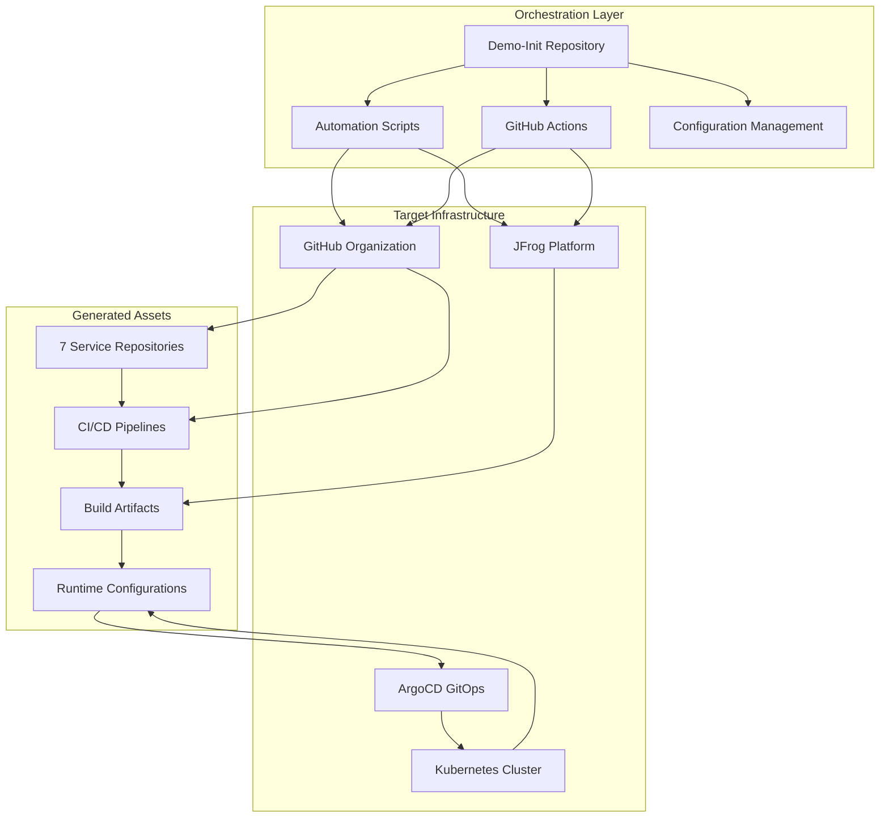
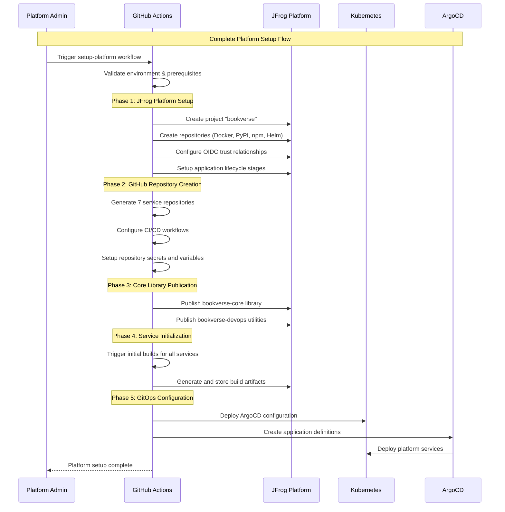

# BookVerse Demo-Init - Orchestration Overview

**Platform Setup Automation and Configuration Management**

This document provides a comprehensive overview of the BookVerse Demo-Init orchestration layer, which serves as the central automation hub for platform provisioning, configuration management, and demo lifecycle operations.

---

## 🏗️ Orchestration Architecture

The Demo-Init orchestration layer implements a sophisticated automation framework that bridges the gap between raw infrastructure and a fully configured, operational BookVerse platform.



### Core Responsibilities

#### **🚀 Platform Provisioning**
- **JFrog Platform Setup**: Complete configuration of Artifactory repositories, projects, and security
- **GitHub Organization Management**: Automated creation and configuration of service repositories
- **CI/CD Pipeline Deployment**: End-to-end pipeline setup with security integration
- **OIDC Authentication**: Zero-trust authentication configuration between GitHub and JFrog

#### **⚙️ Configuration Management**
- **Environment Orchestration**: DEV, QA, STAGING, PROD environment configuration
- **Service Integration**: Cross-service dependency and communication setup
- **Secret Management**: Automated distribution of secrets and credentials
- **GitOps Configuration**: ArgoCD and Kubernetes deployment automation

#### **🔄 Lifecycle Operations**
- **Demo Execution**: Streamlined demo startup and management workflows
- **Platform Switching**: Dynamic switching between different JFrog Platform instances
- **Maintenance Operations**: Cleanup, backup, and recovery procedures
- **Validation and Monitoring**: Comprehensive health checking and validation

---

## 📦 Repository Structure

The Demo-Init repository follows a carefully designed structure that separates concerns while maintaining operational coherence:

### 🗂️ Directory Organization

```
bookverse-demo-init/
├── 📁 .github/
│   ├── 📁 scripts/setup/          # Platform provisioning scripts (20+ scripts)
│   └── 📁 workflows/              # GitHub Actions automation workflows
├── 📁 docs/                       # Comprehensive documentation suite
├── 📁 scripts/                    # Operational and maintenance scripts
├── 📁 gitops/                     # Kubernetes and ArgoCD configurations
├── 📁 config/                     # Platform configuration files
└── 📄 bookverse-demo.sh           # Primary demo execution script
```

#### **Setup Scripts (.github/scripts/setup/)**
The setup directory contains the core automation scripts that provision and configure the entire platform:

| Script | Purpose | Dependencies |
|--------|---------|--------------|
| `validate_environment.sh` | Pre-flight environment validation | JFrog CLI, GitHub CLI |
| `create_project.sh` | JFrog project and repository creation | JFrog Admin Token |
| `create_repositories.sh` | GitHub repository generation | GitHub Organization Access |
| `create_oidc.sh` | OIDC trust relationship setup | Both platforms |
| `create_stages.sh` | Application lifecycle stage configuration | Project setup |
| `evidence_keys_setup.sh` | Cryptographic evidence key deployment | Security credentials |
| `publish_libraries.sh` | Core library publication | Build environment |

#### **Operational Scripts (scripts/)**
The scripts directory contains tools for ongoing platform management and operations:

| Script | Purpose | Use Case |
|--------|---------|----------|
| `bookverse-demo.sh` | Primary demo execution interface | Daily demo operations |
| `switch_jfrog_platform_interactive.sh` | Platform switching automation | Multi-environment management |
| `cleanup-*.py` | Maintenance and cleanup utilities | Platform hygiene |
| `generate_version_map.py` | Version coordination across services | Release management |
| `test-bulletproof-setup.sh` | End-to-end validation testing | Quality assurance |

#### **GitOps Configuration (gitops/)**
```
gitops/
├── 📁 apps/                       # Application definitions per environment
│   ├── dev/, qa/, staging/, prod/ # Environment-specific configurations
├── 📁 bootstrap/                  # Initial cluster setup resources
├── 📁 projects/                   # ArgoCD project definitions
└── 📁 policies/                   # Security and governance policies
```

---

## 🚀 Platform Setup Automation

### Comprehensive Setup Pipeline

The platform setup process follows a carefully orchestrated sequence that ensures all components are properly configured and integrated:



### Setup Workflow Components

#### **Environment Validation**
```bash
#!/bin/bash
# Pre-flight validation ensures all prerequisites are met

validate_jfrog_platform() {
    echo "🔍 Validating JFrog Platform connectivity..."
    
    # Test platform accessibility
    if ! jf rt ping; then
        echo "❌ JFrog Platform unreachable"
        exit 1
    fi
    
    # Verify admin permissions
    if ! jf rt curl -X GET "/api/system/info" | jq -r '.type' | grep -q "Artifactory"; then
        echo "❌ Insufficient JFrog Platform permissions"
        exit 1
    fi
    
    echo "✅ JFrog Platform validation successful"
}

validate_github_access() {
    echo "🔍 Validating GitHub Organization access..."
    
    # Test GitHub CLI authentication
    if ! gh auth status >/dev/null 2>&1; then
        echo "❌ GitHub CLI not authenticated"
        exit 1
    fi
    
    # Verify organization access
    if ! gh api "orgs/${GITHUB_ORG}" >/dev/null 2>&1; then
        echo "❌ Cannot access GitHub organization: ${GITHUB_ORG}"
        exit 1
    fi
    
    echo "✅ GitHub Organization access validated"
}
```

#### **Project Creation**
The project creation process establishes the foundational structure in JFrog Platform:

```bash
#!/bin/bash
# Comprehensive JFrog project setup with all required repositories

create_bookverse_project() {
    local project_key="bookverse"
    
    echo "🏗️ Creating BookVerse project: ${project_key}"
    
    # Create project with comprehensive configuration
    jf project create "${project_key}" \
        --display-name "BookVerse Platform" \
        --description "Enterprise microservices platform with secure CI/CD" \
        --admin-privileges \
        --storage-quota-gb 100 \
        --admins "auto"
    
    # Create repository matrix for all package types
    create_repository_matrix "${project_key}"
    
    # Configure security and access policies
    configure_project_security "${project_key}"
    
    echo "✅ Project ${project_key} created successfully"
}

create_repository_matrix() {
    local project_key=$1
    
    # Docker repositories for container images
    for stage in dev qa staging prod; do
        jf rt repo-create "${project_key}-docker-${stage}" \
            --type docker \
            --project-key "${project_key}" \
            --description "Docker repository for ${stage} environment"
    done
    
    # PyPI repositories for Python packages
    jf rt repo-create "${project_key}-pypi-local" \
        --type pypi \
        --project-key "${project_key}" \
        --description "Local PyPI repository for BookVerse libraries"
    
    # npm repositories for JavaScript packages
    jf rt repo-create "${project_key}-npm-local" \
        --type npm \
        --project-key "${project_key}" \
        --description "Local npm repository for web application packages"
    
    # Helm repositories for Kubernetes charts
    jf rt repo-create "${project_key}-helm-local" \
        --type helm \
        --project-key "${project_key}" \
        --description "Helm chart repository for Kubernetes deployments"
}
```

#### **Repository Generation**
The GitHub repository creation process generates seven fully configured service repositories:

```bash
#!/bin/bash
# Automated GitHub repository creation with complete CI/CD setup

create_service_repositories() {
    local services=("inventory" "recommendations" "checkout" "platform" "web" "helm")
    local base_repo="bookverse-demo-init"
    
    for service in "${services[@]}"; do
        echo "🏗️ Creating repository: bookverse-${service}"
        
        # Create repository with comprehensive setup
        gh repo create "${GITHUB_ORG}/bookverse-${service}" \
            --description "BookVerse ${service^} Service - Enterprise microservice" \
            --homepage "https://github.com/${GITHUB_ORG}/bookverse-demo-init" \
            --public \
            --clone
        
        # Configure repository with templates and workflows
        setup_repository_structure "${service}"
        configure_repository_secrets "${service}"
        enable_repository_features "${service}"
        
        echo "✅ Repository bookverse-${service} configured"
    done
}

setup_repository_structure() {
    local service=$1
    local repo_dir="bookverse-${service}"
    
    cd "${repo_dir}"
    
    # Copy service-specific code and configuration
    cp -r "../${base_repo}/templates/${service}/"* .
    
    # Configure CI/CD workflows
    mkdir -p .github/workflows
    cp "../${base_repo}/templates/workflows/${service}-ci.yml" .github/workflows/ci.yml
    
    # Setup project configuration
    cp "../${base_repo}/templates/config/${service}/"* .
    
    # Initialize with proper Git configuration
    git add .
    git commit -m "Initial commit: ${service^} service setup"
    git push origin main
    
    cd ..
}
```

---

## ⚙️ Configuration Management

### Environment Configuration Strategy

The Demo-Init orchestration implements a sophisticated configuration management strategy that supports multiple environments while maintaining consistency and security.

#### **Environment Matrix**
```yaml
# Configuration matrix for all environments
environments:
  dev:
    jfrog_repositories:
      - "bookverse-docker-dev"
      - "bookverse-pypi-dev"
    namespace: "bookverse-dev"
    replicas: 1
    resources:
      requests: { cpu: "100m", memory: "256Mi" }
      limits: { cpu: "500m", memory: "1Gi" }
    
  qa:
    jfrog_repositories:
      - "bookverse-docker-qa"
      - "bookverse-pypi-qa"
    namespace: "bookverse-qa"
    replicas: 2
    resources:
      requests: { cpu: "200m", memory: "512Mi" }
      limits: { cpu: "1", memory: "2Gi" }
    
  staging:
    jfrog_repositories:
      - "bookverse-docker-staging"
      - "bookverse-pypi-staging"
    namespace: "bookverse-staging"
    replicas: 3
    resources:
      requests: { cpu: "500m", memory: "1Gi" }
      limits: { cpu: "2", memory: "4Gi" }
    
  prod:
    jfrog_repositories:
      - "bookverse-docker-prod"
      - "bookverse-pypi-prod"
    namespace: "bookverse-prod"
    replicas: 5
    resources:
      requests: { cpu: "1", memory: "2Gi" }
      limits: { cpu: "4", memory: "8Gi" }
```

#### **Secret Management**
```bash
#!/bin/bash
# Comprehensive secret distribution across all repositories

configure_repository_secrets() {
    local service=$1
    local repo_name="bookverse-${service}"
    
    echo "🔐 Configuring secrets for ${repo_name}"
    
    # JFrog Platform integration secrets
    gh secret set JFROG_URL \
        --repo "${GITHUB_ORG}/${repo_name}" \
        --body "${JFROG_URL}"
    
    gh secret set JFROG_ACCESS_TOKEN \
        --repo "${GITHUB_ORG}/${repo_name}" \
        --body "${JFROG_ACCESS_TOKEN}"
    
    # Service-specific configuration
    configure_service_specific_secrets "${service}" "${repo_name}"
    
    # Shared platform secrets
    configure_shared_secrets "${repo_name}"
    
    echo "✅ Secrets configured for ${repo_name}"
}

configure_service_specific_secrets() {
    local service=$1
    local repo_name=$2
    
    case "${service}" in
        "inventory")
            gh secret set DATABASE_URL \
                --repo "${GITHUB_ORG}/${repo_name}" \
                --body "sqlite:///./inventory.db"
            ;;
        "recommendations")
            gh secret set REDIS_URL \
                --repo "${GITHUB_ORG}/${repo_name}" \
                --body "redis://localhost:6379"
            gh secret set ML_MODEL_BUCKET \
                --repo "${GITHUB_ORG}/${repo_name}" \
                --body "bookverse-ml-models"
            ;;
        "checkout")
            gh secret set STRIPE_SECRET_KEY \
                --repo "${GITHUB_ORG}/${repo_name}" \
                --body "${STRIPE_SECRET_KEY}"
            gh secret set PAYMENT_WEBHOOK_SECRET \
                --repo "${GITHUB_ORG}/${repo_name}" \
                --body "${PAYMENT_WEBHOOK_SECRET}"
            ;;
    esac
}
```

### Version Coordination

#### **Semantic Versioning Strategy**
The orchestration layer implements a unified semantic versioning strategy that coordinates releases across all services:

```python
#!/usr/bin/env python3
"""
Unified version management for BookVerse platform.

This script coordinates semantic versioning across all microservices,
ensuring consistent and compatible releases while maintaining individual
service autonomy for patch-level updates.
"""

import yaml
import subprocess
from typing import Dict, List, Tuple
from dataclasses import dataclass
from packaging import version

@dataclass
class ServiceVersion:
    """Represents a service version with semantic version parsing."""
    name: str
    current_version: str
    target_version: str = None
    
    @property
    def parsed_version(self) -> version.Version:
        return version.parse(self.current_version)
    
    @property
    def needs_update(self) -> bool:
        if not self.target_version:
            return False
        return version.parse(self.target_version) > self.parsed_version

class PlatformVersionCoordinator:
    """
    Coordinates versioning across the entire BookVerse platform.
    
    Implements sophisticated version management that balances service
    autonomy with platform-wide compatibility requirements.
    """
    
    def __init__(self, version_map_path: str = "config/version-map.yaml"):
        self.version_map_path = version_map_path
        self.services = {}
        self.load_version_map()
    
    def load_version_map(self):
        """Load current version map from configuration."""
        try:
            with open(self.version_map_path, 'r') as f:
                version_data = yaml.safe_load(f)
            
            for service_name, service_config in version_data.get('services', {}).items():
                self.services[service_name] = ServiceVersion(
                    name=service_name,
                    current_version=service_config.get('version', '0.1.0'),
                    target_version=service_config.get('target_version')
                )
        
        except FileNotFoundError:
            print(f"Version map not found: {self.version_map_path}")
            self.initialize_version_map()
    
    def coordinate_platform_release(self, release_type: str = "minor") -> Dict[str, str]:
        """
        Coordinate a platform-wide release with version bumping.
        
        Args:
            release_type: Type of release (major, minor, patch)
            
        Returns:
            Dictionary mapping service names to new versions
        """
        
        print(f"🚀 Coordinating platform {release_type} release")
        
        # Determine version bump strategy
        version_updates = {}
        
        for service_name, service_version in self.services.items():
            new_version = self.calculate_new_version(
                service_version.current_version, 
                release_type
            )
            version_updates[service_name] = new_version
            
            print(f"  📦 {service_name}: {service_version.current_version} → {new_version}")
        
        # Update version map
        self.update_version_map(version_updates)
        
        # Trigger service updates
        self.trigger_service_updates(version_updates)
        
        return version_updates
    
    def calculate_new_version(self, current: str, bump_type: str) -> str:
        """Calculate new version based on current version and bump type."""
        
        v = version.parse(current)
        
        if bump_type == "major":
            return f"{v.major + 1}.0.0"
        elif bump_type == "minor":
            return f"{v.major}.{v.minor + 1}.0"
        elif bump_type == "patch":
            return f"{v.major}.{v.minor}.{v.micro + 1}"
        else:
            raise ValueError(f"Invalid bump type: {bump_type}")
    
    def trigger_service_updates(self, version_updates: Dict[str, str]):
        """Trigger CI/CD workflows to build new versions."""
        
        for service_name, new_version in version_updates.items():
            repo_name = f"bookverse-{service_name}"
            
            print(f"🔄 Triggering build for {repo_name} v{new_version}")
            
            # Trigger GitHub Actions workflow with version parameter
            subprocess.run([
                "gh", "workflow", "run", "ci.yml",
                "--repo", f"{os.environ['GITHUB_ORG']}/{repo_name}",
                "--field", f"version={new_version}",
                "--field", f"release_type=platform_release"
            ], check=True)
```

---

## 🔄 Demo Lifecycle Management

### Demo Execution Framework

The Demo-Init provides a comprehensive framework for managing the complete demo lifecycle, from initial setup to daily operations and maintenance.

#### **Demo Startup Process**
```bash
#!/bin/bash
# Primary demo execution script with comprehensive mode handling

bookverse_demo_main() {
    local mode=$1
    
    case "${mode}" in
        "setup")
            execute_first_time_setup
            ;;
        "resume"|"")
            execute_demo_resume
            ;;
        "port-forward")
            execute_port_forward_mode
            ;;
        "cleanup")
            execute_cleanup_mode
            ;;
        *)
            echo "❌ Invalid mode: ${mode}"
            usage
            exit 1
            ;;
    esac
}

execute_first_time_setup() {
    echo "🔧 Executing first-time demo setup..."
    
    # Phase 1: Environment validation
    validate_prerequisites
    
    # Phase 2: Kubernetes cluster setup
    setup_kubernetes_environment
    
    # Phase 3: ArgoCD installation and configuration
    install_and_configure_argocd
    
    # Phase 4: BookVerse platform deployment
    deploy_bookverse_platform
    
    # Phase 5: DNS and ingress configuration
    configure_demo_ingress
    
    # Phase 6: Validation and health checks
    validate_demo_deployment
    
    echo "✅ Demo setup complete!"
    echo "🌐 Access URLs:"
    echo "   BookVerse App: http://bookverse.demo"
    echo "   ArgoCD UI: https://argocd.demo"
}

execute_demo_resume() {
    echo "▶️ Resuming existing demo..."
    
    # Check if demo is already running
    if check_demo_health; then
        echo "✅ Demo is already running and healthy"
        display_access_information
        return 0
    fi
    
    # Restart any stopped components
    restart_demo_components
    
    # Wait for services to be ready
    wait_for_services_ready
    
    # Start port forwarding
    start_port_forwarding
    
    echo "✅ Demo resumed successfully!"
    display_access_information
}

validate_prerequisites() {
    echo "🔍 Validating prerequisites..."
    
    # Check required tools
    local required_tools=("kubectl" "helm" "jq" "curl")
    for tool in "${required_tools[@]}"; do
        if ! command -v "${tool}" >/dev/null 2>&1; then
            echo "❌ Required tool not found: ${tool}"
            exit 1
        fi
    done
    
    # Check Kubernetes cluster access
    if ! kubectl cluster-info >/dev/null 2>&1; then
        echo "❌ Cannot access Kubernetes cluster"
        echo "💡 Ensure kubectl is configured and cluster is running"
        exit 1
    fi
    
    echo "✅ Prerequisites validated"
}
```

#### **Platform Switching**
The orchestration layer supports dynamic switching between different JFrog Platform instances:

```bash
#!/bin/bash
# Interactive platform switching with comprehensive validation

switch_jfrog_platform() {
    echo "🔄 JFrog Platform Switching Wizard"
    echo "=================================="
    
    # Display current platform
    display_current_platform
    
    # Get new platform details
    read_new_platform_config
    
    # Validate new platform
    validate_new_platform
    
    # Execute switch
    execute_platform_switch
    
    # Verify switch
    verify_platform_switch
    
    echo "✅ Platform switch completed successfully!"
}

read_new_platform_config() {
    echo ""
    echo "📝 Enter new JFrog Platform details:"
    
    read -p "JFrog Platform URL: " new_jfrog_url
    read -p "Admin Token: " -s new_admin_token
    echo
    read -p "Project Key [bookverse]: " new_project_key
    new_project_key=${new_project_key:-bookverse}
    
    # Validate input format
    if [[ ! "${new_jfrog_url}" =~ ^https?:// ]]; then
        echo "❌ Invalid URL format. Must start with http:// or https://"
        exit 1
    fi
    
    if [[ ${#new_admin_token} -lt 20 ]]; then
        echo "❌ Admin token appears to be too short"
        exit 1
    fi
}

execute_platform_switch() {
    echo "🔄 Executing platform switch..."
    
    # Update JFrog CLI configuration
    jf c remove bookverse-admin 2>/dev/null || true
    jf c add bookverse-admin \
        --url "${new_jfrog_url}" \
        --access-token "${new_admin_token}" \
        --interactive=false
    jf c use bookverse-admin
    
    # Update repository secrets
    update_repository_secrets
    
    # Trigger repository re-configuration
    trigger_repository_updates
    
    # Update local configuration files
    update_local_configuration
    
    echo "✅ Platform switch configuration updated"
}

update_repository_secrets() {
    local services=("inventory" "recommendations" "checkout" "platform" "web" "helm")
    
    for service in "${services[@]}"; do
        local repo_name="bookverse-${service}"
        
        echo "🔐 Updating secrets for ${repo_name}..."
        
        # Update JFrog Platform secrets
        gh secret set JFROG_URL \
            --repo "${GITHUB_ORG}/${repo_name}" \
            --body "${new_jfrog_url}"
        
        gh secret set JFROG_ACCESS_TOKEN \
            --repo "${GITHUB_ORG}/${repo_name}" \
            --body "${new_admin_token}"
        
        echo "✅ Secrets updated for ${repo_name}"
    done
}
```

---

## 🔧 Maintenance and Operations

### Automated Cleanup and Maintenance

The orchestration layer provides comprehensive maintenance utilities for platform hygiene and resource management.

#### **Intelligent Cleanup System**
```python
#!/usr/bin/env python3
"""
Intelligent cleanup system for BookVerse platform resources.

Provides safe, auditable cleanup of unused resources while preserving
critical platform components and maintaining operational continuity.
"""

import json
import subprocess
from datetime import datetime, timedelta
from typing import Dict, List, Set
from dataclasses import dataclass

@dataclass
class CleanupTarget:
    """Represents a resource targeted for cleanup."""
    resource_type: str
    resource_id: str
    last_used: datetime
    size_mb: float
    dependencies: List[str]
    safety_score: float

class IntelligentCleanupEngine:
    """
    Sophisticated cleanup engine with safety checks and audit trails.
    
    Implements multi-stage cleanup with comprehensive safety validations,
    dependency analysis, and detailed audit logging.
    """
    
    def __init__(self, dry_run: bool = True):
        self.dry_run = dry_run
        self.cleanup_targets = []
        self.safety_threshold = 0.8  # Minimum safety score for cleanup
        self.retention_policies = self.load_retention_policies()
    
    def analyze_cleanup_candidates(self) -> List[CleanupTarget]:
        """Analyze platform resources and identify cleanup candidates."""
        
        print("🔍 Analyzing platform resources for cleanup candidates...")
        
        candidates = []
        
        # Analyze Docker images
        candidates.extend(self.analyze_docker_images())
        
        # Analyze build artifacts
        candidates.extend(self.analyze_build_artifacts())
        
        # Analyze temporary resources
        candidates.extend(self.analyze_temporary_resources())
        
        # Apply safety scoring
        for candidate in candidates:
            candidate.safety_score = self.calculate_safety_score(candidate)
        
        # Filter by safety threshold
        safe_candidates = [
            c for c in candidates 
            if c.safety_score >= self.safety_threshold
        ]
        
        print(f"📊 Analysis complete: {len(candidates)} candidates, {len(safe_candidates)} safe for cleanup")
        
        return safe_candidates
    
    def analyze_docker_images(self) -> List[CleanupTarget]:
        """Analyze Docker images for cleanup candidates."""
        
        # Get all Docker images from JFrog Artifactory
        images_data = subprocess.run([
            "jf", "rt", "search", "--spec", "docker-cleanup-spec.json"
        ], capture_output=True, text=True, check=True)
        
        images = json.loads(images_data.stdout)
        candidates = []
        
        for image in images:
            # Parse image metadata
            last_downloaded = self.parse_jfrog_timestamp(image.get('stats', {}).get('downloaded'))
            size_mb = image.get('size', 0) / (1024 * 1024)
            
            # Check if image is older than retention policy
            retention_days = self.retention_policies.get('docker_images', 30)
            cutoff_date = datetime.now() - timedelta(days=retention_days)
            
            if last_downloaded and last_downloaded < cutoff_date:
                candidates.append(CleanupTarget(
                    resource_type="docker_image",
                    resource_id=image['path'],
                    last_used=last_downloaded,
                    size_mb=size_mb,
                    dependencies=self.find_image_dependencies(image['path']),
                    safety_score=0.0  # Will be calculated later
                ))
        
        return candidates
    
    def calculate_safety_score(self, target: CleanupTarget) -> float:
        """
        Calculate safety score for cleanup target.
        
        Higher scores indicate safer cleanup candidates.
        Factors include age, dependencies, usage patterns, and criticality.
        """
        
        score = 1.0
        
        # Age factor (older = safer)
        age_days = (datetime.now() - target.last_used).days
        if age_days < 7:
            score *= 0.1  # Very recent, high risk
        elif age_days < 30:
            score *= 0.5  # Recent, moderate risk
        elif age_days < 90:
            score *= 0.8  # Moderately old, lower risk
        # else: older than 90 days, no penalty
        
        # Dependency factor (fewer dependencies = safer)
        if len(target.dependencies) == 0:
            score *= 1.0  # No dependencies, safe
        elif len(target.dependencies) <= 2:
            score *= 0.7  # Few dependencies, moderate risk
        else:
            score *= 0.3  # Many dependencies, higher risk
        
        # Size factor (larger = more impact, slightly less safe)
        if target.size_mb > 1000:  # > 1GB
            score *= 0.9
        
        # Resource type factor
        type_safety = {
            'docker_image': 0.8,
            'build_artifact': 0.9,
            'temporary_file': 1.0,
            'log_file': 1.0
        }
        score *= type_safety.get(target.resource_type, 0.5)
        
        return score
    
    def execute_cleanup(self, targets: List[CleanupTarget]) -> Dict[str, any]:
        """
        Execute cleanup operations with comprehensive audit logging.
        
        Args:
            targets: List of validated cleanup targets
            
        Returns:
            Cleanup results with detailed audit information
        """
        
        results = {
            'started_at': datetime.now().isoformat(),
            'dry_run': self.dry_run,
            'targets_processed': 0,
            'total_space_freed_mb': 0,
            'successful_cleanups': [],
            'failed_cleanups': [],
            'skipped_cleanups': []
        }
        
        print(f"🧹 Starting cleanup operation ({'DRY RUN' if self.dry_run else 'LIVE'})")
        
        for target in targets:
            try:
                if self.dry_run:
                    print(f"  [DRY RUN] Would clean: {target.resource_id} ({target.size_mb:.1f} MB)")
                    results['successful_cleanups'].append({
                        'resource_id': target.resource_id,
                        'resource_type': target.resource_type,
                        'size_mb': target.size_mb,
                        'action': 'would_delete'
                    })
                else:
                    self.delete_resource(target)
                    print(f"  ✅ Cleaned: {target.resource_id} ({target.size_mb:.1f} MB)")
                    results['successful_cleanups'].append({
                        'resource_id': target.resource_id,
                        'resource_type': target.resource_type,
                        'size_mb': target.size_mb,
                        'action': 'deleted'
                    })
                
                results['targets_processed'] += 1
                results['total_space_freed_mb'] += target.size_mb
                
            except Exception as e:
                print(f"  ❌ Failed to clean {target.resource_id}: {e}")
                results['failed_cleanups'].append({
                    'resource_id': target.resource_id,
                    'error': str(e)
                })
        
        results['completed_at'] = datetime.now().isoformat()
        
        # Save audit log
        self.save_cleanup_audit(results)
        
        return results
```

---

## 🔗 Integration Patterns

### Service Discovery and Registration

The orchestration layer implements sophisticated service discovery patterns that enable seamless integration between components.

#### **Dynamic Service Registration**
```yaml
# Service registration configuration
apiVersion: v1
kind: ConfigMap
metadata:
  name: service-discovery-config
  namespace: bookverse-system
data:
  service-registry.yaml: |
    services:
      inventory:
        endpoints:
          - name: api
            url: "http://inventory-service.bookverse-prod.svc.cluster.local:8000"
            health_check: "/health"
          - name: metrics
            url: "http://inventory-service.bookverse-prod.svc.cluster.local:9090"
            health_check: "/metrics"
        
      recommendations:
        endpoints:
          - name: api
            url: "http://recommendations-service.bookverse-prod.svc.cluster.local:8001"
            health_check: "/health"
          - name: worker
            url: "http://recommendations-worker.bookverse-prod.svc.cluster.local:8002"
            health_check: "/health"
        
      checkout:
        endpoints:
          - name: api
            url: "http://checkout-service.bookverse-prod.svc.cluster.local:8003"
            health_check: "/health"
        
      platform:
        endpoints:
          - name: api
            url: "http://platform-service.bookverse-prod.svc.cluster.local:8004"
            health_check: "/health"
        
      web:
        endpoints:
          - name: app
            url: "http://web-service.bookverse-prod.svc.cluster.local:80"
            health_check: "/health"
```

### Cross-Service Communication

The orchestration establishes secure, reliable communication patterns between all platform components.

#### **API Gateway Configuration**
```yaml
# Ingress configuration for unified API access
apiVersion: networking.k8s.io/v1
kind: Ingress
metadata:
  name: bookverse-api-gateway
  namespace: bookverse-prod
  annotations:
    nginx.ingress.kubernetes.io/rewrite-target: /$2
    nginx.ingress.kubernetes.io/ssl-redirect: "true"
    nginx.ingress.kubernetes.io/rate-limit: "100"
    nginx.ingress.kubernetes.io/cors-allow-methods: "GET, POST, PUT, DELETE, OPTIONS"
    nginx.ingress.kubernetes.io/cors-allow-headers: "DNT,User-Agent,X-Requested-With,If-Modified-Since,Cache-Control,Content-Type,Range,Authorization"
spec:
  tls:
  - hosts:
    - api.bookverse.demo
    secretName: bookverse-tls
  rules:
  - host: api.bookverse.demo
    http:
      paths:
      - path: /inventory(/|$)(.*)
        pathType: Prefix
        backend:
          service:
            name: inventory-service
            port:
              number: 8000
      - path: /recommendations(/|$)(.*)
        pathType: Prefix
        backend:
          service:
            name: recommendations-service
            port:
              number: 8001
      - path: /checkout(/|$)(.*)
        pathType: Prefix
        backend:
          service:
            name: checkout-service
            port:
              number: 8003
      - path: /platform(/|$)(.*)
        pathType: Prefix
        backend:
          service:
            name: platform-service
            port:
              number: 8004
```

---

## 🔗 Related Documentation

- **[Setup Automation Guide](SETUP_AUTOMATION.md)**: Detailed GitHub Actions workflows and JFrog provisioning
- **[Script Reference](SCRIPT_REFERENCE.md)**: Comprehensive documentation of all automation scripts
- **[Demo Operations Guide](DEMO_OPERATIONS.md)**: Daily operation workflows and troubleshooting
- **[Architecture Guide](../ARCHITECTURE.md)**: Overall platform architecture and design decisions
- **[Getting Started Guide](../GETTING_STARTED.md)**: Quick start deployment procedures

---

