# BookVerse Platform - Promotion Workflows Guide

**Automated promotion logic, manual procedures, and rollback strategies for enterprise-grade application lifecycle management**

The BookVerse Platform implements sophisticated promotion workflows that orchestrate artifact progression through development, quality assurance, staging, and production environments with comprehensive validation, automated decision-making, and rollback capabilities integrated with JFrog AppTrust.

---

## 📋 Table of Contents

- [Promotion Architecture Overview](#-promotion-architecture-overview)
- [Automated Promotion Workflows](#-automated-promotion-workflows)
- [Manual Promotion Procedures](#-manual-promotion-procedures)
- [Quality Gates and Validation](#-quality-gates-and-validation)
- [Rollback Strategies](#-rollback-strategies)
- [AppTrust Integration](#-apptrust-integration)
- [Monitoring and Observability](#-monitoring-and-observability)
- [Security and Compliance](#-security-and-compliance)
- [Troubleshooting Guide](#-troubleshooting-guide)
- [Best Practices](#-best-practices)

---

## 🏗️ Promotion Architecture Overview

### Lifecycle Stage Progression

The BookVerse Platform uses a four-stage promotion pipeline with AppTrust lifecycle management:

```mermaid
graph LR
    DEV[🔬 DEV Environment<br/>Development builds<br/>Continuous integration<br/>Feature validation] --> QA[🧪 QA Environment<br/>Quality assurance<br/>Integration testing<br/>Performance validation]
    
    QA --> STAGING[🎭 STAGING Environment<br/>Pre-production<br/>Production simulation<br/>User acceptance testing]
    
    STAGING --> PROD[🚀 PROD Environment<br/>Production release<br/>Live customer traffic<br/>Business operations]
    
    DEV -.->|Hotfix| PROD
    QA -.->|Emergency| PROD
    STAGING -.->|Critical| PROD
    
    PROD -.->|Rollback| STAGING
    STAGING -.->|Rollback| QA
    QA -.->|Rollback| DEV
```



### Promotion Workflow Components

```mermaid
graph TB
    TM[📋 Trigger Manager<br/>Event detection<br/>Workflow initiation] --> VE[✅ Validation Engine<br/>Quality gates<br/>Automated testing]
    
    VE --> PM[🔄 Promotion Manager<br/>Artifact promotion<br/>Environment deployment]
    
    PM --> MM[📊 Monitoring Manager<br/>Health validation<br/>Performance tracking]
    
    MM --> NM[📢 Notification Manager<br/>Stakeholder alerts<br/>Status updates]
    
    TM --> QGF[🛡️ Quality Gate Framework<br/>Security scanning<br/>Compliance validation]
    QGF --> VE
    
    PM --> RBM[🔄 Rollback Manager<br/>Automated rollback<br/>Recovery procedures]
    RBM --> MM
    
    AT[🏢 AppTrust Integration<br/>Lifecycle management<br/>Evidence collection] --> PM
    AT --> RBM
```



### Environment Configuration Matrix

| Environment | Purpose | Validation Level | Deployment Strategy | Rollback Policy |
|-------------|---------|------------------|-------------------|-----------------|
| **DEV** | Feature development | Basic validation | Continuous deployment | Immediate rollback |
| **QA** | Integration testing | Standard validation | Controlled deployment | Automated rollback |
| **STAGING** | Pre-production validation | Comprehensive validation | Blue-green deployment | Manual approval required |
| **PROD** | Live production | Full validation | Canary deployment | Emergency procedures |

---

## 🤖 Automated Promotion Workflows

### Continuous Promotion Engine

```yaml
# Automated Promotion Configuration
promotion_workflows:
  dev_to_qa:
    trigger:
      - successful_ci_build
      - security_scan_pass
      - unit_tests_pass
    validation:
      - integration_tests
      - performance_benchmarks
      - dependency_scan
    promotion_strategy: "immediate"
    rollback_on_failure: true
    
  qa_to_staging:
    trigger:
      - qa_validation_complete
      - integration_tests_pass
      - performance_criteria_met
    validation:
      - end_to_end_tests
      - security_validation
      - compliance_checks
    promotion_strategy: "scheduled"
    approval_required: false
    rollback_on_failure: true
    
  staging_to_prod:
    trigger:
      - staging_validation_complete
      - business_approval
      - change_management_approval
    validation:
      - production_readiness_check
      - capacity_planning_validation
      - disaster_recovery_verification
    promotion_strategy: "controlled"
    approval_required: true
    rollback_on_failure: true
    monitoring_period: "24h"
```

### GitHub Actions Promotion Workflow

```yaml
name: 🚀 Automated Promotion Workflow

on:
  workflow_run:
    workflows: ["🔨 CI/CD Pipeline"]
    types: [completed]
    branches: [main]

env:
  JFROG_URL: ${{ vars.JFROG_URL }}
  JFROG_ACCESS_TOKEN: ${{ secrets.JFROG_ACCESS_TOKEN }}
  PROMOTION_CONFIG: ${{ vars.PROMOTION_CONFIG }}

jobs:
  determine-promotion:
    runs-on: ubuntu-latest
    outputs:
      should_promote: ${{ steps.promotion-decision.outputs.should_promote }}
      target_stage: ${{ steps.promotion-decision.outputs.target_stage }}
      promotion_strategy: ${{ steps.promotion-decision.outputs.promotion_strategy }}
    
    steps:
      - name: 📥 Checkout code
        uses: actions/checkout@v4
      
      - name: 🔧 Setup JFrog CLI
        uses: jfrog/setup-jfrog-cli@v3
        
      - name: 🎯 Determine promotion eligibility
        id: promotion-decision
        run: |
          # Get current application version
          CURRENT_VERSION=$(jf rt search "bookverse-*/*/LATEST" --format json | jq -r '.[0].version')
          
          # Check promotion criteria
          PROMOTION_ELIGIBLE=$(python3 .github/scripts/check_promotion_criteria.py \
            --version "$CURRENT_VERSION" \
            --stage DEV \
            --config "$PROMOTION_CONFIG")
          
          if [[ "$PROMOTION_ELIGIBLE" == "true" ]]; then
            echo "should_promote=true" >> $GITHUB_OUTPUT
            echo "target_stage=QA" >> $GITHUB_OUTPUT
            echo "promotion_strategy=automated" >> $GITHUB_OUTPUT
          else
            echo "should_promote=false" >> $GITHUB_OUTPUT
          fi

  automated-promotion:
    needs: determine-promotion
    if: needs.determine-promotion.outputs.should_promote == 'true'
    runs-on: ubuntu-latest
    
    steps:
      - name: 📥 Checkout code
        uses: actions/checkout@v4
        
      - name: 🔧 Setup JFrog CLI
        uses: jfrog/setup-jfrog-cli@v3
        
      - name: ✅ Execute quality gates
        id: quality-gates
        run: |
          # Execute comprehensive quality gate validation
          .github/scripts/execute_quality_gates.sh \
            --stage "${{ needs.determine-promotion.outputs.target_stage }}" \
            --strategy "${{ needs.determine-promotion.outputs.promotion_strategy }}"
        
      - name: 🚀 Promote artifacts
        if: steps.quality-gates.outcome == 'success'
        run: |
          # Execute automated promotion
          .github/scripts/promote_artifacts.sh \
            --target-stage "${{ needs.determine-promotion.outputs.target_stage }}" \
            --promotion-strategy "${{ needs.determine-promotion.outputs.promotion_strategy }}" \
            --auto-rollback true
            
      - name: 📊 Setup post-promotion monitoring
        if: steps.quality-gates.outcome == 'success'
        run: |
          # Configure monitoring for promoted version
          .github/scripts/setup_promotion_monitoring.sh \
            --stage "${{ needs.determine-promotion.outputs.target_stage }}" \
            --monitoring-duration "1h"
            
      - name: 🔄 Handle promotion failure
        if: failure()
        run: |
          # Execute automatic rollback on promotion failure
          .github/scripts/handle_promotion_failure.sh \
            --stage "${{ needs.determine-promotion.outputs.target_stage }}" \
            --rollback-strategy "immediate"
```

### Promotion Decision Engine

```python
class PromotionDecisionEngine:
    def __init__(self):
        self.quality_gates = QualityGateFramework()
        self.risk_assessor = RiskAssessmentEngine()
        self.policy_engine = PromotionPolicyEngine()
        
    async def evaluate_promotion_eligibility(self, promotion_request):
        """
        Evaluate whether an artifact is eligible for promotion.
        
        Evaluation criteria:
        1. Quality gate validation
        2. Risk assessment
        3. Policy compliance
        4. Business approval (for production)
        5. Change management approval
        """
        
        evaluation_context = PromotionEvaluationContext(
            request=promotion_request,
            timestamp=datetime.utcnow(),
            source_stage=promotion_request.source_stage,
            target_stage=promotion_request.target_stage
        )
        
        try:
            # Phase 1: Quality Gate Validation
            quality_gate_result = await self.quality_gates.validate_promotion(
                evaluation_context
            )
            
            if not quality_gate_result.passed:
                return PromotionEligibilityResult(
                    eligible=False,
                    reason="Quality gates failed",
                    failed_gates=quality_gate_result.failed_gates,
                    recommendation="Address quality gate failures before promotion"
                )
            
            # Phase 2: Risk Assessment
            risk_assessment = await self.risk_assessor.assess_promotion_risk(
                evaluation_context
            )
            
            if risk_assessment.risk_level == 'HIGH':
                return PromotionEligibilityResult(
                    eligible=False,
                    reason="High risk promotion",
                    risk_factors=risk_assessment.risk_factors,
                    recommendation="Implement risk mitigation before promotion"
                )
            
            # Phase 3: Policy Compliance
            policy_compliance = await self.policy_engine.check_compliance(
                evaluation_context
            )
            
            if not policy_compliance.compliant:
                return PromotionEligibilityResult(
                    eligible=False,
                    reason="Policy compliance violations",
                    violations=policy_compliance.violations,
                    recommendation="Address policy violations before promotion"
                )
            
            # Phase 4: Business Approval (Production only)
            if promotion_request.target_stage == 'PROD':
                approval_status = await self._check_business_approval(
                    evaluation_context
                )
                
                if not approval_status.approved:
                    return PromotionEligibilityResult(
                        eligible=False,
                        reason="Business approval required",
                        pending_approvals=approval_status.pending_approvals,
                        recommendation="Obtain required business approvals"
                    )
            
            # Phase 5: Change Management
            change_management = await self._validate_change_management(
                evaluation_context
            )
            
            if not change_management.approved:
                return PromotionEligibilityResult(
                    eligible=False,
                    reason="Change management approval required",
                    change_request_id=change_management.change_request_id,
                    recommendation="Complete change management process"
                )
            
            return PromotionEligibilityResult(
                eligible=True,
                reason="All promotion criteria satisfied",
                quality_score=quality_gate_result.score,
                risk_level=risk_assessment.risk_level,
                recommendations=self._generate_promotion_recommendations(
                    evaluation_context,
                    quality_gate_result,
                    risk_assessment
                )
            )
            
        except Exception as error:
            logger.error(f"Promotion eligibility evaluation failed: {error}")
            
            return PromotionEligibilityResult(
                eligible=False,
                reason="Evaluation system failure",
                error=str(error),
                recommendation="Contact platform team for assistance"
            )
```

### Intelligent Promotion Scheduling

```python
class PromotionScheduler:
    def __init__(self):
        self.scheduling_policies = SchedulingPolicyEngine()
        self.capacity_planner = CapacityPlanner()
        self.dependency_resolver = DependencyResolver()
        
    async def schedule_promotion(self, promotion_request):
        """
        Intelligently schedule promotion based on various factors.
        
        Scheduling considerations:
        1. System capacity and load
        2. Dependency constraints
        3. Business windows
        4. Risk mitigation timing
        5. Resource availability
        """
        
        scheduling_context = PromotionSchedulingContext(
            request=promotion_request,
            current_time=datetime.utcnow(),
            target_stage=promotion_request.target_stage
        )
        
        # Phase 1: Capacity Assessment
        capacity_assessment = await self.capacity_planner.assess_capacity(
            scheduling_context
        )
        
        if not capacity_assessment.has_capacity:
            next_available_slot = await self.capacity_planner.find_next_available_slot(
                scheduling_context
            )
            
            return PromotionSchedule(
                scheduled_time=next_available_slot,
                reason="Waiting for system capacity",
                capacity_constraints=capacity_assessment.constraints
            )
        
        # Phase 2: Dependency Resolution
        dependency_constraints = await self.dependency_resolver.resolve_dependencies(
            scheduling_context
        )
        
        if dependency_constraints.has_blockers:
            earliest_feasible_time = dependency_constraints.earliest_resolution_time
            
            return PromotionSchedule(
                scheduled_time=earliest_feasible_time,
                reason="Dependency constraints",
                blocking_dependencies=dependency_constraints.blockers
            )
        
        # Phase 3: Business Window Validation
        business_window = await self.scheduling_policies.validate_business_window(
            scheduling_context
        )
        
        if not business_window.is_valid:
            next_business_window = business_window.next_valid_window
            
            return PromotionSchedule(
                scheduled_time=next_business_window,
                reason="Outside business deployment window",
                business_constraints=business_window.constraints
            )
        
        # Phase 4: Risk-Based Scheduling
        risk_based_timing = await self._calculate_risk_optimal_timing(
            scheduling_context
        )
        
        return PromotionSchedule(
            scheduled_time=risk_based_timing.optimal_time,
            reason="Optimal timing based on risk assessment",
            confidence_score=risk_based_timing.confidence,
            risk_factors=risk_based_timing.considered_factors
        )
```

---

## 🛠️ Manual Promotion Procedures

### Manual Promotion Workflow

For cases requiring human intervention or approval:

```bash
#!/usr/bin/env bash
# Manual Promotion Script

set -euo pipefail

# Manual Promotion Configuration
SCRIPT_DIR="$(cd "$(dirname "${BASH_SOURCE[0]}")" && pwd)"
PROMOTION_CONFIG="${SCRIPT_DIR}/promotion-config.yaml"
LOG_FILE="/tmp/manual-promotion-$(date +%Y%m%d-%H%M%S).log"

# Logging function
log() {
    echo "[$(date '+%Y-%m-%d %H:%M:%S')] $*" | tee -a "$LOG_FILE"
}

# Manual promotion function
execute_manual_promotion() {
    local version="$1"
    local source_stage="$2"
    local target_stage="$3"
    local reason="$4"
    
    log "🚀 Starting manual promotion: $version from $source_stage to $target_stage"
    log "📝 Reason: $reason"
    
    # Phase 1: Pre-promotion validation
    log "✅ Executing pre-promotion validation..."
    
    if ! python3 "${SCRIPT_DIR}/validate_promotion_readiness.py" \
        --version "$version" \
        --source-stage "$source_stage" \
        --target-stage "$target_stage"; then
        log "❌ Pre-promotion validation failed"
        exit 1
    fi
    
    # Phase 2: Manual approval workflow
    log "📋 Initiating manual approval workflow..."
    
    approval_id=$(python3 "${SCRIPT_DIR}/initiate_approval_workflow.py" \
        --version "$version" \
        --source-stage "$source_stage" \
        --target-stage "$target_stage" \
        --reason "$reason")
    
    log "📋 Approval workflow initiated: $approval_id"
    log "⏳ Waiting for approvals..."
    
    # Wait for approvals
    while true; do
        approval_status=$(python3 "${SCRIPT_DIR}/check_approval_status.py" \
            --approval-id "$approval_id")
        
        case "$approval_status" in
            "approved")
                log "✅ All approvals received"
                break
                ;;
            "rejected")
                log "❌ Promotion rejected by approvers"
                exit 1
                ;;
            "pending")
                log "⏳ Still waiting for approvals..."
                sleep 30
                ;;
            *)
                log "❓ Unknown approval status: $approval_status"
                exit 1
                ;;
        esac
    done
    
    # Phase 3: Execute promotion
    log "🚀 Executing promotion..."
    
    if ! python3 "${SCRIPT_DIR}/execute_promotion.py" \
        --version "$version" \
        --source-stage "$source_stage" \
        --target-stage "$target_stage" \
        --approval-id "$approval_id"; then
        log "❌ Promotion execution failed"
        
        # Attempt rollback
        log "🔄 Attempting automatic rollback..."
        python3 "${SCRIPT_DIR}/execute_rollback.py" \
            --version "$version" \
            --stage "$target_stage" \
            --reason "Promotion failure"
        
        exit 1
    fi
    
    # Phase 4: Post-promotion validation
    log "🔍 Executing post-promotion validation..."
    
    if ! python3 "${SCRIPT_DIR}/validate_post_promotion.py" \
        --version "$version" \
        --stage "$target_stage"; then
        log "⚠️ Post-promotion validation failed"
        
        # Consider rollback
        read -p "❓ Post-promotion validation failed. Rollback? (y/n): " -n 1 -r
        echo
        if [[ $REPLY =~ ^[Yy]$ ]]; then
            log "🔄 Executing manual rollback..."
            python3 "${SCRIPT_DIR}/execute_rollback.py" \
                --version "$version" \
                --stage "$target_stage" \
                --reason "Post-promotion validation failure"
        fi
        
        exit 1
    fi
    
    # Phase 5: Setup monitoring
    log "📊 Setting up post-promotion monitoring..."
    
    python3 "${SCRIPT_DIR}/setup_promotion_monitoring.py" \
        --version "$version" \
        --stage "$target_stage" \
        --duration "24h"
    
    log "✅ Manual promotion completed successfully"
    log "📊 Monitor promotion at: ${JFROG_URL}/ui/repos/tree/General/bookverse-${target_stage}"
    log "📋 Promotion log: $LOG_FILE"
}

# Main script execution
main() {
    local version="${1:-}"
    local source_stage="${2:-}"
    local target_stage="${3:-}"
    local reason="${4:-Manual promotion}"
    
    if [[ -z "$version" || -z "$source_stage" || -z "$target_stage" ]]; then
        echo "Usage: $0 <version> <source_stage> <target_stage> [reason]"
        echo "Example: $0 1.2.3 QA STAGING 'Urgent bug fix'"
        exit 1
    fi
    
    # Validate stage names
    case "$source_stage" in
        DEV|QA|STAGING|PROD) ;;
        *) echo "❌ Invalid source stage: $source_stage"; exit 1 ;;
    esac
    
    case "$target_stage" in
        DEV|QA|STAGING|PROD) ;;
        *) echo "❌ Invalid target stage: $target_stage"; exit 1 ;;
    esac
    
    # Execute manual promotion
    execute_manual_promotion "$version" "$source_stage" "$target_stage" "$reason"
}

# Execute main function
main "$@"
```

### Approval Workflow Management

```python
class ApprovalWorkflowManager:
    def __init__(self):
        self.approval_policies = ApprovalPolicyEngine()
        self.notification_service = NotificationService()
        self.audit_logger = AuditLogger()
        
    async def initiate_approval_workflow(self, promotion_request):
        """
        Initiate approval workflow for manual promotions.
        
        Approval workflow features:
        1. Dynamic approver determination
        2. Parallel and sequential approval chains
        3. Escalation procedures
        4. Timeout handling
        5. Audit trail maintenance
        """
        
        workflow_context = ApprovalWorkflowContext(
            promotion_request=promotion_request,
            initiated_at=datetime.utcnow(),
            initiated_by=promotion_request.requestor
        )
        
        # Phase 1: Determine required approvers
        required_approvers = await self.approval_policies.determine_approvers(
            workflow_context
        )
        
        # Phase 2: Create approval workflow
        approval_workflow = ApprovalWorkflow(
            workflow_id=str(uuid4()),
            context=workflow_context,
            required_approvers=required_approvers,
            approval_strategy=self._determine_approval_strategy(workflow_context),
            timeout_duration=self._calculate_approval_timeout(workflow_context)
        )
        
        # Phase 3: Send approval requests
        approval_tasks = []
        
        for approver in required_approvers:
            approval_task = await self._send_approval_request(
                approval_workflow,
                approver
            )
            approval_tasks.append(approval_task)
        
        # Phase 4: Monitor approval progress
        monitoring_task = asyncio.create_task(
            self._monitor_approval_progress(approval_workflow)
        )
        
        # Phase 5: Setup timeout handling
        timeout_task = asyncio.create_task(
            self._handle_approval_timeout(approval_workflow)
        )
        
        # Log workflow initiation
        await self.audit_logger.log_approval_workflow_initiation(
            approval_workflow
        )
        
        return ApprovalWorkflowResult(
            workflow_id=approval_workflow.workflow_id,
            approval_tasks=approval_tasks,
            monitoring_task=monitoring_task,
            timeout_task=timeout_task,
            estimated_completion_time=self._estimate_completion_time(approval_workflow)
        )
    
    async def _send_approval_request(self, workflow, approver):
        """Send approval request to individual approver."""
        
        approval_request = ApprovalRequest(
            workflow_id=workflow.workflow_id,
            approver=approver,
            promotion_details=workflow.context.promotion_request,
            approval_url=self._generate_approval_url(workflow, approver),
            expiration_time=workflow.context.initiated_at + workflow.timeout_duration
        )
        
        # Send notification
        await self.notification_service.send_approval_request(
            approval_request
        )
        
        # Log approval request
        await self.audit_logger.log_approval_request_sent(
            approval_request
        )
        
        return approval_request
```

---

## ✅ Quality Gates and Validation

### Quality Gate Framework

```python
class QualityGateFramework:
    def __init__(self):
        self.quality_gates = [
            SecurityScanGate(),
            UnitTestGate(),
            IntegrationTestGate(),
            PerformanceTestGate(),
            ComplianceGate(),
            DependencyGate(),
            VulnerabilityGate()
        ]
        
    async def validate_promotion(self, evaluation_context):
        """
        Execute comprehensive quality gate validation.
        
        Quality gates by stage:
        - DEV → QA: Basic quality gates (security, unit tests)
        - QA → STAGING: Standard quality gates (integration, performance)
        - STAGING → PROD: Comprehensive quality gates (all gates)
        """
        
        applicable_gates = self._determine_applicable_gates(
            evaluation_context.source_stage,
            evaluation_context.target_stage
        )
        
        gate_results = {}
        overall_score = 0
        max_possible_score = 0
        
        for gate in applicable_gates:
            try:
                gate_result = await gate.validate(evaluation_context)
                gate_results[gate.name] = gate_result
                
                overall_score += gate_result.score
                max_possible_score += gate.max_score
                
                # Stop on critical failures
                if not gate_result.passed and gate.is_critical:
                    logger.error(
                        f"Critical quality gate failure: {gate.name} - {gate_result.failure_reason}"
                    )
                    break
                    
            except Exception as error:
                gate_results[gate.name] = QualityGateResult(
                    gate_name=gate.name,
                    passed=False,
                    score=0,
                    failure_reason=str(error),
                    is_critical=gate.is_critical
                )
        
        overall_passed = all(result.passed for result in gate_results.values())
        quality_score = (overall_score / max_possible_score) * 100 if max_possible_score > 0 else 0
        
        failed_gates = [
            result for result in gate_results.values()
            if not result.passed
        ]
        
        return QualityGateValidationResult(
            evaluation_context=evaluation_context,
            gate_results=gate_results,
            passed=overall_passed,
            score=quality_score,
            failed_gates=failed_gates,
            validation_timestamp=datetime.utcnow()
        )
```

### Security Validation Gate

```python
class SecurityScanGate(QualityGate):
    def __init__(self):
        super().__init__("security_scan", is_critical=True, max_score=100)
        self.vulnerability_scanner = VulnerabilityScanner()
        self.license_checker = LicenseChecker()
        self.secret_scanner = SecretScanner()
        
    async def validate(self, evaluation_context):
        """
        Execute comprehensive security validation.
        
        Security validation includes:
        1. Vulnerability scanning
        2. License compliance checking
        3. Secret detection
        4. Security policy compliance
        5. Supply chain security validation
        """
        
        security_context = SecurityValidationContext(
            evaluation_context=evaluation_context,
            scan_timestamp=datetime.utcnow()
        )
        
        validation_results = {}
        
        # Phase 1: Vulnerability Scanning
        vulnerability_result = await self.vulnerability_scanner.scan_artifacts(
            security_context
        )
        validation_results['vulnerability_scan'] = vulnerability_result
        
        # Check for critical vulnerabilities
        if vulnerability_result.has_critical_vulnerabilities:
            return QualityGateResult(
                gate_name=self.name,
                passed=False,
                score=0,
                failure_reason=f"Critical vulnerabilities found: {vulnerability_result.critical_count}",
                details=vulnerability_result.vulnerabilities
            )
        
        # Phase 2: License Compliance
        license_result = await self.license_checker.validate_licenses(
            security_context
        )
        validation_results['license_compliance'] = license_result
        
        if not license_result.compliant:
            return QualityGateResult(
                gate_name=self.name,
                passed=False,
                score=25,
                failure_reason="License compliance violations",
                details=license_result.violations
            )
        
        # Phase 3: Secret Detection
        secret_result = await self.secret_scanner.scan_for_secrets(
            security_context
        )
        validation_results['secret_scan'] = secret_result
        
        if secret_result.secrets_found:
            return QualityGateResult(
                gate_name=self.name,
                passed=False,
                score=0,
                failure_reason="Secrets detected in artifacts",
                details=secret_result.detected_secrets
            )
        
        # Calculate overall security score
        security_score = self._calculate_security_score(validation_results)
        
        return QualityGateResult(
            gate_name=self.name,
            passed=security_score >= 80,  # 80% minimum security score
            score=security_score,
            details=validation_results,
            recommendations=self._generate_security_recommendations(validation_results)
        )
```

---

## 🔄 Rollback Strategies

### Automated Rollback Framework

```python
class RollbackManager:
    def __init__(self):
        self.rollback_strategies = {
            'immediate': ImmediateRollbackStrategy(),
            'graceful': GracefulRollbackStrategy(),
            'blue_green': BlueGreenRollbackStrategy(),
            'canary_rollback': CanaryRollbackStrategy()
        }
        self.monitoring_service = MonitoringService()
        
    async def execute_rollback(self, rollback_request):
        """
        Execute rollback with appropriate strategy.
        
        Rollback strategies:
        1. Immediate: Fastest rollback for critical issues
        2. Graceful: Controlled rollback with connection draining
        3. Blue-Green: Infrastructure-level rollback
        4. Canary: Gradual rollback with traffic shifting
        """
        
        rollback_context = RollbackContext(
            request=rollback_request,
            initiated_at=datetime.utcnow(),
            current_version=await self._get_current_version(rollback_request.stage),
            target_version=rollback_request.target_version
        )
        
        try:
            # Phase 1: Rollback Strategy Selection
            rollback_strategy = self._select_rollback_strategy(rollback_request)
            
            # Phase 2: Pre-rollback Validation
            pre_rollback_validation = await self._validate_rollback_feasibility(
                rollback_context,
                rollback_strategy
            )
            
            if not pre_rollback_validation.feasible:
                raise RollbackValidationError(
                    f"Rollback not feasible: {pre_rollback_validation.blockers}"
                )
            
            # Phase 3: Execute Rollback
            rollback_result = await rollback_strategy.execute_rollback(
                rollback_context
            )
            
            # Phase 4: Post-rollback Validation
            post_rollback_validation = await self._validate_post_rollback_state(
                rollback_context,
                rollback_result
            )
            
            if not post_rollback_validation.healthy:
                # Attempt rollback recovery
                recovery_result = await self._attempt_rollback_recovery(
                    rollback_context,
                    post_rollback_validation.issues
                )
                
                if not recovery_result.successful:
                    raise RollbackRecoveryError(
                        f"Post-rollback validation failed: {post_rollback_validation.issues}"
                    )
            
            # Phase 5: Monitoring Setup
            monitoring_setup = await self._setup_post_rollback_monitoring(
                rollback_context,
                rollback_result
            )
            
            return RollbackExecutionResult(
                rollback_context=rollback_context,
                rollback_strategy=rollback_strategy.name,
                rollback_result=rollback_result,
                post_rollback_validation=post_rollback_validation,
                monitoring_setup=monitoring_setup,
                success=True,
                total_time=datetime.utcnow() - rollback_context.initiated_at
            )
            
        except Exception as error:
            logger.error(f"Rollback execution failed: {error}")
            
            # Execute emergency recovery procedures
            emergency_recovery = await self._execute_emergency_recovery(
                rollback_context,
                error
            )
            
            raise RollbackExecutionError(
                f"Rollback failed: {error}. Emergency recovery: {emergency_recovery.status}"
            ) from error
```

### Intelligent Rollback Decision Engine

```python
class RollbackDecisionEngine:
    def __init__(self):
        self.anomaly_detector = AnomalyDetector()
        self.health_monitor = HealthMonitor()
        self.business_impact_assessor = BusinessImpactAssessor()
        
    async def evaluate_rollback_necessity(self, monitoring_data):
        """
        Automatically evaluate whether rollback is necessary.
        
        Rollback triggers:
        1. Critical system failures
        2. Performance degradation beyond thresholds
        3. Security incidents
        4. Business metric degradation
        5. Health check failures
        """
        
        evaluation_context = RollbackEvaluationContext(
            monitoring_data=monitoring_data,
            evaluation_timestamp=datetime.utcnow()
        )
        
        evaluation_results = {}
        rollback_score = 0
        
        # Phase 1: Anomaly Detection
        anomaly_result = await self.anomaly_detector.detect_anomalies(
            monitoring_data
        )
        evaluation_results['anomaly_detection'] = anomaly_result
        
        if anomaly_result.has_critical_anomalies:
            rollback_score += 40  # High weight for critical anomalies
        
        # Phase 2: Health Check Analysis
        health_result = await self.health_monitor.assess_system_health(
            monitoring_data
        )
        evaluation_results['health_assessment'] = health_result
        
        if health_result.overall_health < 0.8:  # Below 80% health
            rollback_score += 30
        
        # Phase 3: Business Impact Assessment
        business_impact = await self.business_impact_assessor.assess_impact(
            monitoring_data
        )
        evaluation_results['business_impact'] = business_impact
        
        if business_impact.impact_level == 'HIGH':
            rollback_score += 30
        
        # Phase 4: Rollback Decision
        rollback_recommended = rollback_score >= 70  # 70% threshold
        
        if rollback_recommended:
            rollback_urgency = self._determine_rollback_urgency(
                evaluation_results,
                rollback_score
            )
            
            recommended_strategy = self._recommend_rollback_strategy(
                evaluation_results,
                rollback_urgency
            )
        else:
            rollback_urgency = 'NONE'
            recommended_strategy = None
        
        return RollbackDecisionResult(
            evaluation_context=evaluation_context,
            evaluation_results=evaluation_results,
            rollback_recommended=rollback_recommended,
            rollback_score=rollback_score,
            rollback_urgency=rollback_urgency,
            recommended_strategy=recommended_strategy,
            decision_rationale=self._generate_decision_rationale(
                evaluation_results,
                rollback_score
            )
        )
```

---

## 🏢 AppTrust Integration

### AppTrust Promotion API Integration

```python
class AppTrustPromotionManager:
    def __init__(self):
        self.apptrust_client = AppTrustClient()
        self.evidence_collector = EvidenceCollector()
        
    async def promote_application_version(self, promotion_request):
        """
        Promote application version through AppTrust lifecycle.
        
        AppTrust promotion process:
        1. Version validation
        2. Evidence collection
        3. Promotion execution
        4. Lifecycle update
        5. Compliance reporting
        """
        
        promotion_context = AppTrustPromotionContext(
            request=promotion_request,
            timestamp=datetime.utcnow(),
            application_name=promotion_request.application_name,
            version=promotion_request.version
        )
        
        try:
            # Phase 1: Version Validation
            version_validation = await self.apptrust_client.validate_version(
                promotion_context.application_name,
                promotion_context.version,
                promotion_request.source_stage
            )
            
            if not version_validation.valid:
                raise AppTrustValidationError(
                    f"Version validation failed: {version_validation.error}"
                )
            
            # Phase 2: Evidence Collection
            evidence_bundle = await self.evidence_collector.collect_promotion_evidence(
                promotion_context
            )
            
            # Phase 3: AppTrust Promotion
            promotion_result = await self.apptrust_client.promote_version(
                application_name=promotion_context.application_name,
                version=promotion_context.version,
                source_stage=promotion_request.source_stage,
                target_stage=promotion_request.target_stage,
                evidence=evidence_bundle,
                metadata={
                    'promotion_type': promotion_request.promotion_type,
                    'initiated_by': promotion_request.initiated_by,
                    'timestamp': promotion_context.timestamp.isoformat(),
                    'quality_gates': promotion_request.quality_gate_results
                }
            )
            
            # Phase 4: Lifecycle Update
            lifecycle_update = await self.apptrust_client.update_lifecycle_stage(
                promotion_result.promotion_id,
                promotion_request.target_stage
            )
            
            return AppTrustPromotionResult(
                promotion_context=promotion_context,
                promotion_id=promotion_result.promotion_id,
                lifecycle_update=lifecycle_update,
                evidence_bundle=evidence_bundle,
                apptrust_metadata=promotion_result.metadata,
                success=True
            )
            
        except Exception as error:
            logger.error(f"AppTrust promotion failed: {error}")
            
            # Attempt to record failure in AppTrust
            try:
                await self.apptrust_client.record_promotion_failure(
                    promotion_context.application_name,
                    promotion_context.version,
                    promotion_request.source_stage,
                    promotion_request.target_stage,
                    str(error)
                )
            except Exception as logging_error:
                logger.error(f"Failed to log promotion failure: {logging_error}")
            
            raise AppTrustPromotionError(
                f"AppTrust promotion failed: {error}"
            ) from error
```

### Evidence Collection Framework

```python
class EvidenceCollector:
    def __init__(self):
        self.evidence_sources = [
            BuildEvidenceSource(),
            TestEvidenceSource(),
            SecurityEvidenceSource(),
            ComplianceEvidenceSource(),
            QualityEvidenceSource()
        ]
        
    async def collect_promotion_evidence(self, promotion_context):
        """
        Collect comprehensive evidence for promotion compliance.
        
        Evidence types:
        1. Build evidence (SBOM, build logs, checksums)
        2. Test evidence (test results, coverage reports)
        3. Security evidence (scan results, vulnerability reports)
        4. Compliance evidence (policy validation, audit logs)
        5. Quality evidence (metrics, performance data)
        """
        
        evidence_collection_context = EvidenceCollectionContext(
            promotion_context=promotion_context,
            collection_timestamp=datetime.utcnow(),
            evidence_types=self._determine_required_evidence_types(promotion_context)
        )
        
        evidence_bundle = EvidenceBundle(
            context=evidence_collection_context,
            evidence_items={}
        )
        
        # Collect evidence from each source
        for evidence_source in self.evidence_sources:
            if evidence_source.evidence_type in evidence_collection_context.evidence_types:
                try:
                    evidence_items = await evidence_source.collect_evidence(
                        evidence_collection_context
                    )
                    
                    evidence_bundle.evidence_items[evidence_source.evidence_type] = evidence_items
                    
                except Exception as error:
                    logger.error(f"Evidence collection failed for {evidence_source.evidence_type}: {error}")
                    
                    # Continue with other evidence sources
                    evidence_bundle.evidence_items[evidence_source.evidence_type] = EvidenceItem(
                        evidence_type=evidence_source.evidence_type,
                        collection_status='FAILED',
                        error=str(error)
                    )
        
        # Sign evidence bundle
        signed_evidence = await self._sign_evidence_bundle(evidence_bundle)
        
        return signed_evidence
```

---

## 📊 Monitoring and Observability

### Promotion Monitoring Dashboard

```python
class PromotionMonitoringManager:
    def __init__(self):
        self.metrics_collector = MetricsCollector()
        self.alert_manager = AlertManager()
        self.dashboard_generator = DashboardGenerator()
        
    async def setup_promotion_monitoring(self, promotion_context):
        """
        Setup comprehensive monitoring for promoted versions.
        
        Monitoring dimensions:
        1. System health metrics
        2. Performance indicators
        3. Error rates and patterns
        4. Business metrics
        5. User experience metrics
        """
        
        monitoring_config = PromotionMonitoringConfig(
            promotion_context=promotion_context,
            monitoring_duration=self._determine_monitoring_duration(promotion_context),
            alert_thresholds=self._calculate_alert_thresholds(promotion_context),
            metrics_collection_interval=30  # 30 seconds
        )
        
        # Phase 1: Setup Metrics Collection
        metrics_collection_setup = await self.metrics_collector.setup_collection(
            monitoring_config
        )
        
        # Phase 2: Configure Alerting
        alerting_setup = await self.alert_manager.setup_promotion_alerts(
            monitoring_config
        )
        
        # Phase 3: Generate Monitoring Dashboard
        dashboard_setup = await self.dashboard_generator.create_promotion_dashboard(
            monitoring_config
        )
        
        # Phase 4: Start Monitoring Tasks
        monitoring_tasks = await self._start_monitoring_tasks(
            monitoring_config
        )
        
        return PromotionMonitoringSetup(
            monitoring_config=monitoring_config,
            metrics_collection=metrics_collection_setup,
            alerting=alerting_setup,
            dashboard=dashboard_setup,
            monitoring_tasks=monitoring_tasks,
            dashboard_url=dashboard_setup.dashboard_url
        )
```

---

## 🔒 Security and Compliance

### Promotion Security Framework

```python
class PromotionSecurityManager:
    def __init__(self):
        self.security_policies = SecurityPolicyEngine()
        self.audit_logger = SecurityAuditLogger()
        self.access_controller = AccessController()
        
    async def validate_promotion_security(self, promotion_request):
        """
        Validate security aspects of promotion requests.
        
        Security validation includes:
        1. Access control validation
        2. Security policy compliance
        3. Risk assessment
        4. Audit trail requirements
        5. Compliance framework validation
        """
        
        security_context = PromotionSecurityContext(
            promotion_request=promotion_request,
            security_timestamp=datetime.utcnow(),
            security_level=self._determine_security_level(promotion_request)
        )
        
        # Phase 1: Access Control Validation
        access_validation = await self.access_controller.validate_promotion_access(
            security_context
        )
        
        if not access_validation.authorized:
            await self.audit_logger.log_unauthorized_promotion_attempt(
                security_context,
                access_validation.denial_reason
            )
            
            raise PromotionSecurityError(
                f"Unauthorized promotion attempt: {access_validation.denial_reason}"
            )
        
        # Phase 2: Security Policy Compliance
        policy_compliance = await self.security_policies.validate_compliance(
            security_context
        )
        
        if not policy_compliance.compliant:
            await self.audit_logger.log_policy_violation(
                security_context,
                policy_compliance.violations
            )
            
            raise PromotionPolicyViolationError(
                f"Security policy violations: {policy_compliance.violations}"
            )
        
        # Phase 3: Risk Assessment
        risk_assessment = await self._assess_promotion_security_risk(
            security_context
        )
        
        if risk_assessment.risk_level == 'CRITICAL':
            await self.audit_logger.log_high_risk_promotion(
                security_context,
                risk_assessment
            )
            
            raise HighRiskPromotionError(
                f"High-risk promotion blocked: {risk_assessment.risk_factors}"
            )
        
        # Log successful security validation
        await self.audit_logger.log_promotion_security_validation(
            security_context,
            access_validation,
            policy_compliance,
            risk_assessment
        )
        
        return PromotionSecurityValidationResult(
            security_context=security_context,
            access_validation=access_validation,
            policy_compliance=policy_compliance,
            risk_assessment=risk_assessment,
            security_approved=True
        )
```

---

## 🔧 Troubleshooting Guide

### Common Promotion Issues

#### 1. **Quality Gate Failures**

**Problem**: Promotion blocked due to failing quality gates.

**Diagnosis**:
```bash
# Check quality gate status
python3 .github/scripts/check_quality_gates.py \
  --version "1.2.3" \
  --source-stage "QA" \
  --target-stage "STAGING"

# View detailed gate results
jf rt search "bookverse-qa/quality-gates/1.2.3/*" --format json | jq '.'
```

**Resolution**:
1. Address specific quality gate failures
2. Re-run failed quality gates
3. Request quality gate override (if authorized)

#### 2. **AppTrust Integration Issues**

**Problem**: AppTrust promotion fails with API errors.

**Diagnosis**:
```bash
# Check AppTrust connectivity
curl -H "Authorization: Bearer $JFROG_ACCESS_TOKEN" \
  "$JFROG_URL/lifecycle/api/v2/promotion/records"

# Validate application configuration
jf rt search "bookverse-*/promotion-config.json" --format json
```

**Resolution**:
1. Verify OIDC token validity
2. Check AppTrust application configuration
3. Validate promotion permissions

#### 3. **Rollback Failures**

**Problem**: Automatic rollback fails during promotion failure.

**Diagnosis**:
```bash
# Check rollback logs
tail -f /tmp/rollback-*.log

# Verify target version availability
jf rt search "bookverse-staging/*/ROLLBACK_TARGET" --format json
```

**Resolution**:
1. Execute manual rollback procedure
2. Restore from backup if necessary
3. Contact platform team for assistance

---

## 🎯 Best Practices

### Promotion Workflow Best Practices

1. **Automated Quality Gates**: Implement comprehensive automated quality gates
2. **Gradual Rollouts**: Use canary deployments for production promotions
3. **Monitoring Setup**: Always setup monitoring before promotion
4. **Rollback Planning**: Plan rollback strategy before promotion
5. **Evidence Collection**: Collect comprehensive evidence for compliance
6. **Approval Workflows**: Implement appropriate approval workflows for production
7. **Risk Assessment**: Assess and mitigate promotion risks
8. **Communication**: Notify stakeholders of promotion activities
9. **Documentation**: Document promotion decisions and outcomes
10. **Continuous Improvement**: Regularly review and improve promotion processes

### Performance Optimization

- **Parallel Validations**: Run quality gates in parallel when possible
- **Incremental Promotions**: Use incremental promotion strategies
- **Caching**: Cache validation results where appropriate
- **Resource Management**: Optimize resource usage during promotions
- **Batching**: Batch related promotions when possible

---

## 🚀 Next Steps

With comprehensive promotion workflows implemented, you can:

1. **Enhance Quality Gates**: Add more sophisticated validation rules
2. **Implement Advanced Rollback**: Add blue-green and canary rollback strategies
3. **Expand Monitoring**: Add business metrics and customer impact tracking
4. **Automate More Workflows**: Reduce manual intervention points
5. **Improve Security**: Enhance security validation and compliance checking

For additional information, see:
- [AppTrust Lifecycle Guide](APPTRUST_LIFECYCLE.md) - Application lifecycle management
- [JFrog Integration Guide](JFROG_INTEGRATION.md) - Platform configuration details
- [GitHub Actions Guide](GITHUB_ACTIONS.md) - Workflow automation patterns

---

*This promotion workflows guide provides comprehensive procedures for managing enterprise-grade application promotions with automated validation, security compliance, and robust rollback capabilities.*
