# BookVerse Demo-Init - Setup Automation Guide

## GitHub Actions Workflows, JFrog Provisioning, and Repository Creation

This guide provides comprehensive documentation of the automated setup processes
that provision and configure the complete BookVerse platform infrastructure,
from JFrog Platform setup to GitHub repository creation and CI/CD pipeline
deployment.

---

## 🚀 GitHub Actions Workflow Architecture

The Demo-Init repository implements a sophisticated GitHub Actions workflow system
that orchestrates the complete platform setup process through multiple
specialized workflows.

```mermaid
graph TB
    subgraph "Setup Workflows"
        SETUP[🚀 Setup Platform]
        SWITCH[🔄 Switch Platform]
        VALIDATE[📋 Validate K8s]
        CLEANUP[🗑️ Execute Cleanup]
        DISCOVER[🔍 Discover Cleanup]
    end

    subgraph "Setup Phases"
        PHASE1[Phase 1: Environment Validation]
        PHASE2[Phase 2: JFrog Project Creation]
        PHASE3[Phase 3: Repository Matrix]
        PHASE4[Phase 4: OIDC Configuration]
        PHASE5[Phase 5: GitHub Repositories]
        PHASE6[Phase 6: Library Publication]
        PHASE7[Phase 7: Service Initialization]
    end

    subgraph "Infrastructure Targets"
        JFROG[JFrog Platform]
        GITHUB[GitHub Organization]
        REPOS[Service Repositories]
        ARTIFACTS[Build Artifacts]
    end

    SETUP --> PHASE1
    PHASE1 --> PHASE2
    PHASE2 --> PHASE3
    PHASE3 --> PHASE4
    PHASE4 --> PHASE5
    PHASE5 --> PHASE6
    PHASE6 --> PHASE7

    PHASE2 --> JFROG
    PHASE3 --> JFROG
    PHASE4 --> JFROG
    PHASE5 --> GITHUB
    PHASE6 --> REPOS
    PHASE7 --> ARTIFACTS
```



### Core Workflow Overview

#### **🚀 Setup Platform Workflow**
The primary automation workflow that provisions the complete BookVerse
platform infrastructure.

**Trigger Conditions:**
- Manual execution via `workflow_dispatch`
- Scheduled execution (optional)
- API calls via repository dispatch events

**Key Features:**
- Complete platform provisioning in a single execution
- Comprehensive error handling and rollback capabilities
- Detailed logging and audit trail generation
- Parallel execution of independent setup phases
- Automatic validation and health checking

**Required Secrets:**
```yaml
secrets:
  JFROG_ADMIN_TOKEN: ${{ secrets.JFROG_ADMIN_TOKEN }}
  GH_TOKEN: ${{ secrets.GH_TOKEN }}

variables:
  JFROG_URL: ${{ vars.JFROG_URL }}
  GITHUB_ORG: ${{ vars.GITHUB_ORG }}
  PROJECT_KEY: "bookverse"
```

#### **🔄 Switch Platform Workflow**
Enables dynamic switching between different JFrog Platform instances while
preserving all configurations.

**Use Cases:**
- Migration between development and production platforms
- Platform vendor evaluation and testing
- Disaster recovery and business continuity
- Multi-tenant platform management

**Key Capabilities:**
- Zero-downtime platform switching
- Automatic configuration migration
- Repository secret updates across all services
- Validation of new platform connectivity
- Rollback capabilities if switch fails

---

## 🏗️ JFrog Platform Provisioning

### Project Creation and Configuration

The JFrog Platform provisioning process follows a carefully orchestrated
sequence that establishes the complete infrastructure required for the
BookVerse platform.

#### **Project Architecture**
```bash
#!/bin/bash
# Project creation with comprehensive configuration

create_bookverse_project() {
    local project_key="bookverse"
    local display_name="BookVerse Platform"
    local description="Enterprise microservices platform with secure CI/CD"
    
    echo "🏗️ Creating JFrog Project: ${project_key}"
    
    # Build project configuration payload
    local project_payload
    project_payload=$(jq -n \
        --arg key "${project_key}" \
        --arg displayName "${display_name}" \
        --arg description "${description}" \
        --arg storageQuotaBytes "-1" \
        --argjson adminPrivileges true \
        '{
            "project_key": $key,
            "display_name": $displayName,
            "description": $description,
            "admin_privileges": {
                "manage_members": $adminPrivileges,
                "manage_resources": $adminPrivileges,
                "index_resources": $adminPrivileges
            },
            "storage_quota_bytes": ($storageQuotaBytes | tonumber),
            "project_role": "Project Admin"
        }')
    
    # Execute project creation
    local response_code
    response_code=$(curl -s -w "%{http_code}" \
        -X POST \
        -H "Authorization: Bearer ${JFROG_ADMIN_TOKEN}" \
        -H "Content-Type: application/json" \
        -d "${project_payload}" \
        "${JFROG_URL}/access/api/v1/projects" \
        -o /tmp/project_response.json)
    
    # Handle response
    if [[ "${response_code}" == "201" ]]; then
        echo "✅ Project ${project_key} created successfully"
        
        # Configure project-level settings
        configure_project_settings "${project_key}"
        
        # Setup project security policies
        configure_project_security "${project_key}"
        
    elif [[ "${response_code}" == "409" ]]; then
        echo "⚠️ Project ${project_key} already exists, updating configuration"
        update_existing_project "${project_key}"
        
    else
        echo "❌ Failed to create project ${project_key}"
        echo "Response code: ${response_code}"
        cat /tmp/project_response.json
        exit 1
    fi
}

configure_project_settings() {
    local project_key=$1
    
    echo "⚙️ Configuring project settings for ${project_key}"
    
    # Enable project features
    local settings_payload
    settings_payload=$(jq -n \
        --arg projectKey "${project_key}" \
        '{
            "project_key": $projectKey,
            "settings": {
                "use_project_repository": true,
                "use_project_security_policies": true,
                "enable_reactor_policy": true,
                "auto_create_missing_repositories": false,
                "enable_indexing": true
            }
        }')
    
    curl -s \
        -X PUT \
        -H "Authorization: Bearer ${JFROG_ADMIN_TOKEN}" \
        -H "Content-Type: application/json" \
        -d "${settings_payload}" \
        "${JFROG_URL}/access/api/v1/projects/${project_key}/settings"
    
    echo "✅ Project settings configured"
}
```

### Repository Matrix Creation

The repository creation process establishes a comprehensive matrix of
repositories that support all package types and deployment stages required by
the BookVerse platform.

#### **Repository Architecture Strategy**


#### **Service-to-Repository Mapping**
```bash
#!/bin/bash
# Sophisticated service-to-repository mapping with package type determination

# Service definitions with their package requirements
declare -A SERVICE_PACKAGES=(
    ["inventory"]="docker pypi"
    ["recommendations"]="docker generic"
    ["checkout"]="docker generic"
    ["platform"]="docker"
    ["web"]="generic"
    ["helm"]="helm"
    ["infra"]="pypi generic"
)

# Visibility configurations for different services
declare -A SERVICE_VISIBILITY=(
    ["inventory"]="internal"
    ["recommendations"]="internal"
    ["checkout"]="internal"
    ["platform"]="public"     # Platform service has public visibility
    ["web"]="internal"
    ["helm"]="internal"
    ["infra"]="internal"
)

create_repository_matrix() {
    local project_key=$1
    
    echo "🏗️ Creating comprehensive repository matrix for ${project_key}"
    
    # Create repositories for each service and package type combination
    for service in "${!SERVICE_PACKAGES[@]}"; do
        local packages=${SERVICE_PACKAGES[$service]}
        local visibility=${SERVICE_VISIBILITY[$service]}
        
        echo "📦 Processing service: ${service} (${visibility})"
        
        for package_type in $packages; do
            create_service_repositories "${project_key}" "${service}" \
                "${package_type}" "${visibility}"
        done
    done
    
    # Create shared repositories for cross-service artifacts
    create_shared_repositories "${project_key}"
    
    echo "✅ Repository matrix creation completed"
}

create_service_repositories() {
    local project_key=$1
    local service=$2
    local package_type=$3
    local visibility=$4
    
    echo "  🔧 Creating ${package_type} repositories for ${service}"
    
    if [[ "${package_type}" == "docker" ]]; then
        # Create environment-specific Docker repositories
        for environment in dev qa staging prod; do
            create_docker_repository "${project_key}" "${service}" \
                "${environment}" "${visibility}"
        done
    else
        # Create single repository for non-Docker package types
        create_package_repository "${project_key}" "${service}" \
            "${package_type}" "${visibility}"
    fi
}

create_docker_repository() {
    local project_key=$1
    local service=$2
    local environment=$3
    local visibility=$4
    
    local repo_key="${project_key}-${service}-${visibility}-docker-${environment}-local"
    
    local repo_config
    repo_config=$(jq -n \
        --arg key "${repo_key}" \
        --arg rclass "local" \
        --arg packageType "docker" \
        --arg description "Docker repository for ${service} service \
            in ${environment} environment" \
        --arg projectKey "${project_key}" \
        --arg environment "${environment^^}" \
        '{
            "key": $key,
            "rclass": $rclass,
            "packageType": $packageType,
            "description": $description,
            "projectKey": $projectKey,
            "environments": [$environment],
            "dockerApiVersion": "V2",
            "maxUniqueSnapshots": 10,
            "handleReleases": true,
            "handleSnapshots": true,
            "suppressPomConsistencyChecks": false,
            "blackedOut": false,
            "downloadRedirect": false,
            "blockPushingSchema1": true,
            "dockerTagRetention": 5,
            "enableTokenAuthentication": true
        }')
    
    execute_repository_creation "${repo_key}" "${repo_config}"
}

create_package_repository() {
    local project_key=$1
    local service=$2
    local package_type=$3
    local visibility=$4
    
    local repo_key="${project_key}-${service}-${visibility}-${package_type}-local"
    
    local repo_config
    case "${package_type}" in
        "pypi")
            repo_config=$(build_pypi_repository_config \
                "${repo_key}" "${project_key}" "${service}")
            ;;
        "npm")
            repo_config=$(build_npm_repository_config \
                "${repo_key}" "${project_key}" "${service}")
            ;;
        "helm")
            repo_config=$(build_helm_repository_config \
                "${repo_key}" "${project_key}" "${service}")
            ;;
        "generic")
            repo_config=$(build_generic_repository_config \
                "${repo_key}" "${project_key}" "${service}")
            ;;
        *)
            echo "❌ Unsupported package type: ${package_type}"
            return 1
            ;;
    esac
    
    execute_repository_creation "${repo_key}" "${repo_config}"
}

build_pypi_repository_config() {
    local repo_key=$1
    local project_key=$2
    local service=$3
    
    jq -n \
        --arg key "${repo_key}" \
        --arg rclass "local" \
        --arg packageType "pypi" \
        --arg description "PyPI repository for ${service} Python packages" \
        --arg projectKey "${project_key}" \
        '{
            "key": $key,
            "rclass": $rclass,
            "packageType": $packageType,
            "description": $description,
            "projectKey": $projectKey,
            "environments": ["DEV", "QA", "STAGING"],
            "handleReleases": true,
            "handleSnapshots": true,
            "suppressPomConsistencyChecks": false,
            "blackedOut": false,
            "downloadRedirect": false,
            "pypiRegistryUrl": "https://pypi.org",
            "enableTokenAuthentication": true,
            "indexCompressionFormats": ["bz2"]
        }'
}

execute_repository_creation() {
    local repo_key=$1
    local repo_config=$2
    
    echo "    🏗️ Creating repository: ${repo_key}"
    
    local response_code
    response_code=$(curl -s -w "%{http_code}" \
        -X PUT \
        -H "Authorization: Bearer ${JFROG_ADMIN_TOKEN}" \
        -H "Content-Type: application/json" \
        -d "${repo_config}" \
        "${JFROG_URL}/artifactory/api/repositories/${repo_key}" \
        -o "/tmp/repo_${repo_key}_response.json")
    
    if [[ "${response_code}" == "200" ]] || [[ "${response_code}" == "201" ]]; then
        echo "    ✅ Repository ${repo_key} created successfully"
    elif [[ "${response_code}" == "400" ]]; then
        echo "    ⚠️ Repository ${repo_key} already exists or invalid configuration"
        # Check if it's a conflict or actual error
        if grep -q "already exists" "/tmp/repo_${repo_key}_response.json"; then
            echo "    ℹ️ Repository already exists, continuing..."
        else
            echo "    ❌ Configuration error for ${repo_key}"
            cat "/tmp/repo_${repo_key}_response.json"
        fi
    else
        echo "    ❌ Failed to create repository ${repo_key}"
        echo "    Response code: ${response_code}"
        cat "/tmp/repo_${repo_key}_response.json"
        exit 1
    fi
}
```

---

## 🔐 OIDC Authentication Setup

### Zero-Trust Authentication Configuration

The OIDC (OpenID Connect) setup establishes secure, passwordless
authentication between GitHub Actions and JFrog Platform, implementing
zero-trust security principles.

#### **OIDC Trust Relationship Architecture**


#### **OIDC Configuration Implementation**
```bash
#!/bin/bash
# Comprehensive OIDC trust relationship setup

configure_oidc_integration() {
    local project_key=$1
    local github_org=$2
    
    echo "🔐 Configuring OIDC integration for ${project_key}"
    
    # Create OIDC provider configuration
    create_oidc_provider "${project_key}" "${github_org}"
    
    # Setup identity mappings for each service
    setup_service_identity_mappings "${project_key}" "${github_org}"
    
    # Configure access policies
    configure_oidc_access_policies "${project_key}"
    
    # Validate OIDC configuration
    validate_oidc_setup "${project_key}"
    
    echo "✅ OIDC integration configured successfully"
}

create_oidc_provider() {
    local project_key=$1
    local github_org=$2
    
    echo "🔧 Creating OIDC provider configuration"
    
    local provider_name="github-actions-${project_key}"
    local issuer_url="https://token.actions.githubusercontent.com"
    local audience="https://github.com/${github_org}"
    
    local oidc_config
    oidc_config=$(jq -n \
        --arg name "${provider_name}" \
        --arg description "GitHub Actions OIDC provider for ${project_key}" \
        --arg issuerUrl "${issuer_url}" \
        --arg audience "${audience}" \
        --argjson enabled true \
        '{
            "name": $name,
            "description": $description,
            "issuer_url": $issuerUrl,
            "provider_type": "generic",
            "audience": $audience,
            "enabled": $enabled,
            "auto_redirect": false,
            "allow_user_to_access_profile": true,
            "sync_groups": false,
            "verify_audience": true,
            "client_authentication_method": "client_secret_post"
        }')
    
    local response_code
    response_code=$(curl -s -w "%{http_code}" \
        -X POST \
        -H "Authorization: Bearer ${JFROG_ADMIN_TOKEN}" \
        -H "Content-Type: application/json" \
        -d "${oidc_config}" \
        "${JFROG_URL}/access/api/v1/oidc" \
        -o "/tmp/oidc_provider_response.json")
    
    if [[ "${response_code}" == "201" ]]; then
        echo "✅ OIDC provider ${provider_name} created successfully"
    elif [[ "${response_code}" == "409" ]]; then
        echo "⚠️ OIDC provider ${provider_name} already exists, updating configuration"
        update_oidc_provider "${provider_name}" "${oidc_config}"
    else
        echo "❌ Failed to create OIDC provider"
        echo "Response code: ${response_code}"
        cat "/tmp/oidc_provider_response.json"
        exit 1
    fi
}

setup_service_identity_mappings() {
    local project_key=$1
    local github_org=$2
    
    echo "🔧 Setting up identity mappings for services"
    
    # Define services that need OIDC access
    local services=("inventory" "recommendations" "checkout" "platform" "web" "helm" "infra")
    
    for service in "${services[@]}"; do
        create_service_identity_mapping "${project_key}" "${github_org}" "${service}"
    done
}

create_service_identity_mapping() {
    local project_key=$1
    local github_org=$2
    local service=$3
    
    echo "  🔑 Creating identity mapping for ${service}"
    
    local mapping_name="${project_key}-${service}-oidc"
    local repository_pattern="repo:${github_org}/bookverse-${service}:*"
    
    # Create identity mapping with specific claims
    local identity_mapping
    identity_mapping=$(jq -n \
        --arg name "${mapping_name}" \
        --arg description "OIDC identity mapping for ${service} service" \
        --arg provider "github-actions-${project_key}" \
        --arg priority 100 \
        --arg claims "${repository_pattern}" \
        --arg projectKey "${project_key}" \
        '{
            "name": $name,
            "description": $description,
            "provider_name": $provider,
            "priority": ($priority | tonumber),
            "claims": {
                "sub": $claims,
                "iss": "https://token.actions.githubusercontent.com",
                "aud": "https://github.com/'$github_org'"
            },
            "token_spec": {
                "username": "'$project_key'-'$service'-ci",
                "scope": "applied-permissions/groups:readers \
                    applied-permissions/groups:'$project_key'-developers",
                "project_key": $projectKey,
                "access_token": {
                    "expires_in": 3600,
                    "refreshable": false,
                    "include_reference_token": false
                }
            }
        }')
    
    local response_code
    response_code=$(curl -s -w "%{http_code}" \
        -X POST \
        -H "Authorization: Bearer ${JFROG_ADMIN_TOKEN}" \
        -H "Content-Type: application/json" \
        -d "${identity_mapping}" \
        "${JFROG_URL}/access/api/v1/oidc/identity_mappings" \
        -o "/tmp/identity_mapping_${service}_response.json")
    
    if [[ "${response_code}" == "201" ]]; then
        echo "  ✅ Identity mapping for ${service} created successfully"
    elif [[ "${response_code}" == "409" ]]; then
        echo "  ⚠️ Identity mapping for ${service} already exists"
    else
        echo "  ❌ Failed to create identity mapping for ${service}"
        echo "  Response code: ${response_code}"
        cat "/tmp/identity_mapping_${service}_response.json"
    fi
}
```

### Access Policy Configuration

#### **Project-Level Security Policies**
```bash
#!/bin/bash
# Comprehensive access policy configuration for project security

configure_oidc_access_policies() {
    local project_key=$1
    
    echo "🔒 Configuring access policies for ${project_key}"
    
    # Create developer group for CI/CD access
    create_developers_group "${project_key}"
    
    # Setup repository permissions
    configure_repository_permissions "${project_key}"
    
    # Configure build permissions
    configure_build_permissions "${project_key}"
    
    # Setup artifact promotion policies
    configure_promotion_policies "${project_key}"
    
    echo "✅ Access policies configured"
}

create_developers_group() {
    local project_key=$1
    local group_name="${project_key}-developers"
    
    echo "👥 Creating developers group: ${group_name}"
    
    local group_config
    group_config=$(jq -n \
        --arg groupName "${group_name}" \
        --arg description "Developers group for ${project_key} project" \
        --argjson autoJoin false \
        --arg adminPrivileges "false" \
        '{
            "name": $groupName,
            "description": $description,
            "auto_join": $autoJoin,
            "admin_privileges": ($adminPrivileges | test("true")),
            "realm": "internal",
            "realm_attributes": {},
            "watch_manager": false,
            "policy_manager": false,
            "reports_manager": false
        }')
    
    curl -s \
        -X POST \
        -H "Authorization: Bearer ${JFROG_ADMIN_TOKEN}" \
        -H "Content-Type: application/json" \
        -d "${group_config}" \
        "${JFROG_URL}/access/api/v1/groups"
    
    echo "✅ Developers group created"
}

configure_repository_permissions() {
    local project_key=$1
    
    echo "📋 Configuring repository permissions"
    
    # Get all project repositories
    local repositories
    repositories=$(curl -s \
        -H "Authorization: Bearer ${JFROG_ADMIN_TOKEN}" \
        "${JFROG_URL}/artifactory/api/repositories" | \
        jq -r ".[] | select(.key | startswith(\"${project_key}-\")) | .key")
    
    for repo in $repositories; do
        configure_single_repository_permissions "${project_key}" "${repo}"
    done
}

configure_single_repository_permissions() {
    local project_key=$1
    local repo_key=$2
    
    echo "  🔧 Configuring permissions for ${repo_key}"
    
    local permission_target="${repo_key}-permissions"
    local group_name="${project_key}-developers"
    
    # Determine permissions based on repository type
    local permissions
    if [[ "${repo_key}" == *"-prod-"* ]]; then
        # Production repositories: read and deploy only
        permissions='["read", "deploy"]'
    else
        # Non-production repositories: full access
        permissions='["read", "write", "deploy", "delete", "manage"]'
    fi
    
    local permission_config
    permission_config=$(jq -n \
        --arg name "${permission_target}" \
        --arg repo "${repo_key}" \
        --arg groupName "${group_name}" \
        --argjson permissions "${permissions}" \
        '{
            "name": $name,
            "repositories": [$repo],
            "groups": {
                ($groupName): $permissions
            },
            "build": {
                "includes": ["**"],
                "excludes": []
            },
            "release_bundle": {
                "includes": ["**"],
                "excludes": []
            }
        }')
    
    curl -s \
        -X PUT \
        -H "Authorization: Bearer ${JFROG_ADMIN_TOKEN}" \
        -H "Content-Type: application/json" \
        -d "${permission_config}" \
        "${JFROG_URL}/artifactory/api/v2/security/permissions/${permission_target}"
}
```

---

## 📚 GitHub Repository Generation

### Service Repository Creation

The GitHub repository generation process creates seven fully configured service
repositories with complete CI/CD pipelines, security configurations, and
development workflows.

#### **Repository Generation Architecture**
```bash
#!/bin/bash
# Comprehensive GitHub repository generation with full CI/CD setup

create_github_repositories() {
    local github_org=$1
    local project_key=$2
    
    echo "🏗️ Creating GitHub repositories for BookVerse platform"
    
    # Define service configurations
    declare -A SERVICES=(
        ["inventory"]="Product catalog and stock management service"
        ["recommendations"]="AI-powered personalized recommendation engine"
        ["checkout"]="Order processing and payment management service"
        ["platform"]="Service orchestration and coordination hub"
        ["web"]="Modern responsive frontend application"
        ["helm"]="Kubernetes deployment automation charts"
        ["infra"]="Infrastructure utilities and shared libraries"
    )
    
    # Create repositories in parallel for efficiency
    for service in "${!SERVICES[@]}"; do
        {
            create_service_repository "${github_org}" "${service}" \
                "${SERVICES[$service]}" "${project_key}"
        } &
    done
    
    # Wait for all repositories to be created
    wait
    
    echo "✅ All GitHub repositories created successfully"
}

create_service_repository() {
    local github_org=$1
    local service=$2
    local description=$3
    local project_key=$4
    
    local repo_name="bookverse-${service}"
    
    echo "📦 Creating repository: ${repo_name}"
    
    # Create repository with comprehensive configuration
    gh repo create "${github_org}/${repo_name}" \
        --description "${description}" \
        --homepage "https://github.com/${github_org}/bookverse-demo-init" \
        --public \
        --clone \
        --gitignore Python \
        --license Apache-2.0
    
    # Configure repository settings
    configure_repository_settings "${github_org}" "${repo_name}"
    
    # Setup branch protection
    configure_branch_protection "${github_org}" "${repo_name}"
    
    # Install service code and configuration
    install_service_codebase "${repo_name}" "${service}" "${project_key}"
    
    # Configure repository secrets and variables
    configure_repository_secrets "${github_org}" "${repo_name}" "${service}" "${project_key}"
    
    # Setup CI/CD workflows
    install_cicd_workflows "${repo_name}" "${service}"
    
    # Initialize repository with proper Git configuration
    initialize_repository "${repo_name}" "${service}"
    
    echo "✅ Repository ${repo_name} configured successfully"
}

configure_repository_settings() {
    local github_org=$1
    local repo_name=$2
    
    echo "  ⚙️ Configuring repository settings for ${repo_name}"
    
    # Enable repository features
    gh api \
        --method PATCH \
        "/repos/${github_org}/${repo_name}" \
        --field has_issues=true \
        --field has_projects=true \
        --field has_wiki=false \
        --field has_downloads=true \
        --field allow_squash_merge=true \
        --field allow_merge_commit=false \
        --field allow_rebase_merge=true \
        --field delete_branch_on_merge=true \
        --field allow_auto_merge=true \
        --field squash_merge_commit_title="PR_TITLE" \
        --field squash_merge_commit_message="PR_BODY"
    
    # Configure security settings
    gh api \
        --method PUT \
        "/repos/${github_org}/${repo_name}/vulnerability-alerts"
    
    gh api \
        --method PUT \
        "/repos/${github_org}/${repo_name}/automated-security-fixes"
}

configure_branch_protection() {
    local github_org=$1
    local repo_name=$2
    
    echo "  🔒 Configuring branch protection for ${repo_name}"
    
    # Setup main branch protection with comprehensive rules
    gh api \
        --method PUT \
        "/repos/${github_org}/${repo_name}/branches/main/protection" \
        --field required_status_checks='{
            "strict":true,
            "contexts":["ci/build","ci/test","ci/security-scan"]
        }' \
        --field enforce_admins=true \
        --field required_pull_request_reviews='{
          "required_approving_review_count":1,
          "dismiss_stale_reviews":true,
          "require_code_owner_reviews":true,
          "require_last_push_approval":true
        }' \
        --field restrictions='{"users":[],"teams":[],"apps":[]}' \
        --field allow_force_pushes=false \
        --field allow_deletions=false \
        --field block_creations=false \
        --field required_conversation_resolution=true \
        --field lock_branch=false \
        --field allow_fork_syncing=true
}

install_service_codebase() {
    local repo_name=$1
    local service=$2
    local project_key=$3
    
    echo "  📁 Installing service codebase for ${service}"
    
    cd "${repo_name}" || exit 1
    
    # Create service directory structure
    create_service_structure "${service}"
    
    # Copy service-specific templates
    copy_service_templates "${service}" "${project_key}"
    
    # Generate service-specific configuration
    generate_service_config "${service}" "${project_key}"
    
    cd .. || exit 1
}

create_service_structure() {
    local service=$1
    
    case "${service}" in
        "inventory"|"recommendations"|"checkout"|"platform")
            # Python service structure
            mkdir -p app/{api,auth,config,database,models,schemas,services,utils}
            mkdir -p tests/{unit,integration,e2e}
            mkdir -p docs/{api,development,deployment}
            mkdir -p scripts
            touch app/__init__.py
            touch app/main.py
            touch requirements.txt
            touch Dockerfile
            touch docker-compose.yml
            ;;
        "web")
            # JavaScript application structure
            mkdir -p src/{ui,services,components,utils,store}
            mkdir -p public/{css,js,images}
            mkdir -p tests/{unit,integration}
            mkdir -p docs/{development,deployment}
            touch src/main.js
            touch package.json
            touch Dockerfile
            ;;
        "helm")
            # Helm charts structure
            mkdir -p charts/{bookverse-platform,environments}
            mkdir -p templates/{inventory,recommendations,checkout,platform,web}
            mkdir -p docs/{charts,deployment}
            touch Chart.yaml
            touch values.yaml
            ;;
        "infra")
            # Infrastructure utilities structure
            mkdir -p libraries/{bookverse-core,bookverse-devops}
            mkdir -p scripts/{deployment,maintenance,monitoring}
            mkdir -p docs/{libraries,scripts}
            touch setup.py
            touch requirements.txt
            ;;
    esac
}

configure_repository_secrets() {
    local github_org=$1
    local repo_name=$2
    local service=$3
    local project_key=$4
    
    echo "  🔐 Configuring secrets for ${repo_name}"
    
    # Core platform secrets
    gh secret set JFROG_URL \
        --repo "${github_org}/${repo_name}" \
        --body "${JFROG_URL}"
    
    gh secret set JFROG_ACCESS_TOKEN \
        --repo "${github_org}/${repo_name}" \
        --body "${JFROG_ACCESS_TOKEN}"
    
    gh secret set PROJECT_KEY \
        --repo "${github_org}/${repo_name}" \
        --body "${project_key}"
    
    # Repository variables
    gh variable set SERVICE_NAME \
        --repo "${github_org}/${repo_name}" \
        --body "${service}"
    
    gh variable set DOCKER_REPOSITORY \
        --repo "${github_org}/${repo_name}" \
        --body "${project_key}-${service}-internal-docker"
    
    # Service-specific secrets
    configure_service_specific_secrets "${github_org}" "${repo_name}" "${service}"
}

configure_service_specific_secrets() {
    local github_org=$1
    local repo_name=$2
    local service=$3
    
    case "${service}" in
        "recommendations")
            gh secret set REDIS_URL \
                --repo "${github_org}/${repo_name}" \
                --body "redis://localhost:6379"
            
            gh secret set ML_MODEL_REGISTRY \
                --repo "${github_org}/${repo_name}" \
                --body "${JFROG_URL}/artifactory/bookverse-ml-models/"
            ;;
        "checkout")
            gh secret set DATABASE_URL \
                --repo "${github_org}/${repo_name}" \
                --body "postgresql://localhost:5432/bookverse_checkout"
            
            gh secret set STRIPE_SECRET_KEY \
                --repo "${github_org}/${repo_name}" \
                --body "${STRIPE_SECRET_KEY:-sk_test_dummy_key}"
            ;;
        "web")
            gh secret set CDN_BASE_URL \
                --repo "${github_org}/${repo_name}" \
                --body "${JFROG_URL}/artifactory/bookverse-web-assets/"
            ;;
    esac
}
```

### CI/CD Pipeline Installation

#### **Workflow Template Generation**
```bash
#!/bin/bash
# Advanced CI/CD workflow generation with comprehensive pipeline stages

install_cicd_workflows() {
    local repo_name=$1
    local service=$2
    
    echo "  🔄 Installing CI/CD workflows for ${service}"
    
    mkdir -p .github/workflows
    mkdir -p .github/scripts
    
    # Generate main CI workflow
    generate_ci_workflow "${service}" > .github/workflows/ci.yml
    
    # Generate promotion workflow
    generate_promotion_workflow "${service}" > .github/workflows/promotion.yml
    
    # Generate release workflow
    generate_release_workflow "${service}" > .github/workflows/release.yml
    
    # Generate security workflow
    generate_security_workflow "${service}" > .github/workflows/security.yml
    
    # Install workflow scripts
    install_workflow_scripts "${service}"
}

generate_ci_workflow() {
    local service=$1
    
    cat <<EOF
name: 'CI/CD Pipeline'

on:
  push:
    branches: [ main, develop ]
  pull_request:
    branches: [ main ]
  workflow_dispatch:
    inputs:
      version:
        description: 'Version to build'
        required: false
        default: ''
      environment:
        description: 'Target environment'
        required: false
        default: 'dev'
        type: choice
        options:
          - dev
          - qa
          - staging
          - prod

env:
  JFROG_URL: \${{ vars.JFROG_URL }}
  PROJECT_KEY: \${{ vars.PROJECT_KEY }}
  SERVICE_NAME: \${{ vars.SERVICE_NAME }}

jobs:
  build:
    runs-on: ubuntu-latest
    
    permissions:
      id-token: write
      contents: read
      security-events: write
    
    outputs:
      version: \${{ steps.version.outputs.version }}
      docker-image: \${{ steps.build.outputs.docker-image }}
      
    steps:
      - name: Checkout code
        uses: actions/checkout@v4
        with:
          fetch-depth: 0
      
      - name: Setup JFrog CLI
        uses: EyalDelarea/setup-jfrog-cli@swampUpAppTrust
        with:
          version: latest
      
      - name: Authenticate with JFrog Platform
        run: |
          jf c add bookverse --url "\$JFROG_URL" \
            --access-token "\${{ secrets.JFROG_ACCESS_TOKEN }}" \
            --interactive=false
          jf c use bookverse
          
          # Configure OIDC authentication
          jf c add bookverse-oidc --url "\$JFROG_URL" \
            --oidc-provider-name "github-actions-\$PROJECT_KEY" \
            --interactive=false
          jf c use bookverse-oidc
      
      - name: Determine version
        id: version
        run: |
          if [[ -n "\${{ github.event.inputs.version }}" ]]; then
            VERSION="\${{ github.event.inputs.version }}"
          else
            # Generate semantic version from commit
            VERSION=\$(python .github/scripts/generate_version.py)
          fi
          echo "version=\$VERSION" >> \$GITHUB_OUTPUT
          echo "Building version: \$VERSION"
      
$(generate_service_specific_build_steps "${service}")
      
      - name: Build and scan Docker image
        id: build
        run: |
          IMAGE_TAG="\$PROJECT_KEY-\$SERVICE_NAME-internal-docker-dev-local.\\\n            jfrog.io/\$SERVICE_NAME:\${{ steps.version.outputs.version }}"
          
          # Build image
          docker build -t "\$IMAGE_TAG" .
          
          # Security scan
          jf docker scan "\$IMAGE_TAG"
          
          # Push to registry
          jf docker push "\$IMAGE_TAG"
          
          echo "docker-image=\$IMAGE_TAG" >> \$GITHUB_OUTPUT
      
      - name: Generate SBOM
        run: |
          jf build-add-dependencies \
            --spec ".github/specs/dependency-spec.json" \
            "\$SERVICE_NAME" \
            "\${{ steps.version.outputs.version }}"
          
          jf build-collect-env "\$SERVICE_NAME" \
            "\${{ steps.version.outputs.version }}"
          jf build-publish "\$SERVICE_NAME" "\${{ steps.version.outputs.version }}"
      
      - name: Create AppTrust evidence
        run: |
          jf at evidence create \
            --predicate-type "https://slsa.dev/provenance/v1" \
            --subjects "\${{ steps.build.outputs.docker-image }}" \
            --project "\$PROJECT_KEY"

  test:
    runs-on: ubuntu-latest
    needs: build
    
    strategy:
      matrix:
        test-type: [unit, integration, security]
    
    steps:
      - name: Checkout code
        uses: actions/checkout@v4
      
$(generate_service_specific_test_steps "${service}")
      
      - name: Run \${{ matrix.test-type }} tests
        run: |
          .github/scripts/run_\${{ matrix.test-type }}_tests.sh

  deploy-dev:
    runs-on: ubuntu-latest
    needs: [build, test]
    if: github.ref == 'refs/heads/main'
    environment: development
    
    steps:
      - name: Deploy to development
        run: |
          echo "Deploying \${{ needs.build.outputs.docker-image }} to development"
          # GitOps deployment trigger would go here

EOF
}

generate_service_specific_build_steps() {
    local service=$1
    
    case "${service}" in
        "inventory"|"recommendations"|"checkout"|"platform")
            cat <<EOF
      - name: Setup Python
        uses: actions/setup-python@v5
        with:
          python-version: '3.11'
      
      - name: Install dependencies
        run: |
          python -m pip install --upgrade pip
          pip install -r requirements.txt
          pip install pytest coverage safety bandit
      
      - name: Run linting
        run: |
          python -m flake8 app/ --count --select=E9,F63,F7,F82 --show-source --statistics
          python -m black --check app/
          python -m isort --check-only app/
      
      - name: Security scan
        run: |
          safety check
          bandit -r app/ -f json -o bandit-report.json
      
      - name: Build Python package
        run: |
          python setup.py sdist bdist_wheel
          jf rt upload "dist/*.whl" \
            "\$PROJECT_KEY-\$SERVICE_NAME-internal-pypi-local/" \
            --build-name="\$SERVICE_NAME" \
            --build-number="\${{ steps.version.outputs.version }}"
EOF
            ;;
        "web")
            cat <<EOF
      - name: Setup Node.js
        uses: actions/setup-node@v4
        with:
          node-version: '20'
          cache: 'npm'
      
      - name: Install dependencies
        run: |
          npm ci
          npm audit --audit-level=high
      
      - name: Run linting
        run: |
          npm run lint
          npm run lint:css
      
      - name: Build application
        run: |
          npm run build
          tar -czf "\$SERVICE_NAME-\${{ steps.version.outputs.version }}.tar.gz" \
            -C dist .
          jf rt upload "\$SERVICE_NAME-\${{ steps.version.outputs.version }}.tar.gz" \
            "\$PROJECT_KEY-\$SERVICE_NAME-internal-generic-local/" \
            --build-name="\$SERVICE_NAME" \
            --build-number="\${{ steps.version.outputs.version }}"
EOF
            ;;
        "helm")
            cat <<EOF
      - name: Setup Helm
        uses: azure/setup-helm@v3
        with:
          version: '3.12.0'
      
      - name: Lint Helm charts
        run: |
          helm lint charts/\$SERVICE_NAME/
          helm template charts/\$SERVICE_NAME/ --debug
      
      - name: Package Helm chart
        run: |
          helm package charts/\$SERVICE_NAME/ \
            --version "\${{ steps.version.outputs.version }}"
          jf rt upload "\$SERVICE_NAME-\${{ steps.version.outputs.version }}.tgz" \
            "\$PROJECT_KEY-\$SERVICE_NAME-internal-helm-local/" \
            --build-name="\$SERVICE_NAME" \
            --build-number="\${{ steps.version.outputs.version }}"
EOF
            ;;
    esac
}
```

---

## 🔗 Integration Workflows

### Cross-Service Coordination

The setup automation includes sophisticated cross-service coordination
mechanisms that ensure all components work together seamlessly.

#### **Service Dependency Management**
```yaml
# Example of cross-service dependency coordination in CI/CD
name: 'Cross-Service Integration Test'

on:
  workflow_run:
    workflows: ["CI/CD Pipeline"]
    types: [completed]
    branches: [main]

jobs:
  integration-test:
    runs-on: ubuntu-latest
    if: ${{ github.event.workflow_run.conclusion == 'success' }}
    
    strategy:
      matrix:
        include:
          - service: inventory
            dependencies: []
          - service: recommendations
            dependencies: [inventory]
          - service: checkout
            dependencies: [inventory, recommendations]
          - service: platform
            dependencies: [inventory, recommendations, checkout]
          - service: web
            dependencies: [inventory, recommendations, checkout, platform]
    
    steps:
      - name: Test service integration
        run: |
          echo "Testing ${{ matrix.service }} with dependencies: \
${{ join(matrix.dependencies, ', ') }}"
          
          # Start dependency services
          for dep in ${{ join(matrix.dependencies, ' ') }}; do
            docker run -d --name "$dep" \
              "$PROJECT_KEY-$dep-internal-docker-dev-local.jfrog.io/$dep:latest"
          done
          
          # Run integration tests
          .github/scripts/run_integration_tests.sh "${{ matrix.service }}"
```

### Library Publication Automation

#### **Core Library Management**
```bash
#!/bin/bash
# Automated publication of shared libraries across the platform

publish_bookverse_libraries() {
    local project_key=$1
    
    echo "📚 Publishing BookVerse core libraries"
    
    # Publish bookverse-core library
    publish_core_library "${project_key}"
    
    # Publish bookverse-devops utilities
    publish_devops_library "${project_key}"
    
    # Update all service repositories with new library versions
    update_service_dependencies "${project_key}"
    
    echo "✅ Library publication completed"
}

publish_core_library() {
    local project_key=$1
    
    echo "📦 Publishing bookverse-core library"
    
    cd libraries/bookverse-core || exit 1
    
    # Build library
    python setup.py sdist bdist_wheel
    
    # Upload to JFrog Artifactory
    jf rt upload "dist/*.whl" "${project_key}-infra-internal-pypi-local/" \
        --build-name="bookverse-core" \
        --build-number="${CORE_VERSION}" \
        --module="bookverse-core"
    
    # Create build info
    jf rt build-publish "bookverse-core" "${CORE_VERSION}"
    
    cd ../.. || exit 1
    
    echo "✅ bookverse-core library published"
}

update_service_dependencies() {
    local project_key=$1
    
    echo "🔄 Updating service dependencies"
    
    local services=("inventory" "recommendations" "checkout" "platform")
    
    for service in "${services[@]}"; do
        update_service_dependency "${project_key}" "${service}"
    done
}

update_service_dependency() {
    local project_key=$1
    local service=$2
    
    echo "  📝 Updating ${service} dependencies"
    
    # Create dependency update PR
    gh api \
        --method POST \
        "/repos/${GITHUB_ORG}/bookverse-${service}/dispatches" \
        --field event_type="dependency_update" \
        --field client_payload=\"{\\\n\"library\":\"bookverse-core\",\"version\":\"${CORE_VERSION}\"}\""
}
```

---

## 🔗 Related Documentation

- **[Orchestration Overview](ORCHESTRATION_OVERVIEW.md)**: High-level platform \
  orchestration architecture
- **[Script Reference](SCRIPT_REFERENCE.md)**: Detailed documentation of all \
  setup scripts
- **[Demo Operations Guide](DEMO_OPERATIONS.md)**: Daily operations and \
  maintenance procedures
- **[GitHub Actions Workflow Guide](../GITHUB_ACTIONS.md)**: Complete CI/CD \
  workflow documentation
- **[JFrog Integration Guide](../JFROG_INTEGRATION.md)**: Platform configuration \
  and management

---

**Authors**: BookVerse Platform Team  
**Version**: 1.0.0  
**Last Updated**: 2024-01-01
