# BookVerse Platform - Testing Strategies Guide

**Comprehensive unit testing frameworks, integration testing approaches, and end-to-end testing setup for robust quality assurance**

The BookVerse Platform implements a comprehensive testing strategy covering unit tests, integration tests, end-to-end tests, performance tests, and security tests. This guide provides detailed testing approaches, frameworks, tools, and best practices for maintaining high code quality and system reliability.

---

## 📋 Table of Contents

- [Testing Strategy Overview](#-testing-strategy-overview)
- [Unit Testing Framework](#-unit-testing-framework)
- [Integration Testing](#-integration-testing)
- [End-to-End Testing](#-end-to-end-testing)
- [API Testing](#-api-testing)
- [Performance Testing](#-performance-testing)
- [Security Testing](#-security-testing)
- [Test Data Management](#-test-data-management)
- [Test Automation and CI/CD](#-test-automation-and-cicd)
- [Test Coverage and Reporting](#-test-coverage-and-reporting)
- [Mock Services and Test Doubles](#-mock-services-and-test-doubles)
- [Testing Best Practices](#-testing-best-practices)

---

## 🏗️ Testing Strategy Overview

### Testing Pyramid Architecture

The BookVerse Platform follows the testing pyramid principle with comprehensive coverage at all levels:

```mermaid
graph TB
    E2E[🎭 End-to-End Tests<br/>Full User Journeys<br/>Cross-Service Integration<br/>UI Testing<br/>~5% of tests]
    
    INT[🔗 Integration Tests<br/>Service Communication<br/>Database Integration<br/>External APIs<br/>~25% of tests]
    
    UNIT[⚙️ Unit Tests<br/>Individual Functions<br/>Class Methods<br/>Business Logic<br/>~70% of tests]
    
    E2E --> INT
    INT --> UNIT
    
    PERF[⚡ Performance Tests<br/>Load Testing<br/>Stress Testing<br/>Scalability] --> E2E
    
    SEC[🔒 Security Tests<br/>Vulnerability Scanning<br/>Authentication Tests<br/>Authorization Tests] --> E2E
    
    API[📡 API Tests<br/>Contract Testing<br/>Schema Validation<br/>Response Validation] --> INT
```



### Testing Framework Matrix

| Test Type | Python Services | JavaScript Frontend | Tools & Frameworks |
|-----------|----------------|-------------------|-------------------|
| **Unit Tests** | pytest, unittest | Jest, Vitest | Coverage.py, Istanbul |
| **Integration Tests** | pytest with fixtures | Testing Library | Testcontainers |
| **API Tests** | pytest + httpx | Supertest | OpenAPI validation |
| **E2E Tests** | Playwright | Playwright | Browser automation |
| **Performance** | locust, pytest-benchmark | Artillery | Load generation |
| **Security** | bandit, safety | ESLint security | OWASP ZAP |

### Test Environment Configuration

```yaml
# test-environments.yml
environments:
  unit:
    description: "Isolated unit testing"
    database: "in-memory SQLite"
    external_services: "mocked"
    authentication: "disabled"
    logging: "minimal"
    
  integration:
    description: "Service integration testing"
    database: "test SQLite"
    external_services: "test doubles"
    authentication: "mock tokens"
    logging: "debug"
    
  e2e:
    description: "End-to-end testing"
    database: "dedicated test DB"
    external_services: "staging/mock"
    authentication: "test accounts"
    logging: "full"
    
  performance:
    description: "Performance and load testing"
    database: "performance test DB"
    external_services: "production-like"
    authentication: "load test accounts"
    logging: "performance metrics"
```

---

## ⚙️ Unit Testing Framework

### Python Unit Testing Setup

```python
# conftest.py - Shared pytest configuration
import pytest
import asyncio
from unittest.mock import Mock, AsyncMock
from sqlalchemy import create_engine
from sqlalchemy.orm import sessionmaker
from fastapi.testclient import TestClient

from app.main import app
from app.database import get_db, Base
from app.models import Book
from app.config import get_settings

# Test database configuration
TEST_DATABASE_URL = "sqlite:///./test.db"

@pytest.fixture(scope="session")
def event_loop():
    """Create an instance of the default event loop for the test session."""
    loop = asyncio.get_event_loop_policy().new_event_loop()
    yield loop
    loop.close()

@pytest.fixture(scope="function")
def test_db():
    """Create test database for each test function."""
    engine = create_engine(TEST_DATABASE_URL, connect_args={"check_same_thread": False})
    Base.metadata.create_all(bind=engine)
    
    TestingSessionLocal = sessionmaker(autocommit=False, autoflush=False, bind=engine)
    
    def override_get_db():
        try:
            db = TestingSessionLocal()
            yield db
        finally:
            db.close()
    
    app.dependency_overrides[get_db] = override_get_db
    
    yield TestingSessionLocal()
    
    # Cleanup
    Base.metadata.drop_all(bind=engine)
    app.dependency_overrides.clear()

@pytest.fixture
def test_client(test_db):
    """Create test client with database override."""
    return TestClient(app)

@pytest.fixture
def sample_book_data():
    """Sample book data for testing."""
    return {
        "title": "Test Book",
        "author": "Test Author",
        "isbn": "978-0123456789",
        "price": 29.99,
        "quantity": 10,
        "description": "A test book for unit testing"
    }

@pytest.fixture
def sample_book(test_db, sample_book_data):
    """Create a sample book in the test database."""
    book = Book(**sample_book_data)
    test_db.add(book)
    test_db.commit()
    test_db.refresh(book)
    return book

# Mock configurations
@pytest.fixture
def mock_settings():
    """Mock application settings."""
    settings = Mock()
    settings.database_url = TEST_DATABASE_URL
    settings.debug = True
    settings.testing = True
    return settings

@pytest.fixture
def mock_external_api():
    """Mock external API responses."""
    return AsyncMock()
```

### Comprehensive Unit Test Examples

```python
# tests/test_inventory_service.py
import pytest
from unittest.mock import Mock, patch, AsyncMock
from fastapi import HTTPException

from app.services import InventoryService
from app.models import Book
from app.schemas import BookCreate, BookUpdate

class TestInventoryService:
    """Comprehensive unit tests for InventoryService."""
    
    @pytest.fixture
    def inventory_service(self, test_db):
        """Create InventoryService instance for testing."""
        return InventoryService(db=test_db)
    
    @pytest.mark.asyncio
    async def test_create_book_success(self, inventory_service, sample_book_data):
        """Test successful book creation."""
        # Arrange
        book_create = BookCreate(**sample_book_data)
        
        # Act
        result = await inventory_service.create_book(book_create)
        
        # Assert
        assert result.title == sample_book_data["title"]
        assert result.author == sample_book_data["author"]
        assert result.isbn == sample_book_data["isbn"]
        assert result.price == sample_book_data["price"]
        assert result.quantity == sample_book_data["quantity"]
        assert result.id is not None
    
    @pytest.mark.asyncio
    async def test_create_book_duplicate_isbn(self, inventory_service, sample_book, sample_book_data):
        """Test book creation with duplicate ISBN raises error."""
        # Arrange
        book_create = BookCreate(**sample_book_data)  # Same ISBN as sample_book
        
        # Act & Assert
        with pytest.raises(HTTPException) as exc_info:
            await inventory_service.create_book(book_create)
        
        assert exc_info.value.status_code == 400
        assert "ISBN already exists" in str(exc_info.value.detail)
    
    @pytest.mark.asyncio
    async def test_get_book_by_id_success(self, inventory_service, sample_book):
        """Test successful book retrieval by ID."""
        # Act
        result = await inventory_service.get_book(sample_book.id)
        
        # Assert
        assert result.id == sample_book.id
        assert result.title == sample_book.title
        assert result.author == sample_book.author
    
    @pytest.mark.asyncio
    async def test_get_book_by_id_not_found(self, inventory_service):
        """Test book retrieval with non-existent ID."""
        # Act & Assert
        with pytest.raises(HTTPException) as exc_info:
            await inventory_service.get_book(99999)
        
        assert exc_info.value.status_code == 404
        assert "Book not found" in str(exc_info.value.detail)
    
    @pytest.mark.asyncio
    async def test_update_book_success(self, inventory_service, sample_book):
        """Test successful book update."""
        # Arrange
        update_data = BookUpdate(
            title="Updated Test Book",
            price=39.99,
            quantity=15
        )
        
        # Act
        result = await inventory_service.update_book(sample_book.id, update_data)
        
        # Assert
        assert result.title == "Updated Test Book"
        assert result.price == 39.99
        assert result.quantity == 15
        assert result.author == sample_book.author  # Unchanged
    
    @pytest.mark.asyncio
    async def test_delete_book_success(self, inventory_service, sample_book):
        """Test successful book deletion."""
        # Act
        result = await inventory_service.delete_book(sample_book.id)
        
        # Assert
        assert result is True
        
        # Verify book is deleted
        with pytest.raises(HTTPException):
            await inventory_service.get_book(sample_book.id)
    
    @pytest.mark.asyncio
    async def test_search_books_by_title(self, inventory_service, test_db):
        """Test book search by title."""
        # Arrange - Create multiple books
        books_data = [
            {"title": "Python Programming", "author": "Author 1", "isbn": "111", "price": 30, "quantity": 5},
            {"title": "JavaScript Guide", "author": "Author 2", "isbn": "222", "price": 25, "quantity": 8},
            {"title": "Python Advanced", "author": "Author 3", "isbn": "333", "price": 45, "quantity": 3}
        ]
        
        for book_data in books_data:
            book = Book(**book_data)
            test_db.add(book)
        test_db.commit()
        
        # Act
        results = await inventory_service.search_books(query="Python")
        
        # Assert
        assert len(results) == 2
        assert all("Python" in book.title for book in results)
    
    @pytest.mark.asyncio
    async def test_get_books_with_pagination(self, inventory_service, test_db):
        """Test book listing with pagination."""
        # Arrange - Create multiple books
        for i in range(15):
            book = Book(
                title=f"Book {i}",
                author=f"Author {i}",
                isbn=f"isbn-{i}",
                price=20.0 + i,
                quantity=10
            )
            test_db.add(book)
        test_db.commit()
        
        # Act
        page1 = await inventory_service.get_books(skip=0, limit=10)
        page2 = await inventory_service.get_books(skip=10, limit=10)
        
        # Assert
        assert len(page1) == 10
        assert len(page2) == 5
        assert page1[0].id != page2[0].id
    
    @pytest.mark.asyncio
    @patch('app.services.external_api_client')
    async def test_update_inventory_with_external_api(self, mock_api, inventory_service, sample_book):
        """Test inventory update with external API integration."""
        # Arrange
        mock_api.get_current_stock.return_value = 25
        
        # Act
        result = await inventory_service.sync_with_external_system(sample_book.id)
        
        # Assert
        mock_api.get_current_stock.assert_called_once_with(sample_book.isbn)
        assert result.quantity == 25

# tests/test_business_logic.py
class TestBusinessLogic:
    """Test business logic and edge cases."""
    
    @pytest.mark.parametrize("price,expected_discount", [
        (10.0, 0.0),    # No discount under $20
        (25.0, 2.5),    # 10% discount $20-$50
        (75.0, 11.25),  # 15% discount $50-$100
        (150.0, 30.0),  # 20% discount over $100
    ])
    def test_calculate_discount(self, price, expected_discount):
        """Test discount calculation logic."""
        from app.utils import calculate_discount
        
        result = calculate_discount(price)
        assert result == expected_discount
    
    def test_isbn_validation(self):
        """Test ISBN validation logic."""
        from app.utils import validate_isbn
        
        # Valid ISBNs
        assert validate_isbn("978-0-123-45678-9") is True
        assert validate_isbn("9780123456789") is True
        
        # Invalid ISBNs
        assert validate_isbn("invalid-isbn") is False
        assert validate_isbn("978-0-123-45678-0") is False  # Wrong checksum
        assert validate_isbn("") is False
        assert validate_isbn(None) is False
    
    @pytest.mark.asyncio
    async def test_inventory_reservation_logic(self, inventory_service, sample_book):
        """Test inventory reservation business logic."""
        # Arrange
        initial_quantity = sample_book.quantity
        reserve_quantity = 3
        
        # Act
        reservation = await inventory_service.reserve_inventory(
            sample_book.id, 
            reserve_quantity
        )
        
        # Assert
        assert reservation.book_id == sample_book.id
        assert reservation.quantity == reserve_quantity
        assert reservation.status == "reserved"
        
        # Verify available quantity is reduced
        updated_book = await inventory_service.get_book(sample_book.id)
        assert updated_book.available_quantity == initial_quantity - reserve_quantity

# tests/test_error_handling.py
class TestErrorHandling:
    """Test error handling and edge cases."""
    
    @pytest.mark.asyncio
    async def test_database_connection_error(self, inventory_service):
        """Test handling of database connection errors."""
        with patch('app.database.get_db') as mock_db:
            mock_db.side_effect = Exception("Database connection failed")
            
            with pytest.raises(HTTPException) as exc_info:
                await inventory_service.get_books()
            
            assert exc_info.value.status_code == 500
    
    @pytest.mark.asyncio
    async def test_invalid_data_types(self, inventory_service):
        """Test handling of invalid data types."""
        with pytest.raises(ValueError):
            await inventory_service.create_book({
                "title": "Test",
                "price": "invalid_price",  # Should be float
                "quantity": "invalid_quantity"  # Should be int
            })
    
    def test_concurrent_access_handling(self, inventory_service, sample_book):
        """Test handling of concurrent access to inventory."""
        import threading
        import time
        
        results = []
        errors = []
        
        def update_book():
            try:
                # Simulate concurrent updates
                result = inventory_service.update_book(
                    sample_book.id,
                    BookUpdate(quantity=sample_book.quantity + 1)
                )
                results.append(result)
            except Exception as e:
                errors.append(e)
        
        # Create multiple threads to simulate concurrent access
        threads = [threading.Thread(target=update_book) for _ in range(5)]
        
        for thread in threads:
            thread.start()
        
        for thread in threads:
            thread.join()
        
        # Assert that concurrent access is handled properly
        assert len(results) + len(errors) == 5
        # In a properly implemented system, only one update should succeed
        # or all should succeed with proper concurrency control
```

### JavaScript Unit Testing Setup

```javascript
// vitest.config.js
import { defineConfig } from 'vite'

export default defineConfig({
  test: {
    globals: true,
    environment: 'jsdom',
    setupFiles: ['./src/test/setup.js'],
    coverage: {
      reporter: ['text', 'html', 'lcov'],
      exclude: [
        'node_modules/',
        'src/test/',
        '**/*.test.js',
        '**/*.spec.js'
      ]
    },
    mockReset: true,
    clearMocks: true,
    restoreMocks: true
  }
})

// src/test/setup.js
import { vi } from 'vitest'

// Global test setup
global.fetch = vi.fn()

// Mock localStorage
const localStorageMock = {
  getItem: vi.fn(),
  setItem: vi.fn(),
  removeItem: vi.fn(),
  clear: vi.fn(),
}
global.localStorage = localStorageMock

// Mock sessionStorage
const sessionStorageMock = {
  getItem: vi.fn(),
  setItem: vi.fn(),
  removeItem: vi.fn(),
  clear: vi.fn(),
}
global.sessionStorage = sessionStorageMock

// Mock console methods for cleaner test output
global.console = {
  ...console,
  log: vi.fn(),
  error: vi.fn(),
  warn: vi.fn(),
  info: vi.fn(),
}
```

### JavaScript Unit Test Examples

```javascript
// src/services/__tests__/inventory.test.js
import { describe, it, expect, vi, beforeEach, afterEach } from 'vitest'
import { InventoryService } from '../inventory.js'
import { HttpClient } from '../http.js'

// Mock the HTTP client
vi.mock('../http.js')

describe('InventoryService', () => {
  let inventoryService
  let mockHttpClient

  beforeEach(() => {
    mockHttpClient = {
      get: vi.fn(),
      post: vi.fn(),
      put: vi.fn(),
      delete: vi.fn(),
    }
    HttpClient.mockImplementation(() => mockHttpClient)
    
    inventoryService = new InventoryService()
  })

  afterEach(() => {
    vi.clearAllMocks()
  })

  describe('getBooks', () => {
    it('should fetch books successfully', async () => {
      // Arrange
      const mockBooks = [
        { id: 1, title: 'Test Book 1', author: 'Author 1' },
        { id: 2, title: 'Test Book 2', author: 'Author 2' }
      ]
      mockHttpClient.get.mockResolvedValue(mockBooks)

      // Act
      const result = await inventoryService.getBooks()

      // Assert
      expect(mockHttpClient.get).toHaveBeenCalledWith('/books')
      expect(result).toEqual(mockBooks)
    })

    it('should handle pagination parameters', async () => {
      // Arrange
      const mockBooks = [{ id: 1, title: 'Test Book' }]
      mockHttpClient.get.mockResolvedValue(mockBooks)

      // Act
      await inventoryService.getBooks({ page: 2, limit: 10 })

      // Assert
      expect(mockHttpClient.get).toHaveBeenCalledWith('/books?page=2&limit=10')
    })

    it('should handle API errors gracefully', async () => {
      // Arrange
      const apiError = new Error('API Error')
      mockHttpClient.get.mockRejectedValue(apiError)

      // Act & Assert
      await expect(inventoryService.getBooks()).rejects.toThrow('API Error')
    })
  })

  describe('searchBooks', () => {
    it('should search books with query parameter', async () => {
      // Arrange
      const mockResults = [{ id: 1, title: 'Python Programming' }]
      mockHttpClient.get.mockResolvedValue(mockResults)

      // Act
      const result = await inventoryService.searchBooks('Python')

      // Assert
      expect(mockHttpClient.get).toHaveBeenCalledWith('/books/search?q=Python')
      expect(result).toEqual(mockResults)
    })

    it('should handle empty search query', async () => {
      // Act & Assert
      await expect(inventoryService.searchBooks('')).rejects.toThrow('Query cannot be empty')
    })
  })

  describe('createBook', () => {
    it('should create a book successfully', async () => {
      // Arrange
      const bookData = {
        title: 'New Book',
        author: 'New Author',
        isbn: '978-0123456789',
        price: 29.99
      }
      const mockResponse = { ...bookData, id: 1 }
      mockHttpClient.post.mockResolvedValue(mockResponse)

      // Act
      const result = await inventoryService.createBook(bookData)

      // Assert
      expect(mockHttpClient.post).toHaveBeenCalledWith('/books', bookData)
      expect(result).toEqual(mockResponse)
    })

    it('should validate required fields', async () => {
      // Arrange
      const incompleteBookData = {
        title: 'New Book'
        // Missing required fields
      }

      // Act & Assert
      await expect(inventoryService.createBook(incompleteBookData))
        .rejects.toThrow('Missing required fields')
    })
  })
})

// src/components/__tests__/BookCard.test.js
import { describe, it, expect, vi } from 'vitest'
import { render, screen, fireEvent } from '@testing-library/dom'
import { BookCard } from '../BookCard.js'

describe('BookCard Component', () => {
  const mockBook = {
    id: 1,
    title: 'Test Book',
    author: 'Test Author',
    price: 29.99,
    coverImage: 'test-image.jpg'
  }

  it('should render book information correctly', () => {
    // Act
    render(BookCard({ book: mockBook }))

    // Assert
    expect(screen.getByText('Test Book')).toBeInTheDocument()
    expect(screen.getByText('Test Author')).toBeInTheDocument()
    expect(screen.getByText('$29.99')).toBeInTheDocument()
  })

  it('should handle click events', () => {
    // Arrange
    const onClickMock = vi.fn()
    
    // Act
    render(BookCard({ book: mockBook, onClick: onClickMock }))
    fireEvent.click(screen.getByTestId('book-card'))

    // Assert
    expect(onClickMock).toHaveBeenCalledWith(mockBook)
  })

  it('should display default image when coverImage is missing', () => {
    // Arrange
    const bookWithoutImage = { ...mockBook, coverImage: null }

    // Act
    render(BookCard({ book: bookWithoutImage }))

    // Assert
    const image = screen.getByRole('img')
    expect(image.src).toContain('default-book-cover.jpg')
  })

  it('should format price correctly', () => {
    // Arrange
    const bookWithHighPrice = { ...mockBook, price: 1234.56 }

    // Act
    render(BookCard({ book: bookWithHighPrice }))

    // Assert
    expect(screen.getByText('$1,234.56')).toBeInTheDocument()
  })
})

// src/utils/__tests__/validation.test.js
import { describe, it, expect } from 'vitest'
import { validateEmail, validateISBN, validatePrice } from '../validation.js'

describe('Validation Utils', () => {
  describe('validateEmail', () => {
    it('should validate correct email addresses', () => {
      expect(validateEmail('test@example.com')).toBe(true)
      expect(validateEmail('user.name+tag@domain.co.uk')).toBe(true)
    })

    it('should reject invalid email addresses', () => {
      expect(validateEmail('invalid-email')).toBe(false)
      expect(validateEmail('test@')).toBe(false)
      expect(validateEmail('@domain.com')).toBe(false)
      expect(validateEmail('')).toBe(false)
      expect(validateEmail(null)).toBe(false)
    })
  })

  describe('validateISBN', () => {
    it('should validate correct ISBN formats', () => {
      expect(validateISBN('978-0-123-45678-9')).toBe(true)
      expect(validateISBN('9780123456789')).toBe(true)
    })

    it('should reject invalid ISBN formats', () => {
      expect(validateISBN('invalid-isbn')).toBe(false)
      expect(validateISBN('978-0-123-45678-0')).toBe(false) // Wrong checksum
      expect(validateISBN('123456789')).toBe(false) // Too short
    })
  })

  describe('validatePrice', () => {
    it('should validate positive numbers', () => {
      expect(validatePrice(29.99)).toBe(true)
      expect(validatePrice(0.01)).toBe(true)
      expect(validatePrice(1000)).toBe(true)
    })

    it('should reject invalid prices', () => {
      expect(validatePrice(-1)).toBe(false)
      expect(validatePrice(0)).toBe(false)
      expect(validatePrice('29.99')).toBe(false) // String
      expect(validatePrice(null)).toBe(false)
      expect(validatePrice(undefined)).toBe(false)
    })
  })
})
```

---

## 🔗 Integration Testing

### Database Integration Tests

```python
# tests/integration/test_database_integration.py
import pytest
import asyncio
from sqlalchemy import create_engine
from sqlalchemy.orm import sessionmaker

from app.database import Base, get_db
from app.models import Book, Order, OrderItem
from app.services import InventoryService, CheckoutService

class TestDatabaseIntegration:
    """Integration tests for database operations."""
    
    @pytest.fixture(scope="class")
    def integration_db(self):
        """Create integration test database."""
        engine = create_engine("sqlite:///./test_integration.db")
        Base.metadata.create_all(bind=engine)
        
        TestingSessionLocal = sessionmaker(autocommit=False, autoflush=False, bind=engine)
        
        yield TestingSessionLocal
        
        # Cleanup
        Base.metadata.drop_all(bind=engine)
    
    @pytest.mark.asyncio
    async def test_cross_service_transaction(self, integration_db):
        """Test transaction across multiple services."""
        db = integration_db()
        
        try:
            # Create a book
            inventory_service = InventoryService(db=db)
            book = await inventory_service.create_book({
                "title": "Integration Test Book",
                "author": "Test Author",
                "isbn": "978-9999999999",
                "price": 39.99,
                "quantity": 10
            })
            
            # Create an order for the book
            checkout_service = CheckoutService(db=db)
            order = await checkout_service.create_order({
                "customer_id": "test-customer",
                "items": [{"book_id": book.id, "quantity": 2}]
            })
            
            # Verify the order was created correctly
            assert order.id is not None
            assert len(order.items) == 1
            assert order.items[0].book_id == book.id
            assert order.items[0].quantity == 2
            
            # Verify inventory was updated
            updated_book = await inventory_service.get_book(book.id)
            assert updated_book.quantity == 8  # 10 - 2 = 8
            
        finally:
            db.close()
    
    @pytest.mark.asyncio
    async def test_transaction_rollback(self, integration_db):
        """Test transaction rollback on error."""
        db = integration_db()
        
        try:
            inventory_service = InventoryService(db=db)
            
            # Create a book
            book = await inventory_service.create_book({
                "title": "Rollback Test Book",
                "author": "Test Author",
                "isbn": "978-8888888888",
                "price": 29.99,
                "quantity": 5
            })
            
            initial_quantity = book.quantity
            
            # Attempt to create an order that should fail
            checkout_service = CheckoutService(db=db)
            
            with pytest.raises(Exception):  # Should fail due to insufficient inventory
                await checkout_service.create_order({
                    "customer_id": "test-customer",
                    "items": [{"book_id": book.id, "quantity": 10}]  # More than available
                })
            
            # Verify inventory wasn't changed due to rollback
            updated_book = await inventory_service.get_book(book.id)
            assert updated_book.quantity == initial_quantity
            
        finally:
            db.close()

# tests/integration/test_service_communication.py
class TestServiceCommunication:
    """Integration tests for inter-service communication."""
    
    @pytest.fixture
    def mock_recommendations_service(self):
        """Mock recommendations service for integration testing."""
        from unittest.mock import AsyncMock
        
        mock_service = AsyncMock()
        mock_service.get_recommendations.return_value = [
            {"book_id": 2, "title": "Recommended Book 1", "score": 0.95},
            {"book_id": 3, "title": "Recommended Book 2", "score": 0.87}
        ]
        return mock_service
    
    @pytest.mark.asyncio
    async def test_inventory_recommendations_integration(self, test_client, mock_recommendations_service):
        """Test integration between inventory and recommendations services."""
        
        with patch('app.services.recommendations_client', mock_recommendations_service):
            # Get book details
            response = test_client.get("/books/1")
            assert response.status_code == 200
            book_data = response.json()
            
            # Get recommendations for the book
            response = test_client.get(f"/books/{book_data['id']}/recommendations")
            assert response.status_code == 200
            recommendations = response.json()
            
            # Verify recommendations were fetched
            assert len(recommendations) == 2
            assert recommendations[0]["score"] == 0.95
            
            # Verify the recommendations service was called correctly
            mock_recommendations_service.get_recommendations.assert_called_once_with(
                book_id=book_data['id'],
                limit=5
            )
    
    @pytest.mark.asyncio
    async def test_checkout_inventory_integration(self, test_client):
        """Test integration between checkout and inventory services."""
        
        # Create a book first
        book_data = {
            "title": "Integration Book",
            "author": "Test Author",
            "isbn": "978-7777777777",
            "price": 25.00,
            "quantity": 15
        }
        
        response = test_client.post("/books", json=book_data)
        assert response.status_code == 201
        book = response.json()
        
        # Create an order
        order_data = {
            "customer_id": "integration-test-customer",
            "items": [
                {"book_id": book["id"], "quantity": 3}
            ]
        }
        
        response = test_client.post("/orders", json=order_data)
        assert response.status_code == 201
        order = response.json()
        
        # Verify order was created
        assert order["customer_id"] == "integration-test-customer"
        assert len(order["items"]) == 1
        assert order["items"][0]["quantity"] == 3
        
        # Verify inventory was updated
        response = test_client.get(f"/books/{book['id']}")
        updated_book = response.json()
        assert updated_book["quantity"] == 12  # 15 - 3 = 12
```

### API Integration Tests

```python
# tests/integration/test_api_integration.py
import pytest
import httpx
from fastapi.testclient import TestClient

class TestAPIIntegration:
    """Integration tests for API endpoints."""
    
    @pytest.mark.asyncio
    async def test_full_book_lifecycle_api(self, test_client):
        """Test complete book lifecycle through API."""
        
        # 1. Create a book
        book_data = {
            "title": "API Integration Book",
            "author": "API Author",
            "isbn": "978-6666666666",
            "price": 45.99,
            "quantity": 20,
            "description": "A book for API integration testing"
        }
        
        response = test_client.post("/books", json=book_data)
        assert response.status_code == 201
        created_book = response.json()
        book_id = created_book["id"]
        
        # 2. Get the book
        response = test_client.get(f"/books/{book_id}")
        assert response.status_code == 200
        retrieved_book = response.json()
        assert retrieved_book["title"] == book_data["title"]
        
        # 3. Update the book
        update_data = {
            "price": 39.99,
            "quantity": 25
        }
        
        response = test_client.put(f"/books/{book_id}", json=update_data)
        assert response.status_code == 200
        updated_book = response.json()
        assert updated_book["price"] == 39.99
        assert updated_book["quantity"] == 25
        
        # 4. Search for the book
        response = test_client.get("/books/search", params={"q": "API Integration"})
        assert response.status_code == 200
        search_results = response.json()
        assert len(search_results) >= 1
        assert any(book["id"] == book_id for book in search_results)
        
        # 5. Delete the book
        response = test_client.delete(f"/books/{book_id}")
        assert response.status_code == 204
        
        # 6. Verify book is deleted
        response = test_client.get(f"/books/{book_id}")
        assert response.status_code == 404
    
    @pytest.mark.asyncio
    async def test_api_error_handling(self, test_client):
        """Test API error handling and status codes."""
        
        # Test 404 for non-existent book
        response = test_client.get("/books/99999")
        assert response.status_code == 404
        error_detail = response.json()
        assert "not found" in error_detail["detail"].lower()
        
        # Test 400 for invalid data
        invalid_book_data = {
            "title": "",  # Invalid: empty title
            "author": "Test Author",
            "price": -10  # Invalid: negative price
        }
        
        response = test_client.post("/books", json=invalid_book_data)
        assert response.status_code == 422  # Validation error
        
        # Test 405 for invalid HTTP method
        response = test_client.patch("/books")  # PATCH not allowed on collection
        assert response.status_code == 405
    
    @pytest.mark.asyncio
    async def test_api_pagination(self, test_client):
        """Test API pagination functionality."""
        
        # Create multiple books for pagination testing
        books = []
        for i in range(25):
            book_data = {
                "title": f"Pagination Book {i}",
                "author": f"Author {i}",
                "isbn": f"978-{i:010d}",
                "price": 20.0 + i,
                "quantity": 10
            }
            
            response = test_client.post("/books", json=book_data)
            assert response.status_code == 201
            books.append(response.json())
        
        # Test first page
        response = test_client.get("/books", params={"skip": 0, "limit": 10})
        assert response.status_code == 200
        page1 = response.json()
        assert len(page1) == 10
        
        # Test second page
        response = test_client.get("/books", params={"skip": 10, "limit": 10})
        assert response.status_code == 200
        page2 = response.json()
        assert len(page2) == 10
        
        # Verify different books on different pages
        page1_ids = {book["id"] for book in page1}
        page2_ids = {book["id"] for book in page2}
        assert page1_ids.isdisjoint(page2_ids)  # No overlap
    
    @pytest.mark.asyncio
    async def test_concurrent_api_requests(self, test_client):
        """Test handling of concurrent API requests."""
        import asyncio
        import aiohttp
        
        async def create_book(session, book_number):
            """Create a book via async HTTP request."""
            book_data = {
                "title": f"Concurrent Book {book_number}",
                "author": f"Author {book_number}",
                "isbn": f"978-{book_number:010d}",
                "price": 30.0,
                "quantity": 5
            }
            
            async with session.post("http://testserver/books", json=book_data) as response:
                return await response.json(), response.status
        
        # Create 10 books concurrently
        async with aiohttp.ClientSession() as session:
            tasks = [create_book(session, i) for i in range(10)]
            results = await asyncio.gather(*tasks, return_exceptions=True)
        
        # Verify all books were created successfully
        successful_creates = [r for r in results if not isinstance(r, Exception) and r[1] == 201]
        assert len(successful_creates) == 10
```

---

## 🎭 End-to-End Testing

### Playwright E2E Test Setup

```javascript
// playwright.config.js
import { defineConfig, devices } from '@playwright/test'

export default defineConfig({
  testDir: './tests/e2e',
  fullyParallel: true,
  forbidOnly: !!process.env.CI,
  retries: process.env.CI ? 2 : 0,
  workers: process.env.CI ? 1 : undefined,
  reporter: [
    ['html'],
    ['junit', { outputFile: 'test-results/junit.xml' }],
    ['json', { outputFile: 'test-results/results.json' }]
  ],
  use: {
    baseURL: 'http://localhost:3000',
    trace: 'on-first-retry',
    screenshot: 'only-on-failure',
    video: 'retain-on-failure'
  },
  projects: [
    {
      name: 'chromium',
      use: { ...devices['Desktop Chrome'] },
    },
    {
      name: 'firefox',
      use: { ...devices['Desktop Firefox'] },
    },
    {
      name: 'webkit',
      use: { ...devices['Desktop Safari'] },
    },
    {
      name: 'Mobile Chrome',
      use: { ...devices['Pixel 5'] },
    },
    {
      name: 'Mobile Safari',
      use: { ...devices['iPhone 12'] },
    },
  ],
  webServer: [
    {
      command: 'npm run dev',
      port: 3000,
      reuseExistingServer: !process.env.CI,
    },
    {
      command: 'make dev',
      port: 8001,
      reuseExistingServer: !process.env.CI,
      cwd: '../bookverse-inventory',
    },
    {
      command: 'make dev',
      port: 8002,
      reuseExistingServer: !process.env.CI,
      cwd: '../bookverse-recommendations',
    },
    {
      command: 'make dev',
      port: 8003,
      reuseExistingServer: !process.env.CI,
      cwd: '../bookverse-checkout',
    },
  ],
})
```

### Comprehensive E2E Tests

```javascript
// tests/e2e/book-browsing.spec.js
import { test, expect } from '@playwright/test'

test.describe('Book Browsing Journey', () => {
  test.beforeEach(async ({ page }) => {
    // Reset test data before each test
    await page.goto('/test-utils/reset-data')
    await page.goto('/')
  })

  test('user can browse and view book details', async ({ page }) => {
    // Navigate to catalog
    await page.click('[data-testid="browse-books"]')
    await expect(page).toHaveURL('/catalog')
    
    // Wait for books to load
    await page.waitForSelector('[data-testid="book-card"]')
    
    // Verify books are displayed
    const bookCards = page.locator('[data-testid="book-card"]')
    await expect(bookCards).toHaveCountGreaterThan(0)
    
    // Click on first book
    await bookCards.first().click()
    
    // Verify book details page
    await expect(page).toHaveURL(/\/books\/\d+/)
    await expect(page.locator('[data-testid="book-title"]')).toBeVisible()
    await expect(page.locator('[data-testid="book-author"]')).toBeVisible()
    await expect(page.locator('[data-testid="book-price"]')).toBeVisible()
    await expect(page.locator('[data-testid="book-description"]')).toBeVisible()
  })

  test('user can search for books', async ({ page }) => {
    // Use search functionality
    await page.fill('[data-testid="search-input"]', 'Python')
    await page.click('[data-testid="search-button"]')
    
    // Verify search results
    await page.waitForSelector('[data-testid="search-results"]')
    const searchResults = page.locator('[data-testid="book-card"]')
    await expect(searchResults).toHaveCountGreaterThan(0)
    
    // Verify all results contain search term
    const bookTitles = page.locator('[data-testid="book-title"]')
    const count = await bookTitles.count()
    
    for (let i = 0; i < count; i++) {
      const title = await bookTitles.nth(i).textContent()
      expect(title.toLowerCase()).toContain('python')
    }
  })

  test('user can filter books by category', async ({ page }) => {
    await page.goto('/catalog')
    
    // Select Programming category
    await page.click('[data-testid="category-filter"]')
    await page.click('[data-testid="category-programming"]')
    
    // Verify filtered results
    await page.waitForSelector('[data-testid="filtered-results"]')
    const filteredBooks = page.locator('[data-testid="book-card"]')
    await expect(filteredBooks).toHaveCountGreaterThan(0)
    
    // Verify category badge is shown
    await expect(page.locator('[data-testid="active-filter-programming"]')).toBeVisible()
  })

  test('user can sort books by price', async ({ page }) => {
    await page.goto('/catalog')
    
    // Sort by price low to high
    await page.click('[data-testid="sort-dropdown"]')
    await page.click('[data-testid="sort-price-asc"]')
    
    // Wait for results to update
    await page.waitForTimeout(1000)
    
    // Get all prices and verify they are sorted
    const priceElements = page.locator('[data-testid="book-price"]')
    const count = await priceElements.count()
    
    const prices = []
    for (let i = 0; i < count; i++) {
      const priceText = await priceElements.nth(i).textContent()
      const price = parseFloat(priceText.replace('$', ''))
      prices.push(price)
    }
    
    // Verify prices are in ascending order
    for (let i = 1; i < prices.length; i++) {
      expect(prices[i]).toBeGreaterThanOrEqual(prices[i - 1])
    }
  })
})

// tests/e2e/shopping-cart.spec.js
test.describe('Shopping Cart Journey', () => {
  test('complete purchase flow', async ({ page }) => {
    // Add items to cart
    await page.goto('/catalog')
    
    // Add first book to cart
    const firstBook = page.locator('[data-testid="book-card"]').first()
    await firstBook.click()
    
    await page.click('[data-testid="add-to-cart"]')
    await expect(page.locator('[data-testid="cart-notification"]')).toBeVisible()
    
    // Navigate to cart
    await page.click('[data-testid="cart-icon"]')
    await expect(page).toHaveURL('/cart')
    
    // Verify item in cart
    await expect(page.locator('[data-testid="cart-item"]')).toHaveCount(1)
    
    // Update quantity
    await page.click('[data-testid="quantity-increase"]')
    await expect(page.locator('[data-testid="quantity-input"]')).toHaveValue('2')
    
    // Verify total price updated
    const totalElement = page.locator('[data-testid="cart-total"]')
    const totalText = await totalElement.textContent()
    expect(totalText).toMatch(/\$\d+\.\d{2}/)
    
    // Proceed to checkout
    await page.click('[data-testid="checkout-button"]')
    await expect(page).toHaveURL('/checkout')
    
    // Fill checkout form
    await page.fill('[data-testid="customer-name"]', 'John Doe')
    await page.fill('[data-testid="customer-email"]', 'john@example.com')
    await page.fill('[data-testid="customer-address"]', '123 Main St')
    
    // Select payment method
    await page.click('[data-testid="payment-card"]')
    await page.fill('[data-testid="card-number"]', '4111111111111111')
    await page.fill('[data-testid="card-expiry"]', '12/25')
    await page.fill('[data-testid="card-cvv"]', '123')
    
    // Place order
    await page.click('[data-testid="place-order"]')
    
    // Verify order confirmation
    await expect(page).toHaveURL(/\/orders\/\d+/)
    await expect(page.locator('[data-testid="order-confirmation"]')).toBeVisible()
    await expect(page.locator('[data-testid="order-number"]')).toBeVisible()
  })

  test('cart persistence across sessions', async ({ page, context }) => {
    // Add item to cart
    await page.goto('/catalog')
    const firstBook = page.locator('[data-testid="book-card"]').first()
    await firstBook.click()
    await page.click('[data-testid="add-to-cart"]')
    
    // Verify cart has item
    await page.goto('/cart')
    await expect(page.locator('[data-testid="cart-item"]')).toHaveCount(1)
    
    // Create new page (simulate new session)
    const newPage = await context.newPage()
    await newPage.goto('/cart')
    
    // Verify cart persisted
    await expect(newPage.locator('[data-testid="cart-item"]')).toHaveCount(1)
  })

  test('cart item removal', async ({ page }) => {
    // Add multiple items to cart
    await page.goto('/catalog')
    
    const bookCards = page.locator('[data-testid="book-card"]')
    
    // Add first book
    await bookCards.nth(0).click()
    await page.click('[data-testid="add-to-cart"]')
    await page.goBack()
    
    // Add second book
    await bookCards.nth(1).click()
    await page.click('[data-testid="add-to-cart"]')
    
    // Navigate to cart
    await page.goto('/cart')
    await expect(page.locator('[data-testid="cart-item"]')).toHaveCount(2)
    
    // Remove first item
    await page.locator('[data-testid="remove-item"]').first().click()
    
    // Confirm removal
    await page.click('[data-testid="confirm-remove"]')
    
    // Verify item removed
    await expect(page.locator('[data-testid="cart-item"]')).toHaveCount(1)
  })
})

// tests/e2e/recommendations.spec.js
test.describe('Recommendations System', () => {
  test('recommendations appear on book details page', async ({ page }) => {
    await page.goto('/catalog')
    
    // Navigate to a book details page
    await page.locator('[data-testid="book-card"]').first().click()
    
    // Wait for recommendations to load
    await page.waitForSelector('[data-testid="recommendations-section"]')
    
    // Verify recommendations are displayed
    const recommendations = page.locator('[data-testid="recommendation-item"]')
    await expect(recommendations).toHaveCountGreaterThan(0)
    await expect(recommendations).toHaveCountLessThanOrEqual(5)
    
    // Verify recommendation has required elements
    const firstRec = recommendations.first()
    await expect(firstRec.locator('[data-testid="rec-title"]')).toBeVisible()
    await expect(firstRec.locator('[data-testid="rec-author"]')).toBeVisible()
    await expect(firstRec.locator('[data-testid="rec-price"]')).toBeVisible()
  })

  test('clicking recommendation navigates to book', async ({ page }) => {
    await page.goto('/catalog')
    await page.locator('[data-testid="book-card"]').first().click()
    
    await page.waitForSelector('[data-testid="recommendations-section"]')
    
    // Click on first recommendation
    const firstRec = page.locator('[data-testid="recommendation-item"]').first()
    const recTitle = await firstRec.locator('[data-testid="rec-title"]').textContent()
    
    await firstRec.click()
    
    // Verify navigation to recommended book
    await expect(page.locator('[data-testid="book-title"]')).toHaveText(recTitle)
    await expect(page).toHaveURL(/\/books\/\d+/)
  })
})

// tests/e2e/responsive-design.spec.js
test.describe('Responsive Design', () => {
  test('mobile navigation works correctly', async ({ page }) => {
    // Set mobile viewport
    await page.setViewportSize({ width: 375, height: 667 })
    await page.goto('/')
    
    // Verify mobile menu is hidden initially
    await expect(page.locator('[data-testid="mobile-menu"]')).toBeHidden()
    
    // Open mobile menu
    await page.click('[data-testid="mobile-menu-toggle"]')
    await expect(page.locator('[data-testid="mobile-menu"]')).toBeVisible()
    
    // Navigate via mobile menu
    await page.click('[data-testid="mobile-menu-catalog"]')
    await expect(page).toHaveURL('/catalog')
    
    // Verify mobile menu closes after navigation
    await expect(page.locator('[data-testid="mobile-menu"]')).toBeHidden()
  })

  test('book grid adapts to screen size', async ({ page }) => {
    await page.goto('/catalog')
    
    // Desktop layout (3-4 columns)
    await page.setViewportSize({ width: 1200, height: 800 })
    await page.waitForSelector('[data-testid="book-grid"]')
    
    const desktopColumns = await page.evaluate(() => {
      const grid = document.querySelector('[data-testid="book-grid"]')
      return window.getComputedStyle(grid).gridTemplateColumns.split(' ').length
    })
    expect(desktopColumns).toBeGreaterThanOrEqual(3)
    
    // Tablet layout (2 columns)
    await page.setViewportSize({ width: 768, height: 1024 })
    await page.waitForTimeout(500) // Wait for layout adjustment
    
    const tabletColumns = await page.evaluate(() => {
      const grid = document.querySelector('[data-testid="book-grid"]')
      return window.getComputedStyle(grid).gridTemplateColumns.split(' ').length
    })
    expect(tabletColumns).toBe(2)
    
    // Mobile layout (1 column)
    await page.setViewportSize({ width: 375, height: 667 })
    await page.waitForTimeout(500)
    
    const mobileColumns = await page.evaluate(() => {
      const grid = document.querySelector('[data-testid="book-grid"]')
      return window.getComputedStyle(grid).gridTemplateColumns.split(' ').length
    })
    expect(mobileColumns).toBe(1)
  })
})
```

---

## 🔧 Troubleshooting Guide

### Common Testing Issues

#### 1. **Test Database Connection Issues**

**Problem**: Tests fail due to database connection errors.

**Diagnosis**:
```bash
# Check test database file
ls -la test*.db

# Verify test database configuration
grep -n "TEST_DATABASE" conftest.py

# Run single test with verbose output
pytest tests/test_example.py::test_function -v -s
```

**Solution**:
```python
# Ensure proper test database setup
@pytest.fixture(scope="function")
def test_db():
    engine = create_engine("sqlite:///./test_temp.db")
    Base.metadata.create_all(bind=engine)
    
    try:
        yield engine
    finally:
        Base.metadata.drop_all(bind=engine)
        os.unlink("./test_temp.db")  # Clean up
```

#### 2. **Async Test Issues**

**Problem**: Async tests hang or fail unexpectedly.

**Solution**:
```python
# Proper async test setup
import pytest
import asyncio

@pytest.fixture(scope="session")
def event_loop():
    loop = asyncio.get_event_loop_policy().new_event_loop()
    yield loop
    loop.close()

@pytest.mark.asyncio
async def test_async_function():
    # Use proper async/await
    result = await async_function()
    assert result is not None
```

#### 3. **E2E Test Flakiness**

**Problem**: E2E tests pass/fail inconsistently.

**Solution**:
```javascript
// Add proper waits and retries
await page.waitForSelector('[data-testid="element"]', { timeout: 10000 })
await page.waitForLoadState('networkidle')

// Use retry logic for flaky operations
await expect(async () => {
  await page.click('[data-testid="button"]')
  await expect(page.locator('[data-testid="result"]')).toBeVisible()
}).toPass({ timeout: 30000 })
```

---

## 🚀 Next Steps

With comprehensive testing strategies implemented, you can:

1. **Enhance Coverage**: Add more edge cases and boundary conditions
2. **Improve Performance**: Optimize test execution time and parallel running
3. **Add Visual Testing**: Implement visual regression testing
4. **Expand E2E Scenarios**: Add more complex user journeys
5. **Integrate Security Testing**: Add automated security test scans

For additional information, see:
- [Code Standards Guide](CODE_STANDARDS.md) - Development best practices
- [Contribution Guide](CONTRIBUTION_GUIDE.md) - How to contribute tests
- [Local Development Guide](LOCAL_DEVELOPMENT.md) - Setting up test environment

---

*This testing strategies guide provides comprehensive testing approaches with unit tests, integration tests, end-to-end tests, and best practices for maintaining high code quality and system reliability in the BookVerse platform.*
