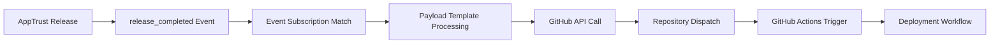

# BookVerse Platform - JFrog Event Webhook Configuration

## "bookverse-release-to-github-action" Webhook Integration

This document explains the **bookverse-release-to-github-action** webhook that is configured in the JFrog Platform during the BookVerse setup process. This webhook provides automated integration between JFrog AppTrust release events and GitHub Actions workflows.

---

## 📋 Table of Contents

- [Overview](#-overview)
- [Webhook Configuration](#-webhook-configuration)
- [Event Flow](#-event-flow)
- [Payload Structure](#-payload-structure)
- [GitHub Actions Integration](#-github-actions-integration)
- [Setup Process](#-setup-process)
- [Troubleshooting](#-troubleshooting)
- [Related Components](#-related-components)

---

## 🎯 Overview

The **bookverse-release-to-github-action** webhook is a JFrog Platform Event Subscription that automatically triggers GitHub repository dispatch events when AppTrust releases are completed. This enables seamless integration between JFrog Platform release management and GitHub Actions CI/CD workflows.

### Key Purpose

- **Automated Deployment**: Trigger downstream deployment workflows when releases are completed
- **Cross-Platform Integration**: Bridge JFrog AppTrust events with GitHub Actions
- **Event-Driven Architecture**: Enable reactive deployment patterns based on release events
- **Platform Orchestration**: Coordinate multi-repository workflows from central release events

---

## ⚙️ Webhook Configuration

### Event Subscription Details

The webhook is configured as a **JFrog Platform Event Subscription** with the following specifications:

```json
{
  "key": "bookverse-release-to-github-action",
  "enabled": true,
  "event_filter": {
    "domain": "app_trust",
    "event_types": [
      "release_completed"
    ],
    "criteria": {}
  },
  "handlers": [
    {
      "handler_type": "custom-webhook",
      "url": "https://api.github.com/repos/yonatanp-jfrog/bookverse-helm/dispatches",
      "method": "POST",
      "payload": "{\"event_type\": \"release_completed\", \"client_payload\": {\"domain\": \"app_trust\", \"event_type\": \"release_completed\", \"data\": {\"application_key\": \"{{.data.application_key}}\", \"application_version\": \"{{.data.application_version}}\", \"stage\": \"{{.data.stage}}\"}, \"subscription_key\": \"bookverse-release-to-github-action\", \"jpd_origin\": \"https://apptrusttraining1.jfrog.io\", \"source\": \"AppTrust\"}}",
      "http_headers": [
        {
          "name": "Authorization",
          "value": "Bearer {{.secrets.github_token}}"
        },
        {
          "name": "Accept", 
          "value": "application/vnd.github+json"
        },
        {
          "name": "Content-Type",
          "value": "application/json"
        }
      ],
      "secrets": [
        {
          "name": "github_token"
        }
      ]
    }
  ],
  "debug": false,
  "project_key": "bookverse"
}
```

### Configuration Breakdown

**1. Event Filter**
- **Domain**: `app_trust` - Listens to AppTrust domain events
- **Event Types**: `release_completed` - Triggers on release completion
- **Criteria**: `{}` - No additional filtering (all releases)

**2. Handler Configuration**
- **Type**: `custom-webhook` - Custom webhook handler
- **Target**: GitHub API repository dispatch endpoint
- **Method**: `POST` - HTTP POST request
- **Authentication**: Bearer token using GitHub token secret

**3. Payload Template**
The webhook sends a GitHub repository dispatch event with:
- **Event Type**: `release_completed`
- **Application Data**: Key, version, and stage information
- **Metadata**: Source tracking and correlation information

---

## 🔄 Event Flow

### Trigger Sequence

1. **AppTrust Release Completion**
   - A release is completed in JFrog AppTrust
   - Release includes application version and target stage information

2. **Event Subscription Activation**
   - JFrog Platform detects the `release_completed` event
   - Event matches the `bookverse-release-to-github-action` subscription filter

3. **Webhook Payload Generation**
   - JFrog Platform generates webhook payload using template
   - Substitutes dynamic values (application_key, version, stage)
   - Includes metadata for tracking and correlation

4. **GitHub API Call**
   - HTTP POST to GitHub repository dispatch API
   - Authenticated using stored GitHub token secret
   - Triggers repository dispatch event in target repository

5. **GitHub Actions Workflow Trigger**
   - GitHub receives repository dispatch event
   - Workflows listening for `release_completed` events are triggered
   - Downstream deployment/update processes begin

### Event Processing Pipeline



---

## 📦 Payload Structure

### GitHub Repository Dispatch Payload

When the webhook triggers, it sends the following payload to GitHub:

```json
{
  "event_type": "release_completed",
  "client_payload": {
    "domain": "app_trust",
    "event_type": "release_completed",
    "data": {
      "application_key": "bookverse-platform",
      "application_version": "2024.09.24.143022",
      "stage": "PROD"
    },
    "subscription_key": "bookverse-release-to-github-action",
    "jpd_origin": "https://apptrusttraining1.jfrog.io",
    "source": "AppTrust"
  }
}
```

### Payload Fields Explanation

**Event Metadata**
- `event_type`: Always "release_completed" for this webhook
- `domain`: Source domain (app_trust)
- `subscription_key`: Identifies the specific webhook subscription

**Release Data**
- `application_key`: The AppTrust application that was released
- `application_version`: The version that was released
- `stage`: The target stage for the release (typically "PROD")

**Tracking Information**
- `jpd_origin`: Source JFrog Platform instance URL
- `source`: Always "AppTrust" to identify the event source

---

## 🚀 GitHub Actions Integration

### Target Repository

The webhook targets the **bookverse-helm** repository:
- **URL**: `https://api.github.com/repos/yonatanp-jfrog/bookverse-helm/dispatches`
- **Purpose**: Central Helm charts repository for BookVerse platform
- **Role**: Manages Kubernetes deployment manifests and versions

### GitHub Actions Workflow Pattern

GitHub Actions workflows in the target repository can listen for these events:

```yaml
# Example workflow in bookverse-helm repository
name: Handle Release Completed
on:
  repository_dispatch:
    types: [release_completed]

jobs:
  update-deployment:
    runs-on: ubuntu-latest
    steps:
      - name: Extract Release Information
        run: |
          echo "Application: ${{ github.event.client_payload.data.application_key }}"
          echo "Version: ${{ github.event.client_payload.data.application_version }}"
          echo "Stage: ${{ github.event.client_payload.data.stage }}"
          echo "Source: ${{ github.event.client_payload.jpd_origin }}"
      
      - name: Update Helm Values
        run: |
          # Update Helm chart values with new version
          # Commit changes to trigger ArgoCD sync
          # Update deployment manifests
```

### Repository Dispatch Token

The webhook uses a GitHub token stored as a secret in JFrog Platform:
- **Secret Name**: `github_token`
- **Purpose**: Authenticate GitHub API calls
- **Permissions Required**: Repository dispatch permissions
- **Configuration**: Set during platform setup process

---

## 🔧 Setup Process

### When Is This Webhook Created?

The webhook is created during the **setup-platform workflow** process, though the exact setup script that creates it is part of the platform initialization. Based on the configuration pattern, it's likely created through:

1. **JFrog Platform API**: Using the Event Subscriptions API
2. **Setup Script**: As part of automated platform configuration
3. **Admin Token**: Using elevated permissions for webhook creation

### Required Components

**JFrog Platform Configuration**
- Event subscriptions feature enabled
- AppTrust domain configured
- Project key: "bookverse"
- GitHub token secret configured

**GitHub Repository Setup**
- Repository dispatch permissions
- GitHub Actions workflows configured to handle events
- Appropriate token permissions for API access

### Configuration API Endpoint

The webhook is managed through the JFrog Platform Event API:
```bash
# List event subscriptions
curl -H "Authorization: Bearer ${JFROG_ADMIN_TOKEN}" \
  "${JFROG_URL}/event/api/v1/subscriptions"

# Get specific subscription
curl -H "Authorization: Bearer ${JFROG_ADMIN_TOKEN}" \
  "${JFROG_URL}/event/api/v1/subscriptions/bookverse-release-to-github-action"
```

---

## 🔧 Troubleshooting

### Common Issues

**1. Webhook Not Triggering**
```bash
# Check webhook status
curl -H "Authorization: Bearer ${JFROG_ADMIN_TOKEN}" \
  "${JFROG_URL}/event/api/v1/subscriptions/bookverse-release-to-github-action" | jq .enabled

# Verify event filter matches release events
curl -H "Authorization: Bearer ${JFROG_ADMIN_TOKEN}" \
  "${JFROG_URL}/event/api/v1/subscriptions/bookverse-release-to-github-action" | jq .event_filter
```

**2. GitHub Authentication Failures**
```bash
# Test GitHub token permissions
curl -H "Authorization: Bearer ${GITHUB_TOKEN}" \
  "https://api.github.com/repos/yonatanp-jfrog/bookverse-helm"

# Verify repository dispatch permissions
curl -X POST \
  -H "Authorization: Bearer ${GITHUB_TOKEN}" \
  -H "Accept: application/vnd.github+json" \
  "https://api.github.com/repos/yonatanp-jfrog/bookverse-helm/dispatches" \
  -d '{"event_type":"test","client_payload":{"test":true}}'
```

**3. Payload Template Issues**
- Check payload template syntax in subscription configuration
- Verify template variable substitution ({{.data.application_key}})
- Ensure JSON formatting is valid

**4. Event Filtering Problems**
- Verify event domain matches AppTrust events
- Check event type matches release_completed
- Ensure project_key filtering is correct

### Debug Mode

Enable debug mode for detailed webhook execution logs:
```bash
# Enable debug mode
curl -X PUT \
  -H "Authorization: Bearer ${JFROG_ADMIN_TOKEN}" \
  -H "Content-Type: application/json" \
  "${JFROG_URL}/event/api/v1/subscriptions/bookverse-release-to-github-action" \
  -d '{"debug": true}'
```

### Webhook Delivery Verification

Check webhook delivery status and logs:
```bash
# Check recent webhook deliveries (if available)
curl -H "Authorization: Bearer ${JFROG_ADMIN_TOKEN}" \
  "${JFROG_URL}/event/api/v1/subscriptions/bookverse-release-to-github-action/deliveries"
```

---

## 🔗 Related Components

### BookVerse Repository Structure

The webhook integrates with the following repositories:

**Target Repository**
- **bookverse-helm**: Helm charts and Kubernetes manifests
  - Receives repository dispatch events
  - Contains GitHub Actions workflows for deployment
  - Manages ArgoCD application configurations

**Source Applications**
- **bookverse-platform**: Platform aggregation service
- **bookverse-inventory**: Inventory microservice  
- **bookverse-recommendations**: Recommendations service
- **bookverse-checkout**: Checkout service
- **bookverse-web**: Web frontend application

### Integration Points

**JFrog AppTrust**
- Release completion events trigger the webhook
- Application versions and stages are included in payload
- Project-scoped filtering ensures relevant events only

**GitHub Actions**
- Repository dispatch events trigger workflows
- Workflow can access release data from payload
- Enables automated deployment updates

**ArgoCD GitOps**
- GitHub Actions can update Helm values
- ArgoCD detects changes and syncs deployments
- Provides automated deployment pipeline

### Configuration Scripts

Related scripts in the BookVerse platform:

**Repository Dispatch Validation**
- `scripts/validate_repo_dispatch.py`: Tests repository dispatch functionality
- Used to verify GitHub token permissions and connectivity

**Service Secrets Configuration**
- `scripts/configure_service_secrets.sh`: Configures repository secrets
- Sets up `GH_REPO_DISPATCH_TOKEN` for cross-repository communication

---

## 📚 Additional Information

### Event Subscription Management

The webhook is part of the JFrog Platform Event Subscriptions system:
- **API Endpoint**: `/event/api/v1/subscriptions`
- **Management**: Through JFrog Platform UI or API
- **Scope**: Project-level (bookverse project)
- **Security**: Token-based authentication with GitHub

### Best Practices

**Security**
- Use dedicated GitHub tokens with minimal required permissions
- Regularly rotate authentication tokens
- Monitor webhook delivery success rates

**Monitoring**
- Enable debug mode during initial setup
- Monitor GitHub Actions workflow execution
- Track release event frequency and patterns

**Maintenance**
- Verify webhook configuration after platform updates
- Test end-to-end flow periodically
- Update GitHub token when repository permissions change

---

*This webhook enables seamless integration between JFrog AppTrust releases and GitHub Actions workflows, providing automated deployment triggers for the BookVerse platform.*
